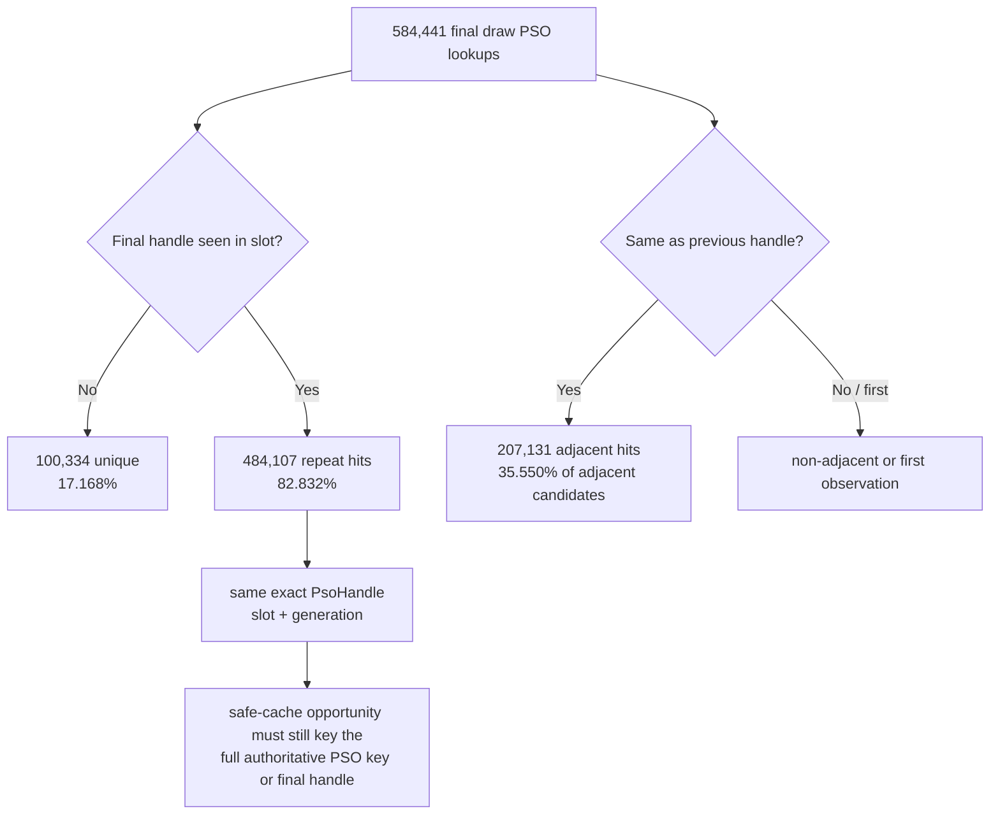
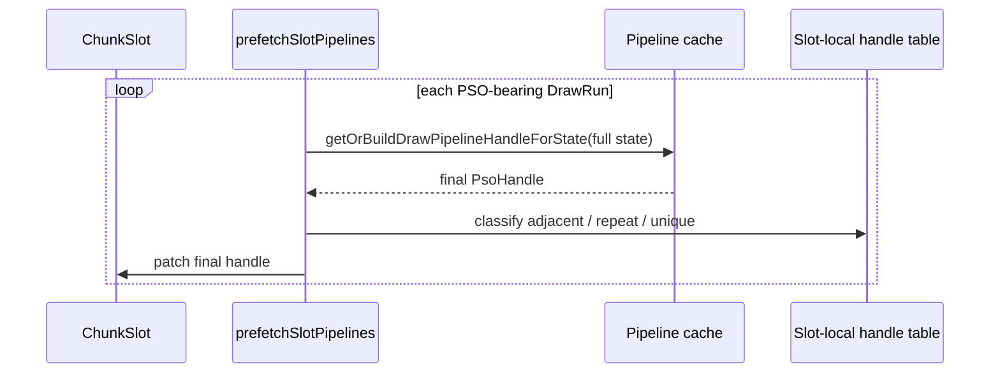

# Encode Phase 72 - Encode-Slot PSO Handle Reuse Opportunity

**Question.** [state-churn-encode-encode-phase.71](state-churn-encode-encode-phase.71.md) names the residual
encode-slot prefetch cost as repeated draw PSO lookup/key work. How much of
that work resolves to a final PSO handle already seen in the same slot?

**Instrumentation.** `prefetchSlotPipelines()` now records, without changing
behavior, final render-PSO handle reuse after the full
`getOrBuildDrawPipelineHandleForState()` lookup:

- adjacent candidates / hits: the previous valid final handle in this slot
  equals the current one;
- slot repeat hits: the current valid final handle was already observed in this
  slot-local fixed open-address table;
- slot unique: first observation of a final handle in this slot;
- slot overflow: fixed table exhausted before classifying the handle.

The table is fixed-size and stack-local; it does not allocate or feed back into
PSO selection.

| Metric | Total | Per present |
|---|---:|---:|
| `present_encoded` | `1,801` | n/a |
| `sampled_avg_fps` | `16.444` | n/a |
| `encode_slot_pso_prefetch_cpu_ms` | `5047.897ms` | `2.802830ms` |
| `encode_slot_pso_prefetch_draw_lookup_cpu_ms` | `4482.211ms` | `2.488735ms` |
| `encode_slot_pso_prefetch_candidates` | `584,441` | `324.509` |
| `encode_slot_pso_prefetch_draw_handle_slot_unique` | `100,334` | `55.710` |
| `encode_slot_pso_prefetch_draw_handle_slot_repeat_hits` | `484,107` | `268.799` |
| `encode_slot_pso_prefetch_draw_handle_slot_overflow` | `0` | `0` |
| `encode_slot_pso_prefetch_draw_handle_adjacent_candidates` | `582,641` | `323.510` |
| `encode_slot_pso_prefetch_draw_handle_adjacent_hits` | `207,131` | `114.454` |
| `gpu_command_buffer_time_ms` | `6119.440ms` | `3.397801ms` |
| `completion_wait_ms` | `51076.768ms` | `28.360227ms` |

Derived:

- observed valid final draw handles = `584,441`
- slot repeat ratio = `82.832%`
- adjacent hit ratio = `35.550%`
- repeated-handle share of current draw lookup time ~= `2.061ms/present`

**Decision.** Accepted opportunity. The final-handle distribution is highly
repetitive: `82.832%` of normal draw PSO prefetch lookups resolve to a handle
already seen in the same slot, and the table never overflowed. That is a much
larger opportunity than adjacent-only reuse (`35.550%`) and directly targets
the `2.489ms/present` draw lookup owner named in phase 71.

**Guardrail.** This is not proof that `DrawPsoSubview` is a safe memo key. The
counter runs after the authoritative lookup, so it proves repeated *results*,
not which reduced input key can be used. Production reuse must either cache by
the exact authoritative key used by the pipeline cache, or cache only after
reconstructing an equivalent key that includes shader variant, sampler/texture
state, attachment formats, sample count, VSOut layout, debug/env bits, and
argbuf/tile mode bits.

**Next gate.** Implement a slot-local exact-key or exact-handle memo on the
encode worker, default-off or guarded by a counter gate first, and require:

- `encode_slot_pso_prefetch_draw_lookup_cpu_ms` decreases close to the repeated
  handle share;
- `encode_draw_pso_prefetch_handle_missing` remains `0`;
- `pipeline_build_draw` / PSO slot count do not rise;
- `actual.png` remains visually normal;
- completion wait and sampled FPS are interpreted as secondary/noisy gates.

**Visual smoke.** `actual.png` for this run shows the normal close-up robot /
machine-gun muzzle/bloom frame, not the black-screen or missing-bloom failure
class.

**Related.** [state-churn-encode-encode-phase.71](state-churn-encode-encode-phase.71.md) ·
[state-churn-encode-encode-phase.70](state-churn-encode-encode-phase.70.md) · [state-churn-encode](../state-churn-encode.md).
