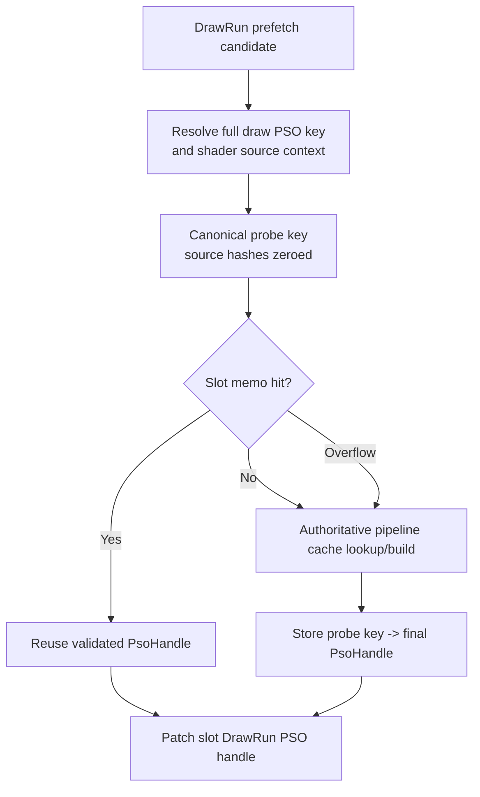
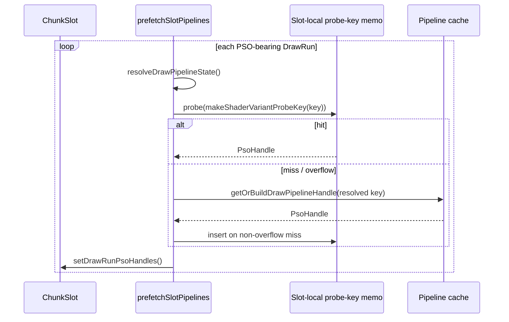

# Encode Phase 73 - Encode-Slot PSO Probe-Key Memo

> **Outdated — every artifact this leaf cites in `source:` is gone from disk.** The numbers below cannot be re-derived or re-checked. Kept as history; do not cite it as current evidence.

**Question.** [state-churn-encode-encode-phase.72](state-churn-encode-encode-phase.72.md) proved that most
encode-slot draw PSO lookups resolve to a final handle already seen in the same
slot. Does a slot-local memo remove that repeated lookup work without breaking
prefetched handles or visual output?

**Change.**

- `Cache::resolveDrawPipelineState()` now splits state -> resolved
  `ShaderVariantKey` + `ShaderSourceContext` from the cache lookup/build call.
- `prefetchSlotPipelines()` keeps a fixed 512-entry slot-local memo keyed by
  `makeShaderVariantProbeKey(resolved.key)`.
- The first occurrence of a probe key still goes through the authoritative
  `getOrBuildDrawPipelineHandle()` path. Later occurrences in the same slot
  reuse that validated `PsoHandle`.
- Full `ShaderVariantKey` equality checks the memo entry, so hash collisions do
  not select a wrong handle. Overflow falls back to the old cache call.
- `DXMT9_DISABLE_ENCODE_SLOT_PSO_PROBE_KEY_MEMO=1` disables the memo for A/B.

| Metric | Phase 72 | Phase 73 | Per-present delta |
|---|---:|---:|---:|
| `present_encoded` | `1,801` | `1,800` | n/a |
| `encode_slot_pso_prefetch_cpu_ms` | `5047.897ms` | `4788.769ms` | `2.803 -> 2.660ms` |
| `encode_slot_pso_prefetch_draw_lookup_cpu_ms` | `4482.211ms` | `404.438ms` | `2.489 -> 0.225ms` |
| `encode_slot_pso_prefetch_draw_key_resolve_cpu_ms` | n/a | `3627.534ms` | `2.015ms` |
| `encode_slot_pso_prefetch_draw_probe_key_memo_hits` | n/a | `485,197` | `269.554` |
| `encode_slot_pso_prefetch_draw_probe_key_memo_misses` | n/a | `100,818` | `56.010` |
| `encode_slot_pso_prefetch_draw_probe_key_memo_overflow` | n/a | `0` | `0` |
| `encode_draw_pso_prefetch_handle_missing` | `0` | `0` | unchanged |
| `sampled_avg_fps` | `16.444` | `16.849` | noisy / secondary |

Derived:

- memo hit ratio = `485,197 / 586,015 = 82.796%`;
- draw cache lookup child drop = `2.489 -> 0.225ms/present` (`-90.97%`);
- total encode-slot prefetch parent drop = `2.803 -> 2.660ms/present`
  (`-0.142ms/present`);
- resolved key/source-context construction is now the visible owner:
  `2.015ms/present`.

**Decision.** Accepted as a CPU cleanup, but not as the primary remaining
encode-slot prefetch fix. The memo removes nearly all repeated global pipeline
cache lookup work and keeps `encode_draw_pso_prefetch_handle_missing=0`, with
normal visual smoke (`actual.png` shows the close-up machine-gun muzzle/bloom
frame, not a black frame). However, the parent only moves by
`0.142ms/present` because the expensive part is now resolved-key construction
before the memo probe.

**Implication.** The phase 72 repeated-handle opportunity was real, but most of
the remaining cost is not the final global cache lookup. The next target is to
avoid rebuilding the resolved draw PSO probe key for repeated state in the same
slot, or to carry a compact, authoritative prefetch key from the draw-run/slot
builder so the encode worker can memo before constructing the full
`ShaderSourceContext`.

**Next gate.**

- Split resolved-key construction further: attachment formats, blend key,
  `makeShaderVariantKey`, `ShaderSourceContext`, X8 alpha-mask, and VSOut
  layout resolution.
- Measure whether `DrawPsoSubview` plus resolved attachment/depth/sample bits
  can form a safe pre-source probe key, or whether the slot builder should
  intern a full prefetch key.
- Require no prefetched-handle misses, `pipeline_build_draw` not rising, and
  normal visual smoke before promoting any earlier memo point.

**Related.** [state-churn-encode-encode-phase.72](state-churn-encode-encode-phase.72.md) ·
[state-churn-encode-encode-phase.71](state-churn-encode-encode-phase.71.md) · [state-churn-encode](index.md).
