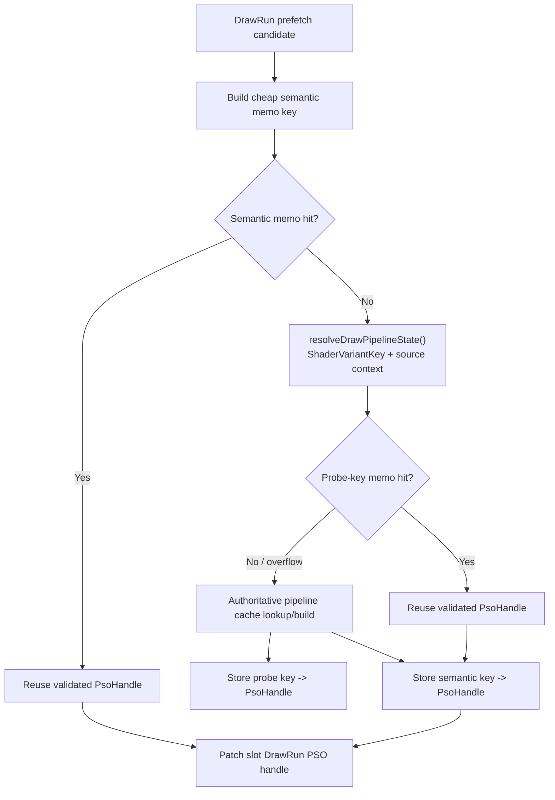
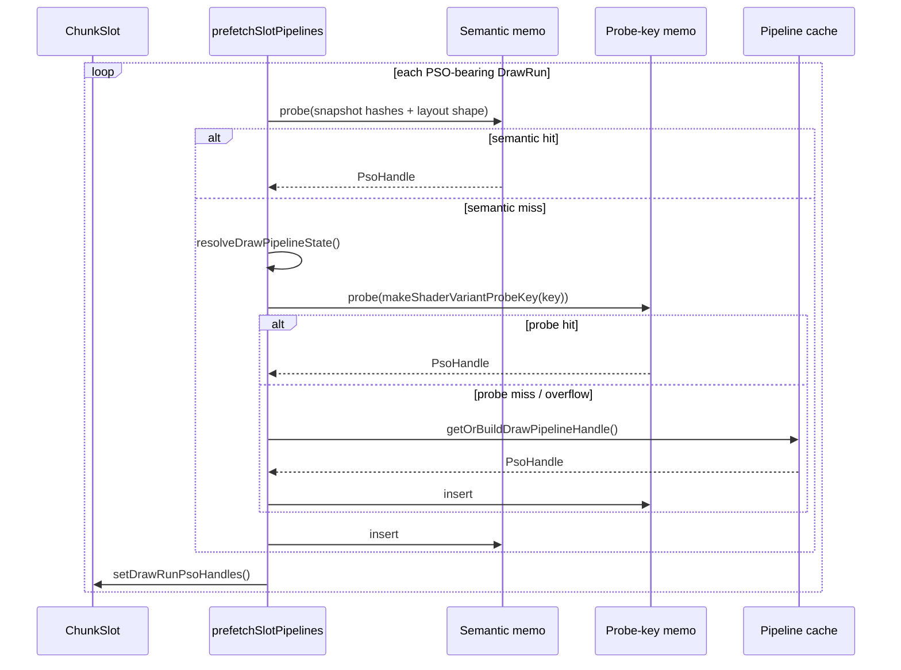

# Encode Phase 74 - Encode-Slot PSO Semantic Memo

> **Outdated — every artifact this leaf cites in `source:` is gone from disk.** The numbers below cannot be re-derived or re-checked. Kept as history; do not cite it as current evidence.

**Question.** [state-churn-encode-encode-phase.73](state-churn-encode-encode-phase.73.md) removed most repeated
global draw PSO cache lookup, but left resolved-key/source-context construction
as the owner. Can the encode-slot prefetch path memo before
`resolveDrawPipelineState()` without using an unsafe reduced key?

**Rejected first attempt.** Pointer identity is not the right pre-resolve key
for GT1. A scout keyed by the immutable `FlatDrawStateRecord*` and shader-layout
pointer had `0 / 586,299` hits and `0` overflow. Final PSO handles repeat, but
the slot stores distinct state records for those draws, so pointer equality only
proves non-reuse.

**Change.**

- `prefetchSlotPipelines()` now keeps a fixed 2048-entry slot-local semantic
  memo before `resolveDrawPipelineState()`.
- The memo key is built from cheap snapshot data: shader/decl/render-state
  hashes, texture and attachment handles, texture-stage and sampler hashes,
  shader layout constant-usage shape, vertex-declaration stream offset/stride
  shape, and argbuf selector bits.
- A hit reuses the first authoritative `PsoHandle` for that semantic state and
  skips both resolved-key construction and the global pipeline-cache lookup.
- A miss falls through to the existing `resolveDrawPipelineState()` path, then
  the phase 73 probe-key memo, then the authoritative cache lookup/build.
- `DXMT9_DISABLE_ENCODE_SLOT_PSO_SEMANTIC_MEMO=1` disables the semantic memo for
  A/B. The phase 73 probe-key memo remains the fallback.

| Metric | Semantic disabled | Semantic enabled | Per-present delta |
|---|---:|---:|---:|
| `present_encoded` | `1,800` | `1,800` | n/a |
| `encode_slot_pso_prefetch_cpu_ms` | `5296.179ms` | `3179.175ms` | `2.942 -> 1.766ms` |
| `encode_slot_pso_prefetch_draw_key_resolve_cpu_ms` | `4027.338ms` | `1908.123ms` | `2.237 -> 1.060ms` |
| `encode_slot_pso_prefetch_draw_resolve_variant_key_cpu_ms` | `2534.068ms` | `1198.804ms` | `1.408 -> 0.666ms` |
| `encode_slot_pso_prefetch_draw_resolve_shader_context_cpu_ms` | `578.310ms` | `273.071ms` | `0.321 -> 0.152ms` |
| `encode_slot_pso_prefetch_draw_resolve_vsout_layout_cpu_ms` | `290.340ms` | `135.110ms` | `0.161 -> 0.075ms` |
| `encode_slot_pso_prefetch_draw_lookup_cpu_ms` | `404.670ms` | `402.564ms` | `0.225 -> 0.224ms` |
| `encode_slot_pso_prefetch_draw_semantic_memo_hits` | `0` | `310,499` | `172.499/present` |
| `encode_slot_pso_prefetch_draw_semantic_memo_misses` | `0` | `276,826` | `153.792/present` |
| `encode_slot_pso_prefetch_draw_semantic_memo_overflow` | `0` | `0` | `0` |
| `encode_slot_pso_prefetch_draw_probe_key_memo_hits` | `484,595` | `175,777` | fallback only |
| `encode_draw_pso_prefetch_handle_missing` | `0` | `0` | unchanged |
| `draw_skipped_no_pipeline` | `0` | `0` | unchanged |
| `sampled_avg_fps` | `16.836` | `16.912` | noisy / secondary |

Derived:

- semantic hit ratio = `310,499 / 587,325 = 52.867%`;
- parent prefetch drop = `-1.176ms/present`;
- draw key-resolve drop = `-1.177ms/present`, so the win is exactly the intended
  skipped resolved-key/source-context work;
- lookup stays flat at about `0.224ms/present` because the phase 73 probe-key
  memo already removed that owner;
- completion wait moves only `26.617 -> 26.311ms/present`, so this is a CPU
  cleanup, not average-FPS completion.

**Decision.** Accepted as the default CPU cleanup. It preserves prefetched
handle correctness counters (`encode_draw_pso_prefetch_handle_missing=0`,
`draw_skipped_no_pipeline=0`), has no memo overflow, and the visual smoke frame
is normal. The disabled A/B also renders normally, but at a different sampled
GT1 moment.

**Implication.** The remaining prefetch cost is no longer a repeated global
lookup problem. It is the conservative miss side of semantic PSO identity plus
the per-candidate depth-state lookup and selector/hash overhead around the memo.
The semantic key is intentionally over-strict for texture and attachment
handles to avoid collapsing resource-format-dependent X8-alpha/attachment
cases; a future relaxation needs explicit same-format proof.

**Next gate.**

- Split semantic memo overhead if `encode_slot_pso_prefetch_cpu_ms` remains hot
  after broader P2/P3 work.
- Measure why `276,826` semantic misses still collapse to only about `101k`
  final unique PSO handles after probe-key fallback: likely texture/attachment
  handle exactness, stream offset/stride shape, or sampler/TSS hash diversity.
- Do not relax texture/attachment/stream fields unless a same-run oracle proves
  no X8-alpha, format, or vertex-layout visual divergence and the 3DMark05
  muzzle/bloom/fog/particle frames stay normal.

**Related.** [state-churn-encode-encode-phase.73](state-churn-encode-encode-phase.73.md) ·
[state-churn-encode-encode-phase.72](state-churn-encode-encode-phase.72.md) · [state-churn-encode](index.md).
