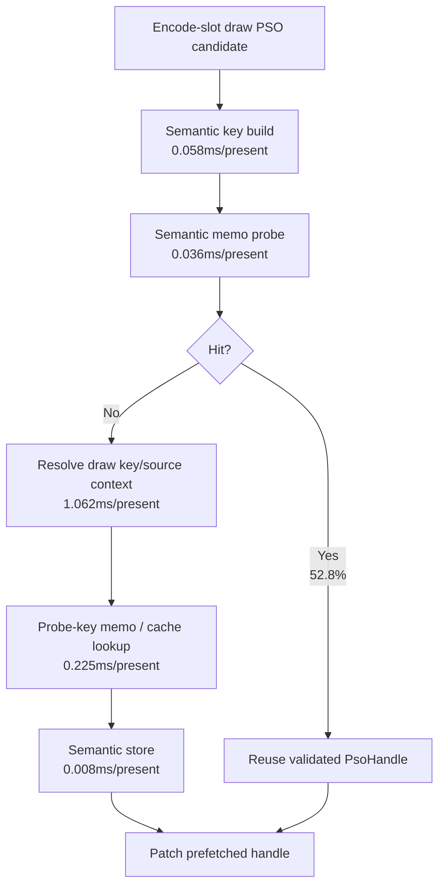
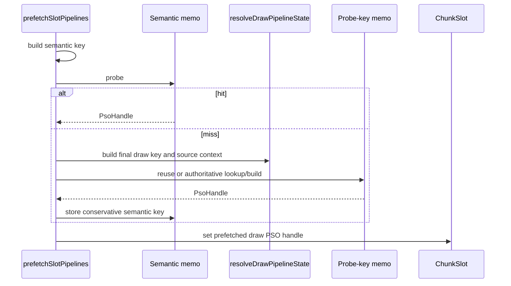

# Encode Phase 75 - Encode-Slot PSO Semantic Memo Split

**Question.** [state-churn-encode-encode-phase.74](state-churn-encode-encode-phase.74.md) accepted the default
encode-slot semantic PSO memo, but did not split the memo's own cost. Is the
new semantic key/probe/store work large enough to become the next bottleneck?

**Run.** `app-d3d9-3dmark05-encode-slot-pso-semantic-split-r1-20260614`,
`--no-gputrace --no-encoder-breakdown --frame-sampling --timeout 120`.
The harness terminated the app by timeout (`returncode=143`) after collecting
the standard summary, but the run status is `pass`, `capture_error=None`, and
the visual smoke frame is normal: the machine-gun muzzle plume, bloom, scene
lighting, and HUD render correctly.

| Metric | Value | Per present |
|---|---:|---:|
| `present_encoded` | `1,800` | n/a |
| `encode_slot_pso_prefetch_cpu_ms` | `3360.232ms` | `1.867ms` |
| `encode_slot_pso_prefetch_draw_key_resolve_cpu_ms` | `1911.417ms` | `1.062ms` |
| `encode_slot_pso_prefetch_draw_resolve_variant_key_cpu_ms` | `1204.283ms` | `0.669ms` |
| `encode_slot_pso_prefetch_draw_resolve_shader_context_cpu_ms` | `275.064ms` | `0.153ms` |
| `encode_slot_pso_prefetch_draw_resolve_vsout_layout_cpu_ms` | `135.235ms` | `0.075ms` |
| `encode_slot_pso_prefetch_draw_lookup_cpu_ms` | `404.999ms` | `0.225ms` |
| `encode_slot_pso_prefetch_draw_semantic_key_cpu_ms` | `103.754ms` | `0.058ms` |
| `encode_slot_pso_prefetch_draw_semantic_probe_cpu_ms` | `65.229ms` | `0.036ms` |
| `encode_slot_pso_prefetch_draw_semantic_store_cpu_ms` | `14.764ms` | `0.008ms` |
| semantic split subtotal | `183.747ms` | `0.102ms` |
| `encode_slot_pso_prefetch_draw_semantic_memo_hits` | `310,304` | `172.391` |
| `encode_slot_pso_prefetch_draw_semantic_memo_misses` | `277,354` | `154.086` |
| `encode_slot_pso_prefetch_draw_semantic_memo_overflow` | `0` | `0` |
| `encode_slot_pso_prefetch_draw_probe_key_memo_hits` | `176,429` | fallback only |
| `encode_slot_pso_prefetch_draw_probe_key_memo_misses` | `100,925` | fallback only |
| `encode_draw_pso_prefetch_handle_missing` | `0` | `0` |
| `draw_skipped_no_pipeline` | `0` | `0` |
| `gpu_command_buffer_errors` | `0` | `0` |
| `sampled_avg_fps` | `16.746` | noisy |
| `completion_wait_ms` | `49220.933ms` | `27.345ms` |
| `gpu_command_buffer_time_ms` | `5870.459ms` | `3.261ms` |
| `commit_chunk_replay_cpu_ms` | `15199.301ms` | `8.444ms` |

Derived:

- semantic hit ratio = `310,304 / 587,658 = 52.805%`, matching phase 74;
- semantic key/probe/store subtotal is only `0.102ms/present`, while phase 74
  saved about `1.176ms/present` from the parent prefetch bucket and
  `1.177ms/present` from resolved-key construction;
- the semantic split subtotal is about `8.7%` of the phase 74 saved
  resolved-key work, even with the extra child timer overhead;
- draw-key resolve remains the larger owner at `1.062ms/present`, led by
  `ShaderVariantKey` construction at `0.669ms/present`;
- draw lookup remains flat at `0.225ms/present`, confirming that phase 73's
  probe-key memo already removed the global lookup owner.

**Decision.** Accepted as attribution. The semantic memo itself is not the next
large target. Its child counters add hot-path clock calls, so the absolute
split values should be read as an upper bound / attribution probe rather than a
new default performance budget. Even so, the measured subtotal is much smaller
than the work the memo removes and much smaller than the remaining draw-key
resolve parent.

**Implication.** The next PSO-prefetch CPU target is not key/probe/store
micro-optimization. It is the miss side that still enters
`resolveDrawPipelineState()`, especially `ShaderVariantKey` construction. The
open question is why `277,354` conservative semantic misses collapse to only
about `100,925` probe-key misses after final-key construction. Likely owners are
texture/attachment handle exactness, stream offset/stride layout shape, sampler
/ texture-stage hash diversity, or resource-format-sensitive X8-alpha cases.

**Next gate.**

- Add non-mutating semantic-miss classifiers before relaxing the key: texture
  handle, attachment handle, stream shape, sampler hash, TSS hash, shader-layout
  shape, and argbuf selector differences.
- Require `encode_draw_pso_prefetch_handle_missing=0`,
  `draw_skipped_no_pipeline=0`, `gpu_command_buffer_errors=0`, no memo overflow,
  and normal muzzle/bloom/fog visual smoke for every relaxed key candidate.
- Do not spend Xcode on this class unless a no-gputrace run first moves
  P2/P3 wall, completion wait, or sampled FPS, not just a child CPU counter.

**Related.** [state-churn-encode-encode-phase.74](state-churn-encode-encode-phase.74.md) ·
[state-churn-encode-encode-phase.73](state-churn-encode-encode-phase.73.md) · [state-churn-encode](../state-churn-encode.md).
