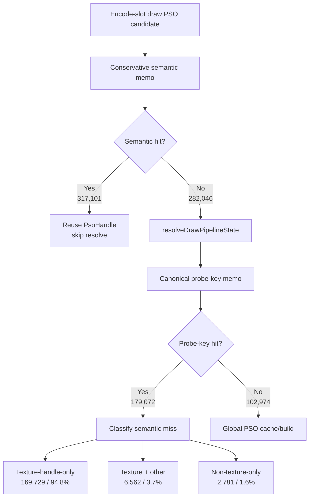
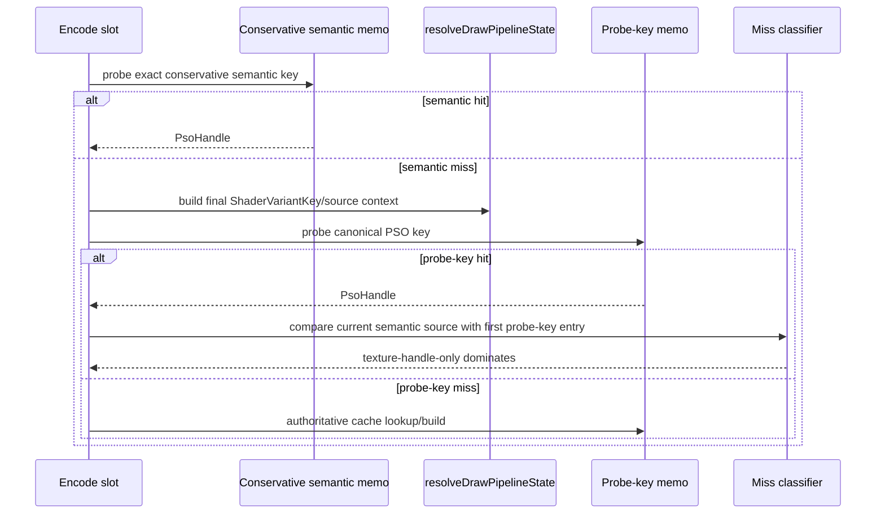

# Encode Phase 76 - Encode-Slot PSO Semantic Miss Classifier

**Question.** [state-churn-encode-encode-phase.75](state-churn-encode-encode-phase.75.md) proved that semantic
key/probe/store overhead is not the next encode-slot PSO-prefetch owner. The
remaining cost is the miss side that still enters `resolveDrawPipelineState()`.
Which conservative semantic fields differ when a semantic-memo miss later
collapses to a slot-local probe-key memo hit?

**Run.** `app-d3d9-3dmark05-encode-slot-pso-semantic-exclusive-r1-20260614`,
`DXMT9_PERF_ENCODE_SLOT_PSO_SEMANTIC_MISS_SPLIT=1`,
`--no-gputrace --no-encoder-breakdown --frame-sampling --timeout 120`.
The run completed as `status=pass`. Visual smoke is normal: the close-up
machine-gun muzzle plume/bloom, scene lighting, and HUD render correctly.

| Metric | Value | Per present |
|---|---:|---:|
| `present_encoded` | `1,851` | n/a |
| `encode_slot_pso_prefetch_cpu_ms` | `3464.877ms` | `1.872ms` |
| `encode_slot_pso_prefetch_draw_key_resolve_cpu_ms` | `1984.862ms` | `1.072ms` |
| `encode_slot_pso_prefetch_draw_resolve_variant_key_cpu_ms` | `1256.517ms` | `0.679ms` |
| `encode_slot_pso_prefetch_draw_lookup_cpu_ms` | `404.541ms` | `0.219ms` |
| `encode_slot_pso_prefetch_draw_semantic_memo_hits` | `317,101` | `171.314` |
| `encode_slot_pso_prefetch_draw_semantic_memo_misses` | `282,046` | `152.375` |
| `encode_slot_pso_prefetch_draw_semantic_memo_overflow` | `0` | `0` |
| `encode_slot_pso_prefetch_draw_semantic_miss_probe_key_hits` | `179,072` | `96.744` |
| `encode_slot_pso_prefetch_draw_probe_key_memo_hits` | `179,072` | fallback only |
| `encode_slot_pso_prefetch_draw_probe_key_memo_misses` | `102,974` | fallback only |
| `draw_skipped_no_pipeline` | `0` | `0` |
| `gpu_command_buffer_errors` | `0` | `0` |
| `sampled_avg_fps` | `16.921` | noisy |

Semantic-miss split:

| Difference bucket | Count | Share of semantic-miss -> probe-key hit |
|---|---:|---:|
| `diff_texture_handles` | `176,291` | `98.447%` |
| `diff_texture_handles_only` | `169,729` | `94.783%` |
| `diff_texture_handles_with_others` | `6,562` | `3.665%` |
| `diff_single_field` | `172,439` | `96.296%` |
| `diff_multi_field` | `6,633` | `3.704%` |
| `diff_vertex_decl` | `3,719` | `2.077%` |
| `diff_attachment` | `6,469` | `3.613%` |
| `diff_sampler` | `2,721` | `1.520%` |
| `diff_render_state` | `219` | `0.122%` |
| `diff_texture_stage` | `7` | `0.004%` |
| `diff_shader` / `diff_texture_lod` / `diff_clip_plane` / `diff_constant_usage` | `0` | `0%` |
| `same_semantic` / `diff_hash_only` / `diff_unknown` | `0` | `0%` |

Derived:

- semantic hit ratio = `317,101 / 599,147 = 52.928%`;
- `179,072 / 282,046 = 63.491%` of semantic misses still collapse to a
  slot-local probe-key hit after final key construction;
- `169,729 / 179,072 = 94.783%` of those collapses differ only by texture
  handle exactness at the conservative semantic layer;
- `diff_hash_only=0` and `diff_unknown=0` validate that the classifier is
  coherent for this run.

**Decision.** Accepted as attribution. The conservative semantic memo is too
strict primarily because it includes exact texture handles. In this run,
texture handles explain `98.447%` of semantic misses that later collapse to an
already-known canonical probe key, and `94.783%` are texture-handle-only. The
remaining resolved-key owner is therefore not a broad shader/layout problem; it
is mostly resource identity exactness before the final PSO shape is known.

**Implication.** The next no-gputrace CPU candidate is a resource-shape or
texture-handle-blind semantic memo, not another global PSO cache lookup
optimization. It must still guard resource-shape state that affects the final
`ShaderVariantKey`, especially active texture mask/type, sampler state, X8
alpha-fill mask, attachment formats, and argbuf selector bits. The current
probe-key equality already proves the final key matched in this diagnostic
classification, but a pre-resolve default memo cannot assume that without an
equivalent guard.

**Next gate.**

- Add a non-mutating resource-shape opportunity counter that ignores texture
  handles only after proving active texture mask/type and X8-alpha shape are
  equal.
- Promote behavior only behind a default-off A/B first, then require
  `encode_draw_pso_prefetch_handle_missing=0`, memo overflow `0`,
  `draw_skipped_no_pipeline=0`, `gpu_command_buffer_errors=0`, and normal
  bloom/fog/muzzle visual smoke.
- Read FPS only after the CPU parent and P4/completion counters move together;
  this remains P2/P3 CPU cleanup until pacing changes.

**Related.** [state-churn-encode-encode-phase.75](state-churn-encode-encode-phase.75.md) ·
[state-churn-encode-encode-phase.74](state-churn-encode-encode-phase.74.md) · [state-churn-encode](../state-churn-encode.md).
