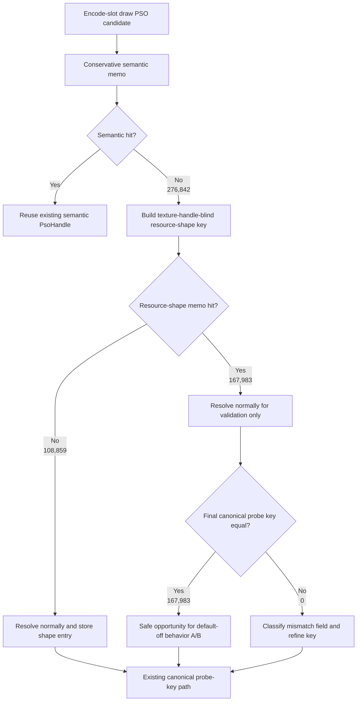
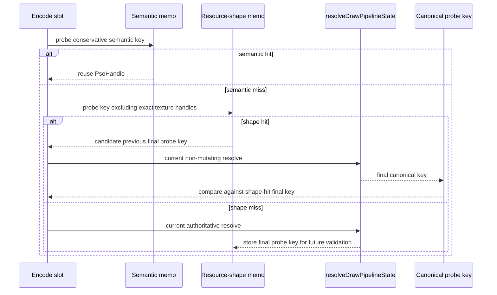

# Encode Phase 77 - Encode-Slot PSO Resource-Shape Opportunity

**Question.** [[state-churn-encode-encode-phase.76]] shows that most
semantic-memo misses which later collapse to a canonical probe-key hit differ
only by exact texture handles. Can a pre-resolve slot-local memo ignore exact
texture handles while still validating to the same final `ShaderVariantKey`
shape after `resolveDrawPipelineState()`?

**Run.** `app-d3d9-3dmark05-encode-slot-pso-resource-shape-opportunity-r1-20260614`,
`DXMT9_PERF_ENCODE_SLOT_PSO_SEMANTIC_MISS_SPLIT=1`,
`DXMT9_PERF_ENCODE_SLOT_PSO_RESOURCE_SHAPE_OPPORTUNITY=1`,
`--no-gputrace --no-encoder-breakdown --frame-sampling --timeout 120`.
The wrapper timeout-finalized the run as `status=pass`, which is valid for this
3DMark05 scout because the expected artifacts were written. Visual smoke is
normal: the machine-gun muzzle plume/bloom, robot, scene lighting, textures, and
HUD render correctly.

| Metric | Value | Per present |
|---|---:|---:|
| `present_encoded` | `1,800` | n/a |
| `encode_slot_pso_prefetch_cpu_ms` | `3635.027ms` | `2.019ms` |
| `encode_slot_pso_prefetch_draw_key_resolve_cpu_ms` | `1976.206ms` | `1.098ms` |
| `encode_slot_pso_prefetch_draw_resolve_variant_key_cpu_ms` | `1247.780ms` | `0.693ms` |
| `encode_slot_pso_prefetch_draw_lookup_cpu_ms` | `403.444ms` | `0.224ms` |
| `encode_slot_pso_prefetch_draw_semantic_memo_hits` | `310,099` | `172.277` |
| `encode_slot_pso_prefetch_draw_semantic_memo_misses` | `276,842` | `153.801` |
| `encode_slot_pso_prefetch_draw_semantic_memo_overflow` | `0` | `0` |
| `encode_slot_pso_prefetch_draw_semantic_miss_probe_key_hits` | `175,836` | `97.687` |
| `draw_skipped_no_pipeline` | `0` | `0` |
| `gpu_command_buffer_errors` | `0` | `0` |
| `sampled_avg_fps` | `16.891` | noisy |

Resource-shape opportunity split:

| Metric | Value | Derived |
|---|---:|---:|
| `encode_slot_pso_prefetch_draw_resource_shape_memo_candidates` | `276,842` | all semantic non-overflow misses |
| `encode_slot_pso_prefetch_draw_resource_shape_memo_hits` | `167,983` | `60.678%` of candidates |
| `encode_slot_pso_prefetch_draw_resource_shape_memo_misses` | `108,859` | `39.322%` of candidates |
| `encode_slot_pso_prefetch_draw_resource_shape_memo_overflow` | `0` | no table pressure |
| `encode_slot_pso_prefetch_draw_resource_shape_memo_stores` | `108,859` | one store per miss |
| `encode_slot_pso_prefetch_draw_resource_shape_memo_validated_hits` | `167,983` | `100.000%` of memo hits |
| `encode_slot_pso_prefetch_draw_resource_shape_memo_validated_misses` | `0` | `0.000%` of memo hits |
| all `encode_slot_pso_prefetch_draw_resource_shape_memo_mismatch_*` | `0` | no guard category fired |

Derived:

- resource-shape hit ratio = `167,983 / 276,842 = 60.678%`;
- validated hit ratio among resource-shape hits = `167,983 / 167,983 = 100%`;
- resource-shape hits cover `167,983 / 175,836 = 95.534%` of semantic-miss
  rows that later hit the canonical probe-key memo;
- every final-key mismatch bucket is `0`: texture mask, texture type, X8 alpha,
  attachment shape, sampler LOD bias, VSOut layout, and other.

**Decision.** Accepted as opportunity. The non-mutating counter proves that the
dominant semantic-miss class can be relaxed from exact texture identity to
resource shape for this GT1 run: `167,983` pre-resolve shape hits all validated
to the same final canonical probe key, with no mismatch in active texture
mask/type, X8 alpha-fill mask, attachment formats/blend/sample count, sampler
LOD bias, or VSOut layout.

This does not claim an FPS win yet. The run deliberately still calls
`resolveDrawPipelineState()` for validation, so it adds diagnostic work instead
of removing CPU. The value is the safety proof for a default-off behavior A/B
that can skip resolved-key/source-context construction on resource-shape hits.

**Next gate.**

- Run the default-off behavior
  `DXMT9_ENABLE_ENCODE_SLOT_PSO_RESOURCE_SHAPE_MEMO=1`, which reuses the
  memoized `PsoHandle` only when the resource-shape key hits. If the opportunity
  knob is also enabled, the non-mutating validation path must win.
- Keep the validation/guard path available under a perf knob and require
  resource-shape overflow `0`, validated mismatches `0`,
  `encode_draw_pso_prefetch_handle_missing=0`,
  `draw_skipped_no_pipeline=0`, `gpu_command_buffer_errors=0`, and normal
  muzzle/bloom/fog visual smoke.
- Read the win first as P2/P3 CPU cleanup: expected movement is lower
  `encode_slot_pso_prefetch_draw_key_resolve_cpu_ms` and
  `encode_slot_pso_prefetch_cpu_ms`; average FPS remains gated by completion
  wait / producer overlap until P4 counters move too.

**Related.** [[state-churn-encode-encode-phase.76]] ·
[[state-churn-encode-encode-phase.75]] · [[state-churn-encode]].
