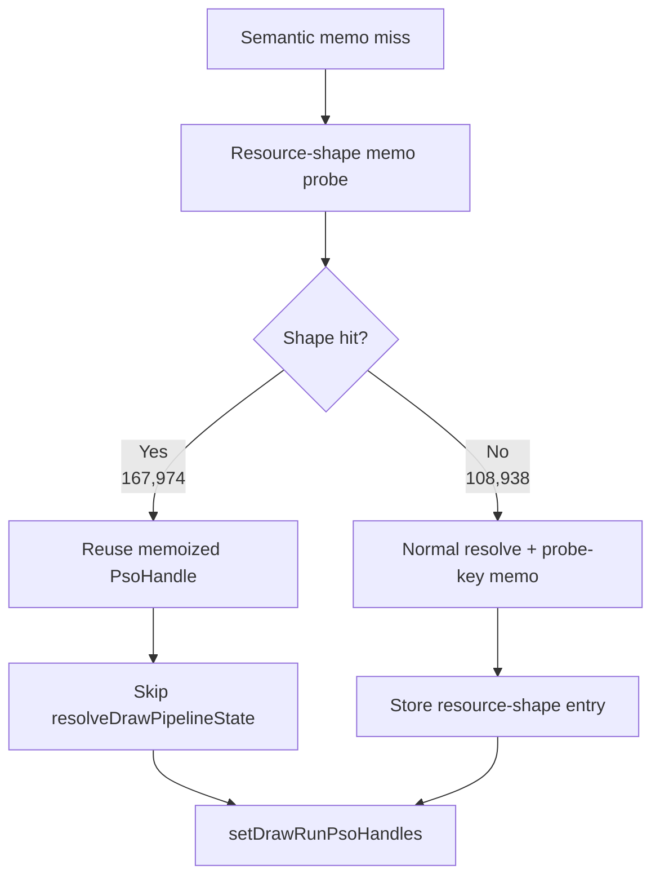

# Encode Phase 78 - Encode-Slot PSO Resource-Shape Memo Behavior

**Question.** [state-churn-encode-encode-phase.77](state-churn-encode-encode-phase.77.md) proves that a
texture-handle-blind resource-shape memo can validate to the same final
canonical draw PSO key on `167,983` semantic misses. If promoted behind a
default-off behavior knob, does it actually bypass repeated
`resolveDrawPipelineState()` work while preserving the normal visual smoke and
prefetched-handle correctness counters?

**Run.** `app-d3d9-3dmark05-encode-slot-pso-resource-shape-memo-r1-20260614`,
`DXMT9_ENABLE_ENCODE_SLOT_PSO_RESOURCE_SHAPE_MEMO=1`,
`--no-gputrace --no-encoder-breakdown --frame-sampling --timeout 120`.
The wrapper timeout-finalized the run as `status=pass`. Visual smoke is normal:
the machine-gun muzzle plume/bloom, robot, scene lighting, textures, and HUD
render correctly.

| Metric | Phase 77 opportunity | Phase 78 behavior | Delta |
|---|---:|---:|---:|
| `present_encoded` | `1,800` | `1,800` | `0` |
| `encode_slot_pso_prefetch_cpu_ms` | `3635.027ms` | `2402.263ms` | `-1232.764ms` |
| `encode_slot_pso_prefetch_cpu_ms / present` | `2.019ms` | `1.335ms` | `-0.685ms` |
| `encode_slot_pso_prefetch_draw_key_resolve_cpu_ms` | `1976.206ms` | `796.461ms` | `-1179.745ms` |
| `draw_key_resolve / present` | `1.098ms` | `0.442ms` | `-0.655ms` |
| `encode_slot_pso_prefetch_draw_resolve_variant_key_cpu_ms` | `1247.780ms` | `496.364ms` | `-751.416ms` |
| `encode_slot_pso_prefetch_draw_lookup_cpu_ms` | `403.444ms` | `402.281ms` | `-1.163ms` |
| `sampled_avg_fps` | `16.891` | `16.929` | noisy `+0.038` |

Resource-shape behavior counters:

| Metric | Value | Meaning |
|---|---:|---|
| `encode_slot_pso_prefetch_draw_resource_shape_memo_candidates` | `276,912` | semantic non-overflow misses considered |
| `encode_slot_pso_prefetch_draw_resource_shape_memo_hits` | `167,974` | shortcut rows |
| `encode_slot_pso_prefetch_draw_resource_shape_memo_misses` | `108,938` | normal resolve rows |
| `encode_slot_pso_prefetch_draw_resource_shape_memo_overflow` | `0` | no table pressure |
| `encode_slot_pso_prefetch_draw_resource_shape_memo_stores` | `108,938` | one store per miss |
| `encode_slot_pso_prefetch_draw_resource_shape_memo_validated_hits` | `0` | expected: validation knob was off |
| `encode_slot_pso_prefetch_draw_resource_shape_memo_validated_misses` | `0` | expected: validation knob was off |
| `encode_slot_pso_prefetch_draw_probe_key_memo_hits` | `7,870` | only remaining normal-resolve probe-key hits |
| `encode_draw_pso_prefetch_handle_missing` | `0` | shortcut did not lose prefetched handles |
| `draw_skipped_no_pipeline` | `0` | no missing-pipeline draw skip |
| `gpu_command_buffer_errors` | `0` | no Metal command-buffer fault |

**Decision.** Accepted as a default-off smoke. The behavior knob is wired and
the shortcut is live: canonical probe-key memo hits fall from `175,836` in the
validation run to `7,870` because the resource-shape memo now consumes the
former repeated-key rows before the canonical resolve path. The expected local
CPU bucket moves in the right place: `draw_key_resolve` drops by
`0.655ms/present`, led by `draw_resolve_variant_key`.

This still is not a shared default promotion. The validation run already proved
shape-key safety for this sample, but the behavior run cannot emit validated
hit counters because it intentionally skips the final-key construction on hits.
Promotion needs at least one current-code default-off vs default-on A/B pair,
normal visual smoke, and stable P4/completion counters before any FPS claim.

**Next gate.**

- [state-churn-encode-encode-phase.79](state-churn-encode-encode-phase.79.md) runs the paired current-code default
  baseline and `DXMT9_ENABLE_ENCODE_SLOT_PSO_RESOURCE_SHAPE_MEMO=1` with the
  same low-overhead profile. The local CPU win repeats, but average FPS remains
  noisy/flat.
- Keep `DXMT9_PERF_ENCODE_SLOT_PSO_RESOURCE_SHAPE_OPPORTUNITY=1` as the
  correctness guard when the resource-shape key changes.
- Do not enable as default until repeated no-gputrace smokes keep
  `encode_draw_pso_prefetch_handle_missing=0`, resource-shape overflow `0`,
  `draw_skipped_no_pipeline=0`, `gpu_command_buffer_errors=0`, and normal
  muzzle/bloom/fog visual output.

**Related.** [state-churn-encode-encode-phase.77](state-churn-encode-encode-phase.77.md) ·
[state-churn-encode-encode-phase.76](state-churn-encode-encode-phase.76.md) · [state-churn-encode](../state-churn-encode.md).
