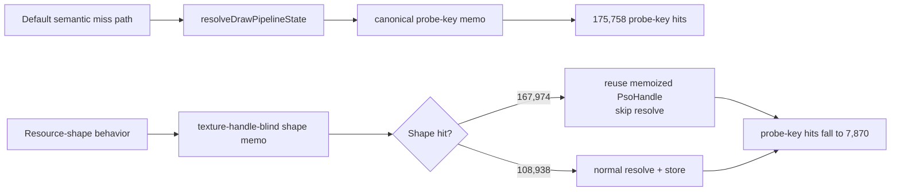

# Encode Phase 79 - Encode-Slot PSO Resource-Shape Memo Paired A/B

**Question.** [state-churn-encode-encode-phase.78](state-churn-encode-encode-phase.78.md) showed that the
default-off resource-shape memo behavior is wired and visually safe in a
single smoke. Does the same current-code default-vs-enabled pair confirm that
the CPU movement is real without the phase 77 validation overhead?

**Runs.**

- Default baseline:
  `app-d3d9-3dmark05-encode-slot-pso-resource-shape-current-default-r1-20260614`,
  no resource-shape behavior/opportunity env,
  `--no-gputrace --no-encoder-breakdown --frame-sampling --timeout 120`.
- Enabled:
  `app-d3d9-3dmark05-encode-slot-pso-resource-shape-memo-r1-20260614`,
  `DXMT9_ENABLE_ENCODE_SLOT_PSO_RESOURCE_SHAPE_MEMO=1`,
  `--no-gputrace --no-encoder-breakdown --frame-sampling --timeout 120`.

Both runs timeout-finalized as `status=pass`. Visual smoke is normal in both:
machine-gun muzzle bloom, robot, scene lighting, textures, and HUD render.

| Metric | Default | Shape memo | Delta |
|---|---:|---:|---:|
| `present_encoded` | `1,800` | `1,800` | `0` |
| `sampled_avg_fps` | `16.924` | `16.929` | noisy `+0.005` |
| `encode_slot_pso_prefetch_cpu_ms` | `3356.163ms` | `2402.263ms` | `-953.900ms` |
| `encode_slot_pso_prefetch_cpu_ms / present` | `1.865ms` | `1.335ms` | `-0.530ms` |
| `encode_slot_pso_prefetch_draw_key_resolve_cpu_ms` | `1907.124ms` | `796.461ms` | `-1110.663ms` |
| `draw_key_resolve / present` | `1.060ms` | `0.442ms` | `-0.617ms` |
| `encode_slot_pso_prefetch_draw_resolve_variant_key_cpu_ms` | `1200.497ms` | `496.364ms` | `-704.133ms` |
| `encode_slot_pso_prefetch_draw_lookup_cpu_ms` | `406.167ms` | `402.281ms` | `-3.886ms` |
| `commit_chunk_replay_cpu_ms / present` | `8.357ms` | `8.314ms` | `-0.043ms` |
| `commit_chunk_queue_draw_submission_cpu_ms / present` | `4.228ms` | `4.200ms` | `-0.028ms` |
| `encode_draw_cpu_ms / present` | `9.445ms` | `9.453ms` | noisy `+0.008ms` |
| `completion_wait_ms / present` | `26.977ms` | `26.587ms` | noisy `-0.390ms` |

Mechanism counters:

| Metric | Default | Shape memo |
|---|---:|---:|
| `encode_slot_pso_prefetch_draw_semantic_memo_hits` | `310,541` | `310,790` |
| `encode_slot_pso_prefetch_draw_semantic_memo_misses` | `276,764` | `276,912` |
| `encode_slot_pso_prefetch_draw_resource_shape_memo_candidates` | `0` | `276,912` |
| `encode_slot_pso_prefetch_draw_resource_shape_memo_hits` | `0` | `167,974` |
| `encode_slot_pso_prefetch_draw_resource_shape_memo_misses` | `0` | `108,938` |
| `encode_slot_pso_prefetch_draw_resource_shape_memo_overflow` | `0` | `0` |
| `encode_slot_pso_prefetch_draw_resource_shape_memo_stores` | `0` | `108,938` |
| `encode_slot_pso_prefetch_draw_probe_key_memo_hits` | `175,758` | `7,870` |
| `encode_slot_pso_prefetch_draw_probe_key_memo_misses` | `101,006` | `101,068` |
| `encode_draw_pso_prefetch_handle_missing` | `0` | `0` |
| `draw_skipped_no_pipeline` | `0` | `0` |
| `gpu_command_buffer_errors` | `0` | `0` |

**Decision.** Accepted as a CPU win, still default-off. The pair confirms the
mechanism without phase 77 validation overhead: resource-shape hits consume
almost all rows that previously reached the canonical probe-key memo, and the
local CPU target drops in the expected child. The win is concentrated in
resolved-key/source-context construction, especially `draw_resolve_variant_key`;
global draw lookup is unchanged because phase 73 already removed that owner.

Do not read the `+0.005` sampled FPS as a promotion signal. The average-FPS
owner is still outside this local bucket unless a repeated run moves
completion/pacing counters together. This remains a clean P2/P3 CPU reduction
and a candidate for default promotion after repeated smokes, not a closure of
the broader GT1 performance goal.

**Next gate.**

- [state-churn-encode-encode-phase.80](state-churn-encode-encode-phase.80.md) repeats the default-vs-enabled pair.
  The CPU-local win repeats, but FPS remains noisy/flat.
- [state-churn-encode-encode-phase.81](state-churn-encode-encode-phase.81.md) then promotes the path as default CPU
  cleanup with `DXMT9_DISABLE_ENCODE_SLOT_PSO_RESOURCE_SHAPE_MEMO=1` as opt-out.
- If the resource-shape key changes, rerun
  `DXMT9_PERF_ENCODE_SLOT_PSO_RESOURCE_SHAPE_OPPORTUNITY=1` first and require
  validated mismatches `0`.
- Default promotion still requires resource-shape overflow `0`,
  `encode_draw_pso_prefetch_handle_missing=0`,
  `draw_skipped_no_pipeline=0`, `gpu_command_buffer_errors=0`, and normal
  muzzle/bloom/fog visual output on repeated runs.

**Related.** [state-churn-encode-encode-phase.78](state-churn-encode-encode-phase.78.md) ·
[state-churn-encode-encode-phase.77](state-churn-encode-encode-phase.77.md) · [state-churn-encode](index.md).
