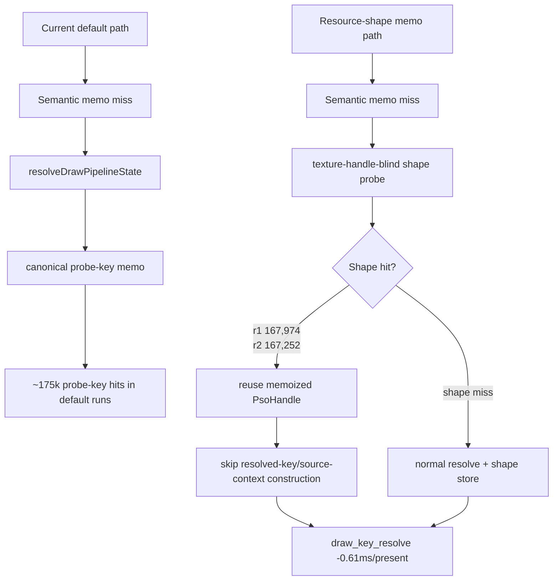

# Encode Phase 80 - Encode-Slot PSO Resource-Shape Memo Repeat A/B

**Question.** [[state-churn-encode-encode-phase.79]] accepted the first
current-code default-vs-enabled pair as a local CPU win, but kept the behavior
default-off until one more low-overhead smoke repeated the direction. Does the
second pair keep the same CPU movement, correctness counters, and visual smoke?

**Runs.**

- Pair r1:
  `app-d3d9-3dmark05-encode-slot-pso-resource-shape-current-default-r1-20260614`
  vs `app-d3d9-3dmark05-encode-slot-pso-resource-shape-memo-r1-20260614`.
- Pair r2:
  `app-d3d9-3dmark05-encode-slot-pso-resource-shape-current-default-r2-20260614`
  vs `app-d3d9-3dmark05-encode-slot-pso-resource-shape-memo-r2-20260614`.
- Enabled runs use `DXMT9_ENABLE_ENCODE_SLOT_PSO_RESOURCE_SHAPE_MEMO=1`.
- All runs use
  `--no-gputrace --no-encoder-breakdown --frame-sampling --timeout 120`.

All four runs timeout-finalized as `status=pass`. Visual smoke was normal in
the inspected output frames: scene lighting, robot, textures, HUD, and muzzle /
bloom effects were present.

## Paired results

| Metric | r1 default | r1 shape memo | r1 delta |
|---|---:|---:|---:|
| `present_encoded` | `1,800` | `1,800` | `0` |
| `sampled_avg_fps` | `16.924` | `16.929` | noisy `+0.005` |
| `gpu_command_buffer_time_ms / present` | `3.342ms` | `3.133ms` | noisy `-0.209ms` |
| `completion_wait_ms / present` | `26.977ms` | `26.587ms` | noisy `-0.390ms` |
| `commit_chunk_replay_cpu_ms / present` | `8.357ms` | `8.314ms` | noisy `-0.043ms` |
| `commit_chunk_queue_draw_submission_cpu_ms / present` | `4.228ms` | `4.200ms` | noisy `-0.028ms` |
| `encode_draw_cpu_ms / present` | `9.445ms` | `9.453ms` | noisy `+0.008ms` |
| `encode_slot_pso_prefetch_cpu_ms / present` | `1.865ms` | `1.335ms` | `-0.530ms` |
| `draw_key_resolve / present` | `1.060ms` | `0.442ms` | `-0.617ms` |
| `draw_resolve_variant_key / present` | `0.667ms` | `0.276ms` | `-0.391ms` |
| `draw_lookup / present` | `0.226ms` | `0.224ms` | flat |

| Metric | r2 default | r2 shape memo | r2 delta |
|---|---:|---:|---:|
| `present_encoded` | `1,800` | `1,800` | `0` |
| `sampled_avg_fps` | `16.927` | `16.854` | noisy `-0.073` |
| `gpu_command_buffer_time_ms / present` | `3.124ms` | `3.264ms` | noisy `+0.140ms` |
| `completion_wait_ms / present` | `26.481ms` | `26.829ms` | noisy `+0.348ms` |
| `commit_chunk_replay_cpu_ms / present` | `8.308ms` | `8.327ms` | noisy `+0.019ms` |
| `commit_chunk_queue_draw_submission_cpu_ms / present` | `4.203ms` | `4.209ms` | noisy `+0.006ms` |
| `encode_draw_cpu_ms / present` | `9.392ms` | `9.444ms` | noisy `+0.052ms` |
| `encode_slot_pso_prefetch_cpu_ms / present` | `1.853ms` | `1.332ms` | `-0.520ms` |
| `draw_key_resolve / present` | `1.053ms` | `0.441ms` | `-0.612ms` |
| `draw_resolve_variant_key / present` | `0.664ms` | `0.275ms` | `-0.389ms` |
| `draw_lookup / present` | `0.224ms` | `0.223ms` | flat |

## Mechanism counters

| Metric | r1 shape memo | r2 shape memo |
|---|---:|---:|
| `encode_slot_pso_prefetch_draw_resource_shape_memo_candidates` | `276,912` | `275,948` |
| `encode_slot_pso_prefetch_draw_resource_shape_memo_hits` | `167,974` | `167,252` |
| `encode_slot_pso_prefetch_draw_resource_shape_memo_misses` | `108,938` | `108,696` |
| `encode_slot_pso_prefetch_draw_resource_shape_memo_overflow` | `0` | `0` |
| `encode_slot_pso_prefetch_draw_resource_shape_memo_stores` | `108,938` | `108,696` |
| `encode_slot_pso_prefetch_draw_probe_key_memo_hits` | `7,870` | `7,861` |
| `encode_slot_pso_prefetch_draw_probe_key_memo_misses` | `101,068` | `100,835` |
| `encode_draw_pso_prefetch_handle_missing` | `0` | `0` |
| `draw_skipped_no_pipeline` | `0` | `0` |
| `gpu_command_buffer_errors` | `0` | `0` |

**Decision.** Accepted as repeated CPU win. Two independent low-overhead pairs
show the same local effect: the resource-shape memo consistently removes about
`0.52-0.53ms/present` from `encode_slot_pso_prefetch_cpu_ms`, mostly by cutting
`draw_key_resolve` / `draw_resolve_variant_key`. The mechanism counters line up:
resource-shape hits are stable, overflow is `0`, remaining probe-key hits stay
small, and the prefetched-handle / skipped-pipeline / Metal-error guards remain
clean.

This is still not an average-FPS proof. Pair r1 moves sampled FPS by `+0.005`
and pair r2 by `-0.073`; GPU command-buffer and completion-wait counters do not
move coherently. The result should be treated as a safe local P2/P3 CPU cleanup
candidate, while the broader GT1 FPS owner remains the serial cadence /
completion-pacing lane.

**Next gate.**

- [[state-churn-encode-encode-phase.81]] promotes the behavior as default CPU
  cleanup without making an FPS claim. Keep an opt-out or validation path:
  changing the resource-shape key must rerun
  `DXMT9_PERF_ENCODE_SLOT_PSO_RESOURCE_SHAPE_OPPORTUNITY=1` and require
  validated mismatches `0`.
- Do not spend Xcode on this knob for GPU-time proof; it does not target the
  TVB/PB or render-pass lanes.
- The next FPS-focused experiment should return to P4/P2/P3 serial cadence:
  prove whether another CPU-local cleanup also reduces
  `completion_wait_ms`, or whether producer/run-ahead work is needed.

**Related.** [[state-churn-encode-encode-phase.79]] ·
[[state-churn-encode-encode-phase.78]] · [[present-pacing]] ·
[[state-churn-encode]].
