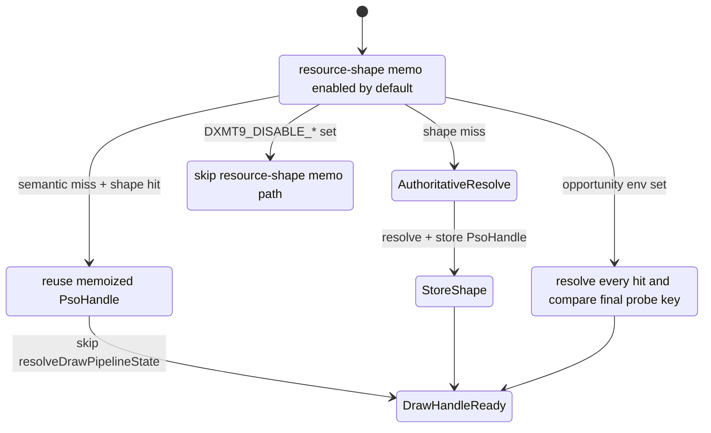

# Encode Phase 81 - Encode-Slot PSO Resource-Shape Memo Default Promotion

**Question.** [state-churn-encode-encode-phase.80](state-churn-encode-encode-phase.80.md) repeated the
resource-shape memo CPU win twice, but still left it default-off. If the memo
is promoted to the normal encode-slot PSO prefetch path, does a no-gputrace
3DMark05 GT1 smoke keep the expected counters and visual output?

**Change.** The resource-shape memo is now default-on. Use
`DXMT9_DISABLE_ENCODE_SLOT_PSO_RESOURCE_SHAPE_MEMO=1` to opt out. The
validation-only opportunity path still wins when
`DXMT9_PERF_ENCODE_SLOT_PSO_RESOURCE_SHAPE_OPPORTUNITY=1` is set, so key-shape
changes can be revalidated without taking the shortcut.

**Run.** `app-d3d9-3dmark05-encode-slot-pso-resource-shape-default-on-r1-20260614`,
no explicit resource-shape enable env,
`--no-gputrace --no-encoder-breakdown --frame-sampling --timeout 120`.
The wrapper timeout-finalized the run as `status=pass`.

Visual smoke is normal: the output frame shows the machine-gun muzzle bloom,
robot, scene lighting, textures, floor glow, and HUD without a black screen,
missing bloom, or obvious texture/geometry drift.

| Metric | Value | Per present |
|---|---:|---:|
| `present_encoded` | `1,800` | n/a |
| `sampled_avg_fps` | `16.911` | n/a |
| `gpu_command_buffer_time_ms` | `5624.836ms` | `3.125ms` |
| `completion_present_wait_ms` | `47479.119ms` | `26.377ms` |
| `commit_chunk_replay_cpu_ms` | `15219.797ms` | `8.455ms` |
| `commit_chunk_queue_draw_submission_cpu_ms` | `7721.081ms` | `4.289ms` |
| `encode_draw_cpu_ms` | `17201.981ms` | `9.557ms` |
| `encode_slot_pso_prefetch_cpu_ms` | `2404.217ms` | `1.336ms` |
| `encode_slot_pso_prefetch_draw_key_resolve_cpu_ms` | `785.205ms` | `0.436ms` |
| `encode_slot_pso_prefetch_draw_resolve_variant_key_cpu_ms` | `487.530ms` | `0.271ms` |
| `encode_slot_pso_prefetch_draw_lookup_cpu_ms` | `405.672ms` | `0.225ms` |

Mechanism/correctness counters:

| Metric | Value |
|---|---:|
| `encode_slot_pso_prefetch_draw_resource_shape_memo_candidates` | `277,156` |
| `encode_slot_pso_prefetch_draw_resource_shape_memo_hits` | `168,200` |
| `encode_slot_pso_prefetch_draw_resource_shape_memo_misses` | `108,956` |
| `encode_slot_pso_prefetch_draw_resource_shape_memo_overflow` | `0` |
| `encode_slot_pso_prefetch_draw_resource_shape_memo_stores` | `108,956` |
| `encode_slot_pso_prefetch_draw_probe_key_memo_hits` | `7,863` |
| `encode_slot_pso_prefetch_draw_probe_key_memo_misses` | `101,093` |
| `encode_draw_pso_prefetch_handle_missing` | `0` |
| `draw_skipped_no_pipeline` | `0` |
| `gpu_command_buffer_errors` | `0` |

**Decision.** Accepted as default CPU cleanup. The default-on smoke matches the
phase 79/80 enabled-shape: resource-shape candidates and hits are live,
overflow remains `0`, handle-missing/skipped-pipeline/Metal-error guards remain
`0`, and the visual smoke is normal. The parent prefetch cost stays in the
expected `~1.33ms/present` band, and `draw_key_resolve` remains below the
pre-promotion `~1.05-1.06ms/present` default baseline.

This is not an average-FPS closure. `sampled_avg_fps=16.911` is in the same
noise band as the phase 79/80 pairs, and completion wait remains the larger
frame-cadence bucket. The promotion removes repeated resolved-key/source-context
work from the default CPU path; the GT1 FPS owner still needs P2/P3/P4 serial
cadence proof.

**Next gate.**

- Keep `DXMT9_DISABLE_ENCODE_SLOT_PSO_RESOURCE_SHAPE_MEMO=1` for opt-out A/B
  and regression bisection.
- If the resource-shape key changes, rerun
  `DXMT9_PERF_ENCODE_SLOT_PSO_RESOURCE_SHAPE_OPPORTUNITY=1` and require
  validated mismatches `0` before trusting the default shortcut.
- The next performance target should not be this PSO memo path. Return to
  serial replay/snapshot/encode or present-pacing work and require
  `completion_present_wait_ms` or producer-overlap movement before claiming FPS.

**Related.** [state-churn-encode-encode-phase.80](state-churn-encode-encode-phase.80.md) ·
[state-churn-encode-encode-phase.79](state-churn-encode-encode-phase.79.md) · [state-churn-encode](index.md) ·
[present-pacing](../present-pacing/index.md).
