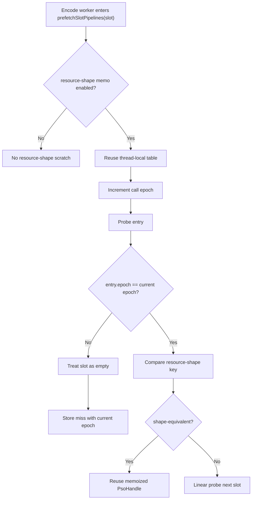

# Encode Phase 82 - Resource-Shape Memo Scratch Reuse

**Question.** [[state-churn-encode-encode-phase.81]] made the resource-shape
PSO memo default-on. Did that path introduce avoidable hot-path allocation or
table clearing inside `prefetchSlotPipelines()`?

**Change.** The resource-shape memo table no longer uses a per-slot
`std::make_unique<std::array<...>>()`. It now uses thread-local scratch storage
with a monotonically increasing epoch. Stale entries from previous slots are
treated as empty when their epoch differs from the current call, so the table
does not need per-slot heap allocation or full zero-initialization.

The table is large enough for this to matter as hot-path hygiene:

| Table | Capacity | Approx bytes |
|---|---:|---:|
| `DrawResourceShapeMemoEntry` | `2,048` | `671,744 B` |
| `DrawProbeKeyMemoEntry` | `512` | `167,936 B` |
| `DrawSemanticMemoEntry` | `2,048` | `81,920 B` |
| handle reuse table | `2,048` | `8,192 B` |

This phase only changes the default-on resource-shape table. The semantic and
probe-key tables remain stack-local and zero-initialized per call; they are
smaller and already existed before the default resource-shape promotion.



**Run.**

```sh
bash scripts/tools/run_3dmark05_perf_probe.sh \
  --suffix encode-slot-pso-resource-shape-scratch-r1-20260615 \
  --no-gputrace --no-encoder-breakdown --frame-sampling --timeout 120
```

The wrapper timeout-finalized the run as `status=pass`. Visual smoke is normal:
the output frame shows the machine-gun muzzle bloom, robot, lighting, textures,
and HUD without a black screen or missing-bloom failure.

| Metric | Value | Per present |
|---|---:|---:|
| `present_encoded` | `1,800` | n/a |
| `sampled_avg_fps` | `16.880` | n/a |
| `gpu_command_buffer_time_ms` | `5762.122ms` | `3.201ms` |
| `completion_wait_ms` | `48603.817ms` | `27.002ms` |
| `commit_chunk_replay_cpu_ms` | `15048.743ms` | `8.361ms` |
| `commit_chunk_queue_draw_submission_cpu_ms` | `7601.745ms` | `4.223ms` |
| `encode_draw_cpu_ms` | `16942.478ms` | `9.412ms` |
| `encode_slot_pso_prefetch_cpu_ms` | `2320.388ms` | `1.289ms` |
| `encode_slot_pso_prefetch_draw_key_resolve_cpu_ms` | `779.637ms` | `0.433ms` |
| `encode_slot_pso_prefetch_draw_resolve_variant_key_cpu_ms` | `485.173ms` | `0.270ms` |
| `encode_slot_pso_prefetch_draw_lookup_cpu_ms` | `400.831ms` | `0.223ms` |

Mechanism/correctness counters:

| Metric | Value |
|---|---:|
| `encode_slot_pso_prefetch_draw_resource_shape_memo_candidates` | `276,393` |
| `encode_slot_pso_prefetch_draw_resource_shape_memo_hits` | `167,727` |
| `encode_slot_pso_prefetch_draw_resource_shape_memo_misses` | `108,666` |
| `encode_slot_pso_prefetch_draw_resource_shape_memo_overflow` | `0` |
| `encode_slot_pso_prefetch_draw_resource_shape_memo_stores` | `108,666` |
| `encode_slot_pso_prefetch_draw_probe_key_memo_hits` | `7,868` |
| `encode_slot_pso_prefetch_draw_probe_key_memo_misses` | `100,798` |
| `encode_draw_pso_prefetch_handle_missing` | `0` |
| `draw_skipped_no_pipeline` | `0` |
| `gpu_command_buffer_errors` | `0` |

**Decision.** Accepted as hot-path cleanup. The behavior counters remain in the
phase 79-81 enabled/default band: resource-shape hits are live, overflow stays
`0`, probe-key hits stay low because the shape memo consumes those rows first,
and the prefetched-handle / skipped-pipeline / Metal-error guards remain clean.
The code also removes a default-on per-slot heap allocation of about `672 KiB`.

Do not read this as an average-FPS fix. The scout keeps sampled FPS and
completion wait in the existing noisy band. The value of this phase is removing
new allocation pressure from the accepted PSO-prefetch cleanup path while
preserving the phase81 mechanism.

**Verification.**

- `meson compile -C build-arm64-nowine`
- `meson compile -C build-x86_64-builtin`
- `meson test -C build-arm64-nowine dxmt9:dxmt9-perf-counter-table-audit dxmt9:dxmt9-perf-counter-callsite-audit --timeout-multiplier 3`
- `git diff --check`

**Next.** If encode-slot PSO prefetch remains worth pursuing, the remaining
scratch cost is the semantic/probe-key table initialization and the resolved-key
children. Otherwise, return to the larger P2/P3/P4 serial-cadence lane.

**Related.** [[state-churn-encode-encode-phase.81]] ·
[[state-churn-encode-encode-phase.80]] · [[state-churn-encode]] ·
[[present-pacing]].
