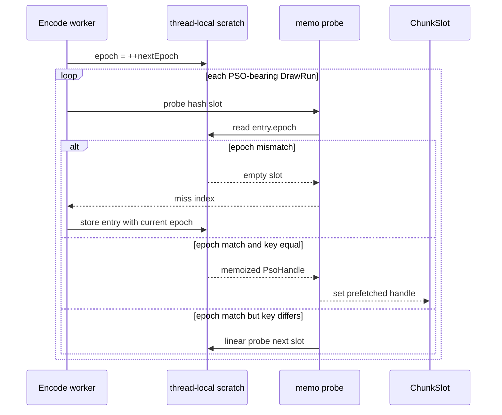

# Encode Phase 83 - Encode-Slot PSO Memo Scratch Epochs

**Question.** [state-churn-encode-encode-phase.82](state-churn-encode-encode-phase.82.md) removed the new
resource-shape memo heap allocation after default promotion. Can the remaining
slot-local memo tables in `prefetchSlotPipelines()` also avoid per-call
zero-initialization and stack pressure?

**Change.** The final-handle reuse table, semantic memo table, and probe-key
memo table now use thread-local scratch storage with a per-call epoch, matching
the resource-shape memo model from phase 82. Stale entries whose epoch differs
from the current call are treated as empty, so the open-addressing miss path
still stops at the first empty slot.

| Table | Capacity | Approx bytes | Previous reset cost |
|---|---:|---:|---|
| final-handle reuse | `2,048` | `~8 KiB` | stack zero-init |
| semantic memo | `2,048` | `~80 KiB` | stack zero-init |
| probe-key memo | `512` | `~164 KiB` | stack zero-init |
| resource-shape memo | `2,048` | `~656 KiB` | phase82 thread-local epoch |



**Run.**

```sh
bash scripts/tools/run_3dmark05_perf_probe.sh \
  --suffix encode-slot-pso-memo-all-scratch-r1-20260615 \
  --no-gputrace --no-encoder-breakdown --frame-sampling --timeout 120
```

The wrapper timeout-finalized the run as `status=pass`. Visual smoke is normal:
the machine-gun muzzle bloom, robot, scene lighting, textures, and HUD render
without a black screen or missing-bloom failure.

| Metric | Value | Per present |
|---|---:|---:|
| `present_encoded` | `1,800` | n/a |
| `sampled_avg_fps` | `16.861` | n/a |
| `gpu_command_buffer_time_ms` | `5397.711ms` | `2.999ms` |
| `completion_wait_ms` | `51198.241ms` | `28.443ms` |
| `commit_chunk_replay_cpu_ms` | `15382.940ms` | `8.546ms` |
| `commit_chunk_queue_draw_submission_cpu_ms` | `7845.461ms` | `4.359ms` |
| `encode_draw_cpu_ms` | `17149.738ms` | `9.528ms` |
| `encode_slot_pso_prefetch_cpu_ms` | `2321.516ms` | `1.290ms` |
| `encode_slot_pso_prefetch_draw_key_resolve_cpu_ms` | `789.935ms` | `0.439ms` |
| `encode_slot_pso_prefetch_draw_resolve_variant_key_cpu_ms` | `491.024ms` | `0.273ms` |
| `encode_slot_pso_prefetch_draw_lookup_cpu_ms` | `404.080ms` | `0.224ms` |

Mechanism/correctness counters:

| Metric | Value |
|---|---:|
| `encode_slot_pso_prefetch_draw_semantic_memo_hits` | `306,884` |
| `encode_slot_pso_prefetch_draw_semantic_memo_misses` | `277,109` |
| `encode_slot_pso_prefetch_draw_semantic_memo_overflow` | `0` |
| `encode_slot_pso_prefetch_draw_resource_shape_memo_candidates` | `277,109` |
| `encode_slot_pso_prefetch_draw_resource_shape_memo_hits` | `167,036` |
| `encode_slot_pso_prefetch_draw_resource_shape_memo_misses` | `110,073` |
| `encode_slot_pso_prefetch_draw_resource_shape_memo_overflow` | `0` |
| `encode_slot_pso_prefetch_draw_probe_key_memo_hits` | `7,875` |
| `encode_slot_pso_prefetch_draw_probe_key_memo_misses` | `102,198` |
| `encode_slot_pso_prefetch_draw_probe_key_memo_overflow` | `0` |
| `encode_slot_pso_prefetch_draw_handle_slot_repeat_hits` | `481,795` |
| `encode_slot_pso_prefetch_draw_handle_slot_unique` | `102,198` |
| `encode_slot_pso_prefetch_draw_handle_slot_overflow` | `0` |
| `encode_draw_pso_prefetch_handle_missing` | `0` |
| `draw_skipped_no_pipeline` | `0` |
| `gpu_command_buffer_errors` | `0` |

**Decision.** Accepted as hot-path cleanup. The epoch scratch conversion keeps
all memo mechanism counters in the phase81/82 band, with no overflow, missing
prefetched handles, skipped pipeline draws, or Metal command-buffer errors.
It removes the remaining per-call stack zero-init for the slot-local PSO memo
tables.

This does not change the average-FPS conclusion. `sampled_avg_fps=16.861` and
`completion_wait_ms=28.443ms/present` remain in the existing noisy cadence band.
The value is cleanup of the accepted encode-slot PSO prefetch path, not closure
of the GT1 wall-clock bottleneck.

**Verification.**

- `meson compile -C build-arm64-nowine`
- `meson compile -C build-x86_64-builtin`
- `meson test -C build-arm64-nowine dxmt9:dxmt9-perf-counter-table-audit dxmt9:dxmt9-perf-counter-callsite-audit --timeout-multiplier 3`
- `git diff --check`

**Next.** Do not continue PSO memo scratch work unless a new counter names it.
The larger remaining lanes are still P2/P3/P4 serial cadence and the argbuf /
constant-storage model.

**Related.** [state-churn-encode-encode-phase.82](state-churn-encode-encode-phase.82.md) ·
[state-churn-encode-encode-phase.81](state-churn-encode-encode-phase.81.md) · [state-churn-encode](index.md) ·
[present-pacing](../present-pacing/index.md).
