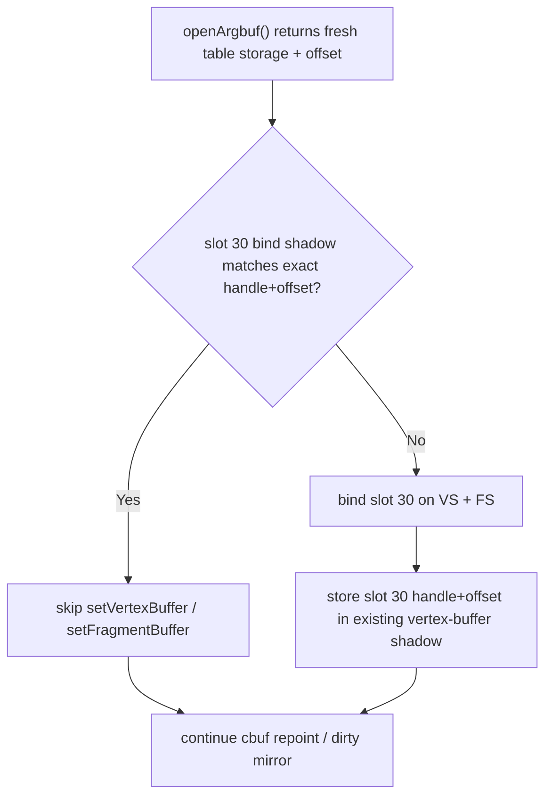

# Encode Phase 84 - Argbuf Table Shadow Direct Slot Check

**Question.** After [state-churn-encode-encode-phase.83](state-churn-encode-encode-phase.83.md) closed the PSO
memo scratch lane, the next average-FPS work should return to P2/P3 argbuf /
constant-storage costs. One small open question was whether the Stage 2
slot-30 argbuf table bind shadow still carries a useful separate hash path,
even though [state-churn-encode-encode-phase.09](state-churn-encode-encode-phase.09.md) measured
`encode_draw_argbuf_table_bind_skipped=0`.

**Change.** Remove the dedicated `argbufTableHash` / `argbufTableValid` shadow
state and the `argbufTableShadowHash(handle, offset)` helper. The argbuf table
bind skip now checks the existing vertex-buffer bind shadow for slot 30
directly:



This preserves the old skip semantics but removes the redundant lossy hash
state. The current fresh-table design is still expected to miss the skip path:
each reopened argbuf gets a distinct transient offset.

**Run.**

```sh
bash scripts/tools/run_3dmark05_perf_probe.sh \
  --suffix argbuf-table-shadow-direct-r1-20260615 \
  --no-gputrace --no-encoder-breakdown --frame-sampling --timeout 120
```

The wrapper finalized the run as `status=pass`. Visual smoke is normal: the
machine-gun muzzle bloom, HUD, robot, lighting, and texture mapping are present;
there is no black-screen or missing-bloom failure.

| Metric | Value | Per present |
|---|---:|---:|
| `present_encoded` | `1,800` | n/a |
| `draw_calls` | `1,330,873` | `739.374` |
| `sampled_avg_fps` | `16.779` | n/a |
| `gpu_command_buffer_time_ms` | `5722.384ms` | `3.179ms` |
| `completion_wait_ms` | `49289.820ms` | `27.383ms` |
| `commit_chunk_replay_cpu_ms` | `15156.189ms` | `8.420ms` |
| `commit_chunk_queue_draw_submission_cpu_ms` | `7682.167ms` | `4.268ms` |
| `encode_draw_cpu_ms` | `17039.616ms` | `9.466ms` |
| `encode_draw_argbuf_setup_cpu_ms` | `4538.988ms` | `2.522ms` |
| `encode_draw_argbuf_open_cpu_ms` | `2514.222ms` | `1.397ms` |
| `encode_draw_argbuf_open_call_cpu_ms` | `649.964ms` | `0.361ms` |
| `encode_draw_argbuf_reopen_post_cpu_ms` | `1703.464ms` | `0.946ms` |
| `encode_draw_argbuf_reopen_table_probe_cpu_ms` | `49.962ms` | `0.028ms` |
| `encode_draw_argbuf_reopen_table_shadow_store_cpu_ms` | `50.166ms` | `0.028ms` |
| `encode_draw_argbuf_table_bind_cpu_ms` | `292.396ms` | `0.162ms` |
| `encode_draw_argbuf_cbuf_update_cpu_ms` | `1761.749ms` | `0.979ms` |
| `encode_slot_pso_prefetch_cpu_ms` | `2317.560ms` | `1.288ms` |

Correctness / mechanism counters:

| Metric | Value |
|---|---:|
| `encode_draw_argbuf_table_bind_calls` | `987,526` |
| `encode_draw_argbuf_table_bind_skipped` | `0` |
| `draw_skipped_no_pipeline` | `0` |
| `gpu_command_buffer_errors` | `0` |
| `render_split_hazard` | `0` |
| `map_buffer_wait_ms` | `0.000` |
| `queue_sequence_wait_ms` | `0.000` |

**Decision.** Accepted as cleanup, rejected as an FPS lever. The exact slot-30
shadow check is simpler and cannot collide, but the run confirms the old
conclusion: `encode_draw_argbuf_table_bind_skipped=0`. Slot-30 table shadowing
does not help the current Stage 2 fresh-table design.

The remaining argbuf owners are structural: table open/reopen frequency,
fresh-table storage shape, dirty VS cbuf update frequency/width, or a larger
constant-storage model. Do not spend more time on slot-30 bind shadowing unless
a future design makes `openArgbuf()` reuse the exact same table handle+offset
within one render encoder.

**Verification.**

- `meson compile -C build-arm64-nowine`
- `meson compile -C build-x86_64-builtin`
- `meson test -C build-arm64-nowine dxmt9:dxmt9-perf-counter-table-audit dxmt9:dxmt9-perf-counter-callsite-audit --timeout-multiplier 3`
- `git diff --check`

**Next.** Continue P2/P3 work on argbuf table storage/reopen shape, dirty VS
cbuf update frequency, binding-packet/storage width, and snapshot/queue
interning. Average-FPS promotion still needs P4 completion-wait or same-cycle
serial-stage movement.

**Related.** [state-churn-encode-encode-phase.83](state-churn-encode-encode-phase.83.md) ·
[state-churn-encode-encode-phase.68](state-churn-encode-encode-phase.68.md) · [present-pacing-lowoverhead-serial.24](../present-pacing/present-pacing-lowoverhead-serial.24.md)
· [state-churn-encode](../state-churn-encode.md) · [present-pacing](../present-pacing.md).
