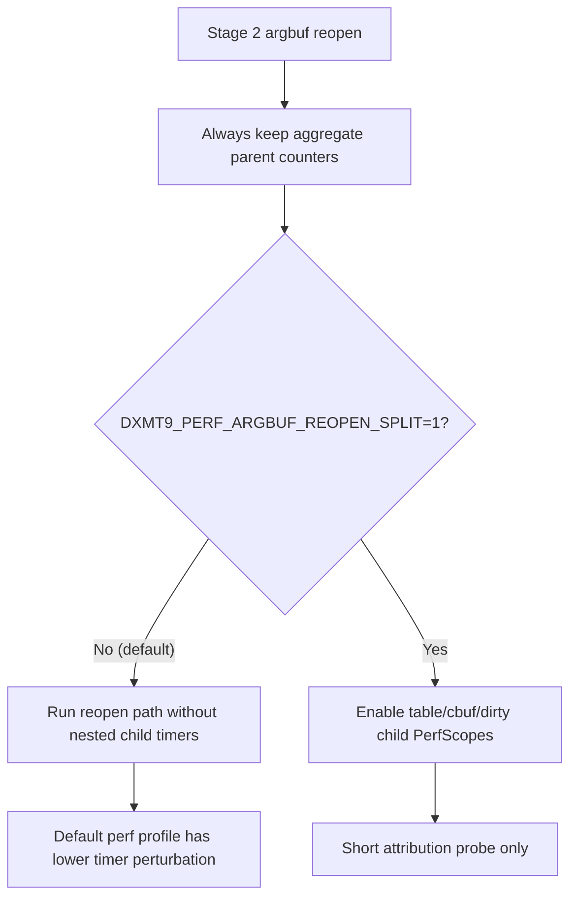

# Encode Phase 85 - Argbuf Reopen Split Default-Off Cleanup

**Question.** [state-churn-encode-encode-phase.57](state-churn-encode-encode-phase.57.md) split the Stage 2 argbuf
post-open path and showed the residual was distributed bookkeeping rather than
one hidden child. Those child timers were attribution-only, but they still ran
in the default hot path. After [state-churn-encode-encode-phase.84](state-churn-encode-encode-phase.84.md) rejected
slot-30 table shadowing as the next lever, the default profile should stop
paying for the old split unless explicitly requested.

**Change.** Add `DXMT9_PERF_ARGBUF_REOPEN_SPLIT=1` as the opt-in guard for the
post-open child timers:

- `encode_draw_argbuf_reopen_table_probe_cpu_ms`
- `encode_draw_argbuf_reopen_table_shadow_store_cpu_ms`
- `encode_draw_argbuf_reopen_byte_account_cpu_ms`
- `encode_draw_argbuf_reopen_cbuf_cache_probe_cpu_ms`
- `encode_draw_argbuf_reopen_cbuf_dirty_scan_cpu_ms`
- `encode_draw_argbuf_reopen_cbuf_force_dirty_cpu_ms`

The aggregate behavior and parent counters remain live by default:
`encode_draw_argbuf_reopen_post_cpu_ms`, argbuf table bind, cbuf update, and
argbuf bytes are still counted.



**Run.**

```sh
bash scripts/tools/run_3dmark05_perf_probe.sh \
  --suffix argbuf-reopen-split-default-off-r1-20260615 \
  --no-gputrace --no-encoder-breakdown --frame-sampling --timeout 120
```

The wrapper finalized the run as `status=pass`. Visual smoke is normal:
machine-gun muzzle bloom, rifle/impact particles, bright effects, HUD, geometry,
and texture mapping are present; there is no black-screen or yellow-screen
failure.

| Metric | Value | Per present |
|---|---:|---:|
| `present_encoded` | `1,800` | n/a |
| `draw_calls` | `1,328,758` | `738.199` |
| `sampled_avg_fps` | `16.905` | n/a |
| `gpu_command_buffer_time_ms` | `5645.199ms` | `3.136ms` |
| `completion_wait_ms` | `47880.264ms` | `26.600ms` |
| `commit_chunk_replay_cpu_ms` | `15211.546ms` | `8.451ms` |
| `commit_chunk_queue_draw_submission_cpu_ms` | `7715.400ms` | `4.286ms` |
| `encode_draw_cpu_ms` | `16335.070ms` | `9.075ms` |
| `encode_draw_argbuf_setup_cpu_ms` | `3761.136ms` | `2.090ms` |
| `encode_draw_argbuf_open_cpu_ms` | `1738.442ms` | `0.966ms` |
| `encode_draw_argbuf_open_call_cpu_ms` | `638.318ms` | `0.355ms` |
| `encode_draw_argbuf_reopen_post_cpu_ms` | `925.485ms` | `0.514ms` |
| `encode_draw_argbuf_table_bind_cpu_ms` | `180.677ms` | `0.100ms` |
| `encode_draw_argbuf_cbuf_update_cpu_ms` | `1762.803ms` | `0.979ms` |
| `encode_slot_pso_prefetch_cpu_ms` | `2308.010ms` | `1.282ms` |

Default-off verification:

| Split child counter | Value |
|---|---:|
| `encode_draw_argbuf_reopen_table_probe_cpu_ms` | `0.000` |
| `encode_draw_argbuf_reopen_table_shadow_store_cpu_ms` | `0.000` |
| `encode_draw_argbuf_reopen_byte_account_cpu_ms` | `0.000` |
| `encode_draw_argbuf_reopen_cbuf_cache_probe_cpu_ms` | `0.000` |
| `encode_draw_argbuf_reopen_cbuf_dirty_scan_cpu_ms` | `0.000` |
| `encode_draw_argbuf_reopen_cbuf_force_dirty_cpu_ms` | `0.000` |

Correctness / mechanism counters:

| Metric | Value |
|---|---:|
| `encode_draw_argbuf_table_bind_calls` | `986,453` |
| `encode_draw_argbuf_table_bind_skipped` | `0` |
| `draw_skipped_no_pipeline` | `0` |
| `gpu_command_buffer_errors` | `0` |
| `render_split_hazard` | `0` |
| `map_buffer_wait_ms` | `0.000` |
| `queue_sequence_wait_ms` | `0.000` |

**Decision.** Accepted as hot-path instrumentation cleanup, not as an FPS
proof. The run proves the attribution-only child timers are no longer present
in the default profile, while the aggregate argbuf cost remains measurable.
`encode_draw_argbuf_reopen_post_cpu_ms` is still `0.514ms/present`,
`encode_draw_argbuf_cbuf_update_cpu_ms` is still `0.979ms/present`, and
`encode_draw_argbuf_table_bind_skipped` remains `0`, so the structural Stage 2
argbuf problem is unchanged.

Use `DXMT9_PERF_ARGBUF_REOPEN_SPLIT=1` only for short attribution probes. The
next argbuf work must change table storage/reopen frequency, dirty VS cbuf
update frequency/width, or the constant-storage model rather than further
splitting this bookkeeping path.

**Verification.**

- `meson compile -C build-arm64-nowine`
- `meson compile -C build-x86_64-builtin`
- `meson test -C build-arm64-nowine dxmt9:dxmt9-perf-counter-table-audit dxmt9:dxmt9-perf-counter-callsite-audit --timeout-multiplier 3`
- `bash scripts/tools/run_3dmark05_perf_probe.sh --suffix argbuf-reopen-split-default-off-r1-20260615 --no-gputrace --no-encoder-breakdown --frame-sampling --timeout 120`
- `git diff --check`

**Next.** Keep the default profile low-overhead for P2/P3/P4 work. The likely
next CPU-facing candidates are dirty VS cbuf update frequency/width, argbuf
table storage/reopen shape, or earlier PE/unix publication/interning work that
can also move completion wait or same-cycle serial stage deltas.

**Related.** [state-churn-encode-encode-phase.84](state-churn-encode-encode-phase.84.md) ·
[state-churn-encode-encode-phase.57](state-churn-encode-encode-phase.57.md) · [state-churn-encode-encode-phase.68](state-churn-encode-encode-phase.68.md)
· [present-pacing-lowoverhead-serial.24](../present-pacing/present-pacing-lowoverhead-serial.24.md) · [state-churn-encode](../state-churn-encode.md).
