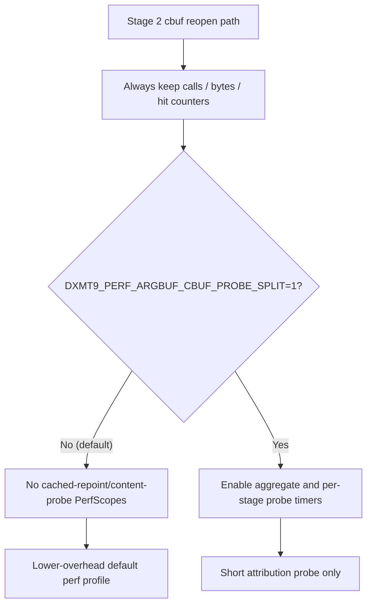

# Encode Phase 86 - Argbuf Cbuf Probe Timers Default-Off Cleanup

> **Outdated — every artifact this leaf cites in `source:` is gone from disk.** The numbers below cannot be re-derived or re-checked. Kept as history; do not cite it as current evidence.

**Question.** [state-churn-encode-encode-phase.61](state-churn-encode-encode-phase.61.md) used
`DXMT9_PERF_ARGBUF_CBUF_PROBE_SPLIT=1` to split cached cbuf repoint and content
probe costs. That attribution rejected both as primary one-stage targets, but
the aggregate cached-repoint and content-probe `PerfScope`s still ran in the
default Stage 2 argbuf reopen path. They should be opt-in like the stage split
children from [state-churn-encode-encode-phase.85](state-churn-encode-encode-phase.85.md).

**Change.** Gate these attribution timers behind
`DXMT9_PERF_ARGBUF_CBUF_PROBE_SPLIT=1`:

- `encode_draw_argbuf_cbuf_cached_repoint_cpu_ms`
- `encode_draw_argbuf_cbuf_cached_repoint_{vs,ps,ffp_vs,ffp_ps}_cpu_ms`
- `encode_draw_argbuf_cbuf_content_probe_cpu_ms`
- `encode_draw_argbuf_cbuf_content_probe_{vs,ps,ffp_ps}_cpu_ms`

The non-timed counters remain live by default: cached-repoint calls/bytes and
content-probe calls/hits/misses still size the mechanism without timing every
probe.



**Run.**

```sh
bash scripts/tools/run_3dmark05_perf_probe.sh \
  --suffix argbuf-cbuf-probe-timers-default-off-r1-20260615b \
  --no-gputrace --no-encoder-breakdown --frame-sampling --timeout 120
```

The wrapper finalized the run as `status=pass`. Visual smoke is normal: bright
muzzle / impact bloom, particles, HUD, geometry, and texture mapping are
present; there is no black-screen or yellow-screen failure.

| Metric | Value | Per present |
|---|---:|---:|
| `present_encoded` | `1,800` | n/a |
| `draw_calls` | `1,329,463` | `738.591` |
| `sampled_avg_fps` | `16.962` | n/a |
| `gpu_command_buffer_time_ms` | `5639.970ms` | `3.133ms` |
| `completion_wait_ms` | `48464.610ms` | `26.925ms` |
| `commit_chunk_replay_cpu_ms` | `14960.524ms` | `8.311ms` |
| `commit_chunk_queue_draw_submission_cpu_ms` | `7554.919ms` | `4.197ms` |
| `encode_draw_cpu_ms` | `15780.530ms` | `8.767ms` |
| `encode_draw_argbuf_setup_cpu_ms` | `3372.722ms` | `1.874ms` |
| `encode_draw_argbuf_open_cpu_ms` | `1388.509ms` | `0.771ms` |
| `encode_draw_argbuf_reopen_post_cpu_ms` | `608.585ms` | `0.338ms` |
| `encode_draw_argbuf_cbuf_update_cpu_ms` | `1733.649ms` | `0.963ms` |
| `encode_slot_pso_prefetch_cpu_ms` | `2307.959ms` | `1.282ms` |

Default-off verification:

| Split counter | Value |
|---|---:|
| `encode_draw_argbuf_cbuf_cached_repoint_cpu_ms` | `0.000` |
| `encode_draw_argbuf_cbuf_cached_repoint_vs_cpu_ms` | `0.000` |
| `encode_draw_argbuf_cbuf_cached_repoint_ps_cpu_ms` | `0.000` |
| `encode_draw_argbuf_cbuf_cached_repoint_ffp_vs_cpu_ms` | `0.000` |
| `encode_draw_argbuf_cbuf_cached_repoint_ffp_ps_cpu_ms` | `0.000` |
| `encode_draw_argbuf_cbuf_content_probe_cpu_ms` | `0.000` |
| `encode_draw_argbuf_cbuf_content_probe_vs_cpu_ms` | `0.000` |
| `encode_draw_argbuf_cbuf_content_probe_ps_cpu_ms` | `0.000` |
| `encode_draw_argbuf_cbuf_content_probe_ffp_ps_cpu_ms` | `0.000` |

The mechanism counters remain live:

| Mechanism counter | Value |
|---|---:|
| `encode_draw_argbuf_cbuf_cached_repoint_calls` | `1,726,364` |
| `encode_draw_argbuf_cbuf_cached_repoint_bytes` | `400,548,256` |
| `encode_draw_argbuf_cbuf_content_probe_calls` | `965,978` |
| `encode_draw_argbuf_cbuf_content_probe_vs_hits` | `148,602` |
| `encode_draw_argbuf_cbuf_content_probe_vs_misses` | `817,376` |
| `encode_draw_argbuf_cbuf_content_probe_ps_hits` | `645,452` |
| `encode_draw_argbuf_cbuf_content_probe_ps_misses` | `320,526` |
| `encode_draw_argbuf_cbuf_content_probe_ffp_ps_hits` | `932,310` |
| `encode_draw_argbuf_cbuf_content_probe_ffp_ps_misses` | `33,668` |

Correctness / clean-run counters:

| Metric | Value |
|---|---:|
| `draw_skipped_no_pipeline` | `0` |
| `gpu_command_buffer_errors` | `0` |
| `render_split_hazard` | `0` |
| `map_buffer_wait_ms` | `0.000` |
| `queue_sequence_wait_ms` | `0.000` |

**Decision.** Accepted as default-profile cleanup, not as an FPS proof. The run
proves cached-repoint/content-probe timing is no longer paid in the default
Stage 2 argbuf path while the sizing counters remain available. The structural
owners remain the larger argbuf setup/cbuf update path, encode-slot PSO
prefetch, queued draw submission, and completion wait.

Use `DXMT9_PERF_ARGBUF_CBUF_PROBE_SPLIT=1` only for short attribution probes.
The next argbuf/cbuf work should reduce table reopen frequency, dirty VS update
frequency, or storage shape; another micro-split of cached repoint/content
probe is not justified by current counters.

**Verification.**

- `meson compile -C build-arm64-nowine`
- `meson compile -C build-x86_64-builtin`
- `meson test -C build-arm64-nowine dxmt9:dxmt9-perf-counter-table-audit dxmt9:dxmt9-perf-counter-callsite-audit --timeout-multiplier 3`
- `bash scripts/tools/run_3dmark05_perf_probe.sh --suffix argbuf-cbuf-probe-timers-default-off-r1-20260615b --no-gputrace --no-encoder-breakdown --frame-sampling --timeout 120`
- `git diff --check`

**Related.** [state-churn-encode-encode-phase.85](state-churn-encode-encode-phase.85.md) ·
[state-churn-encode-encode-phase.61](state-churn-encode-encode-phase.61.md) · [present-pacing-lowoverhead-serial.24](../present-pacing/present-pacing-lowoverhead-serial.24.md)
· [state-churn-encode](index.md).
