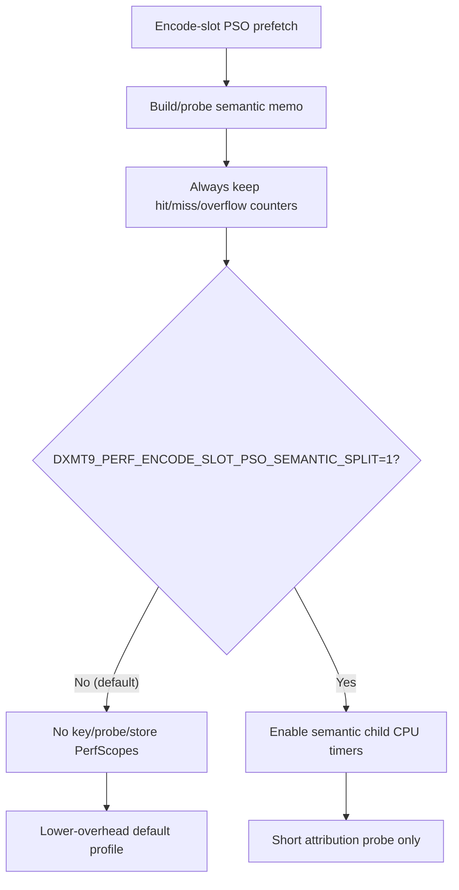

# Encode Phase 87 - Encode-Slot PSO Semantic Split Default-Off Cleanup

**Question.** [[state-churn-encode-encode-phase.75]] split the default
encode-slot PSO semantic memo into key/probe/store child timers and classified
their subtotal as attribution overhead, not the next primary PSO-prefetch
target. Those child timers still ran in the default profile. They should follow
the phase85/phase86 pattern: keep mechanism counters live, make clocked child
timers opt-in.

**Change.** Add `DXMT9_PERF_ENCODE_SLOT_PSO_SEMANTIC_SPLIT=1` as the opt-in
guard for:

- `encode_slot_pso_prefetch_draw_semantic_key_cpu_ms`
- `encode_slot_pso_prefetch_draw_semantic_probe_cpu_ms`
- `encode_slot_pso_prefetch_draw_semantic_store_cpu_ms`

The semantic memo still runs by default, and hit/miss/overflow plus
resource-shape memo counters remain live.



**Run.**

```sh
bash scripts/tools/run_3dmark05_perf_probe.sh \
  --suffix pso-semantic-split-default-off-r1-20260615 \
  --no-gputrace --no-encoder-breakdown --frame-sampling --timeout 120
```

The wrapper finalized the run as `status=pass`. Visual smoke is normal: bright
muzzle / impact bloom, particle spray, HUD, geometry, and texture mapping are
present; there is no black-screen or yellow-screen failure.

| Metric | Value | Per present |
|---|---:|---:|
| `present_encoded` | `1,851` | n/a |
| `draw_calls` | `1,360,088` | `734.786` |
| `sampled_avg_fps` | `16.938` | n/a |
| `gpu_command_buffer_time_ms` | `5786.857ms` | `3.126ms` |
| `completion_wait_ms` | `50279.114ms` | `27.163ms` |
| `commit_chunk_replay_cpu_ms` | `15301.861ms` | `8.267ms` |
| `commit_chunk_queue_draw_submission_cpu_ms` | `7718.847ms` | `4.170ms` |
| `encode_slot_pso_prefetch_cpu_ms` | `2241.544ms` | `1.211ms` |
| `encode_slot_pso_prefetch_draw_key_resolve_cpu_ms` | `795.567ms` | `0.430ms` |
| `encode_slot_pso_prefetch_draw_resolve_variant_key_cpu_ms` | `494.619ms` | `0.267ms` |
| `encode_slot_pso_prefetch_draw_lookup_cpu_ms` | `404.582ms` | `0.219ms` |

Default-off verification:

| Split child counter | Value |
|---|---:|
| `encode_slot_pso_prefetch_draw_semantic_key_cpu_ms` | `0.000` |
| `encode_slot_pso_prefetch_draw_semantic_probe_cpu_ms` | `0.000` |
| `encode_slot_pso_prefetch_draw_semantic_store_cpu_ms` | `0.000` |

Mechanism counters remain live:

| Counter | Value |
|---|---:|
| `encode_slot_pso_prefetch_draw_semantic_memo_hits` | `316,115` |
| `encode_slot_pso_prefetch_draw_semantic_memo_misses` | `281,818` |
| `encode_slot_pso_prefetch_draw_semantic_memo_overflow` | `0` |
| `encode_slot_pso_prefetch_draw_resource_shape_memo_hits` | `171,046` |
| `encode_draw_pso_prefetch_handle_missing` | `0` |

Correctness / clean-run counters:

| Metric | Value |
|---|---:|
| `draw_skipped_no_pipeline` | `0` |
| `gpu_command_buffer_errors` | `0` |
| `render_split_hazard` | `0` |
| `map_buffer_wait_ms` | `0.000` |
| `queue_sequence_wait_ms` | `0.000` |

**Decision.** Accepted as hot-path instrumentation cleanup, not as an FPS proof.
The semantic memo behavior remains intact, while the attribution-only
key/probe/store clock calls no longer perturb the default profile.

The remaining encode-slot PSO owners are real work: draw-key resolve
(`0.430ms/present`, led by variant-key construction) and final lookup
(`0.219ms/present`). Further PSO-prefetch work should reduce miss-side resolve
or lookup frequency rather than micro-splitting the semantic memo again.

**Verification.**

- `meson compile -C build-arm64-nowine`
- `meson compile -C build-x86_64-builtin`
- `meson test -C build-arm64-nowine dxmt9:dxmt9-perf-counter-table-audit dxmt9:dxmt9-perf-counter-callsite-audit --timeout-multiplier 3`
- `bash scripts/tools/run_3dmark05_perf_probe.sh --suffix pso-semantic-split-default-off-r1-20260615 --no-gputrace --no-encoder-breakdown --frame-sampling --timeout 120`
- `git diff --check`

**Related.** [[state-churn-encode-encode-phase.86]] ·
[[state-churn-encode-encode-phase.75]] · [[state-churn-encode-encode-phase.81]]
· [[present-pacing-lowoverhead-serial.24]] · [[state-churn-encode]].
