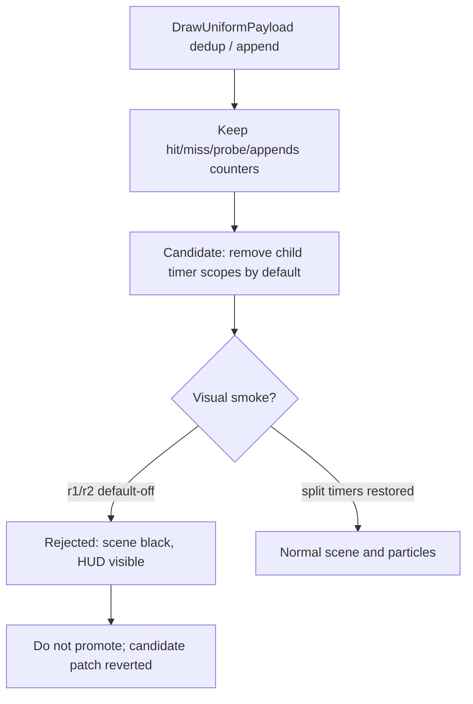

# Encode Phase 88 - Uniform Payload Split Default-Off Rejected

**Question.** The `draw_uniform_payload_*` child timers under
`submit_draw_run_batch_append_uniform_cpu_ms` are hot-path attribution probes.
Can they be made default-off like the phase85/phase86/phase87 timer cleanups,
while keeping hit/miss/appends counters live?

**Candidate.** A temporary patch gated these child timers behind a new
`DXMT9_PERF_DRAW_UNIFORM_PAYLOAD_SPLIT=1` flag:

- `draw_uniform_payload_lookup_cpu_ms`
- `draw_uniform_payload_lookup_bucket_cpu_ms`
- `draw_uniform_payload_append_reserve_cpu_ms`
- `draw_uniform_payload_append_copy_cpu_ms`
- `draw_uniform_payload_append_link_cpu_ms`

The mechanism counters remained live: lookup hits/misses/probes/collisions and
append count.

**Runs.**

| Run | Timer mode | Result | Visual | Key counters |
|---|---|---|---|---|
| `uniform-payload-split-default-off-r1-20260615` | child timers off | `pass` summary | rejected: HUD-only black scene | child timers `0.000`, appends `947,521`, FPS `16.885` |
| `uniform-payload-split-default-off-r2-20260615` | child timers off | `pass` summary | rejected: HUD-only black scene | child timers `0.000`, appends `968,924`, FPS `16.942` |
| `uniform-payload-split-optin-r1-20260615` | child timers restored | `pass` summary | accepted: normal scene, bloom, particles, HUD | lookup `298.392ms`, bucket `155.622ms`, copy `631.871ms`, appends `944,635`, FPS `16.868` |

All three runs keep explicit correctness counters clean:
`draw_skipped_no_pipeline=0`, `gpu_command_buffer_errors=0`,
`render_split_hazard=0`, `map_buffer_wait_ms=0`, and
`queue_sequence_wait_ms=0`. That is not enough to accept the candidate because
the visual gate fails twice when the child timer scopes are removed.

**Decision.** Rejected. The temporary patch was reverted. Do not make
`draw_uniform_payload_*` child timers default-off until the visual timing
sensitivity is explained. The result is evidence that queue append timing can
mask or expose a renderer/presenter hazard that is not caught by the existing
skipped-pipeline, Metal-error, render-split-hazard, map-wait, or
queue-sequence-wait counters.

**Implication.** This is not a uniform-payload CPU cleanup. It is a new
perf/visual-coupling clue. Future work should add a targeted visual/timing
hazard probe around queue append -> slot publish -> encode rather than
removing this timer layer blindly. If the candidate is revisited, require:

- repeated normal visual smoke with the timers off;
- an A/B against the timer-restored mode in the same code state;
- additional counters that explain why the scene can go black while HUD,
  present count, and explicit error counters remain clean.

**Verification.**

- `meson compile -C build-arm64-nowine`
- `meson compile -C build-x86_64-builtin`
- `meson test -C build-arm64-nowine dxmt9:dxmt9-perf-counter-table-audit dxmt9:dxmt9-perf-counter-callsite-audit --timeout-multiplier 3`
- `bash scripts/tools/run_3dmark05_perf_probe.sh --suffix uniform-payload-split-default-off-r1-20260615 --no-gputrace --no-encoder-breakdown --frame-sampling --timeout 120`
- `bash scripts/tools/run_3dmark05_perf_probe.sh --suffix uniform-payload-split-default-off-r2-20260615 --no-gputrace --no-encoder-breakdown --frame-sampling --timeout 120`
- `DXMT9_PERF_DRAW_UNIFORM_PAYLOAD_SPLIT=1 bash scripts/tools/run_3dmark05_perf_probe.sh --suffix uniform-payload-split-optin-r1-20260615 --no-gputrace --no-encoder-breakdown --frame-sampling --timeout 120`

**Related.** [[state-churn-encode-encode-phase.87]] ·
[[state-churn-encode-encode-phase.52]] · [[state-churn-encode-encode-phase.53]]
· [[visual-coupling]] · [[state-churn-encode]].
