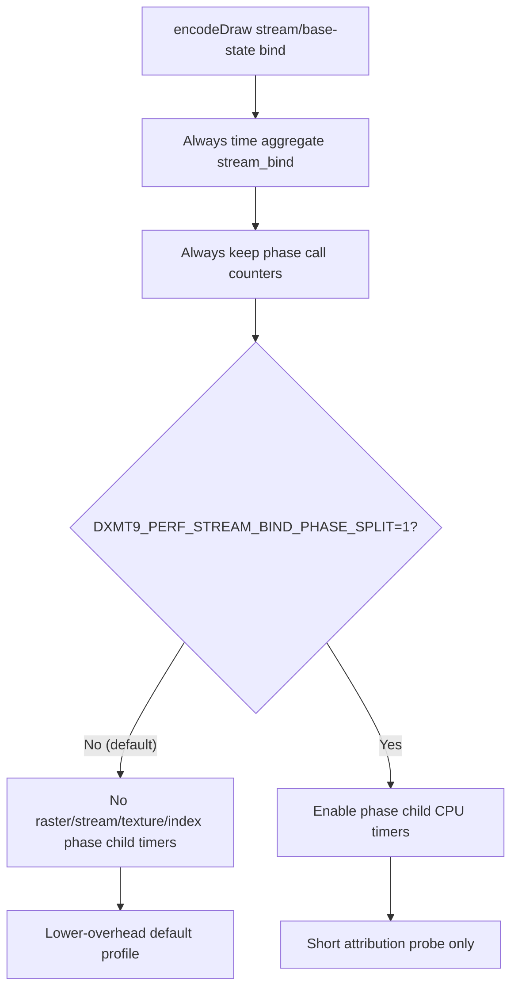

# Encode Phase 89 - Stream Bind Phase Split Default-Off Cleanup

**Question.** `encode_draw_stream_bind_cpu_ms` remains a current CPU child
(`1.388ms/present` in [present-pacing-lowoverhead-refresh.33](../present-pacing/present-pacing-lowoverhead-refresh.33.md)), but the
phase child timers under it are attribution-only:

- `encode_draw_stream_bind_raster_phase_cpu_ms`
- `encode_draw_stream_bind_ffp_stream_cpu_ms`
- `encode_draw_stream_bind_shader_stream_cpu_ms`
- `encode_draw_stream_bind_texture_phase_cpu_ms`
- `encode_draw_stream_bind_index_phase_cpu_ms`

Can the default profile keep the aggregate parent timer and phase call counters
while making these child timers opt-in?

**Change.** Add `DXMT9_PERF_STREAM_BIND_PHASE_SPLIT=1`. The default profile now
passes `nullptr` to the phase child `PerfScope`s while keeping:

- aggregate `encode_draw_stream_bind_cpu_ms`;
- phase call counters;
- narrower real work timers such as texture/sampler bind, vertex stream bind,
  raster state, and index setup.

**Runs.**

| Run | Timer mode | Visual | FPS avg | `stream_bind` | Phase child timers |
|---|---|---|---:|---:|---:|
| `stream-bind-phase-split-default-off-r1-20260615` | child timers off | normal bloom/particles/scene/HUD | `18.931` | `1.187ms/present` | all `0.000` |
| `stream-bind-phase-split-optin-r1-20260615` | child timers on | normal bloom/particles/scene/HUD | `18.960` | `1.396ms/present` | nonzero, expected shape |

Default-off keeps phase call counters live:

| Counter | Default-off |
|---|---:|
| `encode_draw_stream_bind_raster_phase_calls` | `454,445` |
| `encode_draw_stream_bind_ffp_stream_calls` | `17,979` |
| `encode_draw_stream_bind_shader_stream_calls` | `1,313,743` |
| `encode_draw_stream_bind_texture_phase_calls` | `454,445` |
| `encode_draw_stream_bind_index_phase_calls` | `1,331,722` |

Opt-in restores the attribution shape:

| Child timer | Opt-in per present |
|---|---:|
| `encode_draw_stream_bind_raster_phase_cpu_ms` | `0.213ms` |
| `encode_draw_stream_bind_ffp_stream_cpu_ms` | `0.004ms` |
| `encode_draw_stream_bind_shader_stream_cpu_ms` | `0.272ms` |
| `encode_draw_stream_bind_texture_phase_cpu_ms` | `0.441ms` |
| `encode_draw_stream_bind_index_phase_cpu_ms` | `0.256ms` |

Both runs keep explicit clean-run counters at zero:
`draw_skipped_no_pipeline`, `gpu_command_buffer_errors`,
`render_split_hazard`, `map_buffer_wait_ms`, and `queue_sequence_wait_ms`.

**Decision.** Accepted as a hot-path instrumentation cleanup, not an FPS proof.
Unlike [state-churn-encode-encode-phase.88](state-churn-encode-encode-phase.88.md), removing these child timers did
not expose a black-screen or HUD-only visual failure. The default-off run keeps
normal visual output and live call counters, while the opt-in run proves the
old phase attribution remains available when needed.

This does not solve the `stream_bind` structural cost. It only removes
default-profile clock calls around the coarse phase split. Future stream-bind
work should reduce the underlying texture/sampler, shader-stream, or index
binding work and then pass the P4 gate from
[present-pacing-lowoverhead-refresh.33](../present-pacing/present-pacing-lowoverhead-refresh.33.md).

**Verification.**

- `meson compile -C build-arm64-nowine`
- `meson compile -C build-x86_64-builtin`
- `meson test -C build-arm64-nowine dxmt9:dxmt9-perf-counter-table-audit dxmt9:dxmt9-perf-counter-callsite-audit --timeout-multiplier 3`
- `bash scripts/tools/run_3dmark05_perf_probe.sh --suffix stream-bind-phase-split-default-off-r1-20260615 --no-gputrace --no-encoder-breakdown --frame-sampling --timeout 120`
- `DXMT9_PERF_STREAM_BIND_PHASE_SPLIT=1 bash scripts/tools/run_3dmark05_perf_probe.sh --suffix stream-bind-phase-split-optin-r1-20260615 --no-gputrace --no-encoder-breakdown --frame-sampling --timeout 120`
- `git diff --check`

**Related.** [present-pacing-lowoverhead-refresh.33](../present-pacing/present-pacing-lowoverhead-refresh.33.md) ·
[state-churn-encode-encode-phase.88](state-churn-encode-encode-phase.88.md) ·
[state-churn-encode-encode-phase.14](state-churn-encode-encode-phase.14.md) ·
[state-churn-encode-encode-phase.12](state-churn-encode-encode-phase.12.md) · [state-churn-encode](../state-churn-encode.md).
