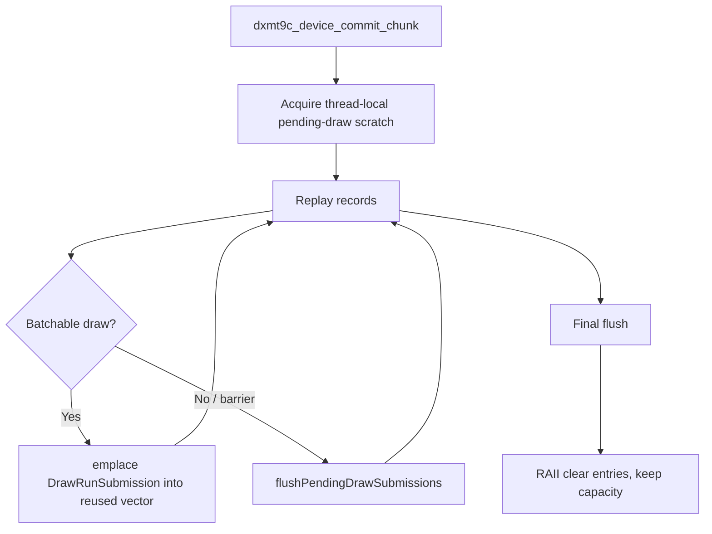

# Encode Phase 90 - Commit Chunk Pending Submission Scratch

**Question.** The P2 replay path still builds a temporary
`std::vector<DrawRunSubmission>` inside every `dxmt9c_device_commit_chunk`
call. Can we remove the per-chunk vector allocation/page-touch shape without
changing draw submission semantics?

**Change.** Replace the local `pendingDrawSubmissions` vector with
thread-local replay scratch:

- `PendingDrawSubmissionScratch::submissions` owns the vector capacity;
- `ScopedPendingDrawSubmissionScratchUse` clears entries on entry/exit but keeps
  capacity for the next chunk on the same replay thread;
- the existing `flushPendingDrawSubmissions()` lambda and
  `submitDrawSubmissionBatch()` flow are unchanged;
- early `commitChunkFail(...)` exits are covered by the RAII guard.



**Why this is safe.** The scratch is used only inside one commit-chunk replay
call and `submitDrawSubmissionBatch()` consumes the submissions synchronously
before the vector is cleared. Reusing capacity does not change the owned
snapshot payloads already materialized into queue storage by the submit path.
The guard asserts non-reentrant use, matching the existing queue-side
`DrawSubmitScratch` pattern.

**Expected effect.** This is a small P2 cleanup, not a standalone FPS claim. It
targets the allocation churn called out in the copy-policy review: a commit
chunk no longer creates/destroys a pending-submission vector and re-reserves the
same capacity repeatedly. It does not reduce the size of each
`DrawRunSubmission`, the snapshot copy work, or backend encode work.

**Runtime scouts.** Two low-overhead frame-sampling runs exercised the current
code:

```sh
bash scripts/tools/run_3dmark05_perf_probe.sh \
  --suffix phase90-pending-scratch-r1-20260615 \
  --no-gputrace --no-encoder-breakdown --frame-sampling --timeout 120

bash scripts/tools/run_3dmark05_perf_probe.sh \
  --suffix phase90-pending-scratch-r2-20260615 \
  --no-gputrace --no-encoder-breakdown --frame-sampling --timeout 120
```

The first run finished normally (`status=pass`, `timed_out=false`,
`returncode=0`) with `1,847` presents and `1,847` frame-sampling rows. The
repeat finalized through the expected final-frame timeout
(`status=pass`, `timed_out=true`, `returncode=143`) after `1,800` encoded
presents and `1,852` frame-sampling rows. Both visual smoke frames are normal:
scene geometry, bright bloom, impact particles, and HUD are visible; this is
not the HUD-only or black-screen failure class.

Compared with the documented current low-overhead refresh
[present-pacing-lowoverhead-refresh.33](../present-pacing/present-pacing-lowoverhead-refresh.33.md), r1/r2 repeat the intended local
direction but not a frame-rate proof:

| Metric | Refresh 33 | Phase 90 r1 | Phase 90 r2 | r1/r2 avg delta |
|---|---:|---:|---:|---:|
| sampled average FPS | `18.878` | `18.908` | `18.952` | `+0.28%` |
| FPS p50 | `18.657` | `18.682` | `18.666` | `+0.09%` |
| FPS p95 | `26.833` | `27.006` | `27.012` | `+0.65%` |
| `completion_wait_ms / present` | `28.834ms` | `28.278ms` | `27.321ms` | `-3.59%` |
| `completion_wait_with_enqueue_ms / present` | `0.208ms` | `1.063ms` | `0.148ms` | `+0.397ms` |
| `completion_wait_without_enqueue_ms / present` | `28.626ms` | `27.215ms` | `27.173ms` | `-5.00%` |
| `commit_chunk_replay_cpu_ms / present` | `8.457ms` | `8.334ms` | `8.291ms` | `-1.71%` |
| `commit_chunk_queue_draw_submission_cpu_ms / present` | `4.314ms` | `4.196ms` | `4.185ms` | `-2.86%` |
| `commit_chunk_queue_draw_submission_emplace_cpu_ms / present` | n/a | `0.318ms` | `0.310ms` | n/a |
| `commit_chunk_queue_draw_submission_snapshot_cpu_ms / present` | `3.593ms` | `3.552ms` | `3.553ms` | `-1.13%` |
| `d3d9_snapshot_draw_submission_cpu_ms / present` | `3.593ms` | `3.491ms` | `3.493ms` | `-2.80%` |
| `d3d9_snapshot_cache_lookup_cpu_ms / present` | `3.057ms` | `2.957ms` | `2.956ms` | `-3.29%` |
| `encode_chunk_cpu_ms / present` | `10.695ms` | `10.595ms` | `10.478ms` | `-1.48%` |
| `encode_draw_cpu_ms / present` | `8.730ms` | `8.625ms` | `8.534ms` | `-1.72%` |

Clean counters stay clean: `present_boundary_wait_ms=0`,
`queue_sequence_wait_ms=0`, `map_buffer_wait_ms=0`,
`draw_skipped_no_pipeline=0`, `gpu_command_buffer_errors=0`, and
`render_split_hazard=0`.

The no-enqueue same-cycle stage split still names the same owners:

| Stage | p50 | p95 |
|---|---:|---:|
| `commit_entry -> publish` | `14.834ms` | `26.296ms` |
| `publish -> encode_dequeue` | `0.357ms` | `0.481ms` |
| `encode_dequeue -> command_buffer_commit` | `18.021ms` | `24.018ms` |
| `wait -> next_enqueue` | `12.281ms` | `48.144ms` |

**Decision.** Accepted as a hot-path cleanup, not an FPS fix. The intended P2
axis repeated in the right direction: `commit_chunk_replay`,
`commit_chunk_queue_draw_submission`, and snapshot/cache lookup are lower than
the documented refresh in both runs. The r1 completion-overlap signal did not
repeat; r2 falls back to the old near-zero overlap band
(`completion_wait_with_enqueue_ms=0.148ms/present`, `6` enqueue-while-wait
events). Therefore this change removes avoidable vector allocation churn but
does not prove that P4/completion wait or average FPS has been moved.

**Next gate.** Do not spend Xcode or `.gputrace` on this cleanup alone. The next
promotion has to reduce one of the remaining named CPU children and move either
completion wait, producer overlap, or same-cycle serial stage deltas in a
repeated low-overhead run with normal visual smoke.

**Verification.**

- `meson compile -C build-arm64-nowine`
- `meson compile -C build-x86_64-builtin`
- `meson test -C build-arm64-nowine dxmt9:dxmt9-core-device-com-spec dxmt9:dxmt9-chunk-record-import-spec dxmt9:dxmt9-dod-replay-observer-spec --timeout-multiplier 3`
- `bash scripts/tools/run_3dmark05_perf_probe.sh --suffix phase90-pending-scratch-r1-20260615 --no-gputrace --no-encoder-breakdown --frame-sampling --timeout 120`
- `bash scripts/tools/run_3dmark05_perf_probe.sh --suffix phase90-pending-scratch-r2-20260615 --no-gputrace --no-encoder-breakdown --frame-sampling --timeout 120`
- `git diff --check`

**Related.** [present-pacing-lowoverhead-refresh.33](../present-pacing/present-pacing-lowoverhead-refresh.33.md) ·
[present-pacing-systemtrace-p4-smoke.34](../present-pacing/present-pacing-systemtrace-p4-smoke.34.md) ·
[state-churn-encode-encode-phase.35](state-churn-encode-encode-phase.35.md) ·
[state-churn-encode-encode-phase.37](state-churn-encode-encode-phase.37.md) · [state-churn-encode](index.md).
