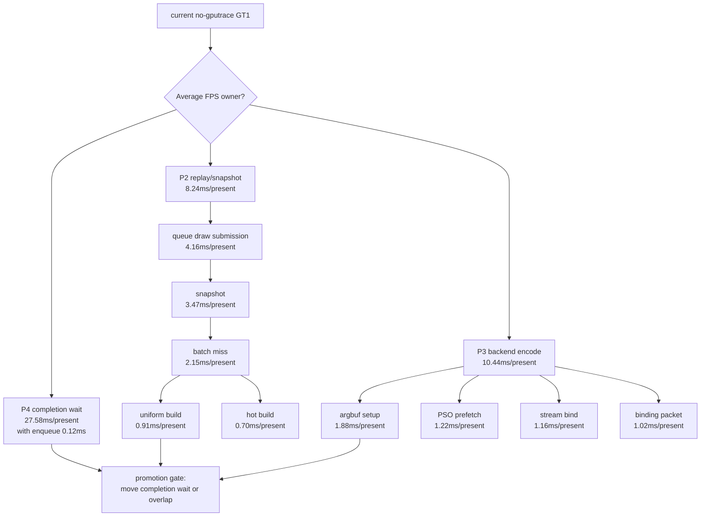

# Encode Phase 91 - Current Next-Owner Low-Overhead Scout

**Question.** After the phase90 pending-submission scratch cleanup, what still
owns the no-gputrace average-FPS lane, and is there a new candidate strong
enough to justify a behavior change or Xcode spend?

**Preflight.** Xcode is installed, but `.gputrace` / attach-driven Xcode replay
remains blocked by Developer Mode:

```sh
xcode-select -p
xcrun xctrace version
/usr/sbin/DevToolsSecurity -status
```

Result: `/Applications/Xcode.app/Contents/Developer`,
`xctrace version 16.0 (17F42)`, and
`Developer mode is currently disabled.` Therefore this scout uses the standard
3DMark05 wrapper with `--no-gputrace`.

**Method.**

```sh
bash scripts/tools/run_3dmark05_perf_probe.sh \
  --suffix current-next-owner-r1-20260615 \
  --no-gputrace --no-encoder-breakdown --frame-sampling --timeout 120
```

Status is `pass`, `timed_out=false`, `returncode=0`, with `1,847` encoded
presents and `1,847` frame samples. The screenshot is visually normal: scene,
HUD, bloom, muzzle/impact light, and particle streaks are present; this is not
the black-scene or HUD-only failure class.

**Top-level cadence.**

| Metric | Total | Per present |
|---|---:|---:|
| `gpu_command_buffer_time_ms` | `5,761.235ms` | `3.119ms` |
| `completion_wait_ms` | `50,939.293ms` | `27.579ms` |
| `completion_wait_with_enqueue_ms` | `221.806ms` | `0.120ms` |
| `completion_wait_without_enqueue_ms` | `50,717.487ms` | `27.459ms` |
| `commit_chunk_replay_cpu_ms` | `15,226.673ms` | `8.244ms` |
| `encode_chunk_cpu_ms` | `19,281.903ms` | `10.440ms` |
| `encode_draw_cpu_ms` | `15,654.865ms` | `8.476ms` |

Frame CSV mean/p50/p95/tail-600-p50 is `18.914 / 18.731 / 26.912 /
17.278fps`. The summary-level wall-clock average is lower because it divides by
the wider run wall window; use frame-sampling percentiles and per-present CPU
counters for this lane.

Clean counters remain clean: `present_boundary_wait_ms=0`,
`queue_sequence_wait_ms=0`, `map_buffer_wait_ms=0`,
`draw_skipped_no_pipeline=0`, `gpu_command_buffer_errors=0`, and
`render_split_hazard=0`.

**Current CPU owners.**

| Bucket | Per present | Interpretation |
|---|---:|---|
| `commit_chunk_queue_draw_submission_cpu_ms` | `4.159ms` | still mostly queued snapshot |
| `commit_chunk_queue_draw_submission_snapshot_cpu_ms` | `3.525ms` | nested snapshot owner |
| `d3d9_snapshot_draw_submission_cpu_ms` | `3.465ms` | current snapshot cost |
| `d3d9_snapshot_cache_lookup_cpu_ms` | `2.932ms` | batch cache lookup still primary |
| `commit_chunk_replay_pending_flush_cpu_ms` | `1.593ms` | wrapper around batch submit; overlaps batch submit work |
| `commit_chunk_draw_batch_submit_cpu_ms` | `1.579ms` | queue-side submit for pending batches |
| `submit_draw_run_batch_append_cpu_ms` | `1.216ms` | slot append storage |
| `submit_draw_run_batch_append_uniform_cpu_ms` | `0.620ms` | uniform payload storage / lookup |
| `submit_draw_run_batch_append_state_cpu_ms` | `0.295ms` | remaining state SoA append |

The backend encode side is still distributed rather than one isolated child:

| Encode child | Per present |
|---|---:|
| `encode_draw_argbuf_setup_cpu_ms` | `1.880ms` |
| `encode_slot_pso_prefetch_cpu_ms` | `1.220ms` |
| `encode_draw_stream_bind_cpu_ms` | `1.161ms` |
| `encode_draw_binding_packet_cpu_ms` | `1.024ms` |
| `encode_draw_argbuf_cbuf_update_cpu_ms` | `0.965ms` |
| `encode_draw_issue_cpu_ms` | `0.575ms` |
| `encode_draw_pipeline_lookup_cpu_ms` | `0.541ms` |

**Snapshot breakdown.** Batch misses still dominate lookup, but no closed
micro-target is large enough alone:

| Snapshot child | Per present |
|---|---:|
| `d3d9_snapshot_cache_batch_miss_cpu_ms` | `2.147ms` |
| `d3d9_snapshot_cache_batch_hit_cpu_ms` | `0.673ms` |
| `d3d9_snapshot_cache_batch_miss_uniform_build_cpu_ms` | `0.905ms` |
| `d3d9_snapshot_cache_batch_miss_hot_build_cpu_ms` | `0.695ms` |
| `d3d9_snapshot_cache_batch_miss_shader_layout_cpu_ms` | `0.343ms` |
| `d3d9_snapshot_cache_batch_miss_uniform_build_vs_const_hash_cpu_ms` | `0.299ms` |

The uniform elision branch is still closed for GT1:
`d3d9_snapshot_uniform_elided=0` and
`d3d9_snapshot_uniform_adjacent_same_generation=0`. The remaining full VS
constant fallback is indexed-float (`168,526` full-hash calls overall,
`83,075` in batch misses); the safe int/bool tail is still only an opportunity
counter, not a broad constant-layout proof.

**Uniform append breakdown.**

| Uniform append child | Total | Per present |
|---|---:|---:|
| `draw_uniform_payload_append_copy_cpu_ms` | `631.285ms` | `0.342ms` |
| `draw_uniform_payload_lookup_cpu_ms` | `304.977ms` | `0.165ms` |
| `draw_uniform_payload_lookup_bucket_cpu_ms` | `158.406ms` | `0.086ms` |
| `draw_uniform_payload_append_link_cpu_ms` | `65.241ms` | `0.035ms` |
| `draw_uniform_payload_append_reserve_cpu_ms` | `55.574ms` | `0.030ms` |

This repeats the phase52/53/59 shape. `DXMT9_DISABLE_DRAW_UNIFORM_PAYLOAD_DEDUP`
can reduce this local child, but phase59 already showed the broader queue bucket
flat. A default policy change is still not justified by GT1 alone. Similarly,
moving `DrawUniformPayload` from the submission into the slot would not remove
the required owned payload copy because `DrawUniformPayload` is a large value
object made of arrays and scalars.



**Decision.** Accepted as the current next-owner baseline. The phase90 cleanup
does not change the high-level attribution: completion wait remains almost
entirely un-overlapped, while P2/P3 serial work after the wait is still split
across replay/snapshot and encode. Do not spend `.gputrace` on another CPU-only
cleanup while Developer Mode is disabled and no no-gputrace run moves P4.

**Next.** The next implementation should be either:

- a larger snapshot/storage change that reduces batch-miss uniform/hot build or
  queue uniform append without relying on adjacent uniform-generation reuse; or
- a larger producer-overlap / earlier-publish design that is judged directly by
  `completion_wait_with_enqueue_ms`, same-cycle stage deltas, and frame
  sampling.

Avoid repeating already-closed micro-targets: per-chunk vector capacity,
draw-run local vector scratch, uniform lookup prereserve, slot-local uniform
dedup default flip, stream/IB handle identity as a GPU owner, or VS indexed
constant tail hashing as a broad fix.

**Verification.**

- `meson compile -C build-arm64-nowine`
- `meson compile -C build-x86_64-builtin`
- `meson compile -C build-win32-x86-builtin`
- `meson compile -C build-win32-x64-builtin`
- `bash scripts/tools/run_3dmark05_perf_probe.sh --suffix current-next-owner-r1-20260615 --no-gputrace --no-encoder-breakdown --frame-sampling --timeout 120`

**Related.** [state-churn-encode](index.md) ·
[state-churn-encode-encode-phase.90](state-churn-encode-encode-phase.90.md) ·
[snapshot-cache-snapshot.22](../snapshot-cache/snapshot-cache-snapshot.22.md) ·
present-pacing-lowoverhead-refresh.33 · [present-pacing](../present-pacing/index.md).
