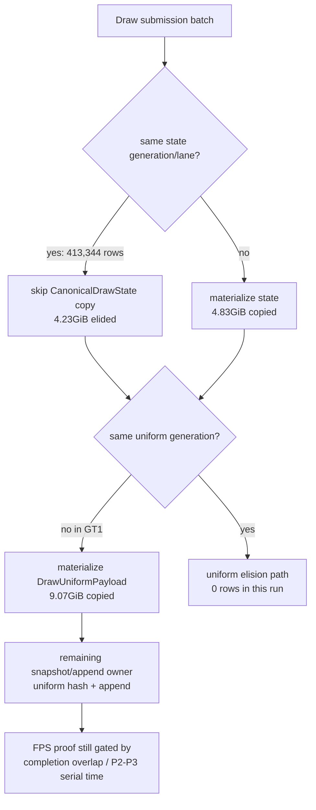

# Encode Phase 92 - Copy-Elision Current Smoke

**Question.** Is the promoted draw-submission state-copy elision still live in
the current low-overhead GT1 path, and does it change the next-owner class?

**Method.**

```sh
bash scripts/tools/run_3dmark05_perf_probe.sh \
  --suffix current-copyelision-r1-20260615 \
  --frame 60 \
  --no-gputrace \
  --no-encoder-breakdown \
  --timeout 120 \
  --frame-sampling
```

The wrapper reports `status=pass`. `run_experiment.py` timeout-finalized the
run (`returncode=143`, `timed_out=true`), which is valid for this workload
because the expected `result.json`, perf summary, frame CSV, and `actual.png`
were written. The artifact size is small for this no-gputrace lane:
`experiments/output/...=11MiB`, `traces/...=0B`.

The screenshot is visually normal for the sampled point: scene geometry, HUD,
bright muzzle/impact bloom, and particle streaks are present. This is not the
HUD-only or black-scene failure class.

**Cadence.**

| Metric | Total | Per present |
|---|---:|---:|
| `present_encoded` | `1,800` | - |
| `completion_wait_ms` | `49,103.058ms` | `27.279ms` |
| `completion_wait_with_enqueue_ms` | `211.500ms` | `0.117ms` |
| `completion_wait_without_enqueue_ms` | `48,891.558ms` | `27.162ms` |
| `gpu_command_buffer_time_ms` | `5,702.252ms` | `3.168ms` |
| `commit_chunk_replay_cpu_ms` | `14,914.247ms` | `8.286ms` |
| `commit_chunk_queue_draw_submission_cpu_ms` | `7,530.322ms` | `4.184ms` |
| `d3d9_snapshot_draw_submission_cpu_ms` | `6,278.849ms` | `3.488ms` |
| `encode_chunk_cpu_ms` | `18,716.476ms` | `10.398ms` |
| `encode_draw_cpu_ms` | `15,217.656ms` | `8.454ms` |

Frame CSV mean/p50/p95/tail-600-p50 is `18.898 / 18.735 / 27.067 /
17.326fps`. Clean counters stay clean:
`draw_skipped_no_pipeline=0`, `gpu_command_buffer_errors=0`, and
`render_split_hazard=0`.

**Copy-elision proof.**

| Counter | Value |
|---|---:|
| `submit_draw_run_batch_submission_adjacent_pairs` | `787,486` |
| `submit_draw_run_batch_submission_adjacent_same_generation_lane` | `413,344` |
| same-generation/lane adjacent ratio | `52.489%` |
| `d3d9_snapshot_state_materialized` | `472,269` |
| `d3d9_snapshot_state_materialized_bytes` | `4,832,256,408` |
| `d3d9_snapshot_state_elided` | `413,344` |
| `d3d9_snapshot_state_elided_bytes` | `4,229,335,808` |
| `d3d9_snapshot_state_copy_cpu_ms` | `138.845ms` |
| `submit_draw_run_batch_compat_same_generation_lane` | `410,877` |
| `submit_draw_run_batch_compat_same_generation_lane_incompatible` | `0` |

The same-generation/lane fast path is therefore active and clean. State copy is
no longer the first queue/snapshot target: the run elides about `4.23GiB` of
canonical state copies, leaving only `0.077ms/present` in
`d3d9_snapshot_state_copy_cpu_ms`.

**Uniform path remains the residual.**

| Counter | Value |
|---|---:|
| `d3d9_snapshot_uniform_materialized` | `885,613` |
| `d3d9_snapshot_uniform_materialized_bytes` | `9,068,677,120` |
| `d3d9_snapshot_uniform_elided` | `0` |
| `d3d9_snapshot_uniform_adjacent_same_generation` | `0` |
| `d3d9_snapshot_uniform_build_hash_cpu_ms` | `1,850.409ms` |
| `d3d9_snapshot_uniform_build_vs_const_hash_cpu_ms` | `1,098.627ms` |
| `d3d9_snapshot_uniform_copy_cpu_ms` | `246.681ms` |
| `submit_draw_run_batch_append_uniform_cpu_ms` | `1,128.798ms` |

Adjacent uniform-generation reuse has no current GT1 opportunity. The residual
queue/snapshot owner is not N-1 canonical state anymore; it is the uniform
payload generation/hash/copy/append lane plus the already-known batch-miss hot
build lane.



**Decision.** Accepted as current validation. The state-copy elision cleanup is
working and should stay, but it is no longer the average-FPS owner. The next
GT1 CPU work should not target more non-front state materialization unless a
new counter shows it reappearing. Focus instead on:

- reducing uniform payload hash/build/append without relying on adjacent
  uniform-generation equality;
- reducing remaining batch-miss hot build / cache lookup width; or
- changing producer overlap / earlier publish so the large
  `completion_wait_without_enqueue_ms` bucket is hidden.

Do not spend `.gputrace` budget on this state-copy cleanup alone. Developer
Mode is still disabled, and this run is a CPU/P4 no-gputrace validation sample,
not an Xcode `VS Buffer Device Memory Bytes Written` proof.

**Verification.**

- `meson compile -C build-arm64-nowine`
- `meson test -C build-arm64-nowine dxmt9-core-device-com-spec dxmt9-dod-replay-observer-spec dxmt9-imported-apply-state-value-spec`
- `bash scripts/tools/run_3dmark05_perf_probe.sh --suffix current-copyelision-r1-20260615 --frame 60 --no-gputrace --no-encoder-breakdown --timeout 120 --frame-sampling`

**Related.** [state-churn-encode](index.md) ·
[state-churn-encode-encode-phase.91](state-churn-encode-encode-phase.91.md) ·
[state-churn-encode-encode-phase.48](state-churn-encode-encode-phase.48.md) · [snapshot-cache](../snapshot-cache/index.md) ·
[present-pacing](../present-pacing/index.md).
