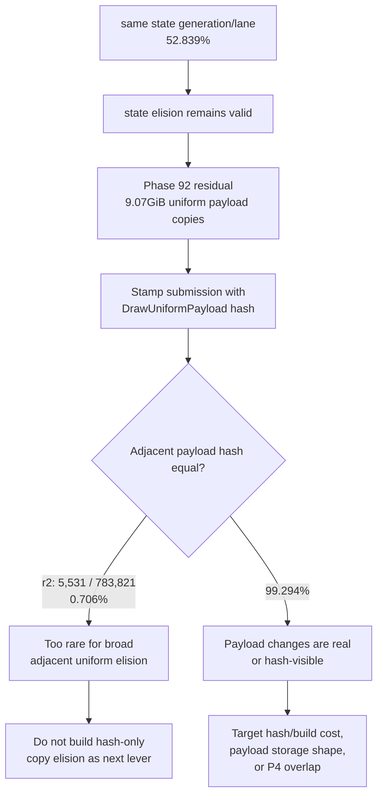

# Encode Phase 93 - Uniform Payload Hash Opportunity

**Question.** Phase 92 left `DrawUniformPayload` materialization as the visible
snapshot residual. Is adjacent uniform reuse hidden by generation churn, such
that a hash/equality-based uniform copy elision would remove most of the
`9GiB` payload copy lane?

**Method.**

Add observation-only counters that stamp each `DrawRunSubmission` with the
already-built `DrawUniformPayload::hash`. Count adjacent submissions with the
same payload hash, split by same/different state lane and generation. The probe
does not change batching, uniform payload storage, or encode behavior.

```sh
bash scripts/tools/run_3dmark05_perf_probe.sh \
  --suffix uniform-payload-hash-opportunity-r1-20260615 \
  --frame 60 \
  --no-gputrace \
  --no-encoder-breakdown \
  --timeout 120 \
  --frame-sampling

bash scripts/tools/run_3dmark05_perf_probe.sh \
  --suffix uniform-payload-hash-opportunity-r2-20260615 \
  --frame 60 \
  --no-gputrace \
  --no-encoder-breakdown \
  --timeout 120 \
  --frame-sampling \
  --capture-delay-sec 40
```

Developer Mode is disabled, so this is a no-gputrace CPU/P4 validation sample.
The first run's `actual.png` is a HUD-only black frame at the sampled screenshot
time; keep it only as a numeric scout. The second run captures a normal GT1
scene with geometry, glow, sparks, fog, and HUD, so it is the representative
visual gate.

**Results.**

| Metric | r1 | r2 |
|---|---:|---:|
| `present_encoded` | `1,800` | `1,800` |
| frame CSV avg FPS | `18.849` | `18.866` |
| frame CSV p50 FPS | `18.556` | `18.624` |
| `completion_wait_ms / present` | `29.392ms` | `29.264ms` |
| `gpu_command_buffer_time_ms / present` | `3.060ms` | `3.060ms` |
| `commit_chunk_replay_cpu_ms / present` | `8.464ms` | `8.489ms` |
| `encode_chunk_cpu_ms / present` | `10.598ms` | `10.530ms` |
| `d3d9_snapshot_draw_submission_cpu_ms / present` | `3.596ms` | `3.610ms` |
| `d3d9_snapshot_uniform_build_hash_cpu_ms / present` | `1.159ms` | `1.150ms` |
| `submit_draw_run_batch_append_uniform_cpu_ms / present` | `0.632ms` | `0.639ms` |

**Opportunity counters.**

| Counter | r1 | r2 |
|---|---:|---:|
| `submit_draw_run_batch_submission_adjacent_pairs` | `784,666` | `783,821` |
| `submit_draw_run_batch_submission_adjacent_same_generation_lane` | `414,664` | `414,166` |
| same-generation/lane adjacent ratio | `52.846%` | `52.839%` |
| `d3d9_snapshot_uniform_materialized` | `883,649` | `882,654` |
| `d3d9_snapshot_uniform_materialized_bytes` | `9,048,565,760` | `9,038,376,960` |
| `d3d9_snapshot_uniform_elided` | `0` | `0` |
| `d3d9_snapshot_uniform_adjacent_same_generation` | `0` | `0` |
| `d3d9_snapshot_uniform_adjacent_same_payload_hash` | `5,512` | `5,531` |
| same-payload-hash adjacent ratio | `0.702%` | `0.706%` |
| `d3d9_snapshot_uniform_adjacent_same_payload_hash_same_state_lane` | `1` | `0` |
| `d3d9_snapshot_uniform_adjacent_same_payload_hash_diff_state_lane` | `5,511` | `5,531` |
| `d3d9_snapshot_uniform_adjacent_same_payload_hash_diff_generation` | `5,512` | `5,531` |

The residual uniform lane is real, but it is not repeated adjacent payloads.
Even when state-copy elision finds about `52.8%` same-generation/lane neighbors,
full uniform-payload hash equality appears in only about `0.7%` of adjacent
pairs, and all representative hits are under different uniform generations.
That is far below the threshold needed to justify a broad adjacent-uniform
copy-elision path.



**Decision.** Rejected as a current broad optimization target. Keep the
observation counters while the uniform lane is under investigation, but do not
implement behavior based on adjacent payload hash equality. A future exact
payload interning design would still need collision-safe equality and owned
storage, but GT1's measured adjacent hit rate is too small to make that the
next CPU/P4 lever.

The next useful work should be one of:

- reduce `d3d9_snapshot_uniform_build_hash_cpu_ms` itself, especially VS
  constant hash construction;
- change uniform payload storage/append shape so changed payloads are cheaper;
- reduce remaining snapshot cache lookup / batch-miss hot-build width; or
- move producer/encode overlap so the `completion_wait_without_enqueue_ms`
  bucket is hidden rather than simply shortening a small child.

**Verification.**

- `meson compile -C build-arm64-nowine`
- `meson test -C build-arm64-nowine dxmt9-core-device-com-spec dxmt9-dod-replay-observer-spec dxmt9-imported-apply-state-value-spec`
- `meson test -C build-arm64-nowine dxmt9-perf-counter-table-audit dxmt9-perf-counter-callsite-audit`
- `python3 -m pytest tests/scripts/test_3dmark05_probe_scripts.py -q`
- `git diff --check`
- two wrapper runs listed in **Method**

**Related.** [state-churn-encode](../state-churn-encode.md) ·
[state-churn-encode-encode-phase.92](state-churn-encode-encode-phase.92.md) ·
[snapshot-cache](../snapshot-cache.md) · [present-pacing](../present-pacing.md).
