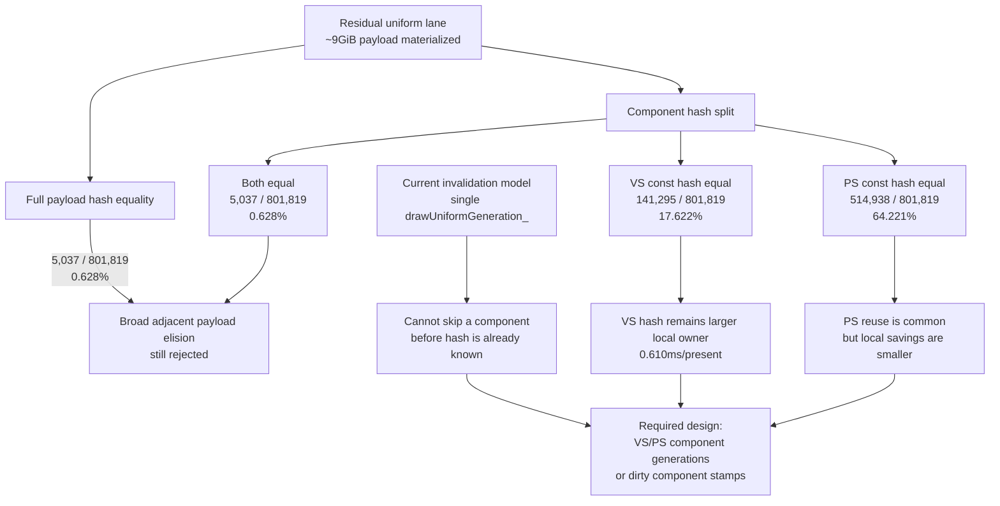

# Encode Phase 94 - Uniform Component Hash Opportunity

**Question.** Phase 93 rejects broad adjacent `DrawUniformPayload` equality as
a copy-elision target. Is that hiding a narrower VS/PS component opportunity
where one shader-constant half is unchanged even though the full payload hash
changes?

**Method.**

Add observation-only counters for adjacent submissions with the same
`vertexConstantsHash`, same `pixelConstantsHash`, or both. The probe counts only
after the current payload has already been built and hashed, so it proves
opportunity shape only; it does not avoid copy/hash work or change batching.

```sh
bash scripts/tools/run_3dmark05_perf_probe.sh \
  --suffix uniform-component-hash-opportunity-r1-20260615 \
  --frame 60 \
  --no-gputrace \
  --no-encoder-breakdown \
  --timeout 120 \
  --frame-sampling \
  --capture-delay-sec 40
```

Developer Mode is disabled, so this is a no-gputrace CPU/P4 sample. The
captured `actual.png` is a normal GT1 frame at time `0:28.08`, frame `551`, HUD
`18 FPS`; geometry, fog, lighting, and projectile glow are present.

**Results.**

| Metric | r1 |
|---|---:|
| `present_encoded` | `1,844` |
| frame screenshot | normal GT1 scene |
| `completion_wait_ms / present` | `27.546ms` |
| `completion_wait_with_enqueue_ms / present` | `0.166ms` |
| `completion_wait_without_enqueue_ms / present` | `27.380ms` |
| `gpu_command_buffer_time_ms / present` | `3.110ms` |
| `commit_chunk_replay_cpu_ms / present` | `8.289ms` |
| `commit_chunk_queue_draw_submission_cpu_ms / present` | `4.182ms` |
| `d3d9_snapshot_draw_submission_cpu_ms / present` | `3.486ms` |
| `d3d9_snapshot_cache_lookup_cpu_ms / present` | `2.936ms` |
| `d3d9_snapshot_cache_batch_miss_cpu_ms / present` | `2.146ms` |
| `d3d9_snapshot_uniform_build_hash_cpu_ms / present` | `1.027ms` |
| `d3d9_snapshot_uniform_build_vs_const_hash_cpu_ms / present` | `0.610ms` |
| `d3d9_snapshot_uniform_build_ps_const_copy_cpu_ms / present` | `0.084ms` |
| `d3d9_snapshot_uniform_build_ps_const_hash_cpu_ms / present` | `0.071ms` |
| `submit_draw_run_batch_append_uniform_cpu_ms / present` | `0.623ms` |
| `encode_chunk_cpu_ms / present` | `10.477ms` |
| `encode_draw_cpu_ms / present` | `8.527ms` |

**Opportunity counters.**

| Counter | Value | Adjacent ratio |
|---|---:|---:|
| `submit_draw_run_batch_submission_adjacent_pairs` | `801,819` | `100.000%` |
| `d3d9_snapshot_uniform_adjacent_previous_payload` | `801,819` | `100.000%` |
| `d3d9_snapshot_uniform_adjacent_same_payload_hash` | `5,037` | `0.628%` |
| `d3d9_snapshot_uniform_adjacent_same_vs_const_hash` | `141,295` | `17.622%` |
| `d3d9_snapshot_uniform_adjacent_same_vs_const_hash_same_state_lane` | `5,330` | `0.665%` |
| `d3d9_snapshot_uniform_adjacent_same_ps_const_hash` | `514,938` | `64.221%` |
| `d3d9_snapshot_uniform_adjacent_same_ps_const_hash_same_state_lane` | `412,182` | `51.406%` |
| `d3d9_snapshot_uniform_adjacent_same_shader_const_hashes` | `5,037` | `0.628%` |
| `submit_draw_run_batch_submission_adjacent_same_generation_lane` | `420,626` | `52.459%` |
| `d3d9_snapshot_uniform_elided` | `0` | `0.000%` |

Full-payload equality remains too rare. Component equality is asymmetric:
pixel-shader constants repeat in most adjacent rows, while vertex-shader
constants repeat in only about one sixth. The current local CPU owner is also
asymmetric: VS constant hashing is `0.610ms/present`, while PS constant copy and
hash together are about `0.155ms/present`.



**Decision.** Accepted as attribution, not as an implemented optimization.
Phase 94 refines the phase93 rejection: do not build a broad adjacent-uniform
copy-elision path, but keep a VS/PS component-generation design open.

The required implementation condition is important. The current frontend has a
single `drawUniformGeneration_`, and shader constants are mutated through
`mutableShaderConstantsState()`. Therefore post-build component-hash equality
cannot itself save the expensive hash; it is discovered too late. A real
optimization needs explicit VS/PS shader-constant generations or dirty component
stamps, then cache refresh can skip copying/hashing the unchanged half before
calling `hashDrawUniformPayload()`.

The expected ceiling is local rather than structural: the PS side has high
reuse but small measured cost, while the VS side is costlier but changes more
often. This should be ranked below larger P4/serial-stage work unless a cheap
component-generation patch cuts `d3d9_snapshot_uniform_build_hash_cpu_ms` and
also moves `completion_wait_ms` or frame sampling in a repeated low-overhead
run.

**Clean gates.**

- `draw_skipped_no_pipeline=0`
- `gpu_command_buffer_errors=0`
- `render_split_hazard=0`
- `map_buffer_failures=0`

**Verification.**

- `meson compile -C build-arm64-nowine`
- `meson test -C build-arm64-nowine dxmt9-core-device-com-spec dxmt9-dod-replay-observer-spec dxmt9-imported-apply-state-value-spec`
- `meson test -C build-arm64-nowine dxmt9-perf-counter-table-audit dxmt9-perf-counter-callsite-audit`
- `python3 -m pytest tests/scripts/test_3dmark05_probe_scripts.py -q`
- `git diff --check`
- wrapper run listed in **Method**

**Related.** [state-churn-encode](../state-churn-encode.md) ·
[state-churn-encode-encode-phase.93](state-churn-encode-encode-phase.93.md) ·
[state-churn-encode-encode-phase.92](state-churn-encode-encode-phase.92.md) · [snapshot-cache](../snapshot-cache.md) ·
[present-pacing](../present-pacing.md).
