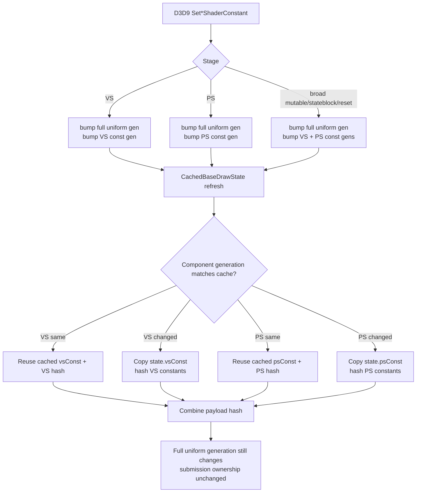

# Encode Phase 95 - Uniform Component Generation Reuse

**Question.** Phase 94 proves that adjacent pixel-shader constant hashes repeat
often, but post-build hash equality is too late to skip work. Does adding
explicit VS/PS shader-constant generations turn that evidence into a safe
uniform-refresh cleanup?

**Implementation.**

The cache now keeps separate shader-constant component generations alongside
the existing full `drawUniformGeneration_`:

- `drawVertexShaderConstantGeneration_`
- `drawPixelShaderConstantGeneration_`
- `CachedBaseDrawState::vertexShaderConstantGeneration`
- `CachedBaseDrawState::pixelShaderConstantGeneration`

Shader-constant setters use VS/PS-specific mutable accessors. Broad state
invalidations that may mutate constants still invalidate both component
generations. The existing full `drawUniformGeneration_` remains the submission
semantic for payload ownership and uniform elision.

On a cache hit with only one shader-constant half changed,
`refreshDrawUniformPayloadShaderConstantsFromState()` reuses the unchanged
cache-owned component and its existing component hash. No borrowed pointer is
stored and no heap allocation is added.



**Method.**

```sh
bash scripts/tools/run_3dmark05_perf_probe.sh \
  --suffix uniform-component-generation-r1-20260615 \
  --frame 60 \
  --no-gputrace \
  --no-encoder-breakdown \
  --timeout 120 \
  --frame-sampling \
  --capture-delay-sec 40
```

Developer Mode is disabled, so this is a no-gputrace CPU/P4 sample. The run
timeout-finalizes cleanly (`returncode=143`, `timed_out=true`) after complete
artifacts are written, which is valid for the 3DMark05 wrapper. The screenshot
is a normal GT1 frame at time `0:27.69`, frame `549`, HUD `17 FPS`.

**Results.**

| Metric | Phase 94 component-hash scout | Phase 95 component generation |
|---|---:|---:|
| `present_encoded` | `1,844` | `1,800` |
| visual gate | normal | normal |
| `completion_wait_ms / present` | `27.546ms` | `27.281ms` |
| `completion_wait_with_enqueue_ms / present` | `0.166ms` | `0.149ms` |
| `gpu_command_buffer_time_ms / present` | `3.110ms` | `3.187ms` |
| `commit_chunk_replay_cpu_ms / present` | `8.289ms` | `8.247ms` |
| `d3d9_snapshot_draw_submission_cpu_ms / present` | `3.486ms` | `3.426ms` |
| `d3d9_snapshot_cache_lookup_cpu_ms / present` | `2.936ms` | `2.871ms` |
| `d3d9_snapshot_uniform_build_hash_cpu_ms / present` | `1.027ms` | `0.989ms` |
| `d3d9_snapshot_uniform_build_vs_const_copy_cpu_ms / present` | `0.094ms` | `0.096ms` |
| `d3d9_snapshot_uniform_build_vs_const_hash_cpu_ms / present` | `0.610ms` | `0.610ms` |
| `d3d9_snapshot_uniform_build_vs_const_hash_bytes` | `830,941,712` | `812,301,792` |
| `d3d9_snapshot_uniform_build_ps_const_copy_cpu_ms / present` | `0.084ms` | `0.048ms` |
| `d3d9_snapshot_uniform_build_ps_const_hash_cpu_ms / present` | `0.071ms` | `0.048ms` |
| `d3d9_snapshot_uniform_build_ps_const_hash_bytes` | `63,180,448` | `47,273,904` |
| `submit_draw_run_batch_append_uniform_cpu_ms / present` | `0.623ms` | `0.628ms` |
| `encode_chunk_cpu_ms / present` | `10.477ms` | `10.525ms` |
| `encode_draw_cpu_ms / present` | `8.527ms` | `8.582ms` |

The patch moves the intended local PS side: copy falls by about
`0.036ms/present`, PS hash by about `0.023ms/present`, and PS hash bytes by
`15.9MB` over the run. Total uniform hash drops by `0.038ms/present`.

It does not move the larger VS hash owner. VS constant hash stays essentially
flat (`0.610ms/present`), which matches the phase94 opportunity shape: VS
constants repeat much less often and remain dominated by indexed-float full
fallback.

**Clean gates.**

- `draw_skipped_no_pipeline=0`
- `gpu_command_buffer_errors=0`
- `render_split_hazard=0`
- `map_buffer_failures=0`

**Decision.** Accepted as a local CPU cleanup, not as an average-FPS proof. The
implementation is structurally correct and lowers the smaller PS half, but the
measured ceiling is small. The next owner remains:

- VS constant hash/full indexed fallback;
- uniform payload storage/append width;
- larger encode children such as PSO prefetch, argbuf setup/cbuf update, stream
  bind, or binding packet; and
- P4/serial-stage overlap so completion wait is hidden rather than merely
  shortened by small local CPU work.

**Verification.**

- `meson compile -C build-arm64-nowine`
- `meson test -C build-arm64-nowine dxmt9-core-device-com-spec dxmt9-state-draw-transform-spec dxmt9-draw-uniforms-layout-spec`
- `meson test -C build-arm64-nowine dxmt9-perf-counter-table-audit dxmt9-perf-counter-callsite-audit dxmt9-perf-docs-source-audit`
- `python3 -m pytest tests/scripts/test_3dmark05_probe_scripts.py -q`
- `git diff --check`
- wrapper run listed in **Method**

**Related.** [state-churn-encode](../state-churn-encode.md) ·
[state-churn-encode-encode-phase.94](state-churn-encode-encode-phase.94.md) ·
[state-churn-encode-encode-phase.93](state-churn-encode-encode-phase.93.md) · [snapshot-cache](../snapshot-cache.md) ·
[present-pacing](../present-pacing.md).
