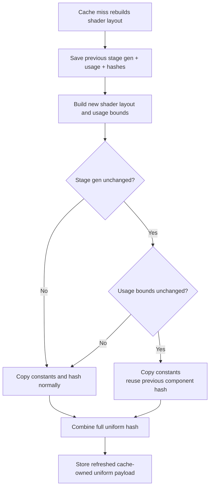

# Encode Phase 96 - Shader Constant Hash Reuse On Cache Miss

**Question.** Phase 95 reuses unchanged VS/PS shader-constant halves on cache
hits, but most remaining VS hash cost is still in cache-miss uniform rebuilds.
Can a cache miss reuse the previous component hash when both the shader-constant
generation and scanned usage bounds are unchanged?

**Implementation.**

`makeDrawUniformPayloadFromState()` now accepts optional reusable
shader-constant component hashes, parallel to the existing non-constant hash
reuse. The direct and binding-agnostic draw-state cache miss paths save the
previous constant generations and `ShaderConstantUsageBounds` before rebuilding
the shader layout. After rebuild, a stage reuses the previous component hash
only if both of these are true:

- previous stage constant generation equals the current stage constant
  generation;
- previous stage usage bounds equal the newly scanned usage bounds.

The uniform payload still owns freshly copied constants, so the optimization
does not store borrowed state or change submission semantics. It only skips the
hash read over the copied constant block when the copied bytes are already
proved identical for that usage window.



**Method.**

```sh
bash scripts/tools/run_3dmark05_perf_probe.sh \
  --suffix uniform-shader-const-miss-reuse-r1-20260615 \
  --frame 60 \
  --no-gputrace \
  --no-encoder-breakdown \
  --timeout 120 \
  --frame-sampling \
  --capture-delay-sec 40
```

Developer Mode remains unavailable for `.gputrace`, so this is a no-gputrace
CPU/P4 sample. The wrapper timeout-finalizes cleanly with complete artifacts
(`returncode=143`, `timed_out=true`). The captured frame is visually normal
GT1 at time `0:27.97`, frame `553`, HUD `19 FPS`; image metrics are
`mean_luma=102.547`, `variance=3097.966`.

**Results.**

| Metric | Phase 95 component generation | Phase 96 miss hash reuse |
|---|---:|---:|
| `present_encoded` | `1,800` | `1,800` |
| visual gate | normal | normal |
| `completion_wait_ms / present` | `27.281ms` | `27.655ms` |
| `completion_wait_with_enqueue_ms / present` | `0.149ms` | `0.695ms` |
| `gpu_command_buffer_time_ms / present` | `3.187ms` | `3.226ms` |
| `commit_chunk_replay_cpu_ms / present` | `8.247ms` | `8.283ms` |
| `d3d9_snapshot_draw_submission_cpu_ms / present` | `3.426ms` | `3.420ms` |
| `d3d9_snapshot_cache_lookup_cpu_ms / present` | `2.871ms` | `2.862ms` |
| `d3d9_snapshot_cache_batch_miss_cpu_ms / present` | `2.171ms` | `2.162ms` |
| `d3d9_snapshot_uniform_build_hash_cpu_ms / present` | `0.989ms` | `0.955ms` |
| `d3d9_snapshot_uniform_build_vs_const_hash_cpu_ms / present` | `0.610ms` | `0.592ms` |
| `d3d9_snapshot_uniform_build_vs_const_hash_bytes` | `812,301,792` | `791,557,696` |
| `d3d9_snapshot_cache_batch_miss_uniform_build_vs_const_hash_cpu_ms / present` | `0.300ms` | `0.284ms` |
| `d3d9_snapshot_cache_batch_miss_uniform_build_vs_const_hash_bytes` | `399,837,296` | `381,005,952` |
| `d3d9_snapshot_uniform_build_ps_const_hash_cpu_ms / present` | `0.048ms` | `0.038ms` |
| `d3d9_snapshot_uniform_build_ps_const_hash_bytes` | `47,273,904` | `41,291,872` |
| `submit_draw_run_batch_append_uniform_cpu_ms / present` | `0.628ms` | `0.637ms` |
| `encode_chunk_cpu_ms / present` | `10.525ms` | `10.632ms` |
| sampled FPS avg / p50 / p95 / tail600 p50 | not recorded here | `18.865 / 18.557 / 27.069 / 17.259` |

The cache-miss reuse works, but the ceiling is small. It removes about
`20.7MB` of total VS constant hash bytes and about `18.8MB` from the batch-miss
VS hash path, lowering total uniform hash by `0.034ms/present`. The residual
VS full/indexed-float hash count is still essentially unchanged
(`165,734` full VS hashes), so the dominant indexed VS fallback remains live.

The run does not produce an FPS or P4 proof. `completion_wait_ms` remains about
`27.7ms/present`, `encode_chunk_cpu_ms` is noise-flat to slightly worse, and
uniform materialization/append storage still costs about `9.09GiB` of copied
payloads plus `0.637ms/present` in append-uniform work.

**Clean gates.**

- `draw_skipped_no_pipeline=0`
- `gpu_command_buffer_errors=0`
- `render_split_hazard=0`
- `map_buffer_wait_ms=0`
- `queue_sequence_wait_ms=0`

**Decision.** Accepted as a bounded local CPU cleanup, rejected as the current
VS-hash/FPS lever. The next uniform/snapshot work should stop expecting more
small component-hash reuse to move GT1 average FPS. Better candidates are:

- reducing full indexed VS hash frequency or storage shape;
- reducing uniform payload materialization / append bytes;
- reducing larger encode children such as PSO prefetch, argbuf cbuf update,
  stream bind, or binding packet work; and
- proving P2/P3 CPU reductions also move completion wait or producer overlap.

**Verification.**

- `meson compile -C build-arm64-nowine`
- `meson test -C build-arm64-nowine dxmt9-core-device-com-spec dxmt9-state-draw-transform-spec dxmt9-draw-uniforms-layout-spec`
- `git diff --check`
- wrapper run listed in **Method**

**Related.** [state-churn-encode](index.md) ·
[state-churn-encode-encode-phase.95](state-churn-encode-encode-phase.95.md) ·
[state-churn-encode-encode-phase.94](state-churn-encode-encode-phase.94.md) · [snapshot-cache](../snapshot-cache/index.md) ·
[present-pacing](../present-pacing/index.md).
