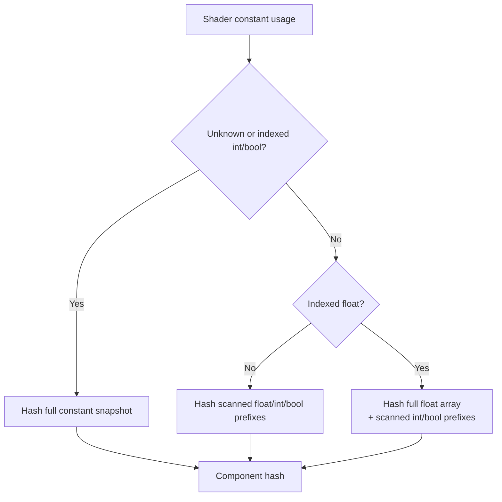

# Encode Phase 97 - Indexed Float Constant Hash Tail Trim

**Question.** Phase 96 left the full indexed VS constant hash path as the
largest local uniform-hash child. The shader ABI still needs the full float
constant array for `c[a0 + n]`, but if a shader has indexed float access and no
indexed int/bool access, can the hash ignore unused int/bool tails?

**Implementation.**

`hashShaderConstantsForUsage()` now treats indexed-float-only usage as a
minimum-safe hash shape:

- hash the full float constant array, preserving dynamic `c[a0 + n]` semantics;
- hash only the scanned int/bool prefixes when int/bool access is not indexed;
- keep the existing full fallback for unknown usage, indexed int, or indexed
  bool.

This does not change upload/storage ABI or shader source generation. It only
reduces the CPU bytes read for shader-constant identity.



**Method.**

```sh
bash scripts/tools/run_3dmark05_perf_probe.sh \
  --suffix indexed-float-hash-tail-trim-r1-20260615 \
  --frame 60 \
  --no-gputrace \
  --no-encoder-breakdown \
  --timeout 120 \
  --frame-sampling \
  --capture-delay-sec 40
```

Developer Mode is still disabled, so Xcode `.gputrace` attach is unavailable
for this run. The wrapper timeout-finalized cleanly with complete artifacts
(`returncode=143`, `timed_out=true`). The captured frame is visually normal GT1
at time `0:28.47`, frame `561`, HUD `19 FPS`; image metrics are
`mean_luma=58.400`, `variance=2961.756`.

**Results.**

| Metric | Phase 96 miss hash reuse | Phase 97 indexed-float trim |
|---|---:|---:|
| `present_encoded` | `1,800` | `1,800` |
| visual gate | normal | normal |
| `completion_wait_ms / present` | `27.655ms` | `27.538ms` |
| `completion_wait_with_enqueue_ms / present` | `0.695ms` | `0.197ms` |
| `gpu_command_buffer_time_ms / present` | `3.226ms` | `3.153ms` |
| `commit_chunk_replay_cpu_ms / present` | `8.283ms` | `8.212ms` |
| `d3d9_snapshot_draw_submission_cpu_ms / present` | `3.420ms` | `3.382ms` |
| `d3d9_snapshot_cache_lookup_cpu_ms / present` | `2.862ms` | `2.823ms` |
| `d3d9_snapshot_cache_batch_miss_cpu_ms / present` | `2.162ms` | `2.139ms` |
| `d3d9_snapshot_uniform_build_hash_cpu_ms / present` | `0.955ms` | `0.920ms` |
| `d3d9_snapshot_uniform_build_vs_const_hash_cpu_ms / present` | `0.592ms` | `0.561ms` |
| `d3d9_snapshot_uniform_build_vs_const_hash_bytes` | `791,557,696` | `747,093,584` |
| `d3d9_snapshot_uniform_build_vs_const_hash_full_indexed_float` | `165,734` | `165,873` |
| `d3d9_snapshot_cache_batch_miss_uniform_build_vs_const_hash_cpu_ms / present` | `0.284ms` | `0.268ms` |
| `d3d9_snapshot_cache_batch_miss_uniform_build_vs_const_hash_bytes` | `381,005,952` | `357,967,232` |
| `d3d9_snapshot_uniform_build_ps_const_hash_cpu_ms / present` | `0.038ms` | `0.038ms` |
| `submit_draw_run_batch_append_uniform_cpu_ms / present` | `0.637ms` | `0.628ms` |
| `encode_chunk_cpu_ms / present` | `10.632ms` | `10.573ms` |
| sampled FPS avg / p50 / p95 / tail600 p50 | `18.865 / 18.557 / 27.069 / 17.259` | `18.877 / 18.636 / 26.671 / 17.335` |

The intended local counter moves. VS hash bytes fall by `44.46MB`
(`791.56MB -> 747.09MB`), and batch-miss VS hash bytes fall by `23.04MB`.
The CPU change is correspondingly small but repeatable in the target child:
total uniform hash improves by `0.035ms/present`, and VS constant hash improves
by `0.031ms/present`.

This is not an average-FPS proof. Full indexed VS hashes still occur about
`166k` times, uniform materialization is still `8.46GiB`, append-uniform remains
about `0.63ms/present`, and completion wait remains about `27.5ms/present`.

**Clean gates.**

- `draw_skipped_no_pipeline=0`
- `gpu_command_buffer_errors=0`
- `render_split_hazard=0`
- `map_buffer_wait_ms=0`
- `queue_sequence_wait_ms=0`

**Decision.** Accepted as a bounded local cleanup. It closes the safe int/bool
tail part of the indexed-float hash path, but rejects that tail as the
remaining FPS lever. The next proof still needs one of:

- fewer full indexed VS hash calls;
- a storage/copy shape change for uniform payload materialization or append;
- a larger encode child such as PSO prefetch, argbuf cbuf update, stream bind,
  or binding packet work; or
- a P4 design that overlaps producer work with completion wait.

**Verification.**

- `meson test -C build-arm64-nowine dxmt9-state-draw-transform-spec`
- `meson test -C build-arm64-nowine dxmt9-draw-uniforms-layout-spec dxmt9-draw-uniforms-dirty-spec`
- `meson compile -C build-win32-x86-builtin`
- `meson compile -C build-x86_64-builtin`
- wrapper run listed in **Method**

**Related.** [state-churn-encode](../state-churn-encode.md) ·
[state-churn-encode-encode-phase.96](state-churn-encode-encode-phase.96.md) ·
[state-churn-encode-encode-phase.65](state-churn-encode-encode-phase.65.md) ·
[state-churn-encode-encode-phase.66](state-churn-encode-encode-phase.66.md) · [snapshot-cache](../snapshot-cache.md) ·
[present-pacing](../present-pacing.md).
