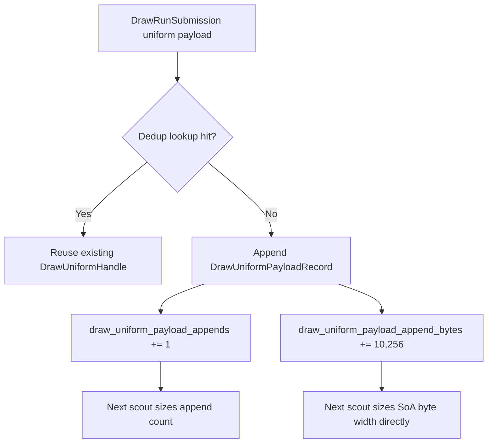

# Encode Phase 98 - Uniform Append Byte Counter

**Question.** Phase 97 leaves the residual uniform lane on payload
materialization, hash/build, and append/storage shape. The existing
`draw_uniform_payload_appends` counter sizes appended records by count, but the
low-overhead summary still requires manual multiplication by the current record
width. Can the next scout expose the uniform SoA storage/copy width directly
without adding another hot-path timer?

**Implementation.**

Add `draw_uniform_payload_append_bytes`, incremented by
`sizeof(DrawUniformPayloadRecord)` whenever `ChunkSlot::appendDrawUniformPayload`
appends a unique payload record.

Current layout check:

| Type | Size |
|---|---:|
| `DrawUniformPayload` | `10,240B` |
| `DrawUniformPayloadRecord` | `10,256B` |
| `VertexShaderConstants` | `4,368B` |
| `PixelShaderConstants` | `3,856B` |

The counter is deliberately not a CPU timer. It avoids the phase88 failure mode
where changing uniform-payload child timing probes was visually
timing-sensitive, while still making the storage-width lane visible in
`result.json` and `3dmark05-perf-summary.md`.



**Expected readout.**

For phase97-like runs, use:

```text
draw_uniform_payload_append_bytes / present_encoded
```

alongside:

```text
d3d9_snapshot_uniform_materialized_bytes / present_encoded
submit_draw_run_batch_append_uniform_cpu_ms / present_encoded
draw_uniform_payload_append_copy_cpu_ms / present_encoded
```

This distinguishes three questions that were previously easy to conflate:

| Question | Counter |
|---|---|
| How many full frontend payloads were materialized? | `d3d9_snapshot_uniform_materialized_bytes` |
| How many unique payload records were stored in the backend slot? | `draw_uniform_payload_append_bytes` |
| How much CPU does the append path spend? | `submit_draw_run_batch_append_uniform_cpu_ms` and child timers |

**Decision.** Accepted instrumentation. This is not an FPS proof and should not
be treated as a storage-shape optimization by itself. Its purpose is to let the
next normal 120s no-gputrace run rank uniform append/storage width against the
larger current P2/P3 children without enabling extra timers.

**Runtime status.** The counter now builds into the native tree, the Rosetta
Wine unix provider, and the 32-bit PE frontend used by 3DMark05. The immediate
current-head no-gputrace scout
`app-d3d9-3dmark05-current-uniform-append-bytes-r1-20260615` could not launch
because macOS reported `session_locked: yes`; it produced no sample artifacts.
Xcode `.gputrace` attach remains blocked by Developer Mode being disabled. The
next runtime gate is the same 120s no-gputrace scout after unlock.

**Verification.**

- `meson test -C build-arm64-nowine dxmt9-perf-counter-table-audit dxmt9-perf-counter-callsite-audit dxmt9-perf-docs-source-audit`
- `python3 -m pytest tests/scripts/test_summarize_3dmark05_perf.py -q`
- `meson compile -C build-arm64-nowine`
- `meson compile -C build-x86_64-builtin`
- `meson compile -C build-win32-x86-builtin`
- `git diff --check`

**Related.** [state-churn-encode](../state-churn-encode.md) ·
[state-churn-encode-encode-phase.97](state-churn-encode-encode-phase.97.md) ·
[state-churn-encode-encode-phase.88](state-churn-encode-encode-phase.88.md) · [snapshot-cache](../snapshot-cache.md) ·
[present-pacing](../present-pacing.md).
