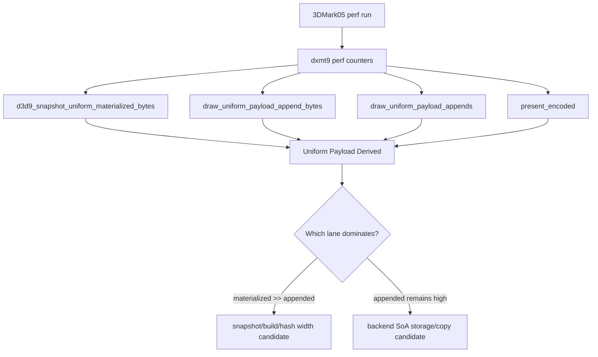

# Encode Phase 99 - Uniform Payload Derived Summary

**Question.** Phase 98 exposes `draw_uniform_payload_append_bytes`, but the raw
counter still requires manual normalization against presents, frontend
materialized payload bytes, and append count. Can the summary make the next
low-overhead scout answer "frontend uniform copy/hash vs backend append/storage"
without another timing probe?

**Implementation.**

`scripts/tools/summarize_3dmark05_perf.py` now writes a
`Uniform Payload Derived` block after draw batching derived metrics:

| Metric | Purpose |
|---|---|
| `uniform_materialized_bytes_per_present` | frontend `DrawUniformPayload` copy width per encoded present |
| `uniform_append_bytes_per_present` | backend `DrawUniformPayloadRecord` storage width per encoded present |
| `uniform_append_bytes_per_append` | current record width check; expected around `10,256B` |
| `uniform_append_records_per_materialized_snapshot` | dedup/storage collapse ratio after frontend materialization |
| `uniform_append_bytes_share_of_materialized_bytes` | backend append width compared with frontend materialized width |
| `uniform_snapshot_elision_share` | whether same-generation uniform snapshot elision is active |

This block is derived from existing counters only. It deliberately does not add
new hot-path timers after the phase88 visual/timing sensitivity.

**Decision.** Accepted summary tooling. This does not prove a new performance
owner; it reduces interpretation error for the next unlocked 120s no-gputrace
run by keeping the uniform materialization/append split visible in one table.

**Runtime status.** Runtime sampling remains externally blocked at the time of
this note: Xcode `.gputrace` attach preflight reports Developer Mode disabled,
and the no-gputrace 3DMark05 scout exits before launch with `session_locked:
yes`. No sample artifacts were produced.

**Verification.**

- `python3 -m pytest tests/scripts/test_summarize_3dmark05_perf.py -q`
- `git diff --check -- scripts/tools/summarize_3dmark05_perf.py tests/scripts/test_summarize_3dmark05_perf.py`

**Related.** [state-churn-encode](../state-churn-encode.md) ·
[state-churn-encode-encode-phase.98](state-churn-encode-encode-phase.98.md) ·
[state-churn-encode-encode-phase.97](state-churn-encode-encode-phase.97.md) ·
[state-churn-encode-encode-phase.88](state-churn-encode-encode-phase.88.md).
