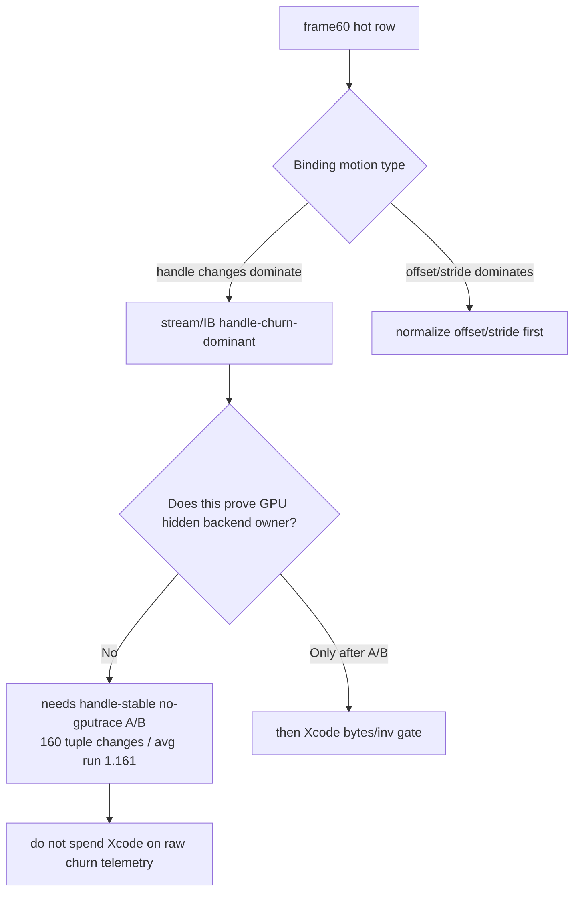
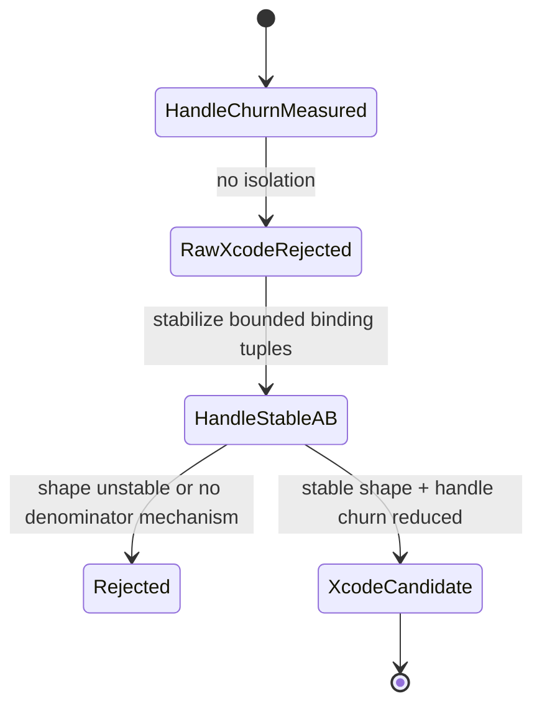

# Stream/IB Backend Churn Preflight

**Question / hypothesis.** [hidden-backend-storage-shape.11](../hidden-backend-storage/hidden-backend-storage-shape.11.md) rejects PSO churn
as an isolated Xcode candidate because the hot rows are dominated by stream/IB
binding motion. Is that stream/IB motion real handle churn in the current
frame60 shape, or is it mostly offset/stride noise or explicit dxmt writer
traffic that cannot explain hidden backend storage?

**Method.** Added `scripts/tools/analyze_stream_ib_backend_churn.py`, then ran
it on the current visibility-scout/cache-join no-gputrace encoder telemetry:

```sh
bash scripts/tools/run_3dmark05_perf_probe.sh \
  --suffix stream-extra-bindings-r1 \
  --no-gputrace \
  --measure-index-cache-opt-candidate \
  --timeout 180

python3 scripts/tools/analyze_stream_ib_backend_churn.py \
  experiments/output/app-d3d9-3dmark05-stream-extra-bindings-r1/3dmark05-perf-encoders.csv \
  --output traces/app-d3d9-3dmark05-stream-extra-bindings-r1/analysis/frame60-stream-ib-backend-churn.md \
  --csv-output traces/app-d3d9-3dmark05-stream-extra-bindings-r1/analysis/frame60-stream-ib-backend-churn.csv
```

The tool joins `[dxmt9-perf-encoder]` rows with
`[dxmt9-perf-encoder-stream]` rows and, when present,
`3dmark05-perf-indexed-probe-draws.csv`. It classifies hot rows by handle vs
offset/stride motion, reports explicit dxmt writer bytes per vertex, and counts
draw-level `stream0` / IB / extra-stream binding identity changes. During this
turn, `src/dxmt9/dxmt9_draw_encoder.mm` and `summarize_3dmark05_perf.py` were
extended so probe-draw CSVs include `stream_extra_bindings`
(`sN:0xhandle@offset/stride`). The run exited through the wrapper watchdog
(`status=124`) after writing postprocess artifacts, which is expected for the
known final-frame hang; the perf summary is `partial-log` but contains the
encoder, stream, and probe-draw CSVs needed for this gate.

**Result.**

| Row | Verdict | Draws | Triangles | Stream h/draw | IB h/draw | Combined h/draw | Offset+stride/draw | Tuple changes | Unique tuples | Max run | Avg run | Extra changes | Explicit B/vertex | LRU32 delta | Stream breakdown |
|---|---|---:|---:|---:|---:|---:|---:|---:|---:|---:|---:|---:|---:|---:|---|
| `60/2` | `handle-churn-dominant` | `187` | `389,376` | `1.449` | `0.856` | `2.305` | `0.053` | `160` | `58` | `6` | `1.161` | `111` | `0.089` | `-175,168` | `s0:h160/o0/s0/u34;s1:h111/o0/s10/u25` |
| `60/1` | `handle-churn-dominant` | `156` | `228,725` | `0.833` | `0.833` | `1.667` | `0.077` | `130` | `86` | `5` | `1.191` | `0` | `0.116` | `-88,059` | `s0:h130/o12/s0/u86` |
| `60/0` | `handle-churn-dominant` | `42` | `97,294` | `0.857` | `0.857` | `1.714` | `0.000` | `36` | `25` | `6` | `1.135` | `0` | `0.095` | `-43,792` | `s0:h36/o0/s0/u25` |

The current hot rows are therefore handle-churn-dominant and not
offset/stride-dominant. Explicit dxmt writer bytes remain tiny at roughly
`0.089-0.116 B/vertex` on the hot rows, while the known Xcode hidden backend
bucket is measured in roughly `~1.5 KiB/VS invocation` in the current frame60
family. The row-local LRU32 signal is still largest where the handle churn is
largest, but that is correlation with geometry/index locality until a
handle-stable A/B isolates the denominator. The draw-level probe join confirms
the visible stream0/IB alternation directly (`60/2`: `160` stream0 changes and
`160` IB changes), and the fresh `stream_extra_bindings` run confirms stream1
is the second row-local source (`111` extra-stream binding changes, `25` unique
extra-stream bindings). The full binding tuple changes `160` times over `187`
draws with only `58` unique tuples, max tuple run `6`, and average run length
`1.161`. That is bounded alternation, not unbounded allocation.



**Verdict.** Accepted as a gate. Current stream/IB churn is real handle
alternation in all hot frame60 rows, and it is the strongest current state
motion signal after PSO is rejected as unisolated. It still does **not** justify
another Xcode capture by itself: the previous `DrawBindingOverride` work already
proved CPU batching wins with GPU-flat counters, and the current report only
names the missing experiment. The next valid step is a no-gputrace
handle-stabilizing A/B that keeps geometry, index order, VS invocation count,
render state, and visible shader layout stable while reducing Metal stream/IB
handle changes. Only if that A/B is stable and predicts bytes/invocation
movement should it be promoted to `.gputrace`/Xcode counters.



**Related.** [state-churn-encode](index.md) · [state-churn-encode-stream.03](state-churn-encode-stream.03.md) ·
[state-churn-encode-binding.01](state-churn-encode-binding.01.md) · [hidden-backend-storage-shape.11](../hidden-backend-storage/hidden-backend-storage-shape.11.md) ·
[index-cache-locality](../index-cache-locality/index.md).
