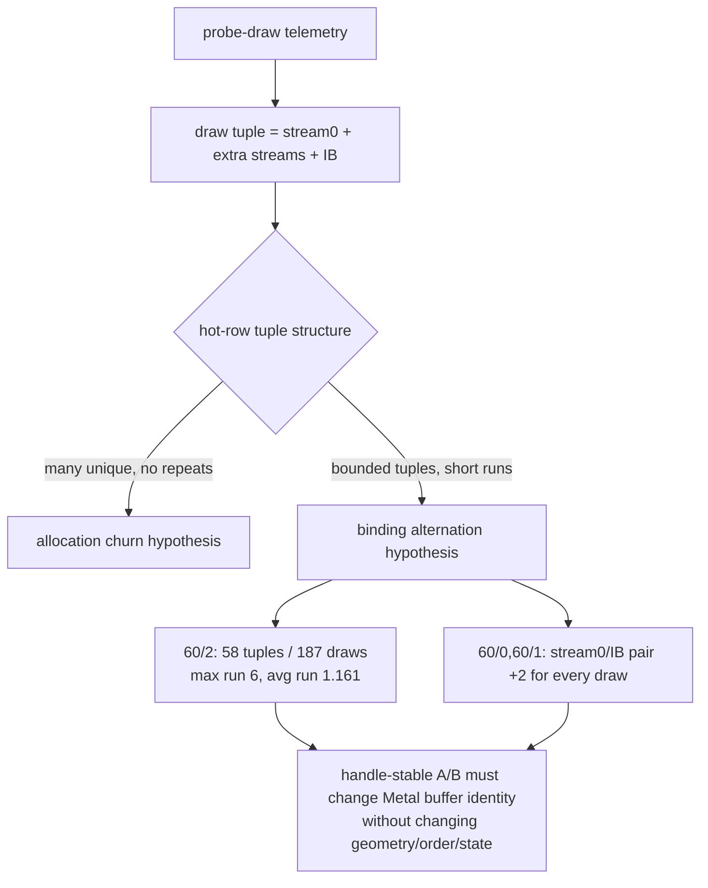
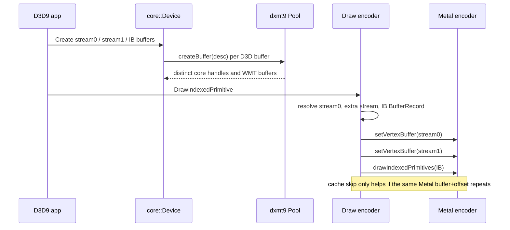
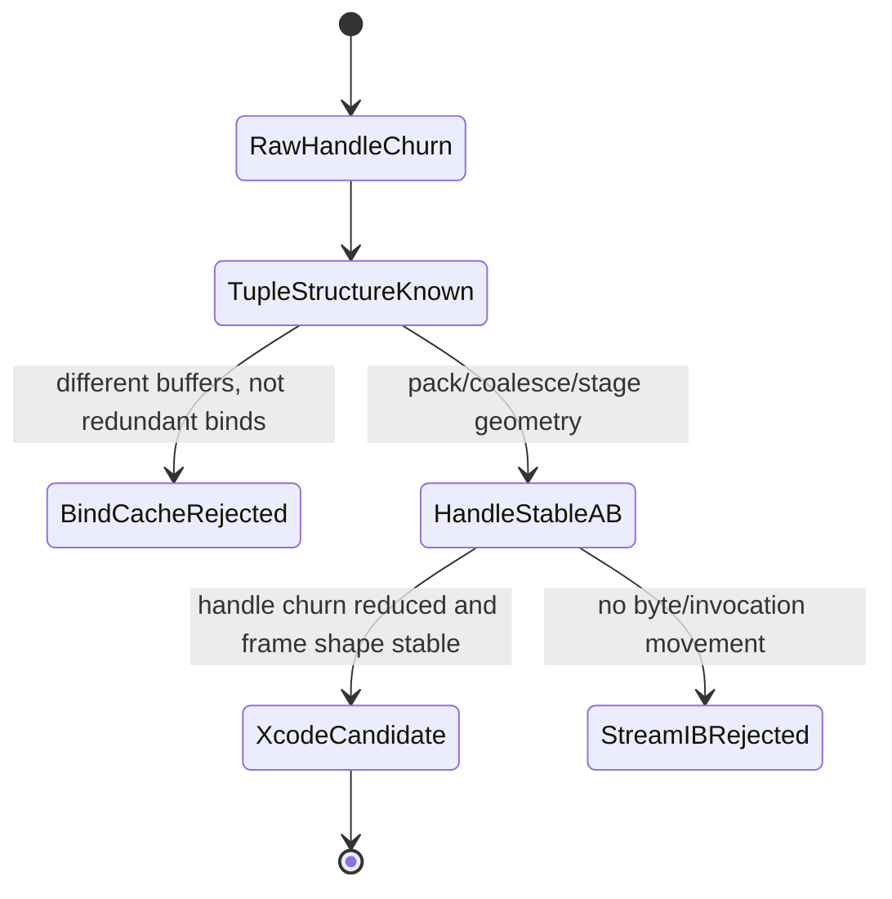

# Stream/IB Binding Tuple Structure

**Question / hypothesis.** [state-churn-encode-stream.04](state-churn-encode-stream.04.md) proved that frame60
hot rows are stream/IB handle-churn-dominant. Is that churn an unbounded
allocation problem, or a bounded binding tuple alternation that can be isolated
with a handle-stable A/B?

**Method.** Extended `scripts/tools/analyze_stream_ib_backend_churn.py` so the
optional probe-draw join reports:

- complete draw binding tuple top-N and transition classes,
- stream0/IB pair deltas,
- stream0/first-extra-stream/IB triplet deltas,
- consecutive pair/triplet ratios.

The report was regenerated from
`experiments/output/app-d3d9-3dmark05-stream-extra-bindings-r1/` into
`traces/app-d3d9-3dmark05-stream-extra-bindings-r1/analysis/frame60-stream-ib-backend-churn.md`.

**Result.**

| Row | Tuple changes | Unique tuples | Transition classes | Consecutive s0/IB pairs | Consecutive s0/s1/IB triplets | Top delta |
|---|---:|---:|---|---:|---:|---|
| `60/2` | `160/187` | `58` | `s0+ib+extra` `111`, `s0+ib` `49`, `same` `26` | `168/187` (`0.898`) | `132/187` (`0.706`) | pair `+2x168`, triplet `+1/+2x132` |
| `60/1` | `130/156` | `86` | `s0+ib` `130`, `same` `25` | `156/156` (`1.000`) | `0/0` | pair `+2x156` |
| `60/0` | `36/42` | `25` | `s0+ib` `36`, `same` `5` | `42/42` (`1.000`) | `0/0` | pair `+2x42` |

This says the hot rows are not allocating endlessly. They alternate through a
bounded set of draw-local geometry objects. In `60/2`, `132/187` draws use the
consecutive core-handle shape `stream0`, `stream1 = stream0 + 1`,
`IB = stream0 + 2`; `168/187` draws at least preserve the `stream0`,
`IB = stream0 + 2` pair. Rows `60/1` and `60/0` have no active extra stream in
the probe-draw rows, but every draw has the same `stream0`, `IB = stream0 + 2`
pair pattern.

**Code implication.** The current binding path already skips redundant Metal
calls when the same `(MTLBuffer, offset)` is still bound in the same slot. The
hot rows still churn because the draw data lives behind different buffer
records and therefore different Metal buffer identities. `core::Device` creates
one core handle per D3D buffer, `dxmt9::Pool::createBuffer()` creates the
corresponding WMT buffer, and the draw encoder binds each stream/IB record's
live buffer. A stronger bind cache cannot make different handles look stable
without lying about the data.

**Verdict.** Accepted as a sharper gate. The next valid stream/IB experiment is
not "add another bind-cache skip"; it is a handle-stable no-gputrace A/B that
presents the same geometry bytes through fewer/stable Metal buffer identities
while holding draw order, index order, VS invocation count, render state, and
visible shader layout fixed. Plausible mechanisms are per-row tuple packing or
resource-level coalescing/staging; both change data layout and must be guarded
by visual correctness before any Xcode counter spend. If such an A/B cannot
reduce handle changes without changing those denominators, stream/IB should be
rejected as the hidden-backend owner and the investigation should move back to
TVB/parameter-storage shape.

**Related.** [state-churn-encode-stream.04](state-churn-encode-stream.04.md) · [state-churn-encode](../state-churn-encode.md) ·
[hidden-backend-storage](../hidden-backend-storage.md) · [hidden-backend-storage-shape.11](../hidden-backend-storage/hidden-backend-storage-shape.11.md) ·
[index-cache-locality](../index-cache-locality.md).
