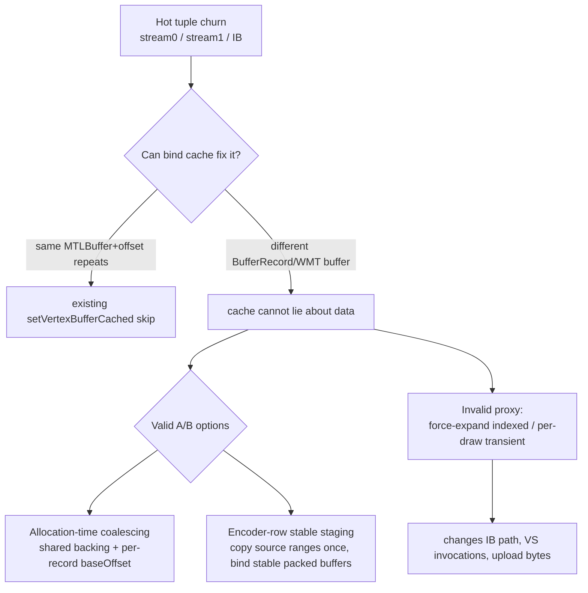
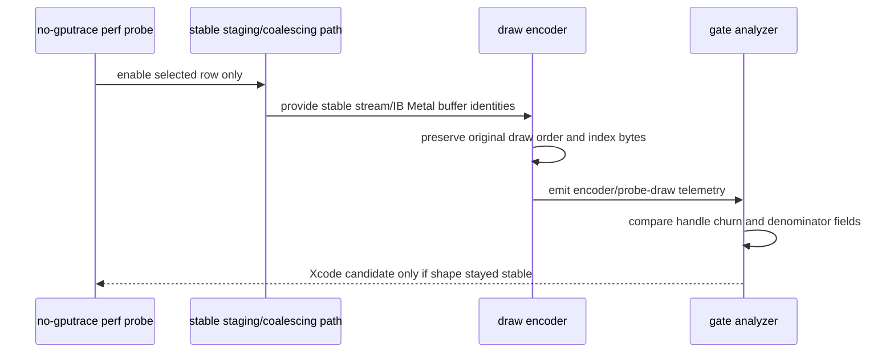

# Handle-Stable Stream/IB A/B Feasibility

**Question / hypothesis.** [[state-churn-encode-stream.05]] makes stream/IB a
bounded tuple-alternation target. Can the next experiment be a small bind-cache
change, or does a valid handle-stable A/B require a data-layout mechanism?

**Code inspection.**

- The draw encoder already shadows direct vertex binds and skips a Metal call
  when the same `(MTLBuffer, offset)` remains bound at a slot. The hot rows
  still churn because different `BufferRecord` objects carry different
  `WMT::Buffer` identities.
- `BufferRecord` stores one `WMT::Reference<WMT::Buffer>`, one `contents`
  pointer, one `shadow`, and dynamic rename-ring state. It has no
  `baseOffset`/slice field that would let multiple D3D buffers alias different
  ranges of a shared Metal buffer.
- `Pool::uploadBufferData()` and `Pool::finalizeBufferMap()` write and map the
  record as if its buffer starts at byte `0`. Sharing one Metal buffer between
  several records would need every CPU write/map path to add a base offset.
- `DXMT9_PROBE_FORCE_EXPAND_INDEXED` and the auto-expand path can replace an
  indexed draw with transient flat vertex data, but that changes the
  index-buffer path and the post-transform-cache/VS-invocation denominator. It
  is therefore not a valid proxy for "same geometry, fewer buffer identities".

**Feasibility matrix.**

| Option | What it would prove | Main risk | Current verdict |
|---|---|---|---|
| Stronger bind-cache skip | Nothing beyond existing cache | Different buffers must not be treated as the same data | rejected |
| Force-expand indexed rows | Whether flat transient draws behave differently | Mutates index path and VS invocation denominator | invalid proxy |
| Per-draw transient stream/IB copy | Whether transient buffers can render | Adds large explicit writer traffic and likely new offsets | invalid for Xcode gate |
| Encoder-row stable staging | Whether stable Metal buffer identities change backend bytes with same draw order | Must copy source spans without changing indices/baseVertex/stream offsets | plausible diagnostic A/B |
| Allocation-time coalescing | Production-like proof that adjacent stream/IB objects can share backing | Requires `BufferRecord` base offset, map/upload/rename/lifetime rewrite | plausible but invasive |

**Valid A/B contract.** Before promoting stream/IB to another `.gputrace`, the
no-gputrace run must prove all of the following:

- the selected row's geometry, index order, primitive count, VS invocation
  proxy, render state, shader variant, and VSOut layout stay stable;
- stream0/IB and extra-stream Metal handle changes drop materially;
- explicit dxmt writer bytes remain bounded and are reported separately;
- the visual gate against the `v0.0.3` anchor does not show black/translucent
  vertices, UV drift, or cbuf/texture artifacts.

**Verdict.** Accepted as a design gate. The next implementation should not
touch Xcode first and should not use forced expansion as evidence. The least
invasive valid path is an encoder-row stable-staging diagnostic that copies the
row's source stream/IB ranges into stable packed Metal buffers while preserving
the original draw/index semantics. If that cannot be made shape-stable, the
production-shaped option is allocation-time coalescing, but that is a broader
resource-pool design change because the current `BufferRecord` model has no
slice/base-offset abstraction.

**Related.** [[state-churn-encode-stream.05]] ·
[[state-churn-encode-stream.04]] · [[state-churn-encode]] ·
[[hidden-backend-storage]].
