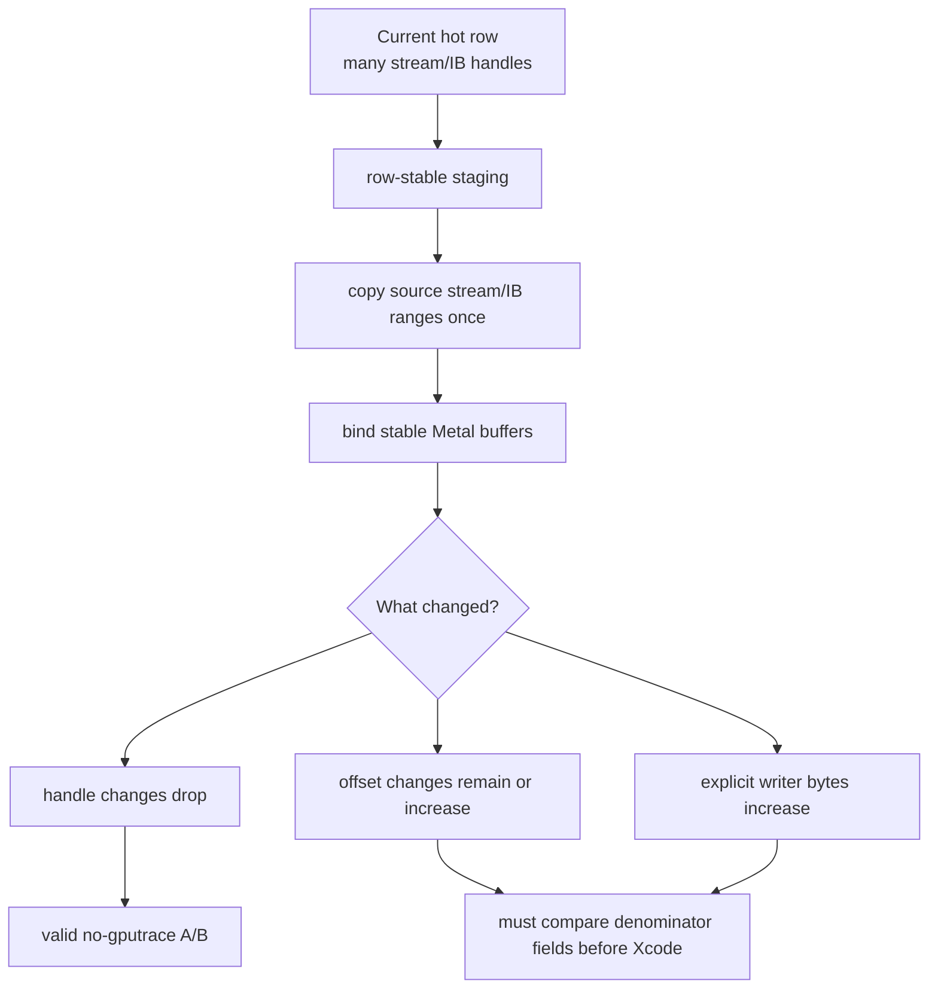
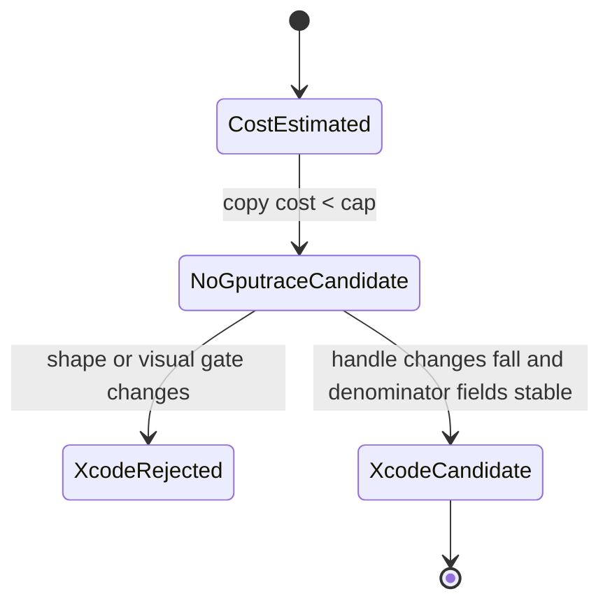

# Stream/IB Stable Staging Cost Preflight

**Question / hypothesis.** [[state-churn-encode-stream.06]] says the next valid
stream/IB A/B is row-stable staging or allocation-time coalescing. Is
row-stable staging cheap enough to try as a no-gputrace diagnostic, and what
new confounder would it introduce?

**Method.** Added `scripts/tools/analyze_stream_ib_staging_feasibility.py` and
ran it on the current `stream-extra-bindings-r1` probe-draw CSV:

```sh
python3 scripts/tools/analyze_stream_ib_staging_feasibility.py \
  experiments/output/app-d3d9-3dmark05-stream-extra-bindings-r1/3dmark05-perf-indexed-probe-draws.csv \
  --output traces/app-d3d9-3dmark05-stream-extra-bindings-r1/analysis/frame60-stream-ib-staging-feasibility.md \
  --csv-output traces/app-d3d9-3dmark05-stream-extra-bindings-r1/analysis/frame60-stream-ib-staging-feasibility.csv
```

The estimator uses the existing indexed probe fields:

- stream0 byte min/max plus one stride for each source stream0 handle;
- original index min/max with extra-stream offset/stride for stream1+ ranges;
- effective index offset/byte count for each source IB handle;
- encoder explicit writer bytes for the current dxmt writer baseline.

It then estimates the copy bytes needed if a row-stable staging path packs
source stream/IB ranges behind stable Metal buffer identities without changing
draw order or index bytes.

**Result.**

| Row | Verdict | Copy bytes | Copy B/vertex | Existing writers | Writer ratio | Offset changes/draw | Handles s0/extra/IB |
|---|---|---:|---:|---:|---:|---:|---:|
| `60/2` | `staging-ab-candidate-offset-risk` | `8,217,974` | `7.035` | `104,472` | `78.662` | `2.305` | `34/25/34` |
| `60/1` | `staging-ab-candidate-offset-risk` | `6,616,722` | `9.643` | `79,448` | `83.284` | `1.667` | `86/0/86` |
| `60/0` | `staging-ab-candidate-offset-risk` | `2,786,022` | `9.545` | `27,704` | `100.564` | `1.714` | `25/0/25` |

Byte split:

| Row | Stream0 copy | Extra stream copy | IB copy |
|---|---:|---:|---:|
| `60/2` | `2,344,728` | `5,429,792` | `443,454` |
| `60/1` | `5,557,488` | `0` | `1,059,234` |
| `60/0` | `2,342,976` | `0` | `443,046` |

The estimated copy cost is small compared with the known hidden backend storage
bucket (~GiB/frame), but it is very large compared with current dxmt explicit
writers for those rows. That means a staging A/B can be a good no-gputrace
mechanism test, but it cannot be promoted to Xcode unless the gate reports the
new copy traffic separately.



**Verdict.** Accepted as a preflight gate. Row-stable staging is feasible as a
diagnostic because the largest hot-row copy estimate is only `8.2 MiB`, but it
has an explicit writer confounder (`~79x` current writers for `60/2`) and an
offset-churn confounder (`2.305` expected offset changes/draw). The next
implementation should therefore be row-scoped and no-gputrace first. Promotion
to Xcode requires proving that draw order, index order, VS invocation proxy,
render state, shader variant, VSOut layout, and visual output remain stable
while stream/IB Metal handle changes fall materially.



**Related.** [[state-churn-encode-stream.06]] ·
[[state-churn-encode-stream.05]] · [[state-churn-encode-stream.04]] ·
[[hidden-backend-storage]].
