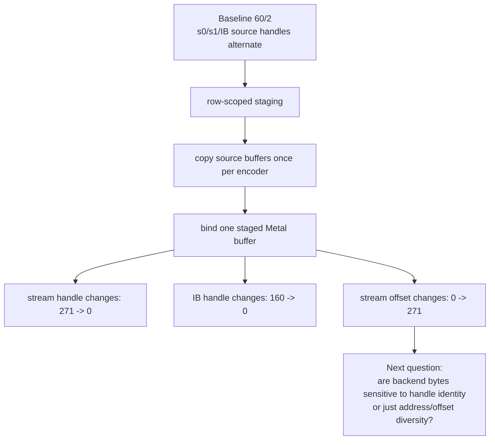
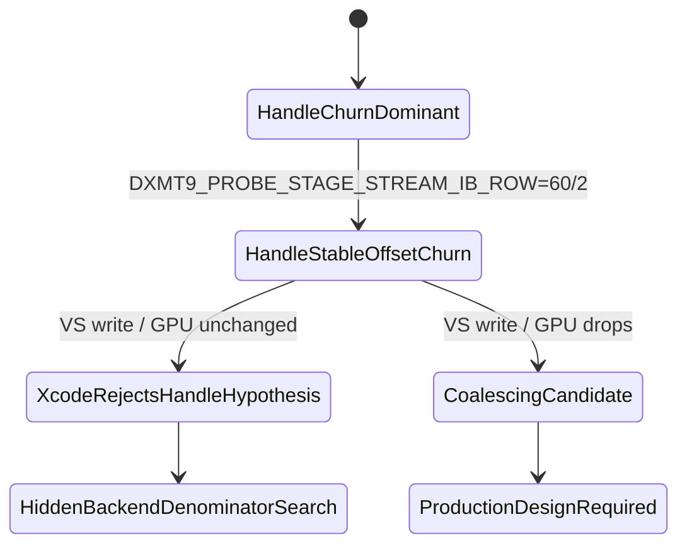

# Row-Scoped Stream/IB Staging A/B

**Question / hypothesis.** [[state-churn-encode-stream.07]] named `60/2` as a
valid no-gputrace A/B target: if the same indexed draw sequence is routed
through stable Metal buffer handles, does the stream/IB handle churn actually
drop while geometry, PSO, argbuf, and draw counts stay stable?

**Method.** Added a diagnostic-only, row-scoped staging probe:

- `DXMT9_PROBE_STAGE_STREAM_IB_ROW=<seq>/<encoder>` enables staging only for the
  selected render encoder.
- The probe copies each source stream/IB buffer once into an encoder-local
  transient slab, reuses that staged Metal buffer for the rest of the pass, and
  changes per-draw bindings to offsets inside the staged buffer.
- `recordStreamResource()` still records source D3D buffer resources; stream/IB
  state and indexed probe rows record the effective Metal handle/offset.
- The path preserves draw order, index bytes, vertex count, shader variants,
  PSO state, and VSOut layout; it does not apply index-order mutation.

Run:

```sh
DXMT9_PROBE_STAGE_STREAM_IB_ROW=60/2 \
bash scripts/tools/run_3dmark05_perf_probe.sh \
  --suffix stream-ib-stage-60-2-r1 \
  --no-gputrace \
  --measure-index-cache-opt-candidate \
  --timeout 180
```

The run exited with watchdog status `124` after `225s`, but wrote the summary,
encoder CSV, stream CSV, and indexed probe-draw CSV. This is acceptable for the
no-gputrace diagnostic gate; it is not an FPS proof.

**Result.**

Baseline `stream-extra-bindings-r1` vs staged `stream-ib-stage-60-2-r1`,
encoder `60/2`:

| Metric | Baseline | Staged |
|---|---:|---:|
| Draws | `187` | `187` |
| Stream handle changes | `271` | `0` |
| IB handle changes | `160` | `0` |
| Stream offset changes | `0` | `271` |
| Stream stride changes | `10` | `10` |
| PSO handle changes | `48` | `48` |
| Argbuf table bytes | `5,056` | `5,056` |
| Argbuf cbuf bytes | `96,424` | `96,424` |
| `setVertexBytes` bytes | `2,992` | `2,992` |
| Staged stream bytes | `0` | `6,938,808` |
| Staged IB bytes | `0` | `443,454` |

The backend-churn analyzer now classifies `60/2` as `offset-stride-dominant`
instead of `handle-churn-dominant`: stream/IB handle changes are eliminated,
while the same per-draw diversity appears as staged-buffer offsets.



**Interpretation.**

The diagnostic succeeded at isolating the variable it was built for: `60/2`
can be made handle-stable without changing draw count, PSO churn, argbuf bytes,
cbuf bytes, or volatile bytes. That means future Xcode counter work can test a
real handle-identity hypothesis instead of measuring the original mixed
stream/IB/PSO churn shape.

It does **not** prove a performance fix. The diagnostic pays explicit copy
traffic (`6.94 MiB` stream + `0.44 MiB` IB), and it replaces handle churn with
offset churn inside one staged buffer. If Xcode still reports the same VS
buffer/backend bytes after this A/B, stream/IB handle identity is not the
first-order hidden-backend owner. If Xcode drops materially despite the added
copy traffic, allocation-time geometry coalescing or resource-identity
stabilization becomes a production design candidate.



**Verdict.** Accepted as a diagnostic A/B. This closes the no-gputrace
isolation question: handle churn can be removed while the row shape stays
stable enough for a counter replay. The Xcode follow-up
([[state-churn-encode-stream.09]]) answers the GPU question negatively: the
handle-stable row does not materially reduce GPU time or VS buffer writes. Keep
this probe as an investigation tool rather than a production optimization.

**Related.** [[state-churn-encode-stream.07]] ·
[[state-churn-encode-stream.09]] · [[state-churn-encode-stream.06]] ·
[[state-churn-encode-stream.05]] · [[hidden-backend-storage]].
