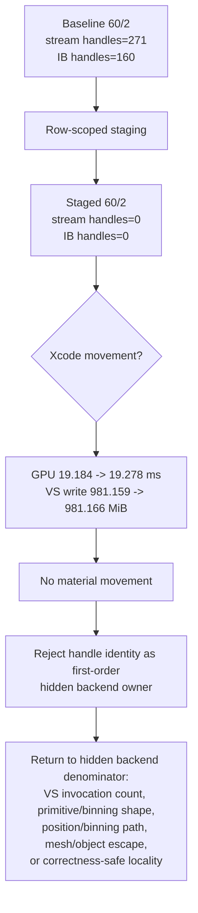
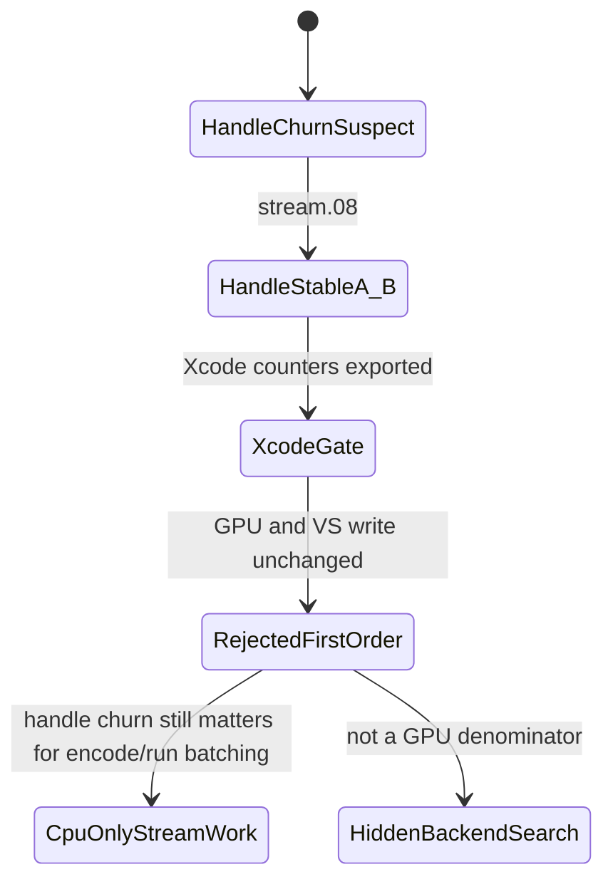

# Xcode Stream/IB Handle-Stable Gate

**Question / hypothesis.** [[state-churn-encode-stream.08]] proved that
`60/2` can be made stream/IB handle-stable without changing draw count,
PSO churn, argbuf bytes, cbuf bytes, or visible VSOut layout. This gate asks the
GPU-side question: does removing stream/IB handle identity churn reduce Xcode's
hidden backend/VS buffer-write bucket?

**Method.**

The staged capture used:

```sh
DXMT9_PROBE_STAGE_STREAM_IB_ROW=60/2 \
bash scripts/tools/run_3dmark05_perf_probe.sh \
  --suffix stream-ib-stage-60-2-xcode-r1 \
  --timeout 240
```

The run hit the watchdog after `285s`, but wrote the frame60 gputrace and perf
CSV/log outputs. Xcode was then used to replay the frame, embed performance
data, wait for draw counter profiling to finish, and export encoder counters to
`traces/app-d3d9-3dmark05-stream-ib-stage-60-2-xcode-r1/analysis/frame60-counters-xcode.csv`.

Comparison is against the current post-visualfix frame60 Xcode baseline,
`post-visualfix-frame60-baseline-r1`. The exact no-gputrace preflight baseline
`stream-extra-bindings-r1` does not have Xcode counters, so the Xcode result is
a shape-stable row-key comparison rather than a same-run-id replay pair.

**Result.**

Top-3 aggregate, post-visualfix baseline vs staged:

| Metric | Baseline | Staged | Delta |
|---|---:|---:|---:|
| Total GPU | `33.614 ms` | `33.621 ms` | `+0.02%` |
| Top-3 GPU | `32.984 ms` | `33.023 ms` | `+0.12%` |
| Top-3 VS buffer write | `1627.332 MiB` | `1627.335 MiB` | `+0.00%` |
| Top hidden backend write | `1597.755 MiB` | `1590.780 MiB` | `-0.44%` |
| Top unexplained buffer write | `1627.792 MiB` | `1620.771 MiB` | `-0.43%` |
| Top stream handle changes | `437` | `166` | `-62.01%` |
| Top IB handle changes | `326` | `166` | `-49.08%` |
| Top stream offset changes | `12` | `283` | `+2258.33%` |
| Top transient bytes | `0` | `7.040 MiB` | staging cost |

Target row `60/2`:

| Metric | Baseline | Staged | Delta |
|---|---:|---:|---:|
| GPU | `19.184 ms` | `19.278 ms` | `+0.49%` |
| VS buffer write | `981.159 MiB` | `981.166 MiB` | `+0.00%` |
| VS invocations | `642,001` | `642,001` | `+0.00%` |
| Stream handle changes | `271` | `0` | `-100.00%` |
| IB handle changes | `160` | `0` | `-100.00%` |
| Stream offset changes | `0` | `271` | offset diversity remains |
| Staged stream bytes | `0` | `6,938,808` | staging cost |
| Staged IB bytes | `0` | `443,454` | staging cost |
| Draw calls | `187` | `187` | `+0.00%` |
| Vertex count | `1,168,128` | `1,168,128` | `+0.00%` |
| Triangle estimate | `389,376` | `389,376` | `+0.00%` |

The VS-scaling report classifies the run as `shape-stable unchanged`: row keys
match, draw/vertex/primitive counts are stable, VS invocations are stable, and
VS buffer write does not materially move.





**Interpretation.**

This closes the current stream/IB GPU hypothesis. The row-local variable was
isolated strongly enough for the intended question: the target row's draw count,
vertex count, triangle count, VS invocations, PSO shape, and VSOut key stayed
stable while stream/IB handle changes fell to zero. Xcode's backend bucket did
not follow. The remaining top VS writes are still `~1.63 GiB/frame`, still
`~7.9x` visible VSOut, and still `~33x` stream0 input bytes.

The staging path should remain a diagnostic tool, not a production
optimization. It adds explicit copy traffic and converts handle churn into
offset churn. More importantly, the Xcode result says handle identity/packing is
not the first-order owner of GT1's hidden vertex/backend write traffic. Future
GPU work should not spend captures on stream/IB handle stabilization unless a
new mechanism also changes VS invocations, primitive/binning shape, or an Apple
backend path below visible VSOut.

CPU conclusions are separate. Stream/IB handle churn still explains draw-run
breaks and stream-bind CPU cost in [[state-churn-encode]], but it is not the
current GPU-frame limiter.

**Verdict.** Rejected as first-order GPU owner. Accepted as a useful negative
gate: it prevents spending more Xcode budget on stream/IB handle identity and
pushes the remaining GPU investigation back to [[hidden-backend-storage]],
[[tvb-mechanism-proof]], and correctness-safe locality work.

**Related.** [[state-churn-encode-stream.08]] ·
[[state-churn-encode-stream.07]] · [[hidden-backend-storage]] ·
[[index-cache-locality]].
