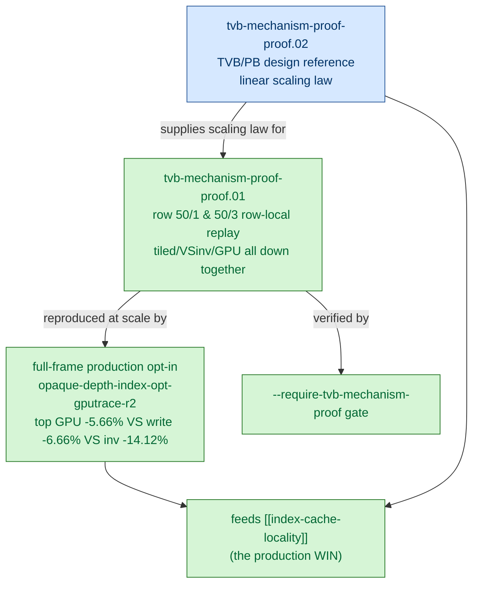

# TVB Mechanism Proof — why the index-cache win is real

> Part of the 3DMark05 GT1 GPU-bottleneck investigation. Root map: [[overview]].

## Scope & question

This domain owns the **load-bearing mechanism behind the only accepted
production win**. The central GT1 finding is that the top render encoders write
a ~1.6 GiB "VS Buffer Device Memory Bytes Written" bucket that is *not* explained
by dxmt CPU-side writers (~0.4 MiB), visible MSL `VSOut` width (184 B), or AIR
scratch — it is hidden Apple GPU vertex-stage / tiler / **Tiled Vertex Buffer
(TVB) / Parameter Buffer (PB)** storage that scales with
`VS invocations × per-vertex VSOut bytes`. This domain proves the corollary: if
that model is right, reducing post-transform VS invocations (via index-cache
LRU32 reorder) must linearly reduce TVB write traffic and GPU time. It does —
both row-local and full-frame.

## Hypotheses & verdicts

| # | Hypothesis | Verdict | Evidence |
|---|-----------|---------|----------|
| H1 | TVB write bytes scale linearly with `VS invocations × per-vertex VSOut bytes` (Imagination/Asahi PB model) | accepted (model) | [[tvb-mechanism-proof-proof.02]] |
| H2 | A row-local index-cache LRU32 reorder lowers VS invocations, named tiled bytes, and GPU time together (geometry/shader locked) | accepted | [[tvb-mechanism-proof-proof.01]] |
| H3 | A standalone mini-replay reading `VS Buffer Device Memory Bytes Written = 0 MiB` is an architectural artifact (PB never spills), not a fidelity defect | accepted | [[tvb-mechanism-proof-proof.02]] |
| H4 | The mechanism reproduces at full-frame scale through the production opt-in `DXMT9_OPTIMIZE_OPAQUE_DEPTH_INDEX_CACHE=1` (target rows only, non-target stable) | accepted | [[tvb-mechanism-proof-proof.01]] |
| H5 | Named tiled counters alone are a sufficient pass/fail gate | rejected (they cover ~15% of proxy; demoted to subtype evidence) | [[tvb-mechanism-proof-proof.02]] |

## Verification methods

- **`--require-tvb-mechanism-proof`** (`scripts/tools/compare_xcode_dxmt_bottlenecks.py`)
  — mini-replay mechanism gate: checks that top-N hidden backend write,
  `VS Buffer Device Memory Bytes Written`, `vs_invocations`, and `gpu_ms` all
  strictly decrease. Used because Xcode VS write is dominated by hidden
  TVB/parameter storage, so the narrow named-tiled counters are too small to be
  the primary gate.
- **`--require-stable-frame-proof`** — full-frame production gate; gates on
  `VS Buffer Device Memory Bytes Written` because at full-frame scale the PB
  spills and the counter is nonzero.
- **Named tiled counters** (`Tiled Vertex Buffer Bytes`,
  `Tiled Vertex Buffer Primitive Blocks Bytes`) — diagnostic **subtype
  evidence** only; ~15% of the TVB proxy, retained for attribution not pass/fail.
- **Derived joined-CSV fields** — `dxmt_tvb_pressure_proxy_mib`,
  `dxmt_tvb_named_to_proxy_ratio`, `dxmt_vs_buffer_write_to_tvb_proxy_ratio`
  distinguish "PB never spilled" from "missing capture."
- **External model references** — WWDC20 #10632, Asahi GPU part 5
  (A. Rosenzweig), Imagination "What is the Parameter Buffer?", MoltenVK source;
  design doc `docs/superpowers/specs/2026-06-03-tvb-mechanism-proof-design.md`.

## Experiment dependency graph

## Results synthesis

**Settled.** The mechanism is closed. The Imagination/Asahi Parameter-Buffer
model ([[tvb-mechanism-proof-proof.02]]) predicts that TVB write traffic scales
with `VS invocations × per-vertex VSOut bytes`, and two geometry/shader-locked
row-local replays (50/1, 50/3) confirm that an LRU32 post-transform index-cache
reorder drives named tiled bytes, VS invocations, and GPU time down *together*
with the visible `VSOut` layout held constant ([[tvb-mechanism-proof-proof.01]]).
The full-frame production opt-in `DXMT9_OPTIMIZE_OPAQUE_DEPTH_INDEX_CACHE=1`
reproduced the effect (`opaque-depth-index-opt-gputrace-r2`): target opaque
depth-writing rows lose VS invocations and VS-write bytes while the non-target
hot row `50/2` stays geometry- and counter-stable, with ~85% of the target
VS-write drop attributable to fewer invocations and ~15% to lower bytes per
invocation. This is the **mechanism that makes the only production win real** —
without it the index-cache reorder would be an unexplained correlation; with it,
the win is a direct consequence of reducing hidden vertex-stage storage pressure.

**Open.** The TVB model also explains why almost everything *else* is still
hidden: named tiled counters cover only ~15% of the expected proxy, so the
remaining top-3 cost (`hidden_vertex_tiler_parameter_storage`) on non-opaque rows
like `50/2` is not reachable by this mechanism. Lowering the production min-gain
threshold to 0 admits weaker candidates without moving Xcode VS invocations, so
the guarded min-gain-10 path stays. Further wins must reduce VS invocations or
primitive/backend storage on rows the opaque-depth cache does not cover — work
that belongs to [[index-cache-locality]] and [[primitive-reorder-diagnostics]].

## Cross-references
- [[hidden-backend-storage]] — supplies the TVB cost model this domain proves; the hidden VS-write bucket is the thing being reduced.
- [[index-cache-locality]] — the production path (`DXMT9_OPTIMIZE_OPAQUE_DEPTH_INDEX_CACHE`) that this mechanism makes legitimate; the only accepted win.
- [[mini-replay-bisection]] — the row-local replay harness that produced the geometry-locked 50/1 / 50/3 evidence.
- [[vsout-layout]] — visible varying width was held constant across variants, so this proof rules it out as the first-order owner.
- [[overview]] — root priority DAG and synthesis.
