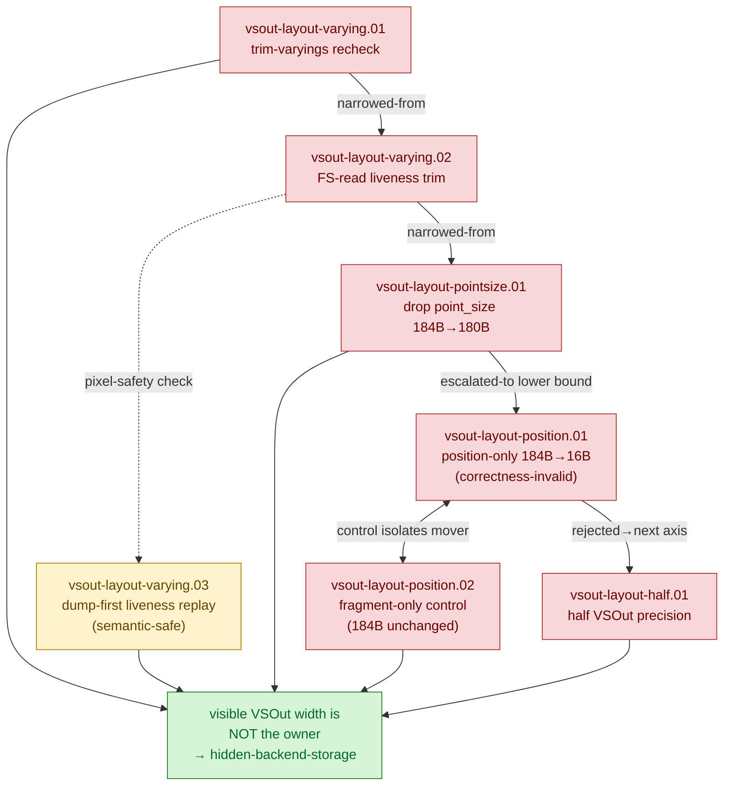

# VSOut Layout — visible varying-width attempts to explain the VS-write bucket - Historical Log

> Full historical detail moved from the former top-level `vsout-layout.md` overview.
> Keep [overview](overview.md) current and compact; append long-running chronology,
> rejected paths, and detailed synthesis here only when it is not already captured in
> one-experiment leaf documents.

---

# VSOut Layout — visible varying-width attempts to explain the VS-write bucket

> Part of the 3DMark05 GT1 GPU-bottleneck investigation. Root map: [overview-3dmark05-gt1](../overview-3dmark05-gt1.md).

## Scope & question

This domain owns every attempt to explain or reduce the dominant Xcode
"VS Buffer Device Memory Bytes Written" bucket (~1.6 GiB across the top-3 render
encoders) by changing the **visible** per-vertex shader-stage-out shape — the MSL
`VSOut` struct width / field set. The hypotheses span blanket varying trimming,
exact FS-read liveness, dropping a single field (point-size), the extreme
position-only lower bound (plus its fragment-only control), and half-precision
varyings. Almost every one was **rejected** as not the first-order owner; the one
useful result is a semantically-*safe* liveness trim that nonetheless does not move
the bucket.

## Hypotheses & verdicts

| # | Hypothesis | Verdict | Evidence |
|---|-----------|---------|----------|
| H1 | Trimming unused varyings (`DXMT9_TRIM_UNUSED_VARYINGS`) shrinks the VS-write bucket | rejected | vsout-layout-varying.01 |
| H2 | Exact FS-read liveness trim (keep only fields the FS reads) moves it where blanket trim did not | rejected | vsout-layout-varying.02 |
| H3 | A liveness trim can at least be done safely (no pixel change) | rejected (perf), but **semantically safe** (0 changed px, SSIM 1.000) | vsout-layout-varying.03 |
| H4 | Dropping only `VSOut.pointSize` (184B→180B) moves the bucket | rejected | vsout-layout-pointsize.01 |
| H5 | Extreme position-only VSOut (184B→16B) drops the bucket proportionally | rejected (non-proportional; correctness-invalid diagnostic) | vsout-layout-position.01 |
| H6 | Control: constant-fragment alone (184B VSOut unchanged) reproduces the same delta → mover is fragment/raster, not width | rejected as width owner (control confirms) | vsout-layout-position.02 |
| H7 | Half-precision varyings reduce hidden TVB/parameter storage | rejected (fails GPU-time TVB mechanism gate) | vsout-layout-half.01 |

## Verification methods

- **`DXMT9_TRIM_UNUSED_VARYINGS=1`** — collapse ordinary MSL VSOut to declared-used
  fields; proves blanket width reduction does not move the bucket.
- **`--trim-vsout-to-fs-reads`** (mini-replay) — exact FS-read liveness manifest;
  proves liveness trim is pixel-safe but perf-inert.
- **`DXMT9_PROBE_DROP_VSOUT_POINT_SIZE=1`** (`--drop-vsout-point-size`) — single-field
  drop (key `0xfff→0x7ff`); isolates the point-size / `point_size` path.
- **`DXMT9_PROBE_POSITION_ONLY_VSOUT=1`** — extreme `16B` lower bound; **correctness-invalid
  diagnostic** (forces constant fragment), used only as a bandwidth classifier.
- **`DXMT_DEBUG_FORCE_FRAGMENT_COLOR=1`** (`--force-fragment-color`) — the control that
  separates fragment/raster effect from VSOut width; also a diagnostic, not a fix.
- **`DXMT9_PROBE_HALF_VSOUT=1`** (`--probe-half-vsout`) — half4/half precision stage-out;
  the non-reorder backend-shape axis.
- **`--dump-shaders` + finalizer `--require-shader-dump-matches`** — proves the top
  rows actually used the modified VSOut sources.
- **`--require-top-vs-buffer-write-decrease`** / **`--require-tvb-mechanism-proof`** —
  the pass/fail gates these probes are measured against (VS write, hidden backend,
  VS invocations, and GPU time must all strictly decrease).

## Experiment dependency graph



## Results synthesis

The recurring lesson across this domain is unambiguous: **changing the visible MSL
`VSOut` / varying width changes the generated MSL/IR shape but does not move the
Xcode VS-write bucket.** A blanket trim, an exact FS-read liveness trim, dropping
point-size, and even an `88.4x` collapse to position-only (`184B→16B`) all left the
bucket essentially intact (`≤ -0.016MiB` for the non-destructive trims; the `-79MiB`
seen under position-only was reproduced by the fragment-only control with VSOut
unchanged, proving the mover was fragment/raster/backend interaction, not width).
Half-precision varyings shifted only `-2.44%` of top VS write while GPU time
regressed `+3.40%`, failing the TVB mechanism gate. The single positive finding is
correctness, not performance: the dump-first liveness trim is semantically safe
(0 changed pixels, SSIM 1.000) — safe to do, not worth doing for perf.

Two of these probes are **correctness-invalid diagnostics**, usable only as
classifiers: `DXMT9_PROBE_POSITION_ONLY_VSOUT` (forces position-only + constant
fragment) and `DXMT_DEBUG_FORCE_FRAGMENT_COLOR` (strips fragment work). They must
never be treated as optimization candidates. The remaining `clip_distance` axis
was audited and is already absent from the hot frame50 rows, so it offers no further
width to remove.

Nothing in this domain is still open: visible VSOut width is closed as the owner.
The surviving owner is hidden Apple GPU vertex-stage / tiler / parameter (TVB)
backend storage that scales with VS-invocation count × per-vertex VSOut bytes — see
[hidden-backend-storage](../hidden-backend-storage/index.md).

## How to run
Every experiment here is a 3DMark05 GT1 run via the standard wrapper. Capture a
`.gputrace` with the VSOut-layout variant under test plus `--dump-shaders`, then
finalize and require the shader rows actually used the modified VSOut sources:

```sh
bash scripts/tools/run_3dmark05_perf_probe.sh --suffix half-vsout --frame 60 \
  --probe-half-vsout --dump-shaders --timeout 420
# other axes: --trim-unused-varyings, --drop-vsout-point-size,
#   --probe-position-only-vsout (correctness-invalid), --force-fragment-color (control)

bash scripts/tools/finalize_3dmark05_perf_probe.sh --suffix half-vsout --frame 60 \
  --baseline-joined traces/<baseline>/analysis/frame60-xcode-dxmt-joined-summary.csv \
  --require-shader-dump-matches --require-top-vs-buffer-write-decrease
```

The mini-replay FS-read liveness axis (`--trim-vsout-to-fs-reads`) is run through
the [mini-replay-bisection](../mini-replay-bisection/index.md) harness. The exact per-experiment flags live in each
leaf's `**Method.**` field. See `agents/rules/environment_variables.rules.md` for
env-var meanings and `agents/rules/metal_debugging.rules.md` for the full workflow.

## Cross-references
- [hidden-backend-storage](../hidden-backend-storage/index.md) — the surviving owner this whole domain points to (hidden TVB/parameter storage, VS-write density model).
- [tvb-mechanism-proof](../tvb-mechanism-proof/index.md) — the `--require-tvb-mechanism-proof` gate that half-VSOut failed; the accepted row-local mechanism proof.
- [shader-codegen](../shader-codegen/index.md) — sibling axis testing vertex temp/scratch trim and offline Metal codegen (also below visible stage-out).
- [backend-shape-classifiers](../backend-shape-classifiers/index.md) — where the correctness-invalid position-only / fragment-only diagnostics live as state-shape classifiers.
- [overview-3dmark05-gt1](../overview-3dmark05-gt1.md) — root map and priority DAG.

## Root 3DMark05 Map Detail Migration - 2026-07-08

Detail migrated from the former long-form root [3DMark05 overview](../overview-3dmark05-gt1.md) so that `vsout-layout` owns its detailed synthesis while the root overview stays cross-domain only.

### From What is settled vs open

- Visible `VSOut`/varying width, point-size, half-precision varyings. [vsout-layout](index.md)
- Translated-shader temp/scratch sizing; owner is below AIR. [shader-codegen](../shader-codegen/index.md)
- Current primitive-order-preserving backend-shape probes: half-VSOut moves
  bytes/inv only `-1.94%` and regresses GPU, so it fails the non-reorder gate.
  Offline `live-vsout` also left `60/2`/`60/1` scratch unchanged, and the
  scoped `60/0` Xcode counter gate then rejected the remaining visible-width
  candidate outright. [hidden-backend-storage](../hidden-backend-storage/index.md)

- Whether an actual Apple position-only/binning path can avoid hidden
  MSL position-attribute / parameter storage. The existing position-only VSOut probe is a
  correctness-invalid visible-output diagnostic, not proof that this backend
  path was enabled or impossible. [vsout-layout](index.md), [shader-codegen](../shader-codegen/index.md)
