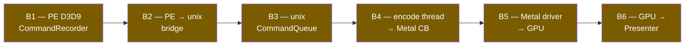

# Boundary-Isolated Benchmarking — gap analysis and proposal

dxmt9 today measures performance through two separate channels: **wild-app
end-to-end** runs (SFIV, Anno1404, DX9 SDK samples) and **synthetic
probes** (`dxmt9-perf-{ffp-only,multi-rt,depth-heavy,skeletal}`). The
G-axis A/B for R-BACK-2.33 (U1, 2026-05-10) showed the wild path is
load-bearing for fps numbers but **scene-dependent and noisy**: SFIV
captures alternated between heavy (RP=22, 12 fps) and menu (RP=2, 55
fps) workloads on consecutive runs at the same `--timeout 150`, and the
4× tile-flush penalty on the heavy scene swallowed the cap=4 fps win
that the cost model in `g-axis-tuning.md` predicted.

This note audits whether the current setup permits **boundary-isolated**
measurement — measuring one architectural boundary at a time, holding
the others fixed — and proposes the missing probes.

## 1. Boundary inventory

dxmt9's pipeline crosses these boundaries from PE call to GPU pixel:



| ID | Boundary | Tests / probes today | Counters surfaced | Missing |
|----|---|---|---|---|
| **B1** | PE → CommandRecorder | `chunk_record_spec`, `chunk_record_validation_spec` (native unit) | `submit_draw_cpu_ms` (only when whole-stack run) | CPU-only chunk-build benchmark; no isolation today |
| **B2** | PE → unix bridge | `bridge_ops_spec` (opcode count only) | `chunk_admit`, `chunk_reject`, `ring_arena_heap_fallback_*` | **No bridge-ABI throughput probe** |
| **B3** | unix CommandQueue | `CommandQueue.tla` (model), queue observer assertions | `command_buffers`, `sub_command_buffers`, `chunk_subcb_count_max`, encoder split classes | **No encode-only probe** (always coupled with GPU) |
| **B4** | encode thread → Metal CB | `EncoderLifecycle.tla`, `render_pass_actions_spec`, the 4 `dxmt9-perf-*` probes (mode-coupled) | render-pass action histograms, `bind_*`, hazard exact/Bloom, `encode_*_cpu_ms` family | Encode throughput in isolation; sub-CB chain sensitivity workload |
| **B5** | Metal driver → GPU | Implicit in frame timing | `gpu_command_buffer_time_ms` P50/P95/P99 (M4), `gpu_command_buffer_errors` (M5) | GPU-only fixed-CB replay (low ROI — Xcode Instruments better) |
| **B6** | GPU → Presenter | `run_dx9_present_policy_ab.py` (multi-mode), CAMetalLayer present timing | `present_acquire_wait_ms`, `present_preacquire_*`, `present_boundary_*` | Drawable-acquire isolation (no encode work) |

Wild apps (SFIV / Anno1404) test the whole pipeline simultaneously and
serve as oracles, but **none of B1-B6 can be measured without the
others**, which is the diagnosis the V1 task is asking us to fix.

## 2. The 4 existing synthetic probes

All four launchers (`experiments/launchers/dxmt9-perf-*.sh`) call
the **same in-tree binary** `experiments/apps/PerformanceProbe/PerformanceProbe.cpp`
with a different mode env var. They differ only in workload shape:

| Probe | Mode | Target boundary | What it tests | Limitation |
|---|---|---|---|---|
| `ffp-only` | FFP path | B4 (shader variant) | `uniform_ffp_*_calls`, FFP fragment dispatch | Includes present cost, encode cost, GPU cost — not isolated |
| `multi-rt` | Render-pass color rotation | B4 (RP merge) | `render_pass_load_action_clear` | Same as above; RT switching also stresses queue tracker (B3) |
| `depth-heavy` | Depth load/store optimization | B4 + B5 (TBDR tile flush) | `render_pass_store_action_depth_dontcare` | Couples encode-side decision with GPU-side flush |
| `skeletal` | Volatile uniform pushes | B3/B4 | `uniform_volatile_pushes` | No matrix of size × frequency |

These probes serve well as **regression sentries for the whole pipeline
under known workload shapes**, but they do not isolate any single
boundary. R-BACK-2.33's U1 A/B used SFIV partly because none of the
four synthetic probes can isolate the sub-CB chain sensitivity — they
all couple encode policy to GPU work.

## 3. Missing boundary-isolated probes

Ranked by ROI:

### (b) Bridge-ABI throughput — `dxmt9-perf-bridge-empty.sh` 🟢 HIGH

A small in-tree app that issues 100k `commit_chunk()` calls with
**header-only / zero-record** payloads. Measures pure PE→unix crossing
cost without any encode or GPU work.

- **Boundary:** B2 only.
- **Counters:** `chunk_admit`, `chunk_reject`, latency percentiles per commit (new perf counter `bridge_commit_latency_ns`).
- **Detects:** any per-call regression in the WINE_UNIX_CALL marshalling, struct-pack ABI changes, importer validation overhead.
- **Implementation:** ~100 lines C++ + Wine wrapper, ~2 days.

### (c) Encode-only throughput — `dxmt9-perf-encode-replay.sh` 🟢 HIGH

A probe that pre-records a fixed chunk (saved to disk on first run, replayed
N times on subsequent invocations). Measures encode-thread throughput
**without per-frame variance from PE recording, drawable acquisition, or
GPU completion timing**.

- **Boundary:** B3 (queue tracker) + B4 (encoder).
- **Counters:** `encode_chunk_cpu_ms`, `encode_draw_cpu_ms` family, `command_buffers`, `sub_command_buffers`. **No** `present_acquire_wait` (no Present record).
- **Detects:** encode-thread CPU regressions, sub-CB chain policy effects in isolation.
- **Implementation:** ~3 days. Pre-recording requires a serialization path for `core::ChunkSlot` which is partially in `chunk_record_import_spec` already.

### (e) Sub-CB chain sensitivity — `dxmt9-perf-chain-parametric.sh` 🟢 HIGH

Parametric workload over chain length, with **small RTs** (256×256 single-format,
no MSAA, no resolve) so the tile-flush envelope per sub-CB is small enough
that the pipelining gain dominates. The U1 SFIV A/B failed to show fps
gain because SFIV's 1920×1080 4-RT envelope dominates; this probe
deliberately constructs the opposite balance.

- **Boundary:** B3/B4 — chain sensitivity isolated from real-app variance.
- **Counters:** `chunk_subcb_count_max`, `gpu_command_buffer_time_ms` distribution, `present_acquire_wait_ms`.
- **Detects:** workload class where R-BACK-2.33 cap matters, default cap value validation.
- **Implementation:** ~1 day after (c) lands (reuses chunk-replay machinery).

### (a) CPU-only chunk-build microbenchmark 🟡 MEDIUM

A native unit test (not an experiment) that times `CommandRecorder::commit*()`
calls against a synthetic state stream, fake backend. Measures B1
isolated from B2.

- **Boundary:** B1.
- **Form:** Google-Benchmark-style or a focused `tests/native/core/` spec with `std::chrono` timing.
- **Counters:** N/A (test-only timing).
- **Detects:** chunk-record regression caused by core/draw-encoder refactors.
- **Implementation:** ~1 day; no Wine, no Metal.

### (f) Drawable-acquire isolation — `dxmt9-perf-present-loop.sh` 🟡 MEDIUM

N empty `Present()` cycles with no draw work. The existing
`run_dx9_present_policy_ab.py` already exercises present policy at the
A/B level, but always on top of an encode workload. A pure-present
probe lets us isolate compositor pacing.

- **Boundary:** B6.
- **Counters:** `present_acquire_wait_ms`, `present_preacquire_*`, `present_token_wait_ms`, `present_boundary_wait_ms`.
- **Detects:** CAMetalLayer drawable-pool depth, compositor regressions.
- **Implementation:** ~1 day.

### (d) GPU-only fixed-CB replay 🟠 LOW

Submit a pre-built `MTLCommandBuffer` repeatedly. Pure Metal driver +
GPU + completion overhead. Lower ROI than the others because **Xcode
Instruments / Metal System Trace already does this better** with the
existing M3 signposts (`com.dxmt9.translator/metal`, intervals
`frame`/`commit`/`draw`).

- Implementation: ~0.5 day. Recommended path: skip the in-tree probe and
  document the Instruments workflow in `agents/rules/metal_debugging.rules.md`.

## 4. Per-boundary reporting schema

Standardize each probe's output around a single section per boundary so
regressions can be attributed without ambiguity. Proposed section:

```
## Boundary Bn — <name>
- workload: <probe id>
- runs: <N>
- key counter: <metric_name> mean / P50 / P95 / P99
- regression gate: <metric> > <baseline + tolerance> → fail with attribution
```

| Boundary | Key counters reported per run |
|---|---|
| B1 | per-call CPU ns (microbenchmark only), `submit_draw_cpu_ms` (when in-pipeline) |
| B2 | `chunk_admit` rate, **new** `bridge_commit_latency_ns` percentiles |
| B3 | `command_buffers / chunk`, `sub_command_buffers / chunk`, `chunk_subcb_count_max` |
| B4 | `encode_chunk_cpu_ms` distribution, render-pass action histograms |
| B5 | `gpu_command_buffer_time_ms` P50/P95/P99, `gpu_command_buffer_errors` |
| B6 | `present_acquire_wait_ms` distribution, drawable-pool depth |

## 5. Harness recommendation

`scripts/tools/run_dx9_present_policy_ab.py` is **the right base** —
it already handles multi-mode env vars, perf-counter extraction into
`result.json`, A/B summary markdown via `BACKEND_COUNTER_FIELDS`, and the
R-BENCH-1.2 CV gate (J3). Extend it with:

1. A `--boundary <B1..B6>` flag that selects the matching probe(s) and
   restricts `BACKEND_COUNTER_FIELDS` to that boundary's counter set.
2. Per-boundary regression gates analogous to L3 expected-range — each
   boundary declares its gate counters in `experiments/CATALOGUE.toml`
   under `[apps.<probe>.expected_counters]`.
3. A new `scripts/run_suites/run_boundary_audit_suite.sh` that runs all
   six boundary probes in sequence and emits one unified report.

The 4 existing synthetic probes stay (they cover B4 workload shapes).
The new probes (b, c, e, f, a) slot in at the appropriate boundary
without breaking present-policy A/B.

## 6. Anti-goals

- Do **not** consolidate the 4 existing probes into one app at the cost
  of CATALOGUE.toml clarity. They already share `PerformanceProbe.cpp`
  via mode env vars; the launcher script per-probe is the right
  granularity for catalogue + reproducibility.
- Do **not** replace `run_dx9_present_policy_ab.py` with a new harness.
  Its A/B + CV-gate machinery is reused.
- Do **not** drop wild-app benchmarks. SFIV / Anno / SDK samples remain
  the end-to-end oracle. The boundary probes complement, not replace.

## 7. Implementation cost summary

| Item | Effort | Priority |
|---|---|---|
| (b) Bridge-ABI probe | 2 days | 🟢 |
| (c) Encode-only replay probe | 3 days | 🟢 |
| (e) Chain-sensitivity probe | 1 day after (c) | 🟢 |
| (a) CPU-only microbenchmark | 1 day | 🟡 |
| (f) Drawable-acquire probe | 1 day | 🟡 |
| Harness `--boundary` flag + suite runner | 2 days | 🟡 |
| (d) GPU-only fixed-CB replay | skip — use Instruments | 🟠 |

Total to "boundary audit complete": ~10 working days, parallelizable
into 3 batches (probes / harness / docs).

## 8. Open questions

1. Should each new probe ship its own dedicated `expected_counters`
   range gate (L3) at first commit, or land the probe first and add
   gates after a baseline run? Recommendation: probe + observable
   counters first, gates after empirical baselines.
2. Is the chunk-replay serialization in `chunk_record_import_spec`
   sufficient for (c) to pre-record a chunk to disk and replay? Or
   does it need a new sidecar format? Investigate before committing
   to the 3-day estimate.
3. For (b) bridge-ABI probe, should it also exercise the `commit_chunk`
   error path (malformed payload) or only the success path? Either is
   useful; success path is the regression sentinel.

---

**Status:** Research phase complete. Implementation is ranked but not
scheduled. The **3 high-ROI probes** (b/c/e) collectively unblock
G-axis sub-CB chain validation against workloads where the cap matters,
which is the SFIV-can't-show-it gap from U1.
