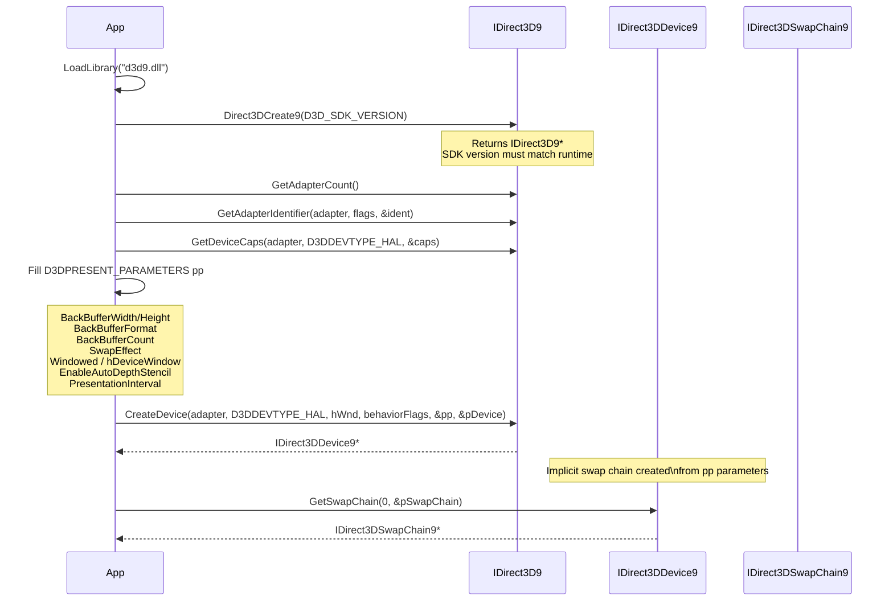
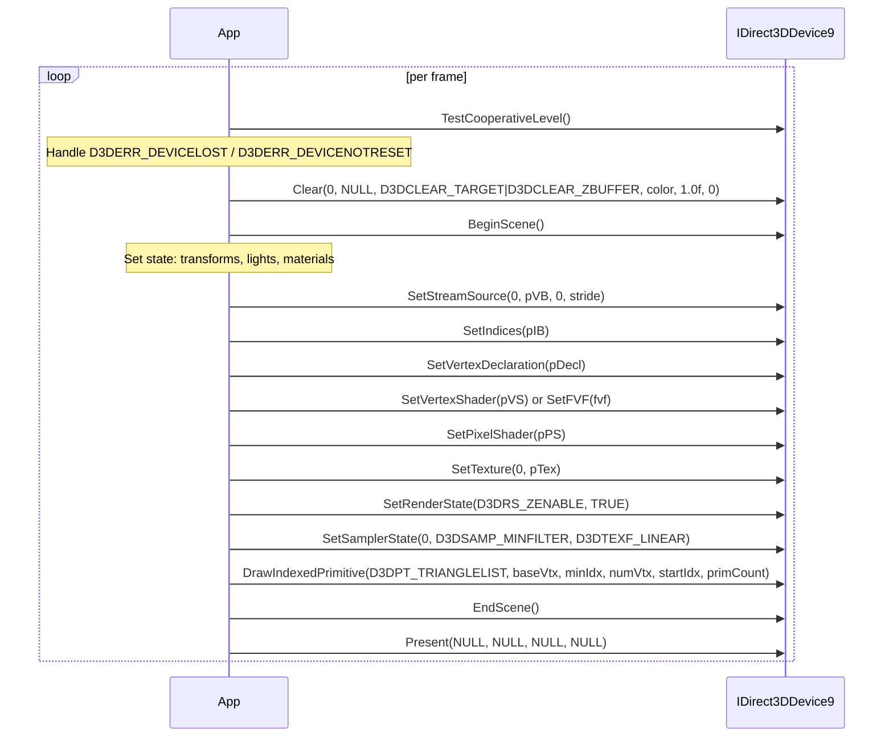
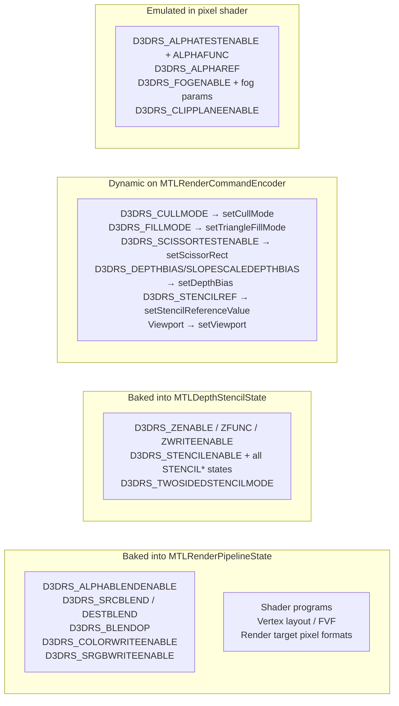
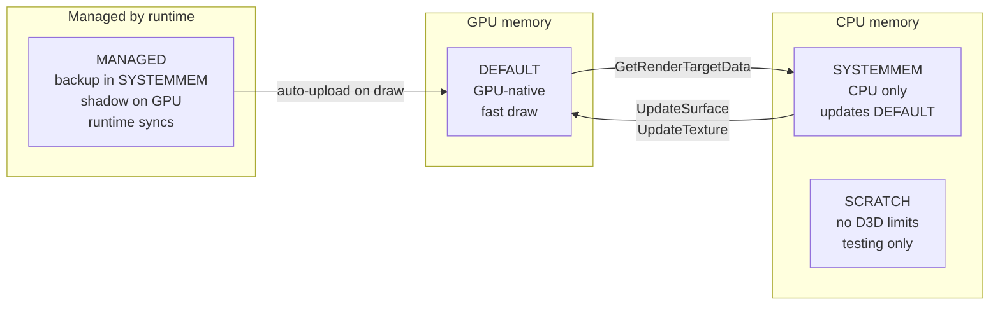

# Direct3D 9 API Research Notes

Sources: Microsoft Learn (MSDN), Windows Driver Kit (WDK), d3d9.h / d3d9types.h SDK headers,
Wine source (winehq.org), Mesa Gallium Nine.

---

## COM Interface Hierarchy

```mermaid
classDiagram
    class IUnknown {
        +QueryInterface()
        +AddRef()
        +Release()
    }
    class IDirect3D9 {
        +GetAdapterCount()
        +GetAdapterIdentifier()
        +EnumAdapterModes()
        +CheckDeviceFormat()
        +GetDeviceCaps()
        +CreateDevice()
    }
    class IDirect3D9Ex {
        +CheckDeviceState()
        +CreateDeviceEx()
    }
    class IDirect3DDevice9 {
        +BeginScene() / EndScene()
        +DrawPrimitive()
        +DrawIndexedPrimitive()
        +SetRenderState()
        +SetTexture()
        +SetTransform()
        +Present()
        +Reset()
    }
    class IDirect3DDevice9Ex {
        +ResetEx()
        +CheckResourceResidency()
        +GetDisplayModeEx()
    }
    class IDirect3DResource9 {
        +GetDevice()
        +GetType()
        +GetPriority() / SetPriority()
        +PreLoad()
    }
    class IDirect3DBaseTexture9 {
        +GetLevelCount()
        +SetLOD() / GetLOD()
        +SetAutoGenFilterType()
    }
    class IDirect3DTexture9 { +GetSurfaceLevel() }
    class IDirect3DCubeTexture9 { +GetCubeMapSurface() }
    class IDirect3DVolumeTexture9 { +GetVolumeLevel() }
    class IDirect3DSurface9 { +GetDesc() / LockRect() / UnlockRect() }
    class IDirect3DVertexBuffer9 { +Lock() / Unlock() / GetDesc() }
    class IDirect3DIndexBuffer9 { +Lock() / Unlock() / GetDesc() }
    class IDirect3DVolume9 { +GetDesc() / LockBox() / UnlockBox() }
    class IDirect3DSwapChain9 { +Present() / GetBackBuffer() / GetPresentStats() }
    class IDirect3DVertexDeclaration9 { +GetDeclaration() }
    class IDirect3DVertexShader9 { +GetFunction() }
    class IDirect3DPixelShader9 { +GetFunction() }
    class IDirect3DQuery9 { +Issue() / GetData() }
    class IDirect3DStateBlock9 { +Capture() / Apply() }

    IUnknown <|-- IDirect3D9
    IDirect3D9 <|-- IDirect3D9Ex
    IUnknown <|-- IDirect3DDevice9
    IDirect3DDevice9 <|-- IDirect3DDevice9Ex
    IUnknown <|-- IDirect3DResource9
    IDirect3DResource9 <|-- IDirect3DBaseTexture9
    IDirect3DBaseTexture9 <|-- IDirect3DTexture9
    IDirect3DBaseTexture9 <|-- IDirect3DCubeTexture9
    IDirect3DBaseTexture9 <|-- IDirect3DVolumeTexture9
    IDirect3DResource9 <|-- IDirect3DSurface9
    IDirect3DResource9 <|-- IDirect3DVertexBuffer9
    IDirect3DResource9 <|-- IDirect3DIndexBuffer9
    IUnknown <|-- IDirect3DVolume9
    IUnknown <|-- IDirect3DSwapChain9
    IUnknown <|-- IDirect3DVertexDeclaration9
    IUnknown <|-- IDirect3DVertexShader9
    IUnknown <|-- IDirect3DPixelShader9
    IUnknown <|-- IDirect3DQuery9
    IUnknown <|-- IDirect3DStateBlock9
```



**Note:** `IDirect3DVolume9` is NOT derived from `IDirect3DResource9`. This is a historical
quirk — volumes are not pooled the same way as other resources.

---

## Device Creation Flow



**Key `BehaviorFlags`:**
- `D3DCREATE_HARDWARE_VERTEXPROCESSING` — GPU vertex processing (required for shaders)
- `D3DCREATE_SOFTWARE_VERTEXPROCESSING` — CPU vertex processing (compatibility mode)
- `D3DCREATE_MULTITHREADED` — thread-safe device (enables internal locking)
- `D3DCREATE_FPU_PRESERVE` — do not alter FPU precision/rounding state
- `D3DCREATE_PUREDEVICE` — skip redundant state change filtering (fastest)

---

## Frame Render Loop



---

## Fixed-Function Pipeline States

### D3DRS_ Render States (Key Subset)

| State | Default | Type | Notes |
|---|---|---|---|
| D3DRS_ZENABLE | TRUE | BOOL | Depth buffer enable |
| D3DRS_FILLMODE | D3DFILL_SOLID | enum | Solid/Wireframe/Point |
| D3DRS_SHADEMODE | D3DSHADE_GOURAUD | enum | Gouraud/Flat/Phong |
| D3DRS_ZWRITEENABLE | TRUE | BOOL | Write to depth buffer |
| D3DRS_ALPHATESTENABLE | FALSE | BOOL | Alpha test (emulate in PS on Metal) |
| D3DRS_LASTPIXEL | TRUE | BOOL | Include last pixel in lines |
| D3DRS_SRCBLEND | D3DBLEND_ONE | enum | Source blend factor |
| D3DRS_DESTBLEND | D3DBLEND_ZERO | enum | Dest blend factor |
| D3DRS_CULLMODE | D3DCULL_CCW | enum | None/CW/CCW (Metal: flip for CW convention) |
| D3DRS_ZFUNC | D3DCMP_LESSEQUAL | enum | Depth compare function |
| D3DRS_ALPHAREF | 0 | DWORD | Reference value for alpha test |
| D3DRS_ALPHAFUNC | D3DCMP_ALWAYS | enum | Alpha compare function |
| D3DRS_DITHERENABLE | FALSE | BOOL | |
| D3DRS_ALPHABLENDENABLE | FALSE | BOOL | Enable blending |
| D3DRS_FOGENABLE | FALSE | BOOL | |
| D3DRS_SPECULARENABLE | FALSE | BOOL | Specular lighting |
| D3DRS_FOGCOLOR | 0 | D3DCOLOR | |
| D3DRS_FOGTABLEMODE | D3DFOG_NONE | enum | None/Linear/Exp/Exp2 |
| D3DRS_FOGSTART | 0.0f | float | Linear fog start |
| D3DRS_FOGEND | 1.0f | float | Linear fog end |
| D3DRS_FOGDENSITY | 1.0f | float | Exp/Exp2 density |
| D3DRS_RANGEFOGENABLE | FALSE | BOOL | Eye-distance vs depth fog |
| D3DRS_STENCILENABLE | FALSE | BOOL | |
| D3DRS_STENCILFAIL | D3DSTENCILOP_KEEP | enum | |
| D3DRS_STENCILZFAIL | D3DSTENCILOP_KEEP | enum | |
| D3DRS_STENCILPASS | D3DSTENCILOP_KEEP | enum | |
| D3DRS_STENCILFUNC | D3DCMP_ALWAYS | enum | |
| D3DRS_STENCILREF | 0 | int | |
| D3DRS_STENCILMASK | 0xFFFFFFFF | DWORD | |
| D3DRS_STENCILWRITEMASK | 0xFFFFFFFF | DWORD | |
| D3DRS_TEXTUREFACTOR | 0xFFFFFFFF | D3DCOLOR | D3DTA_TFACTOR source |
| D3DRS_WRAP0–7 | 0 | DWORD | Texture wrapping flags |
| D3DRS_CLIPPING | TRUE | BOOL | Guard-band clipping |
| D3DRS_LIGHTING | TRUE | BOOL | Fixed-function lighting |
| D3DRS_AMBIENT | 0 | D3DCOLOR | Global ambient light |
| D3DRS_NORMALIZENORMALS | FALSE | BOOL | Renormalize after transform |
| D3DRS_DIFFUSEMATERIALSOURCE | D3DMCS_COLOR1 | enum | Which vertex channel feeds diffuse |
| D3DRS_SPECULARMATERIALSOURCE | D3DMCS_COLOR2 | enum | |
| D3DRS_AMBIENTMATERIALSOURCE | D3DMCS_MATERIAL | enum | |
| D3DRS_EMISSIVEMATERIALSOURCE | D3DMCS_MATERIAL | enum | |
| D3DRS_VERTEXBLEND | D3DVBF_DISABLE | enum | Vertex blending |
| D3DRS_CLIPPLANEENABLE | 0 | DWORD | Bitfield: which clip planes active |
| D3DRS_POINTSIZE | 1.0f | float | |
| D3DRS_POINTSIZE_MIN | 1.0f | float | |
| D3DRS_POINTSPRITEENABLE | FALSE | BOOL | (must emulate on Metal) |
| D3DRS_POINTSCALEENABLE | FALSE | BOOL | |
| D3DRS_MULTISAMPLEANTIALIAS | TRUE | BOOL | |
| D3DRS_MULTISAMPLEMASK | 0xFFFFFFFF | DWORD | |
| D3DRS_COLORWRITEENABLE | 0xF | DWORD | Per-channel write mask |
| D3DRS_BLENDOP | D3DBLENDOP_ADD | enum | Add/Subtract/RevSubtract/Min/Max |
| D3DRS_SCISSORTESTENABLE | FALSE | BOOL | |
| D3DRS_SLOPESCALEDEPTHBIAS | 0.0f | float | |
| D3DRS_ANTIALIASEDLINEENABLE | FALSE | BOOL | |
| D3DRS_MINTESSELLATIONLEVEL | 1.0f | float | |
| D3DRS_MAXTESSELLATIONLEVEL | 1.0f | float | |
| D3DRS_ADAPTIVETESS_X/Y/Z/W | 0.0f/0.0f/1.0f/0.0f | float | |
| D3DRS_ENABLEADAPTIVETESSELLATION | FALSE | BOOL | |
| D3DRS_TWOSIDEDSTENCILMODE | FALSE | BOOL | |
| D3DRS_CCW_STENCILFAIL/ZFAIL/PASS | KEEP | enum | Back-face stencil |
| D3DRS_CCW_STENCILFUNC | D3DCMP_ALWAYS | enum | |
| D3DRS_COLORWRITEENABLE1–3 | 0xF | DWORD | MRT write masks |
| D3DRS_BLENDFACTOR | 0xFFFFFFFF | D3DCOLOR | D3DBLEND_BLENDFACTOR |
| D3DRS_SRGBWRITEENABLE | 0 | BOOL | Gamma-correct render target write |
| D3DRS_DEPTHBIAS | 0.0f | float | Constant depth offset |
| D3DRS_SEPARATEALPHABLENDENABLE | FALSE | BOOL | Independent color/alpha blend |
| D3DRS_SRCBLENDALPHA | D3DBLEND_ONE | enum | Alpha-only source blend |
| D3DRS_DESTBLENDALPHA | D3DBLEND_ZERO | enum | Alpha-only dest blend |
| D3DRS_BLENDOPALPHA | D3DBLENDOP_ADD | enum | Alpha blend operation |

**Metal mapping for key render states:**



### D3DTSS_ Texture Stage States

| State | Values | Notes |
|---|---|---|
| D3DTSS_COLOROP | D3DTOP_* | Color combine operation |
| D3DTSS_COLORARG1 | D3DTA_* | Arg1 for color op |
| D3DTSS_COLORARG2 | D3DTA_* | Arg2 for color op |
| D3DTSS_ALPHAOP | D3DTOP_* | Alpha combine operation |
| D3DTSS_ALPHAARG1 | D3DTA_* | Arg1 for alpha op |
| D3DTSS_ALPHAARG2 | D3DTA_* | Arg2 for alpha op |
| D3DTSS_BUMPENVMAT00–11 | float | 2×2 bump matrix |
| D3DTSS_TEXCOORDINDEX | 0–7 + D3DTSS_TCI_* | Coordinate source + generation mode |
| D3DTSS_BUMPENVLSCALE | float | Luminance scale for BUMPENVMAPLUMINANCE |
| D3DTSS_BUMPENVLOFFSET | float | Luminance offset |
| D3DTSS_TEXTURETRANSFORMFLAGS | D3DTTFF_* | Count2/3/4 + PROJECTED |
| D3DTSS_COLORARG0 | D3DTA_* | 3rd arg for MULTIPLYADD/LERP |
| D3DTSS_ALPHAARG0 | D3DTA_* | 3rd arg for MULTIPLYADD/LERP |
| D3DTSS_RESULTARG | D3DTA_CURRENT/TEMP | Where to write stage result |
| D3DTSS_CONSTANT | D3DCOLOR | Per-stage constant (D3DTA_CONSTANT) |

**D3DTSS_TEXCOORDINDEX generation modes:**
- `D3DTSS_TCI_PASSTHRU` — use vertex texture coords as-is
- `D3DTSS_TCI_CAMERASPACENORMAL` — generate from normal in camera space
- `D3DTSS_TCI_CAMERASPACEPOSITION` — generate from position in camera space
- `D3DTSS_TCI_CAMERASPACEREFLECTIONVECTOR` — sphere map (reflect normal by eye vector)
- `D3DTSS_TCI_SPHEREMAP` — explicit sphere map calculation

### D3DSAMP_ Sampler States

| State | Default | Notes |
|---|---|---|
| D3DSAMP_ADDRESSU | D3DTADDRESS_WRAP | Horizontal address mode |
| D3DSAMP_ADDRESSV | D3DTADDRESS_WRAP | Vertical address mode |
| D3DSAMP_ADDRESSW | D3DTADDRESS_WRAP | Depth (volume) address mode |
| D3DSAMP_BORDERCOLOR | 0x00000000 | Border color for BORDER address |
| D3DSAMP_MAGFILTER | D3DTEXF_POINT | Magnification filter |
| D3DSAMP_MINFILTER | D3DTEXF_POINT | Minification filter |
| D3DSAMP_MIPFILTER | D3DTEXF_NONE | Mip filter (NONE/POINT/LINEAR/ANISOTROPIC) |
| D3DSAMP_MIPMAPLODBIAS | 0.0f | LOD bias |
| D3DSAMP_MAXMIPLEVEL | 0 | Clamp most detailed mip |
| D3DSAMP_MAXANISOTROPY | 1 | Anisotropy level |
| D3DSAMP_SRGBTEXTURE | 0 | Linear-to-sRGB decode on sample |
| D3DSAMP_ELEMENTINDEX | 0 | Which element of multi-element texture |
| D3DSAMP_DMAP | 0 | Displacement map stage index |

---

## Vertex Format

### FVF Flags

| FVF Flag | Value | Component | Notes |
|---|---|---|---|
| D3DFVF_XYZ | 0x002 | float3 position | Standard 3D position |
| D3DFVF_XYZRHW | 0x004 | float4 pos+rhw | Pre-transformed (screen-space) |
| D3DFVF_XYZB1–5 | 0x006–0x017 | float3+1–5 weights | Vertex blending weights |
| D3DFVF_XYZW | 0x4002 | float4 position | With W for clip |
| D3DFVF_NORMAL | 0x010 | float3 normal | Must follow position |
| D3DFVF_PSIZE | 0x020 | float point size | |
| D3DFVF_DIFFUSE | 0x040 | D3DCOLOR | BGRA packed 32-bit |
| D3DFVF_SPECULAR | 0x080 | D3DCOLOR | BGRA packed 32-bit |
| D3DFVF_TEX1–8 | 0x100–0x800 | float2/3/4 | Texture coordinates |
| D3DFVF_TEXCOORDSIZE2(n) | `n<<16` | float2 | Default: 2 components |
| D3DFVF_TEXCOORDSIZE3(n) | `(n<<16)\|0x01` | float3 | |
| D3DFVF_TEXCOORDSIZE4(n) | `(n<<16)\|0x02` | float4 | |
| D3DFVF_TEXCOORDSIZE1(n) | `(n<<16)\|0x03` | float1 | |

**Memory layout (in order):** Position → RHW → Blend weights → Normal → Point size →
Diffuse → Specular → TexCoord0 → TexCoord1 → …

### D3DVERTEXELEMENT9

```c
typedef struct D3DVERTEXELEMENT9 {
    WORD  Stream;     // Stream index (0–15)
    WORD  Offset;     // Byte offset in stream
    BYTE  Type;       // D3DDECLTYPE_*
    BYTE  Method;     // D3DDECLMETHOD_DEFAULT (always)
    BYTE  Usage;      // D3DDECLUSAGE_*
    BYTE  UsageIndex; // e.g., TEXCOORD0, TEXCOORD1
} D3DVERTEXELEMENT9;
// Terminated by D3DDECL_END() = {0xFF, 0, D3DDECLTYPE_UNUSED, 0, 0, 0}
```

**D3DDECLTYPE values (key subset):**

| Type | Value | Description |
|---|---|---|
| D3DDECLTYPE_FLOAT1 | 0 | float |
| D3DDECLTYPE_FLOAT2 | 1 | float2 |
| D3DDECLTYPE_FLOAT3 | 2 | float3 |
| D3DDECLTYPE_FLOAT4 | 3 | float4 |
| D3DDECLTYPE_D3DCOLOR | 4 | BGRA packed DWORD (→ float4 normalized [0,1]) |
| D3DDECLTYPE_UBYTE4 | 5 | 4 unsigned bytes |
| D3DDECLTYPE_SHORT2 | 6 | 2 signed shorts |
| D3DDECLTYPE_SHORT4 | 7 | 4 signed shorts |
| D3DDECLTYPE_UBYTE4N | 8 | 4 unsigned bytes normalized |
| D3DDECLTYPE_SHORT2N | 9 | 2 signed shorts normalized |
| D3DDECLTYPE_SHORT4N | 10 | 4 signed shorts normalized |
| D3DDECLTYPE_USHORT2N | 11 | 2 unsigned shorts normalized |
| D3DDECLTYPE_USHORT4N | 12 | 4 unsigned shorts normalized |
| D3DDECLTYPE_UDEC3 | 13 | 3 packed 10-bit unsigned |
| D3DDECLTYPE_DEC3N | 14 | 3 packed 10-bit signed normalized |
| D3DDECLTYPE_FLOAT16_2 | 15 | 2 half-floats |
| D3DDECLTYPE_FLOAT16_4 | 16 | 4 half-floats |

**D3DDECLUSAGE values:**

| Usage | Value | Semantic |
|---|---|---|
| D3DDECLUSAGE_POSITION | 0 | Vertex position (POSITION0) |
| D3DDECLUSAGE_BLENDWEIGHT | 1 | Blending weights |
| D3DDECLUSAGE_BLENDINDICES | 2 | Blending indices |
| D3DDECLUSAGE_NORMAL | 3 | Normal vector |
| D3DDECLUSAGE_PSIZE | 4 | Point size |
| D3DDECLUSAGE_TEXCOORD | 5 | Texture coordinate |
| D3DDECLUSAGE_TANGENT | 6 | Tangent vector |
| D3DDECLUSAGE_BINORMAL | 7 | Binormal vector |
| D3DDECLUSAGE_TESSFACTOR | 8 | Tessellation factor |
| D3DDECLUSAGE_POSITIONT | 9 | Pre-transformed position |
| D3DDECLUSAGE_COLOR | 10 | Color (diffuse/specular) |
| D3DDECLUSAGE_FOG | 11 | Fog value |
| D3DDECLUSAGE_DEPTH | 12 | Depth value |
| D3DDECLUSAGE_SAMPLE | 13 | Sampler register index |

---

## Resource Types

### D3DPOOL

| Pool | Value | CPU Read | CPU Write | GPU Access | Device Lost |
|---|---|---|---|---|---|
| D3DPOOL_DEFAULT | 0 | No (need GetRenderTargetData) | No (need UpdateSurface) | Fast GPU native | **Destroyed** |
| D3DPOOL_MANAGED | 1 | Yes | Yes | Copied to GPU on use | Preserved |
| D3DPOOL_SYSTEMMEM | 2 | Yes | Yes | No direct GPU access | Preserved |
| D3DPOOL_SCRATCH | 3 | Yes | Yes | Never (caps check off) | Preserved |



### D3DUSAGE Flags

| Flag | Value | Usage |
|---|---|---|
| D3DUSAGE_RENDERTARGET | 0x0001 | Can bind as render target |
| D3DUSAGE_DEPTHSTENCIL | 0x0002 | Can bind as depth/stencil |
| D3DUSAGE_DYNAMIC | 0x0200 | CPU writes every frame (use Lock DISCARD) |
| D3DUSAGE_AUTOGENMIPMAP | 0x0400 | Runtime generates mipmaps |
| D3DUSAGE_DMAP | 0x4000 | Displacement map |
| D3DUSAGE_WRITEONLY | 0x0008 | VB/IB: no CPU reads (driver can put in VRAM) |
| D3DUSAGE_SOFTWAREPROCESSING | 0x0010 | Use software vertex processing |
| D3DUSAGE_DONOTCLIP | 0x0020 | Do not clip vertices |
| D3DUSAGE_POINTS | 0x0040 | VB: used for point primitives |
| D3DUSAGE_RTPATCHES | 0x0080 | RT patches |
| D3DUSAGE_NPATCHES | 0x0100 | N-patches |
| D3DUSAGE_TEXTAPI | 0x10000000 | D3D9Ex: text rendering |

---

## Presentation

### D3DPRESENT_PARAMETERS

```c
typedef struct D3DPRESENT_PARAMETERS {
    UINT            BackBufferWidth;           // 0 = use window size
    UINT            BackBufferHeight;
    D3DFORMAT       BackBufferFormat;          // D3DFMT_A8R8G8B8 most common
    UINT            BackBufferCount;           // 1–3 back buffers
    D3DMULTISAMPLE_TYPE MultiSampleType;       // NONE, 2X, 4X, etc.
    DWORD           MultiSampleQuality;
    D3DSWAPEFFECT   SwapEffect;                // DISCARD / FLIP / COPY
    HWND            hDeviceWindow;
    BOOL            Windowed;
    BOOL            EnableAutoDepthStencil;
    D3DFORMAT       AutoDepthStencilFormat;    // D3DFMT_D24S8 typical
    DWORD           Flags;                     // D3DPRESENTFLAG_*
    UINT            FullScreen_RefreshRateInHz; // 0 for windowed
    UINT            PresentationInterval;      // D3DPRESENT_INTERVAL_*
} D3DPRESENT_PARAMETERS;
```

**SwapEffect values:**
- `D3DSWAPEFFECT_DISCARD` — most common; driver may discard back buffer contents
- `D3DSWAPEFFECT_FLIP` — contents rotated between back buffers
- `D3DSWAPEFFECT_COPY` — back buffer contents preserved after Present

**PresentationInterval values:**
- `D3DPRESENT_INTERVAL_IMMEDIATE` — no vsync (0)
- `D3DPRESENT_INTERVAL_ONE` — vsync 1x (1)
- `D3DPRESENT_INTERVAL_TWO/THREE/FOUR` — vsync 2x/3x/4x

### Maps to Metal Presentation

| D3D9 concept | Metal equivalent |
|---|---|
| `D3DPRESENT_PARAMETERS.hDeviceWindow` | `CAMetalLayer` attached to window's layer |
| `D3DSWAPEFFECT_DISCARD` | `MTLLoadActionDontCare` on next render pass |
| `PresentationInterval = ONE` | `CAMetalLayer.displaySyncEnabled = YES` |
| `PresentationInterval = IMMEDIATE` | `CAMetalLayer.displaySyncEnabled = NO` |
| `Present()` | `[commandBuffer presentDrawable: nextDrawable]` + commit |
| Back buffer | `CAMetalLayer.nextDrawable.texture` |
| Depth/stencil | Separate `MTLTexture` with `Depth24Unorm_Stencil8` format |

---

## Primitive Types

| D3DPRIMITIVETYPE | Metal equivalent | Notes |
|---|---|---|
| D3DPT_POINTLIST | MTLPrimitiveTypePoint | Point sprites need special handling |
| D3DPT_LINELIST | MTLPrimitiveTypeLine | |
| D3DPT_LINESTRIP | MTLPrimitiveTypeLineStrip | |
| D3DPT_TRIANGLELIST | MTLPrimitiveTypeTriangle | Most common |
| D3DPT_TRIANGLESTRIP | MTLPrimitiveTypeTriangleStrip | |
| D3DPT_TRIANGLEFAN | — | **No Metal equivalent** — must decompose to TRIANGLELIST |

`D3DPT_TRIANGLEFAN` requires index buffer conversion at draw time.

---

## Transform State Registers

```
D3DTS_WORLD          (world matrix 0)
D3DTS_WORLD1–3       (world matrices 1–3 for vertex blending)
D3DTS_VIEW           (view matrix)
D3DTS_PROJECTION     (projection matrix)
D3DTS_TEXTURE0–7     (per-stage texture transforms)
```

All transforms are D3DMATRIX (4×4 row-major float). In Metal shaders these become
uniform buffer constants. The combined WorldView matrix is needed for lighting in
camera space; WorldViewProjection for vertex transform.

---

## Query Types

| D3DQUERYTYPE | Metal equivalent | Notes |
|---|---|---|
| D3DQUERYTYPE_OCCLUSION | MTLVisibilityResultModeBoolean | Sample count of passing fragments |
| D3DQUERYTYPE_TIMESTAMP | MTLCounterSampleBufferTimestamp | GPU timestamp |
| D3DQUERYTYPE_TIMESTAMPDISJOINT | (no direct Metal eq.) | Check if timestamps are reliable |
| D3DQUERYTYPE_TIMESTAMPFREQ | `MTLDevice.sampleTimestamps` | Nanosecond frequency |
| D3DQUERYTYPE_EVENT | `MTLCommandBuffer.addCompletedHandler` | GPU done signal |
| D3DQUERYTYPE_VERTEXSTATS | MTLCounters (indirect) | VS invocation count |

---

## Key Implementation Notes

1. **`TestCooperativeLevel()`** — D3D9 apps call this every frame when device can be lost
   (fullscreen mode switches, GPU reset). For Wine/Metal, implement as always returning
   `D3D_OK` unless a full device reset is in progress.

2. **`IDirect3DStateBlock9`** — captures and restores device state. Requires maintaining
   a complete copy of all render states, texture stage states, sampler states, transforms,
   shaders, and bindings. Use a `D3D9DeviceState` snapshot struct.

3. **`DrawPrimitiveUP`/`DrawIndexedPrimitiveUP`** — user-pointer draw calls (no VB/IB
   objects). Must copy data into a temporary ring buffer for GPU access.

4. **`Lock(DISCARD)`** — tells the driver the previous contents are abandoned; return a
   fresh allocation. Maps to buffer renaming in the Metal core.

5. **`Lock(NOOVERWRITE)`** — tells the driver the application won't overwrite in-use
   data; safe to access GPU region asynchronously. Can skip rename and return same buffer.

6. **`StretchRect`** — blit between surfaces with scaling and filtering. Maps to
   `MTLBlitCommandEncoder.copyFromTexture:...toTexture:` (no scaling) or a fullscreen
   blit pass with a sampler (with scaling).

---

## Sources

- Microsoft D3D9 reference: https://learn.microsoft.com/en-us/windows/win32/direct3d9/dx9-graphics-reference
- d3d9types.h WDK: https://learn.microsoft.com/en-us/windows-hardware/drivers/ddi/d3d9types/
- D3D9 render states: https://learn.microsoft.com/en-us/windows/win32/direct3d9/d3drenderstatetype
- D3D9 texture stage states: https://learn.microsoft.com/en-us/windows/win32/direct3d9/d3dtexturestagestatetype
- Wine D3D9 source: https://source.winehq.org/source/dlls/d3d9/
- Mesa Gallium Nine: https://github.com/evelikov/Mesa/tree/master/src/gallium/state_trackers/nine
