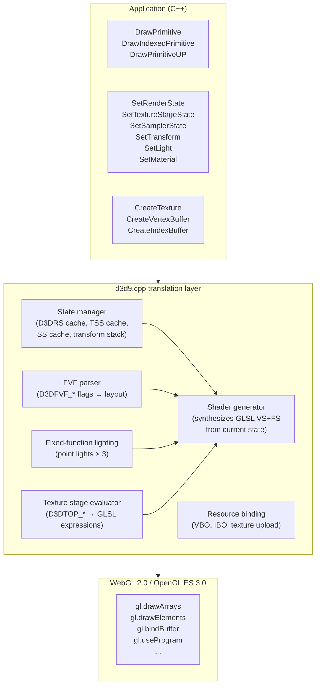
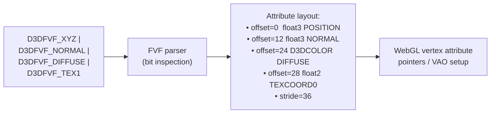

# d3d9-webgl Research Notes

Sources: github.com/LostMyCode/d3d9-webgl (source inspection).

---

## Overview

d3d9-webgl is a Direct3D 9 fixed-function pipeline implementation that targets
WebGL 2.0 through Emscripten and WebAssembly. It is a compatibility wrapper for
running legacy D3D9 applications in the browser without rewriting their rendering code.

Unlike a full D3D9 implementation, this project deliberately focuses on the
**fixed-function path** and exposes a compact integration model: D3D9 headers plus
a single translation unit (`d3d9.cpp`). No programmable shader support.

---

## Repository Shape

```
d3d9-webgl/
├── d3d9.h              D3D9 COM interfaces and types (IDirect3D9, IDirect3DDevice9, etc.)
├── d3dx9math.h         Math helpers (D3DXMATRIX, D3DXVECTOR, etc.)
├── d3dx9.h             Minimal D3DX9 stubs
├── windows_compat.h    Non-Windows compatibility shims (HRESULT, HWND, etc.)
├── d3d9.cpp            THE translation layer — all logic in one ~3000 line file
├── examples/           Demo applications
└── screenshots/        Visual regression reference
```

The single-file design is intentional: copy four headers and `d3d9.cpp` into a
project, link against Emscripten, and legacy D3D9 fixed-function apps compile.

---

## Implementation Architecture



---

## Fixed-Function Translation Approach

The key design: **generate GLSL shaders at draw time** from the accumulated D3D9
state. Every `DrawPrimitive`/`DrawIndexedPrimitive` call triggers a shader generation
pass if the relevant state has changed since the last draw.

### Shader Generation Key

The shader key captures all state that affects generated shader behavior:

```
ShaderKey {
    fvf                      // FVF flags → vertex input layout
    lighting_enabled         // D3DRS_LIGHTING
    num_lights               // how many SetLight() calls with LightEnable
    light_types[3]           // D3DLIGHT_POINT only (limitation)
    specular_enabled         // D3DRS_SPECULARENABLE
    fog_mode                 // D3DFOG_NONE/LINEAR/EXP/EXP2
    num_texture_stages       // how many active stages
    tex_stage_ops[8]         // D3DTSS_COLOROP per stage
    tex_stage_args[8][2]     // D3DTA_* per stage
    clip_planes_enabled      // D3DRS_CLIPPLANEENABLE bitmask
}
```

When the key changes between draw calls, a new GLSL program is compiled and linked
via WebGL's shader pipeline. Programs are cached by key hash to avoid redundant
compilation.

### Generated Vertex Shader Structure

```glsl
// Auto-generated from FVF + state key:
attribute vec3 a_pos;           // D3DFVF_XYZ
attribute vec3 a_normal;        // D3DFVF_NORMAL (if lighting)
attribute vec4 a_color;         // D3DFVF_DIFFUSE (BGRA → RGBA swizzle)
attribute vec2 a_texcoord0;     // D3DFVF_TEX1

uniform mat4 u_worldview;       // D3DTS_WORLD × D3DTS_VIEW
uniform mat4 u_projection;      // D3DTS_PROJECTION
uniform mat3 u_normalmat;       // inverse transpose of upper 3×3 of worldview

void main() {
    vec4 pos_vs = u_worldview * vec4(a_pos, 1.0);

    // Lighting (if D3DRS_LIGHTING):
    vec3 normal_vs = normalize(u_normalmat * a_normal);
    vec4 lit_color = compute_lighting(pos_vs.xyz, normal_vs, a_color);

    gl_Position = u_projection * pos_vs;
    v_color = lit_color;
    v_texcoord0 = a_texcoord0;
}
```

### Generated Fragment Shader Structure

```glsl
// Auto-generated from texture stage ops:
uniform sampler2D u_tex0;

void main() {
    vec4 current = v_color;    // stage 0 starts with diffuse

    // Stage 0:
    vec4 tex0 = texture(u_tex0, v_texcoord0);
    current.rgb = tex0.rgb * current.rgb;  // D3DTOP_MODULATE
    current.a   = tex0.a * current.a;

    // Alpha test (if D3DRS_ALPHATESTENABLE):
    if (current.a < u_alpharef) discard;

    // Fog (if D3DRS_FOGENABLE):
    float fogFactor = clamp((u_fogend - v_fogdist) / (u_fogend - u_fogstart), 0.0, 1.0);
    current.rgb = mix(u_fogcolor.rgb, current.rgb, fogFactor);

    gl_FragColor = current;
}
```

---

## FVF Parsing

d3d9-webgl parses FVF flags at `SetFVF()` time to build an attribute layout table:



**BGRA color handling:** D3D9's `D3DFVF_DIFFUSE` is a packed 32-bit `D3DCOLOR` in
BGRA byte order. WebGL expects RGBA. d3d9-webgl swizzles `.bgra` in the vertex
shader: `a_color.bgra` → `vec4(r, g, b, a)`.

---

## State Caching Strategy

D3D9 apps call `SetRenderState`/`SetTextureStageState` frequently. d3d9-webgl
maintains shadow copies of all state and only issues WebGL calls when the value
actually changes:

```cpp
// Typical state-cache pattern in d3d9.cpp:
void SetRenderState(D3DRENDERSTATETYPE state, DWORD value) {
    if (renderState[state] == value) return;  // no-op if unchanged
    renderState[state] = value;
    applyRenderState(state, value);  // immediately or deferred
}
```

For states that affect shader generation (lighting, texture ops, fog), changes
set a `shaderDirty` flag rather than immediately recompiling.

---

## Texture Format Handling

| D3D9 format | WebGL equivalent | Notes |
|---|---|---|
| D3DFMT_A8R8G8B8 | RGBA8 (BGRA swizzle) | Must swizzle B↔R on upload |
| D3DFMT_X8R8G8B8 | RGBA8 (force A=1) | |
| D3DFMT_R5G6B5 | RGB565 | |
| D3DFMT_A1R5G5B5 | RGBA5551 | |
| D3DFMT_A4R4G4B4 | RGBA4 | |
| D3DFMT_DXT1 | COMPRESSED_RGBA_S3TC_DXT1_EXT | Requires WEBGL_compressed_texture_s3tc |
| D3DFMT_DXT3 | COMPRESSED_RGBA_S3TC_DXT3_EXT | |
| D3DFMT_DXT5 | COMPRESSED_RGBA_S3TC_DXT5_EXT | |
| D3DFMT_D24S8 | DEPTH24_STENCIL8 | WebGL 2.0 renderbuffer |
| D3DFMT_D16 | DEPTH_COMPONENT16 | |

**BGRA upload:** Direct3D textures are stored BGRA. WebGL 2.0 supports
`UNPACK_COLORSPACE_CONVERSION_WEBGL` and `texImage2D` with BGRA internal format
on some implementations, but the portable path is manual B↔R swap on the CPU.

---

## Render-to-Texture and Y-Flip

D3D9 and Metal share the same top-left texture coordinate origin. WebGL (OpenGL)
uses bottom-left origin. d3d9-webgl inserts an explicit Y-flip when presenting
render target textures to screen:

```glsl
// When blitting a render target texture to the default framebuffer:
v_texcoord.y = 1.0 - v_texcoord.y;  // flip Y for OpenGL's bottom-left origin
```

**This is NOT needed for dxmt9 (Metal)** — Metal shares D3D9's top-left convention.
No Y-flip is required when sampling from render target textures.

---

## Clip Plane Emulation

D3D9's `SetClipPlane()` / `D3DRS_CLIPPLANEENABLE` activates up to 6 user clip
planes. WebGL 2.0 / GLSL ES 3.0 does not guarantee `gl_ClipDistance` support.
d3d9-webgl emulates clip planes via fragment shader discard:

```glsl
// Generated in fragment shader for each enabled clip plane:
uniform vec4 u_clipplane0;
// ...
float clipDist0 = dot(v_worldpos, u_clipplane0);
if (clipDist0 < 0.0) discard;
```

Metal supports clip distances via `[[clip_distance]]` in the vertex function, so
dxmt9 can use hardware clip planes properly without the discard overhead.

---

## GL Interop Hooks

d3d9-webgl exposes hooks for hybrid rendering scenarios where the application uses
both D3D9 and raw WebGL/OpenGL calls:

```cpp
// Called before D3D9 draws, to restore D3D9 state after external GL usage:
void BeginScene() {
    restoreD3D9GLState();
}
// Called to allow external GL renders between D3D9 frames:
void registerExternalRenderCallback(void (*fn)(void));
```

This is less relevant for dxmt9 (Metal has no external render interop in the same
sense), but the pattern of explicit state restoration is useful for any translator.

---

## Limitations (Design Choices)

| Limitation | Reason | dxmt9 approach |
|---|---|---|
| Fixed-function only | Browser/Wasm simplicity | Must support programmable shaders (SM 1–3) |
| Max 3 point lights | WebGL uniform limit concern | Support all 8 D3D9 lights |
| No multi-stream VB | Simplicity | Support up to 16 streams via Metal vertex descriptor |
| No GPU readback | Sync overhead in browser | Async readback via staging buffers |
| No D3D9Ex | Browser has no cooperative level | Implement D3D9Ex for Wine compatibility |

---

## Relevance for dxmt9

d3d9-webgl demonstrates a complete D3D9 translation layer at a scale that can be
fully understood. Key patterns to carry forward:

1. **State shadow + dirty flags** — track all D3D9 state, avoid redundant GPU calls
2. **Shader generation from state key** — same pattern for fixed-function emulation
3. **FVF parsing** — same approach for translating FVF to vertex descriptor
4. **Texture format table** — same concept, different target formats (Metal vs WebGL)
5. **Alpha test in shader** — same discard approach (no hardware alpha test in Metal)
6. **Clip plane emulation** — use Metal's native `[[clip_distance]]` instead of discard

The main difference for dxmt9: d3d9-webgl only handles fixed-function state, while
dxmt9 must also translate D3D9 bytecode shaders (SM 1.x through 3.0) — a
significantly larger scope. See `shader-translation.md` for that pipeline.

---

## Sources

- Official repository: https://github.com/LostMyCode/d3d9-webgl
