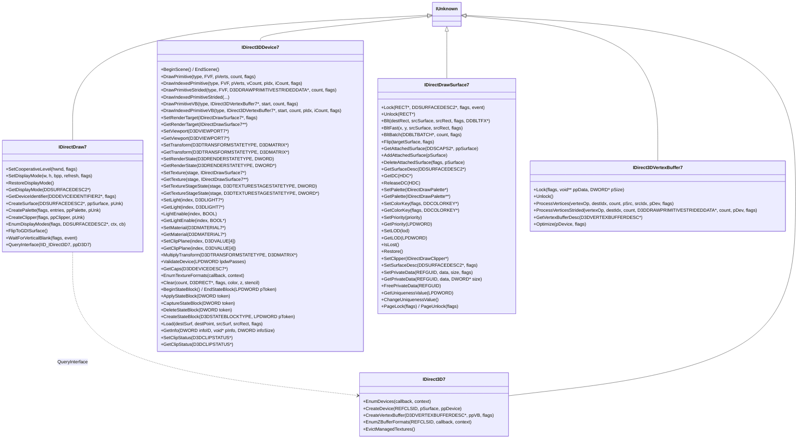
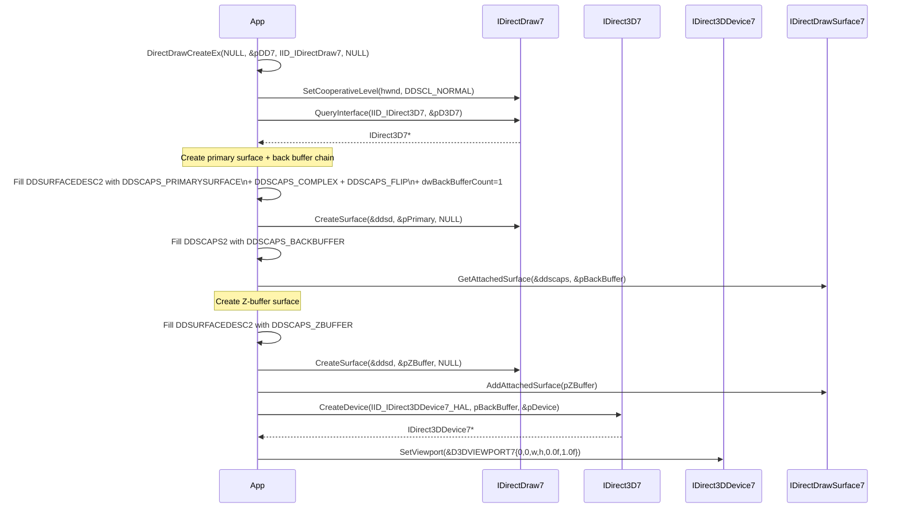
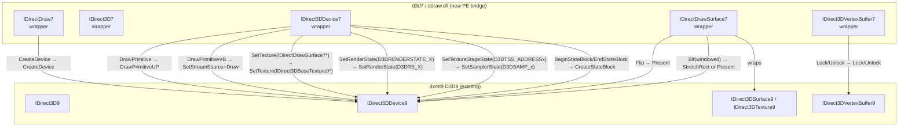

# DirectX 7 / DirectDraw 7 API Research Notes

Sources: Windows SDK headers (`ddraw.h`, `d3d.h`, `d3dtypes.h`, `d3dcaps.h`),
Microsoft Platform SDK docs (archived), Wine source (`dlls/ddraw/`),
DXVK-native (`src/d3d9/` — handles D3D7 compat), WineHQ bug tracker notes.

---

## Overview

DirectX 7 ships as `ddraw.dll`. Unlike D3D8+, the 3D API (`IDirect3D7`,
`IDirect3DDevice7`) is embedded inside DirectDraw — you get a 3D device by
QueryInterface-ing the `IDirectDraw7` factory. The 2D surface model
(`IDirectDrawSurface7`) doubles as the texture and render-target type for the 3D
device.

**Key facts:**
- Fixed-function pipeline only (no programmable vertex or pixel shaders)
- Hardware T&L introduced via `D3DCREATE_HARDWARE_VERTEXPROCESSING`
- Up to 8 texture stages (same as D3D9 FFP)
- Vertex blending up to 3 weights (same as D3D9)
- Surfaces (`IDirectDrawSurface7`) are the render target and texture handle
- `D3DPOOL_MANAGED` texture management lives in the driver (no explicit pool flags
  on surface create — instead `DDSCAPS2_TEXTUREMANAGE` cap)

---

## Entry Points in `ddraw.dll`

```c
// Primary creation functions:
HRESULT WINAPI DirectDrawCreate(GUID* lpGUID, IDirectDraw** lplpDD, IUnknown* pUnk);
HRESULT WINAPI DirectDrawCreateEx(GUID* lpGUID, LPVOID* lplpDD, REFIID iid, IUnknown* pUnk);
// iid = IID_IDirectDraw7 → returns IDirectDraw7*

HRESULT WINAPI DirectDrawEnumerate(LPDDENUMCALLBACK callback, LPVOID context);
HRESULT WINAPI DirectDrawEnumerateEx(LPDDENUMCALLBACKEX callback, LPVOID context, DWORD flags);
```

---

## COM Interface Hierarchy



---

## Device Creation Flow



---

## Key Data Structures

### DDSURFACEDESC2

```c
typedef struct _DDSURFACEDESC2 {
    DWORD          dwSize;            // sizeof(DDSURFACEDESC2)
    DWORD          dwFlags;           // DDSD_* flags
    DWORD          dwHeight;
    DWORD          dwWidth;
    union {
        LONG       lPitch;            // DDSD_PITCH
        DWORD      dwLinearSize;      // DDSD_LINEARSIZE
    };
    union {
        DWORD      dwBackBufferCount; // DDSD_BACKBUFFERCOUNT
        DWORD      dwDepth;           // DDSD_DEPTH (volume surfaces)
    };
    union {
        DWORD      dwMipMapCount;     // DDSD_MIPMAPCOUNT
        DWORD      dwRefreshRate;     // DDSD_REFRESHRATE
        DWORD      dwSrcVBHandle;
    };
    DWORD          dwAlphaBitDepth;
    DWORD          dwReserved;
    LPVOID         lpSurface;         // locked data pointer
    union {
        DDCOLORKEY ddckCKDestOverlay;
        DWORD      dwEmptyFaceColor;
    };
    DDCOLORKEY     ddckCKDestBlt;
    DDCOLORKEY     ddckCKSrcOverlay;
    DDCOLORKEY     ddckCKSrcBlt;
    union {
        DDPIXELFORMAT ddpfPixelFormat; // DDSD_PIXELFORMAT
        DWORD          dwFVF;          // for vertex buffers
    };
    DDSCAPS2       ddsCaps;
    DWORD          dwTextureStage;     // D3D7 texture stage index hint
} DDSURFACEDESC2;
```

**DDSD_* flags (which fields are valid):**

| Flag | Value | Field |
|---|---|---|
| DDSD_CAPS | 0x00000001 | ddsCaps |
| DDSD_HEIGHT | 0x00000002 | dwHeight |
| DDSD_WIDTH | 0x00000004 | dwWidth |
| DDSD_PITCH | 0x00000008 | lPitch |
| DDSD_BACKBUFFERCOUNT | 0x00000020 | dwBackBufferCount |
| DDSD_ZBUFFERBITDEPTH | 0x00000040 | dwZBufferBitDepth (legacy) |
| DDSD_ALPHABITDEPTH | 0x00000080 | dwAlphaBitDepth |
| DDSD_PIXELFORMAT | 0x00001000 | ddpfPixelFormat |
| DDSD_CKDESTOVERLAY | 0x00002000 | ddckCKDestOverlay |
| DDSD_CKDESTSRC | 0x00004000 | ddckCKSrcBlt |
| DDSD_CKSRCOVERLAY | 0x00008000 | ddckCKSrcOverlay |
| DDSD_CKSRCBLT | 0x00010000 | ddckCKSrcBlt |
| DDSD_MIPMAPCOUNT | 0x00020000 | dwMipMapCount |
| DDSD_REFRESHRATE | 0x00040000 | dwRefreshRate |
| DDSD_LINEARSIZE | 0x00080000 | dwLinearSize |
| DDSD_TEXTURESTAGE | 0x00100000 | dwTextureStage |
| DDSD_FVF | 0x00200000 | dwFVF |
| DDSD_DEPTH | 0x00800000 | dwDepth |

### DDSCAPS2

```c
typedef struct _DDSCAPS2 {
    DWORD dwCaps;   // DDSCAPS_*
    DWORD dwCaps2;  // DDSCAPS2_*
    DWORD dwCaps3;
    union {
        DWORD dwCaps4;
        DWORD dwVolumeDepth;
    };
} DDSCAPS2;
```

**Key DDSCAPS_* values:**

| Cap | Meaning |
|---|---|
| DDSCAPS_PRIMARYSURFACE | Front buffer / screen |
| DDSCAPS_BACKBUFFER | Back buffer in flip chain |
| DDSCAPS_FLIP | Surface in a flip chain |
| DDSCAPS_COMPLEX | Multi-surface chain (flip, mips) |
| DDSCAPS_TEXTURE | Used as a 3D texture |
| DDSCAPS_ZBUFFER | Depth buffer |
| DDSCAPS_SYSTEMMEMORY | In system RAM |
| DDSCAPS_VIDEOMEMORY | In GPU memory |
| DDSCAPS_LOCALVIDMEM | In local (dedicated) GPU memory |
| DDSCAPS_MIPMAP | Mipmap chain root |
| DDSCAPS_ALPHA | Has alpha |
| DDSCAPS_OWNDC | Has owned DC |

**Key DDSCAPS2_* values:**

| Cap2 | Meaning |
|---|---|
| DDSCAPS2_TEXTUREMANAGE | Driver manages GPU↔system copy (like D3DPOOL_MANAGED) |
| DDSCAPS2_D3DTEXTUREMANAGE | Same, prefer this for D3D7 textures |
| DDSCAPS2_CUBEMAP | Cube map face |
| DDSCAPS2_CUBEMAP_ALLFACES | All 6 faces (create flag) |
| DDSCAPS2_VOLUME | Volume texture slice |
| DDSCAPS2_HINTDYNAMIC | Frequently updated |
| DDSCAPS2_HINTSTATIC | Rarely updated |

### D3DVIEWPORT7

```c
typedef struct _D3DVIEWPORT7 {
    DWORD    dwX, dwY;           // top-left pixel
    DWORD    dwWidth, dwHeight;  // dimensions in pixels
    D3DVALUE dvMinZ, dvMaxZ;     // depth range [0.0f, 1.0f]
} D3DVIEWPORT7;
```

Mapping to D3D9:
```c
D3DVIEWPORT9 vp9 = {
    .X      = vp7.dwX,   .Y      = vp7.dwY,
    .Width  = vp7.dwWidth, .Height = vp7.dwHeight,
    .MinZ   = vp7.dvMinZ, .MaxZ   = vp7.dvMaxZ,
};
```

### D3DMATERIAL7

```c
typedef struct _D3DMATERIAL7 {
    D3DCOLORVALUE diffuse;
    D3DCOLORVALUE ambient;
    D3DCOLORVALUE specular;
    D3DCOLORVALUE emissive;
    D3DVALUE      power;    // specular exponent
} D3DMATERIAL7;
```

**Structurally identical to `D3DMATERIAL9`.** Direct cast is safe.

### D3DLIGHT7

```c
typedef struct _D3DLIGHT7 {
    D3DLIGHTTYPE  dltType;
    D3DCOLORVALUE dcvDiffuse;
    D3DCOLORVALUE dcvSpecular;
    D3DCOLORVALUE dcvAmbient;
    D3DVECTOR     dvPosition;
    D3DVECTOR     dvDirection;
    D3DVALUE      dvRange;
    D3DVALUE      dvFalloff;
    D3DVALUE      dvAttenuation0, dvAttenuation1, dvAttenuation2;
    D3DVALUE      dvTheta;   // inner spotlight cone (radians)
    D3DVALUE      dvPhi;     // outer spotlight cone (radians)
} D3DLIGHT7;
```

**Structurally identical to `D3DLIGHT9`.** Direct cast is safe.

### D3DVERTEXBUFFERDESC

```c
typedef struct _D3DVERTEXBUFFERDESC {
    DWORD dwSize;           // sizeof this struct
    DWORD dwCaps;           // D3DVBCAPS_SYSTEMMEMORY or D3DVBCAPS_WRITEONLY
    DWORD dwFVF;            // FVF flags (same as D3D9)
    DWORD dwNumVertices;
} D3DVERTEXBUFFERDESC;
```

---

## Render States: D3D7 → D3D9 Mapping

D3D7 render states use `D3DRENDERSTATE_*` names, D3D9 uses `D3DRS_*`.
**Numeric values differ** in some cases — do not assume value parity.

**States with identical semantics and values:**

| D3D7 (D3DRENDERSTATE_*) | D3D9 (D3DRS_*) | Value |
|---|---|---|
| ZENABLE | ZENABLE | 7 |
| FILLMODE | FILLMODE | 8 |
| SHADEMODE | SHADEMODE | 9 |
| ZWRITEENABLE | ZWRITEENABLE | 14 |
| ALPHATESTENABLE | ALPHATESTENABLE | 15 |
| LASTPIXEL | LASTPIXEL | 16 |
| SRCBLEND | SRCBLEND | 19 |
| DESTBLEND | DESTBLEND | 20 |
| CULLMODE | CULLMODE | 22 |
| ZFUNC | ZFUNC | 23 |
| ALPHAREF | ALPHAREF | 24 |
| ALPHAFUNC | ALPHAFUNC | 25 |
| DITHERENABLE | DITHERENABLE | 26 |
| ALPHABLENDENABLE | ALPHABLENDENABLE | 27 |
| FOGENABLE | FOGENABLE | 28 |
| SPECULARENABLE | SPECULARENABLE | 29 |
| FOGCOLOR | FOGCOLOR | 34 |
| FOGTABLEMODE | FOGTABLEMODE | 35 |
| FOGSTART | FOGSTART | 36 |
| FOGEND | FOGEND | 37 |
| FOGDENSITY | FOGDENSITY | 38 |
| RANGEFOGENABLE | RANGEFOGENABLE | 48 |
| STENCILENABLE | STENCILENABLE | 52 |
| STENCILFAIL | STENCILFAIL | 53 |
| STENCILZFAIL | STENCILZFAIL | 54 |
| STENCILPASS | STENCILPASS | 55 |
| STENCILFUNC | STENCILFUNC | 56 |
| STENCILREF | STENCILREF | 57 |
| STENCILMASK | STENCILMASK | 58 |
| STENCILWRITEMASK | STENCILWRITEMASK | 59 |
| TEXTUREFACTOR | TEXTUREFACTOR | 60 |
| WRAP0–7 | WRAP0–7 | 128–135 |
| CLIPPING | CLIPPING | 136 |
| LIGHTING | LIGHTING | 137 |
| AMBIENT | AMBIENT | 139 |
| FOGVERTEXMODE | FOGVERTEXMODE | 140 |
| COLORVERTEX | COLORVERTEX | 141 |
| LOCALVIEWER | LOCALVIEWER | 142 |
| NORMALIZENORMALS | NORMALIZENORMALS | 143 |
| VERTEXBLEND | VERTEXBLEND | 151 |
| CLIPPLANEENABLE | CLIPPLANEENABLE | 152 |
| SOFTWAREVERTEXPROCESSING | — | 153 (D3D7 only) |
| POINTSIZE | POINTSIZE | 154 |
| POINTSIZE_MIN | POINTSIZE_MIN | 155 |
| POINTSPRITEENABLE | POINTSPRITEENABLE | 156 |
| POINTSCALEENABLE | POINTSCALEENABLE | 157 |
| POINTSCALE_A/B/C | POINTSCALE_A/B/C | 158/159/160 |
| MULTISAMPLEANTIALIAS | MULTISAMPLEANTIALIAS | 161 |
| MULTISAMPLEMASK | MULTISAMPLEMASK | 162 |
| COLORWRITEENABLE | COLORWRITEENABLE | 168 |
| BLENDOP | BLENDOP | 171 |

**D3D7-only states (no D3D9 equivalent):**

| D3DRENDERSTATE | Notes |
|---|---|
| TEXTUREHANDLE (1) | Legacy D3D3 compat; use SETTEXTURE instead |
| ANTIALIAS (2) | Superseded by MULTISAMPLEANTIALIAS |
| TEXTUREPERSPECTIVE (4) | Perspective correction; D3D9 always on |
| WRAPU / WRAPV (5, 6) | Moved into WRAP0–7 |
| MONOENABLE (11) | Mono rasterization; not in D3D9 |
| ROP2 (12) | Raster op 2; not in D3D9 |
| PLANEMASK (13) | Not in D3D9 |
| ANISOTROPY (17) | Moved to D3DSAMP_MAXANISOTROPY in D3D9 |
| FLUSHBATCH (50) | Hint to flush batched draw calls |
| TRANSLUCENTSORTINDEPENDENT (51) | Not in D3D9 |
| EXTENTS (138) | Extent calculation enable |
| SOFTWAREVERTEXPROCESSING (153) | D3D7 only |

**D3D7 texture stage state changes (D3DTSS):**
In D3D7, sampler/filter settings lived inside `D3DTSS_*`. In D3D9 they moved to
`D3DSAMP_*`. These TSS values exist in D3D7 but not D3D9 TSS:

| D3D7 D3DTSS_* | D3D9 D3DSAMP_* |
|---|---|
| ADDRESSU (13) | D3DSAMP_ADDRESSU |
| ADDRESSV (14) | D3DSAMP_ADDRESSV |
| BORDERCOLOR (15) | D3DSAMP_BORDERCOLOR |
| MAGFILTER (16) | D3DSAMP_MAGFILTER |
| MINFILTER (17) | D3DSAMP_MINFILTER |
| MIPFILTER (18) | D3DSAMP_MIPFILTER |
| MIPMAPLODBIAS (19) | D3DSAMP_MIPMAPLODBIAS |
| MAXMIPLEVEL (20) | D3DSAMP_MAXMIPLEVEL |
| MAXANISOTROPY (21) | D3DSAMP_MAXANISOTROPY |
| ADDRESSW (25) | D3DSAMP_ADDRESSW |

---

## Transform States

D3D7 uses numeric constants; D3D9 provides macros:

| D3D7 constant | D3D9 macro | Value |
|---|---|---|
| D3DTRANSFORMSTATE_WORLD | D3DTS_WORLD | 256 |
| D3DTRANSFORMSTATE_VIEW | D3DTS_VIEW | 2 |
| D3DTRANSFORMSTATE_PROJECTION | D3DTS_PROJECTION | 3 |
| D3DTRANSFORMSTATE_WORLD1 | D3DTS_WORLD1 | 257 |
| D3DTRANSFORMSTATE_WORLD2 | D3DTS_WORLD2 | 258 |
| D3DTRANSFORMSTATE_WORLD3 | D3DTS_WORLD3 | 259 |
| D3DTRANSFORMSTATE_TEXTURE0–7 | D3DTS_TEXTURE0–7 | 16–23 |

`D3DMATRIX` is a 4×4 row-major float array — identical in D3D7 and D3D9.

---

## Draw Calls

### Direct vertex pointer draw
```c
// D3D7
IDirect3DDevice7_DrawPrimitive(pDev, D3DPT_TRIANGLELIST, D3DFVF_XYZ|D3DFVF_TEX1,
    pVertexData, vertexCount, D3DDP_DONOTCLIP);

// D3D9 equivalent
IDirect3DDevice9_DrawPrimitiveUP(pDev9, D3DPT_TRIANGLELIST, primCount,
    pVertexData, vertexStride);
// Note: D3D9 takes primitive count, D3D7 takes vertex count
```

### Vertex buffer draw
```c
// D3D7
IDirect3DDevice7_DrawPrimitiveVB(pDev, D3DPT_TRIANGLELIST, pVB7, startVertex, count, 0);

// D3D9 equivalent
IDirect3DDevice9_SetStreamSource(pDev9, 0, pVB9, 0, stride);
IDirect3DDevice9_DrawPrimitive(pDev9, D3DPT_TRIANGLELIST, startVertex, primCount);
```

### Strided draw (multi-stream from CPU buffers)
```c
// D3D7 — vertices in multiple separate pointers (unusual)
D3DDRAWPRIMITIVESTRIDEDDATA strided = {};
strided.position.lpvData = posPtr;    strided.position.dwStride = sizeof(float3);
strided.textureCoords[0].lpvData = uvPtr; strided.textureCoords[0].dwStride = sizeof(float2);
IDirect3DDevice7_DrawIndexedPrimitiveStrided(pDev, type, FVF, &strided, vCount,
    pIndices, iCount, flags);
// → must pack into a temporary unified vertex buffer for D3D9
```

---

## Surface Presentation

D3D7 apps present by flipping the primary surface:

```c
// D3D7 windowed present:
// Blt from back buffer to primary (clipped by clipper)
pPrimary->lpVtbl->Blt(pPrimary, &destRect, pBackBuffer, NULL, DDBLT_WAIT, NULL);

// D3D7 fullscreen present:
// Flip the primary/backbuffer chain
pPrimary->lpVtbl->Flip(pPrimary, NULL, DDFLIP_WAIT);
```

**Mapping to Metal:**
- Fullscreen flip → same as D3D9 Present (show current back buffer)
- Windowed Blt → blit back buffer to screen; for `dxmt9` under Wine, route through
  the same `CAMetalLayer` + `macdrv_get_cocoa_view` path used for D3D9 Present

---

## State Block Model (D3D7)

D3D7 state blocks use DWORD tokens, not COM objects:

```c
// D3D7 — token-based (same as D3D8, different from D3D9)
DWORD token;
IDirect3DDevice7_CreateStateBlock(pDev, D3DSBT_ALL, &token);
IDirect3DDevice7_CaptureStateBlock(pDev, token);   // re-record
IDirect3DDevice7_ApplyStateBlock(pDev, token);     // restore
IDirect3DDevice7_DeleteStateBlock(pDev, token);

// Inline begin/end capture:
IDirect3DDevice7_BeginStateBlock(pDev);
// ... set states ...
IDirect3DDevice7_EndStateBlock(pDev, &token);
```

D3DSTATEBLOCKTYPE values in D3D7:
- `D3DSBT_ALL` (1) — capture all state
- `D3DSBT_PIXELSTATE` (2) — pixel shader + texture state
- `D3DSBT_VERTEXSTATE` (3) — vertex/transform state

Mapping: maintain an internal handle-to-COM-object table and delegate to
`IDirect3DDevice9::CreateStateBlock` using the same `D3DSTATEBLOCKTYPE`.

---

## Texture Creation Patterns

### Managed (driver-managed) texture
```c
DDSURFACEDESC2 ddsd = { sizeof(ddsd) };
ddsd.dwFlags = DDSD_CAPS | DDSD_WIDTH | DDSD_HEIGHT | DDSD_PIXELFORMAT | DDSD_MIPMAPCOUNT;
ddsd.ddsCaps.dwCaps  = DDSCAPS_TEXTURE | DDSCAPS_COMPLEX | DDSCAPS_MIPMAP;
ddsd.ddsCaps.dwCaps2 = DDSCAPS2_D3DTEXTUREMANAGE;  // managed
ddsd.dwWidth = 256; ddsd.dwHeight = 256;
ddsd.dwMipMapCount = 8;
// Set ddsd.ddpfPixelFormat for D3DFMT_A8R8G8B8 equivalent
IDirectDraw7_CreateSurface(pDD7, &ddsd, &pTex, NULL);
```

Maps to D3D9: `IDirect3DDevice9_CreateTexture(pDev9, w, h, mips, 0, fmt, D3DPOOL_MANAGED, &pTex9, NULL)`

### Dynamic texture (frequently updated)
```c
ddsd.ddsCaps.dwCaps2 = DDSCAPS2_D3DTEXTUREMANAGE | DDSCAPS2_HINTDYNAMIC;
// Maps to D3D9: D3DUSAGE_DYNAMIC + D3DPOOL_DEFAULT
```

### Render target
```c
ddsd.dwFlags = DDSD_CAPS | DDSD_WIDTH | DDSD_HEIGHT | DDSD_PIXELFORMAT;
ddsd.ddsCaps.dwCaps = DDSCAPS_TEXTURE | DDSCAPS_3DDEVICE; // not managed
// Maps to D3D9: D3DUSAGE_RENDERTARGET + D3DPOOL_DEFAULT
```

### Cube map (D3D7 extension)
```c
ddsd.ddsCaps.dwCaps  = DDSCAPS_TEXTURE | DDSCAPS_COMPLEX;
ddsd.ddsCaps.dwCaps2 = DDSCAPS2_CUBEMAP | DDSCAPS2_CUBEMAP_ALLFACES | DDSCAPS2_D3DTEXTUREMANAGE;
IDirectDraw7_CreateSurface(pDD7, &ddsd, &pCubeTex, NULL);
// GetAttachedSurface with DDSCAPS2_CUBEMAP | DDSCAPS2_CUBEMAP_POSITIVEX etc. → get individual face
```

---

## Pixel Format Mapping (DDPIXELFORMAT → D3DFORMAT)

```c
typedef struct _DDPIXELFORMAT {
    DWORD dwSize;
    DWORD dwFlags;          // DDPF_*
    DWORD dwFourCC;
    DWORD dwRGBBitCount;    // or YUV/Z bit depth
    DWORD dwRBitMask;
    DWORD dwGBitMask;
    DWORD dwBBitMask;
    DWORD dwRGBAlphaBitMask; // or dwRGBZBitMask
} DDPIXELFORMAT;
```

**Key DDPF_* flags:**

| Flag | Meaning |
|---|---|
| DDPF_ALPHAPIXELS | Surface has alpha |
| DDPF_ALPHA | Surface is alpha only |
| DDPF_FOURCC | FourCC format (DXT1/2/3/4/5) |
| DDPF_RGB | RGB format (check masks for layout) |
| DDPF_LUMINANCE | Luminance or luminance+alpha |
| DDPF_ZBUFFER | Depth format |
| DDPF_STENCILBUFFER | Depth+stencil |

**DDPIXELFORMAT → D3DFORMAT mapping:**

| DDPF_RGB, bits, masks | D3DFORMAT |
|---|---|
| 32bpp, R=FF0000, G=FF00, B=FF, A=FF000000 | D3DFMT_A8R8G8B8 |
| 32bpp, R=FF0000, G=FF00, B=FF, A=0 | D3DFMT_X8R8G8B8 |
| 16bpp, R=F800, G=7E0, B=1F | D3DFMT_R5G6B5 |
| 16bpp, R=7C00, G=3E0, B=1F, A=8000 | D3DFMT_A1R5G5B5 |
| 16bpp, R=F00, G=F0, B=F, A=F000 | D3DFMT_A4R4G4B4 |
| FOURCC 'DXT1' | D3DFMT_DXT1 |
| FOURCC 'DXT3' | D3DFMT_DXT3 |
| FOURCC 'DXT5' | D3DFMT_DXT5 |
| DDPF_ZBUFFER 16bpp | D3DFMT_D16 |
| DDPF_ZBUFFER 32bpp | D3DFMT_D32 |
| DDPF_ZBUFFER+DDPF_STENCILBUFFER 32bpp | D3DFMT_D24S8 |

---

## Implementation Strategy for dxmt9

The goal is to translate D3D7 calls to D3D9 calls, routing them into the existing
dxmt9 D3D9 implementation.



### Key translation points

**1. Surface wrapper as unified resource type**

`IDirectDrawSurface7` plays multiple roles; determine role from DDSCAPS:
- `DDSCAPS_PRIMARYSURFACE` + `DDSCAPS_FLIP` → swap chain back buffer (maps to swap chain)
- `DDSCAPS_ZBUFFER` → `IDirect3DSurface9` (depth stencil surface)
- `DDSCAPS_TEXTURE` + `DDSCAPS2_D3DTEXTUREMANAGE` → `IDirect3DTexture9` (managed)
- `DDSCAPS_TEXTURE` + `DDSCAPS_3DDEVICE` → `IDirect3DTexture9` (render target)
- `DDSCAPS2_CUBEMAP` → `IDirect3DCubeTexture9`

**2. Render state name normalization**

Build a lookup table `D3DRENDERSTATE_X → D3DRS_X`. Values are different; cannot
cast directly. Example:
```cpp
// D3DRENDERSTATE_ANTIALIAS (2) → no D3D9 equivalent (ignore or map to MULTISAMPLEANTIALIAS)
// D3DRENDERSTATE_ANISOTROPY (17) → D3DSAMP_MAXANISOTROPY (applies to all samplers)
```

**3. Texture stage state split**

```cpp
// D3D7 calls SetTextureStageState(stage, D3DTSS_MAGFILTER, val)
// → D3D9: SetSamplerState(stage, D3DSAMP_MAGFILTER, val)
// Only the 10 sampler-related TSS values need redirecting; the rest remain TSS.
static const bool isSamplerState[] = {
    // D3DTSS index → true if it should become D3DSAMP_*
    [13]=true, [14]=true, [15]=true, [16]=true, [17]=true,
    [18]=true, [19]=true, [20]=true, [21]=true, [25]=true,
};
```

**4. DrawPrimitive count convention**

D3D7 `DrawPrimitive` takes vertex count; D3D9 `DrawPrimitiveUP` takes primitive count.
Convert using the same formula as D3D9 internally:
```cpp
DWORD primCount = vertexCountToPrimCount(primType, vertexCount);
// D3DPT_TRIANGLELIST: primCount = vertexCount / 3
// D3DPT_TRIANGLESTRIP: primCount = vertexCount - 2
// D3DPT_TRIANGLEFAN: primCount = vertexCount - 2
// D3DPT_LINELIST: primCount = vertexCount / 2
// D3DPT_LINESTRIP: primCount = vertexCount - 1
// D3DPT_POINTLIST: primCount = vertexCount
```

**5. State block token table**

Maintain `std::unordered_map<DWORD, IDirect3DStateBlock9*> stateBlockTable` on
the device wrapper, using a monotonic counter for token generation.

**6. Present / flip mapping**

For windowed mode, `IDirectDrawSurface7::Blt(primary, dstRect, backbuf, NULL, ...)` maps
to `IDirect3DDevice9::Present`. For fullscreen, `Flip()` maps to `Present`.

---

## Sources

- Wine ddraw source: https://source.winehq.org/source/dlls/ddraw/
- DirectX 7 SDK headers (archived MSDN): `ddraw.h`, `d3d.h`, `d3dtypes.h`, `d3dcaps.h`
- DXVK d3d7 compat notes: https://github.com/doitsujin/dxvk/tree/master/src/d3d9
- Wine bug tracker D3D7 issues: https://bugs.winehq.org/buglist.cgi?component=ddraw
- DirectX7 programming guide (Wayback): https://web.archive.org/web/2001*/https://msdn.microsoft.com/en-us/library/ms793120.aspx
