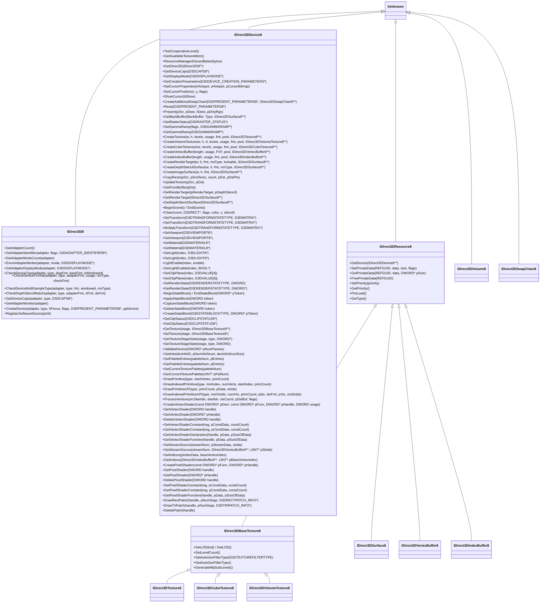

# Direct3D 8 API Research Notes

Sources: Windows SDK headers (`d3d8.h`, `d3d8types.h`, `d3d8caps.h`),
DXVK d3d8 module (`src/d3d8/`), Wine d3d8 source (`dlls/d3d8/`),
vkd3d-shader docs, Microsoft archived MSDN (DirectX 8.1 SDK).

---

## Overview

DirectX 8 (`d3d8.dll`, October 2000) introduced programmable shaders (vs_1_1,
ps_1_1–ps_1_4) while keeping the same resource/state model as D3D7. Structurally
it is the closest predecessor to D3D9 — most COM interfaces map 1:1 — but there are
critical differences that make a simple cast impossible.

**Key facts:**
- Programmable shaders: vs_1_1, ps_1_1, ps_1_2, ps_1_3, ps_1_4
- Shader handles are `DWORD` values, not COM objects
- Vertex declaration is embedded inside the vertex shader handle
- `SetRenderTarget` takes both render target and depth stencil in a single call
- No `IDirect3DSwapChain8` exposed publicly; Present is on the device
- No queries (D3DQUERYTYPE_* was added in D3D9)
- State blocks are token-based (`DWORD`), not COM-based
- D3DPOOL, FVF, and texture formats are largely identical to D3D9

---

## COM Interface Hierarchy



---

## D3D8 vs D3D9: Critical Differences

### 1. Shader Handles (DWORD) vs COM Objects

D3D8 shaders are identified by `DWORD` handles allocated by the driver:

```c
// D3D8 — vertex shader
DWORD hVS;
device->CreateVertexShader(pDeclaration, pShaderByteCode, &hVS, 0);
device->SetVertexShader(hVS);
device->DeleteVertexShader(hVS);

// If handle < D3DVS_MAXTYPES (16), it is treated as an FVF code instead:
device->SetVertexShader(D3DFVF_XYZ | D3DFVF_TEX1);  // FVF — no shader

// D3D8 — pixel shader
DWORD hPS;
device->CreatePixelShader(pShaderByteCode, &hPS);
device->SetPixelShader(hPS);
device->DeletePixelShader(hPS);
```

```c
// D3D9 — COM objects
IDirect3DVertexShader9* pVS9;
device->CreateVertexShader(pShaderByteCode, &pVS9);
device->SetVertexShader(pVS9);
pVS9->Release();

// FVF is separate:
device->SetFVF(D3DFVF_XYZ | D3DFVF_TEX1);
```

**Implementation:** maintain an internal handle table in the D3D8 device wrapper:
```cpp
// In D3D8Device wrapper:
std::unordered_map<DWORD, IDirect3DVertexShader9*> m_vsTable;
std::unordered_map<DWORD, IDirect3DVertexDeclaration9*> m_vsDecl;
std::unordered_map<DWORD, IDirect3DPixelShader9*> m_psTable;
DWORD m_nextShaderHandle = D3DVS_MAXTYPES; // start above FVF range
```

For `SetVertexShader(handle)`:
```cpp
if (handle < D3DVS_MAXTYPES) {
    // It's an FVF
    pDevice9->SetFVF(handle);
    pDevice9->SetVertexShader(nullptr);
} else {
    pDevice9->SetVertexShader(m_vsTable[handle]);
    pDevice9->SetVertexDeclaration(m_vsDecl[handle]);
}
```

### 2. Vertex Shader Declaration Format

D3D8 vertex shader declarations are a `DWORD` token stream using `D3DVSD_*` macros,
NOT the `D3DVERTEXELEMENT9` array format used by D3D9.

```c
// D3D8 declaration format — token stream
DWORD decl[] = {
    D3DVSD_STREAM(0),                          // start stream 0
    D3DVSD_REG(D3DVSDE_POSITION, D3DVSDT_FLOAT3),  // v0 = POSITION float3
    D3DVSD_REG(D3DVSDE_NORMAL,   D3DVSDT_FLOAT3),  // v3 = NORMAL float3
    D3DVSD_REG(D3DVSDE_TEXCOORD0, D3DVSDT_FLOAT2), // v7 = TEX0 float2
    D3DVSD_END()                                // 0xFFFFFFFF terminator
};
```

**D3DVSD_* macro encoding:**

| Macro | Bits [31:29] | Purpose |
|---|---|---|
| D3DVSD_STREAM(n) | 001 | Switch to stream n |
| D3DVSD_REG(reg, type) | 010 | Map stream data to VS input register |
| D3DVSD_CONST(reg, count) | 110 | Load constants from declaration |
| D3DVSD_SKIP(count) | 011 | Skip N DWORDs in stream |
| D3DVSD_TESSUV(reg) | 100 | Tessellator UV |
| D3DVSD_TESSNORMAL(reg, out) | 101 | Tessellator normal |
| D3DVSD_END() | — | 0xFFFFFFFF |

**D3DVSDE_* (destination VS input registers):**

| D3DVSDE | D3DDECLUSAGE (D3D9) | UsageIndex |
|---|---|---|
| D3DVSDE_POSITION (0) | D3DDECLUSAGE_POSITION | 0 |
| D3DVSDE_BLENDWEIGHT (1) | D3DDECLUSAGE_BLENDWEIGHT | 0 |
| D3DVSDE_BLENDINDICES (2) | D3DDECLUSAGE_BLENDINDICES | 0 |
| D3DVSDE_NORMAL (3) | D3DDECLUSAGE_NORMAL | 0 |
| D3DVSDE_PSIZE (4) | D3DDECLUSAGE_PSIZE | 0 |
| D3DVSDE_DIFFUSE (5) | D3DDECLUSAGE_COLOR | 0 |
| D3DVSDE_SPECULAR (6) | D3DDECLUSAGE_COLOR | 1 |
| D3DVSDE_TEXCOORD0–7 (7–14) | D3DDECLUSAGE_TEXCOORD | 0–7 |
| D3DVSDE_POSITION2 (15) | D3DDECLUSAGE_POSITION | 1 |
| D3DVSDE_NORMAL2 (16) | D3DDECLUSAGE_NORMAL | 1 |

**D3DVSDT_* (source data type) → D3DDECLTYPE (D3D9):**

| D3DVSDT | D3DDECLTYPE | Description |
|---|---|---|
| D3DVSDT_FLOAT1 (0) | D3DDECLTYPE_FLOAT1 | 1 float |
| D3DVSDT_FLOAT2 (1) | D3DDECLTYPE_FLOAT2 | 2 floats |
| D3DVSDT_FLOAT3 (2) | D3DDECLTYPE_FLOAT3 | 3 floats |
| D3DVSDT_FLOAT4 (3) | D3DDECLTYPE_FLOAT4 | 4 floats |
| D3DVSDT_D3DCOLOR (4) | D3DDECLTYPE_D3DCOLOR | BGRA packed DWORD |
| D3DVSDT_UBYTE4 (5) | D3DDECLTYPE_UBYTE4 | 4 unsigned bytes |
| D3DVSDT_SHORT2 (6) | D3DDECLTYPE_SHORT2 | 2 signed shorts |
| D3DVSDT_SHORT4 (7) | D3DDECLTYPE_SHORT4 | 4 signed shorts |

**Declaration parser → D3D9 element array:**
```cpp
std::vector<D3DVERTEXELEMENT9> parseD3D8Decl(const DWORD* pDecl) {
    std::vector<D3DVERTEXELEMENT9> elems;
    WORD stream = 0, offset = 0;
    for (const DWORD* t = pDecl; *t != D3DVSD_END(); t++) {
        DWORD type = (*t >> 29) & 0x7;
        if (type == 1) { // D3DVSD_STREAM
            stream = *t & 0xFFFF;
            offset = 0;
        } else if (type == 2) { // D3DVSD_REG
            BYTE reg  = (*t >> 16) & 0x1F;
            BYTE dtype = (*t) & 0xF;
            D3DVERTEXELEMENT9 e;
            e.Stream = stream; e.Offset = offset;
            e.Type   = d3dvsdt_to_ddecltype[dtype];
            e.Method = D3DDECLMETHOD_DEFAULT;
            d3dvsde_to_usage(reg, &e.Usage, &e.UsageIndex);
            e.Offset += declTypeSize[dtype];
            elems.push_back(e);
            offset += declTypeSize[dtype];
        } else if (type == 3) { // D3DVSD_SKIP
            offset += ((*t & 0xF) + 1) * sizeof(DWORD);
        }
    }
    elems.push_back(D3DDECL_END());
    return elems;
}
```

### 3. SetRenderTarget Takes Both RT and DS

```c
// D3D8 — single call for both
device->SetRenderTarget(pRenderTarget, pDepthStencil);

// D3D9 — separate calls
device->SetRenderTarget(0, pRenderTarget);
device->SetDepthStencilSurface(pDepthStencil);
```

D3D8 also has no multi-render-target support. Only render target index 0 exists.

### 4. Present Is on the Device

```c
// D3D8 — Present on device
device->Present(pSrcRect, pDstRect, hDestWindow, pDirtyRgn);

// D3D9 — Present on device OR swap chain
device->Present(pSrcRect, pDstRect, hDestWindow, pDirtyRgn);
swapChain->Present(pSrcRect, pDstRect, hDestWindow, pDirtyRgn, flags);
```

D3D8 does NOT have `DWORD dwFlags` on Present. Translate directly.

### 5. GetBackBuffer Signature

```c
// D3D8 — no swap chain index
device->GetBackBuffer(BackBuffer, D3DBACKBUFFER_TYPE_MONO, &pSurface);

// D3D9
device->GetBackBuffer(0 /*iSwapChain*/, BackBuffer, D3DBACKBUFFER_TYPE_MONO, &pSurface);
```

### 6. CreateRenderTarget / CreateDepthStencilSurface Signatures

```c
// D3D8 — no MultiSampleQuality, CreateRenderTarget has Lockable parameter
device->CreateRenderTarget(w, h, fmt, msType, lockable, &pSurface);
device->CreateDepthStencilSurface(w, h, fmt, msType, &pSurface);

// D3D9 — added MultiSampleQuality parameter; CreateRenderTarget dropped Lockable
device->CreateRenderTarget(w, h, fmt, msType, msQuality, lockable, &pSurface, NULL);
device->CreateDepthStencilSurface(w, h, fmt, msType, msQuality, FALSE, &pSurface, NULL);
```

Translate by injecting `msQuality=0` and `Lockable=FALSE` / `pSharedHandle=NULL`.

### 7. CreateImageSurface (no D3D9 equivalent name)

```c
// D3D8
device->CreateImageSurface(width, height, format, &pSurface);

// D3D9 equivalent
device->CreateOffscreenPlainSurface(width, height, format, D3DPOOL_SYSTEMMEM, &pSurface, NULL);
```

### 8. CopyRects (replaced by UpdateSurface in D3D9)

```c
// D3D8
device->CopyRects(pSrc, pSrcRects, numRects, pDst, pDstPts);

// D3D9 — only supports single rect
device->UpdateSurface(pSrc, pSrcRect, pDst, pDstPt);
// Must loop over multiple rects, calling UpdateSurface once per rect
```

### 9. State Blocks: Token-Based (same as D3D7)

D3D8 uses the same token-based state block API as D3D7 (see D3D7 notes).
These all translate to `IDirect3DStateBlock9` COM calls using an internal table.

### 10. No Queries

D3D8 has no query mechanism. `D3DQUERYTYPE_*` was introduced in D3D9.
No translation needed; just expose nothing.

### 11. D3DPRESENT_PARAMETERS Differences

```c
// D3D8 (D3DPRESENT_PARAMETERS slightly different)
// — No Flags field
// — SwapEffect D3DSWAPEFFECT_COPY_VSYNC exists in D3D8 (not D3D9)

typedef struct _D3DPRESENT_PARAMETERS8 {
    UINT            BackBufferWidth, BackBufferHeight;
    D3DFORMAT       BackBufferFormat;
    UINT            BackBufferCount;
    D3DMULTISAMPLE_TYPE MultiSampleType;
    D3DSWAPEFFECT   SwapEffect;        // D3DSWAPEFFECT_COPY_VSYNC valid in D3D8 only
    HWND            hDeviceWindow;
    BOOL            Windowed;
    BOOL            EnableAutoDepthStencil;
    D3DFORMAT       AutoDepthStencilFormat;
    DWORD           Flags;             // D3DPRESENTFLAG_* — same as D3D9
    UINT            FullScreen_RefreshRateInHz;
    UINT            FullScreen_PresentationInterval; // field name differs from D3D9
} D3DPRESENT_PARAMETERS8;
```

D3D9 renamed `FullScreen_PresentationInterval` → `PresentationInterval`.
`D3DSWAPEFFECT_COPY_VSYNC` → map to `D3DSWAPEFFECT_COPY` + vsync interval in D3D9.

### 12. Texture Stage State: Sampler States Still in TSS

In D3D8, the sampler-related states that D3D9 moved to `D3DSAMP_*` are still part
of `D3DTSS_*`. Same as D3D7 — see the TSS→DSAMP mapping in the D3D7 research doc.

D3D8 TSS indices that become D3D9 sampler states:

| D3D8 D3DTSS_* | D3D9 D3DSAMP_* |
|---|---|
| D3DTSS_ADDRESSU (13) | D3DSAMP_ADDRESSU |
| D3DTSS_ADDRESSV (14) | D3DSAMP_ADDRESSV |
| D3DTSS_ADDRESSW (25) | D3DSAMP_ADDRESSW |
| D3DTSS_BORDERCOLOR (15) | D3DSAMP_BORDERCOLOR |
| D3DTSS_MAGFILTER (16) | D3DSAMP_MAGFILTER |
| D3DTSS_MINFILTER (17) | D3DSAMP_MINFILTER |
| D3DTSS_MIPFILTER (18) | D3DSAMP_MIPFILTER |
| D3DTSS_MIPMAPLODBIAS (19) | D3DSAMP_MIPMAPLODBIAS |
| D3DTSS_MAXMIPLEVEL (20) | D3DSAMP_MAXMIPLEVEL |
| D3DTSS_MAXANISOTROPY (21) | D3DSAMP_MAXANISOTROPY |

D3DTSS indices 0–12 and 22–24 remain TSS in both D3D8 and D3D9.

---

## Shader Model 1.x

### Version Tokens

| Shader | Version Token | Notes |
|---|---|---|
| vs_1_1 | 0xFFFE0101 | Only VS version in D3D8 |
| ps_1_1 | 0xFFFF0101 | |
| ps_1_2 | 0xFFFF0102 | Adds TEXDP3 + phase control |
| ps_1_3 | 0xFFFF0103 | Same as ps_1_2 + TEXM3x3VSPEC |
| ps_1_4 | 0xFFFF0104 | Phase instruction, explicit texld, 6 stages |

### vs_1_1 Register Limits

| Resource | Count | Notes |
|---|---|---|
| Temporary registers (r) | 12 | r0–r11 |
| Constant float registers (c) | 96 | c0–c95 via SetVertexShaderConstant |
| Input registers (v) | 16 | v0–v15, mapped from declaration |
| Address register (a0) | 1 | Integer offset for c[a0.x + n] |
| Texture coord out (oT) | 8 | oT0–oT7 |
| Color out (oD) | 2 | oD0 (diffuse), oD1 (specular) |
| Pos out (oPos) | 1 | Clip-space position |
| Fog out (oFog) | 1 | |
| Point size out (oPts) | 1 | |
| Max instructions | 128 | |
| Flow control | None | No IF/LOOP/CALL |

### ps_1_1–ps_1_3 Limits

| Resource | Count | Notes |
|---|---|---|
| Texture registers (t) | 4 | t0–t3; also used as tex coord input |
| Temporary registers (r) | 2 | r0, r1 |
| Constant registers (c) | 8 | c0–c7, set as D3DCOLOR values |
| Texture instructions | 4 | tex, texcoord, texbem, texm3x3spec, etc. |
| Arithmetic instructions | 8 | |
| Two-sided stencil | No | |
| Dynamic branching | No | |

**ps_1_x D3DCOLOR constants:** `c0–c7` are set via
`SetPixelShaderConstant(reg, &D3DXCOLOR, 1)` — the DWORD values are interpreted
as normalized [0,1] float4 (R→.r, G→.g, B→.b, A→.a), NOT raw float4.

### ps_1_4 Differences

```
- Phase separator instruction: 0xFFFD (extends to 12 tex + 16 arith ops across 2 phases)
- 6 texture registers (t0–t5) vs 4
- 6 temporary registers (r0–r5) vs 2
- Explicit texld: texld r0, t0 (loads from sampler into r0 using t0 as UV)
- Constants c0–c7 are float4 (not D3DCOLOR like ps_1_1/1_2/1_3)
- Partial precision modifier on instructions
```

### ps_1_x Unique Texture Instructions (not in SM2+)

| Instruction | D3D9 equivalent / notes |
|---|---|
| `tex t#` | Sample texture at t# using t# as tex coord (implicit) |
| `texcoord t#` | Move tex coords from t# to output register |
| `texkill t#` | Discard pixel if any channel of t# < 0 |
| `texbem t#, r#` | Bump env map: perturb t# UV by r# using D3DTSS_BUMPENVMAT |
| `texbeml t#, r#` | texbem + luminance correction |
| `texm3x2pad t#, src` | Load row of 3x2 matrix transform |
| `texm3x2tex t#, src` | Complete 3x2 transform and sample |
| `texm3x3pad t#, src` | Row of 3x3 matrix transform |
| `texm3x3tex t#, src` | 3x3 × normal → sample cube map |
| `texm3x3spec t#, src, env` | 3x3 × normal → reflect eye → sample cube map |
| `texm3x3vspec t#, src` | Like texm3x3spec but eye from texture register |
| `texdp3tex t#, r#` | Dot product then texture lookup |
| `texdp3 t#, r#` | Dot product only (ps_1_2+) |
| `texreg2ar t#, r#` | Use r#.a, r#.r as UV |
| `texreg2gb t#, r#` | Use r#.g, r#.b as UV |
| `texreg2rgb t#, r#` | Use r#.rgb as 3D UV (ps_1_2+) |

**vkd3d-shader handles all ps_1_x texture instructions** via its D3DBC parser
lowering passes — this is the recommended path. Do not attempt to implement a
custom ps_1_x translator.

### Source Modifiers in ps_1_x

| Modifier | MSL | Notes |
|---|---|---|
| `_bx2` (bias×2) | `(x - 0.5) * 2.0` | Sign-expand from [0,1] to [-1,1] |
| `_bias` | `x - 0.5` | |
| `-` (negate) | `-x` | |
| `1-` (invert) | `1.0 - x` | |
| `_x2` | `x * 2.0` | |
| `_d2` | `x / 2.0` | |
| `_sat` (dest) | `clamp(x, 0, 1)` | Saturate on write (default behavior) |

### Destination Result Shift Scale (ps_1_x only)

Destination tokens in ps_1_1/1_2/1_3 can carry a result shift:

| Bits [27:24] | Multiplier | MSL |
|---|---|---|
| 0x0 | ×1 (none) | `result` |
| 0x1 | ×2 | `result * 2.0` |
| 0x2 | ×4 | `result * 4.0` |
| 0x3 | ×8 | `result * 8.0` |
| 0xD | ÷8 | `result / 8.0` |
| 0xE | ÷4 | `result / 4.0` |
| 0xF | ÷2 | `result / 2.0` |

vkd3d-shader handles this in its D3DBC lowering pass.

---

## D3D8 → D3D9 Mapping Summary

```mermaid
graph TD
    subgraph D3D8["d3d8.dll (new PE bridge)"]
        D3D8F["IDirect3D8 wrapper"]
        D3D8D["IDirect3DDevice8 wrapper"]
        D3D8R["IDirect3DResource8 wrappers"]
        VSDeclTable["VS Decl handle table\nDWORD → IDirect3DVertexDeclaration9*"]
        VSTable["VS handle table\nDWORD → IDirect3DVertexShader9*"]
        PSTable["PS handle table\nDWORD → IDirect3DPixelShader9*"]
        SBTable["State block table\nDWORD → IDirect3DStateBlock9*"]
    end

    subgraph D3D9["dxmt9 D3D9 (existing)"]
        D3D9F["IDirect3D9"]
        D3D9D["IDirect3DDevice9"]
        D3D9R["IDirect3DResource9"]
    end

    D3D8F -- "CreateDevice → CreateDevice" --> D3D9F
    D3D8D -- "draw calls → draw calls" --> D3D9D
    D3D8D -- "SetRenderTarget(rt,ds)\n→ SetRenderTarget(0,rt)\n  + SetDepthStencilSurface(ds)" --> D3D9D
    D3D8D -- "GetBackBuffer(n)\n→ GetBackBuffer(0,n)" --> D3D9D
    D3D8D -- "CreateVertexShader\n→ parse D3D8 decl\n  + CreateVertexDeclaration\n  + CreateVertexShader" --> D3D9D
    D3D8D -- "SetVertexShader(h)\n→ SetFVF or SetVertexShader+SetDecl" --> D3D9D
    D3D8D -- "SetTextureStageState(TSS_ADDRESS*)\n→ SetSamplerState(DSAMP_*)" --> D3D9D
    D3D8D -- "CreateStateBlock/Apply/Capture\n→ IDirect3DStateBlock9 via table" --> D3D9D
    D3D8D -- "CopyRects(n rects)\n→ n × UpdateSurface" --> D3D9D
    D3D8D -- "CreateImageSurface\n→ CreateOffscreenPlainSurface(SYSTEMMEM)" --> D3D9D
    D3D8D -- "Present → Present(0)" --> D3D9D
    D3D8R -- "wraps" --> D3D9R
```



---

## D3DCAPS8 vs D3DCAPS9

Most capability bits are identical. Notable differences:

| Area | D3D8 | D3D9 |
|---|---|---|
| Pixel shader version | D3DPS_VERSION(1,4) max | D3DPS_VERSION(3,0) max |
| Vertex shader version | D3DVS_VERSION(1,1) max | D3DVS_VERSION(3,0) max |
| MaxPixelShaderValue | float, range [0,1] per channel | MaxPixelShaderValue removed |
| MaxVertexShaderConst | 96 | 256 |
| MaxSimultaneousTextures | 8 | 8 |
| MaxTextureBlendStages | 8 | 8 |
| NumSimultaneousRTs | 1 (always) | up to 4 |

When D3D8 calls `GetDeviceCaps`, clamp reported shader versions to D3D8 limits
to prevent apps from trying to use SM2/SM3.

---

## File Layout for dxmt9 Expansion

```
src/
  d3d8/                     new — D3D8→D3D9 translation layer
    entry.cpp               DirectXCreate8, DllMain
    factory.cpp             IDirect3D8 wrapper
    device.cpp              IDirect3DDevice8 wrapper
    resource.cpp            IDirect3DResource8/Texture/Surface/Buffer wrappers
    shader.cpp              Vertex/pixel shader handle table + D3D8 decl parser
    d3d8.def                PE exports
  d3d7/                     new — D3D7→D3D9 translation layer
    entry.cpp               DirectDrawCreate/DirectDrawCreateEx
    ddraw.cpp               IDirectDraw7 wrapper
    d3d7.cpp                IDirect3D7 wrapper
    device7.cpp             IDirect3DDevice7 wrapper
    surface7.cpp            IDirectDrawSurface7 wrapper (unified RT/tex/buffer)
    vertexbuffer7.cpp       IDirect3DVertexBuffer7 wrapper
    ddraw.def               PE exports (DirectDrawCreate, DirectDrawCreateEx, etc.)
  win32/
    d3d9_entry.cpp          existing
    d3d8_entry.cpp          new — thin PE that loads d3d8 bridge
    bridge.cpp              existing
```

---

## Key References

| Resource | URL/location |
|---|---|
| DXVK d3d8 module | https://github.com/doitsujin/dxvk/tree/master/src/d3d8 |
| DXVK d3d8 shader handle impl | https://github.com/doitsujin/dxvk/blob/master/src/d3d8/d3d8_device.cpp |
| Wine d3d8 source | https://source.winehq.org/source/dlls/d3d8/ |
| vkd3d-shader ps_1_x support | https://gitlab.winehq.org/wine/vkd3d/-/blob/master/libs/vkd3d-shader/d3dbc.c |
| D3D8 SDK headers (archived) | `d3d8.h`, `d3d8types.h`, `d3d8caps.h` (Windows SDK 8.0 or DirectX 8.1 SDK) |
| D3DVSD_* token format | https://learn.microsoft.com/en-us/windows/win32/direct3d8/vertex-shader-declaration |
| ps_1_x instruction reference | https://learn.microsoft.com/en-us/windows/win32/direct3dhlsl/dx9-graphics-reference-asm-ps-1-x |
| vs_1_1 instruction reference | https://learn.microsoft.com/en-us/windows/win32/direct3dhlsl/dx9-graphics-reference-asm-vs-1-1 |
| D3D8 to D3D9 migration guide | https://learn.microsoft.com/en-us/windows/win32/direct3d9/dx8-to-dx9-migration |
