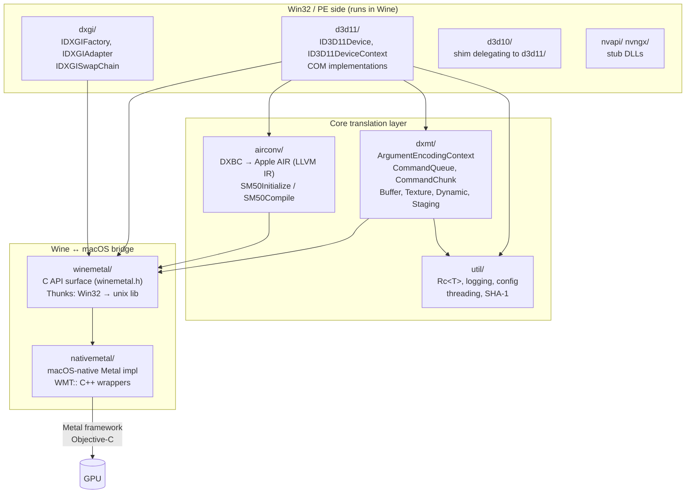
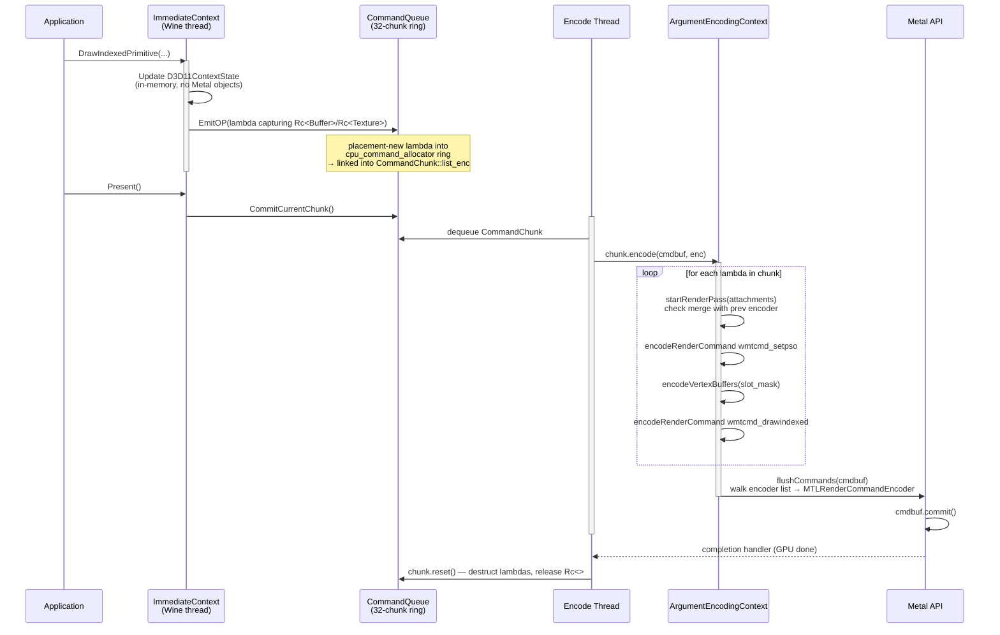
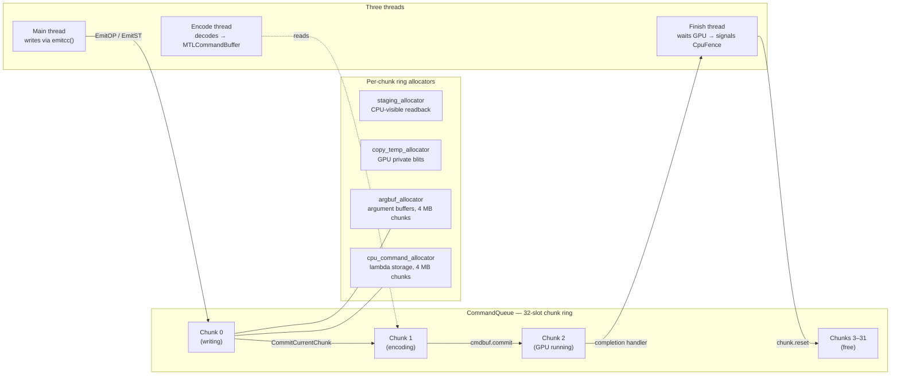
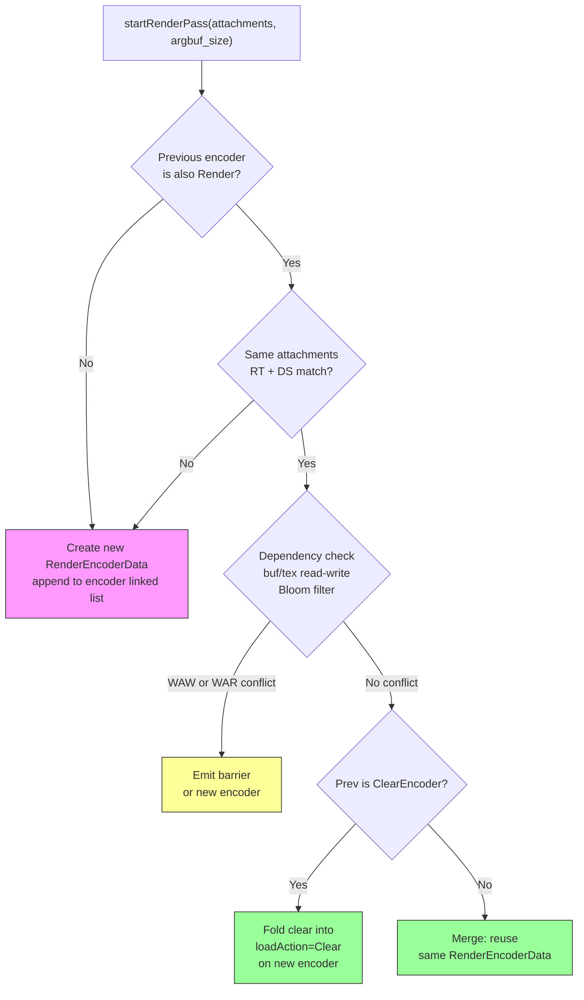
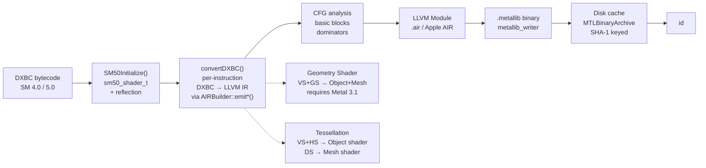
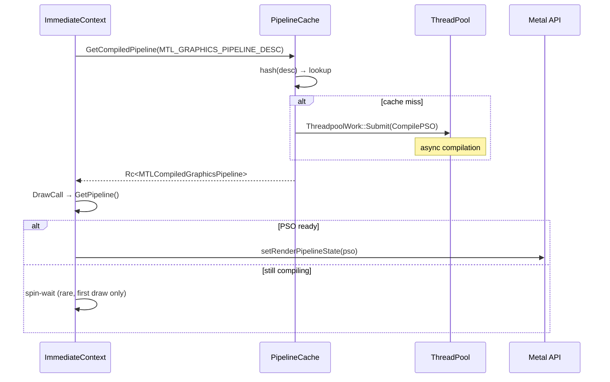
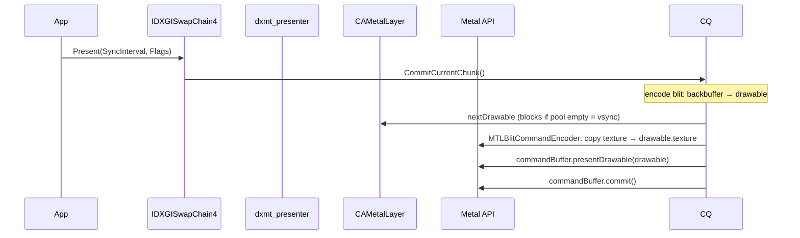

# DXMT Architecture Research Notes

Sources: github.com/3Shain/dxmt (source inspection), deepwiki.com/3Shain/dxmt.

---

## Overview

DXMT is a Metal-based translation layer for Direct3D 11 and Direct3D 10 on macOS, designed
to run Windows 3D applications through Wine. It is a native C++ project — not a browser
wrapper — and its architecture closely parallels the problem space of dxmt9.

The implementation is split across five major source modules: `d3d11/` (COM-facing API),
`dxmt/` (Metal translation core), `airconv/` (shader compiler), `winemetal/` (Wine bridge),
and `dxgi/` (DXGI factory/adapter).

---

## Module Dependency Graph



---

## Source Directory Structure

```
src/
├── airconv/          DXBC → AIR (Apple Intermediate Representation) shader compiler
│   ├── dxbc_converter.{cpp,hpp}         Core DXBC instruction converter
│   ├── dxbc_converter_cfg.cpp           Control flow graph (LOOP/IF/CALL)
│   ├── dxbc_converter_gs.cpp            Geometry shader → Metal mesh shader
│   ├── dxbc_converter_ts.cpp            Tessellation shader conversion
│   ├── air_operations.{cpp,hpp}         AIR (LLVM IR) emitters
│   ├── air_signature.{cpp,hpp}          Function signature / argument table
│   ├── airconv_public.h                 Public C API (SM50Initialize, SM50Compile)
│   ├── metallib_writer.{cpp,hpp}        .metallib binary writer
│   └── darwin/ nt/                      Platform-specific AIR builder variants
│
├── d3d11/            D3D11 COM interface implementation
│   ├── d3d11_device.{cpp,hpp}           ID3D11Device5 implementation
│   ├── d3d11_context_imm.cpp            Immediate context (all Draw/Map/Clear calls)
│   ├── d3d11_context_state.hpp          D3D11ContextState (all pipeline stage state)
│   ├── d3d11_pipeline.{cpp,hpp}         Pipeline descriptor + compiled PSO types
│   ├── d3d11_pipeline_cache.{cpp,hpp}   PSO cache (hash map keyed by descriptor)
│   ├── d3d11_shader.{cpp,hpp}           Shader lifecycle + variant system
│   ├── d3d11_texture.{cpp,hpp}          ID3D11Texture1/2/3D implementations
│   ├── d3d11_buffer.cpp                 ID3D11Buffer implementation
│   ├── d3d11_view.hpp                   SRV / RTV / DSV / UAV wrappers
│   ├── d3d11_state_object.{cpp,hpp}     Blend / DS / Rasterizer / Sampler state
│   ├── d3d11_input_layout.{cpp,hpp}     Input layout
│   └── d3d11_swapchain.{cpp,hpp}        IDXGISwapChain4 implementation
│
├── dxmt/             Core Metal translation layer
│   ├── dxmt_device.{cpp,hpp}            Device wrapper (owns MTLDevice + CommandQueue)
│   ├── dxmt_context.{cpp,hpp}           ArgumentEncodingContext (encode thread)
│   ├── dxmt_command.{cpp,hpp,metal}     Command structs + Metal-side replay
│   ├── dxmt_command_list.hpp            CommandList<Context> lambda linked list
│   ├── dxmt_command_queue.{cpp,hpp}     CommandQueue (32-slot ring, 3 threads)
│   ├── dxmt_buffer.{cpp,hpp}            Buffer + BufferAllocation + BufferView
│   ├── dxmt_texture.{cpp,hpp}           Texture + TextureAllocation + TextureView
│   ├── dxmt_dynamic.{cpp,hpp}           Triple-buffering for USAGE_DYNAMIC resources
│   ├── dxmt_staging.{cpp,hpp}           StagingResource (CPU-readable)
│   ├── dxmt_format.{cpp,hpp}            DXGI → MTLPixelFormat conversion
│   ├── dxmt_residency.hpp               Per-encoder resource residency tracking
│   ├── dxmt_deptrack.hpp                Bloom-filter dependency tracking
│   ├── dxmt_ring_bump_allocator.hpp     Ring sub-allocators (4 types)
│   ├── dxmt_presenter.{cpp,hpp}         CAMetalLayer blit + present
│   ├── dxmt_shader_cache.{cpp,hpp}      MTLBinaryArchive disk shader cache
│   └── dxmt_pipeline_cache.hpp          In-memory PSO cache
│
├── winemetal/        Wine ↔ macOS bridge
│   ├── winemetal.h                      C API surface for Win32 side
│   ├── Metal.hpp                        C++ wrappers (WMT:: namespace)
│   ├── winemetal_thunks.{c,h}           Win32 DLL → unix lib thunks
│   ├── airconv_thunks.{c,h}             Shader compiler cross-process calls
│   └── unix/winemetal_unix.c            macOS-native implementations
│
├── dxgi/             DXGI factory/adapter/output COM implementation
├── d3d10/            D3D10 shim (delegates to d3d11/)
├── nvapi/ nvngx/     NVIDIA API stubs
└── util/             Rc<T>, logging, config, SHA-1, thread, bloom filter
```

---

## Command Recording and Encoding Pipeline

The central design insight: the main (Wine) thread never touches Metal objects. All Metal
API calls happen on a dedicated encode thread. Communication uses a ring of command
chunks, each holding a linked list of captured C++ lambdas.



---

## Command Queue Ring Architecture



---

## Encoder Merging and Dependency Tracking

DXMT avoids redundant Metal encoders by merging consecutive passes with identical
attachments and by folding `Clear()` into `MTLLoadActionClear`.



Each `EncoderData` carries four `PartitionedBloomFilter64<16>` sets:
`buf_read`, `buf_write`, `tex_read`, `tex_write`. `checkEncoderRelation()` uses these
filters to detect potential hazards across encoder boundaries — probabilistic but fast,
with false positives producing unnecessary barriers (safe) rather than missing hazards.

---

## Resource Lifetime Model

```mermaid
stateDiagram-v2
    [*] --> Alive: CreateBuffer / CreateTexture\n(COM + Rc created)
    Alive --> InFlight: lambda captures Rc copy
    InFlight --> Alive: lambda destructs\n(Rc count drops)
    Alive --> Renamed: DynamicBuffer::rename()\nMap DISCARD → swap allocation
    Renamed --> Alive: old Rc fully released\nby in-flight lambdas
    Alive --> [*]: COM Release() → Rc → 0\nMTLBuffer/MTLTexture freed

    note right of InFlight
        CommandChunk::AllocationRefTracking
        holds Allocation* list.
        GPU done → chunk.reset()
        → lambda destructors run
        → Rc refs drop
    end note
```

**Ownership layers:**
```
Application (COM AddRef/Release)
  └─ IDirect3DResource9 (COM object)
        └─ Rc<Buffer> / Rc<Texture>           D3D11 COM layer
              └─ Rc<BufferAllocation>          current physical MTLBuffer
                    └─ WMT::Buffer handle

Lambda in CommandChunk::list_enc
  └─ Rc<BufferAllocation>  (captured copy)    keeps allocation alive during GPU work
        └─ released when chunk.reset() runs after GPU completion
```

---

## Argument Buffer Binding Model

DXMT does not call `setBuffer`/`setTexture` per slot. All resources are packed into
one GPU-side argument buffer per render pass, and the shader receives one buffer pointer.

```
Argument Buffer (argbuf_allocator, shared storage mode)
┌──────────────────────────────────────────┐
│ Vertex buffers: {gpu_addr, stride, len}[] │  slots 0–15
│ Constant buffers: gpu_addr[]             │  CBs: indices 0–31
│ Samplers: handle[]                       │  indices 32–63
│ SRVs: {tex_handle, buf_handle, width}[]  │  indices 128+ (stride 3)
│ UAVs: {handle, counter, metadata}[]      │  indices 512+ (stride 3)
└──────────────────────────────────────────┘
         ↑
setVertexBufferOffset(argbuf_base, slot=0)
setFragmentBufferOffset(argbuf_base, slot=0)
```

Slot layout from `MTL_SHADER_REFLECTION`:
- `ArgumentBufferBindIndex` — which Metal buffer slot holds the argument buffer
- `ConstantBufferTableBindIndex` — offset within argbuf for CB table
- `SRVSlotMaskHi/Lo`, `SamplerSlotMask`, `UAVSlotMask` — which slots are live

---

## Shader Translation Pipeline (airconv)

DXMT compiles DXBC SM4/SM5 directly to Apple AIR (LLVM IR with Metal metadata),
bypassing text-based MSL entirely.



**Note for dxmt9:** airconv targets SM4/SM5 only. For D3D9 (SM 1–3), use the
vkd3d-shader → SPIRV-Cross pipeline described in `shader-translation.md`.

### Shader Variant System

The same DXBC is compiled multiple times for different specializations:

| Variant type | Specialization keys |
|---|---|
| `ShaderVariantVertex` | Input layout + GS passthrough flags + rasterization disabled |
| `ShaderVariantPixel` | Sample mask + dual-source blend + depth output disable + UNORM mask |
| `ShaderVariantTessVS+HS` | Paired compilation → single object shader |
| `ShaderVariantDomainDS` | Compiled as mesh shader |
| `ShaderVariantGS` | VS+GS paired: object + mesh shader |

---

## PSO Compilation (Async)



---

## Present / Swapchain Path



---

## Key Design Patterns for dxmt9

| Pattern | DXMT Implementation | Apply to dxmt9 |
|---|---|---|
| Producer-consumer command queue | Main thread writes lambdas; encode thread replays | Keep Metal off Wine thread |
| Deferred encoder + merging | `startRenderPass()` checks attachments + Bloom deps | Map BeginScene/EndScene and RT changes to pass boundaries |
| Bloom filter dependency tracking | `EncoderDepSet` = `PartitionedBloomFilter64<16>` | Detect cross-pass hazards cheaply |
| Resource renaming | `Buffer::rename()` swaps allocation atomically | D3D9 DISCARD = rename, not stall |
| Argument buffers | All slots packed into one GPU buffer per pass | Saves per-resource `setBuffer` overhead |
| Async PSO compilation | `ThreadpoolWork`; draw blocks only on first miss | Cache D3D9 pipeline states similarly |
| COM over Rc | COM layer uses AddRef/Release; core uses Rc | Maintain boundary for dxmt9 COM objects |
| Wine unix lib thunks | `__wine_unix_call` → macOS-native code | Required for Wine-hosted builds |
| Shader disk cache | `MTLBinaryArchive` keyed by SHA-1 | Apply to compiled MSL/metallib |

---

## Key Files to Study

| Concern | DXMT file |
|---|---|
| Command recording / lambda emission | `dxmt/dxmt_command_queue.hpp`, `dxmt/dxmt_command_list.hpp` |
| Encoder management + merging | `dxmt/dxmt_context.{cpp,hpp}` |
| Metal command structs | `dxmt/dxmt_command.{hpp,metal}` |
| Buffer / Texture lifetime | `dxmt/dxmt_buffer.hpp`, `dxmt/dxmt_texture.hpp` |
| Dynamic resource triple-buffering | `dxmt/dxmt_dynamic.{cpp,hpp}` |
| Residency / dependency tracking | `dxmt/dxmt_residency.hpp`, `dxmt/dxmt_deptrack.hpp` |
| Shader compilation entry point | `airconv/airconv_public.h`, `airconv/airconv_context.cpp` |
| D3D state → Metal PSO | `d3d11/d3d11_pipeline.{cpp,hpp}`, `d3d11/d3d11_shader.hpp` |
| Present path | `dxmt/dxmt_presenter.{cpp,hpp}`, `d3d11/d3d11_swapchain.cpp` |
| Wine bridge | `winemetal/winemetal.h`, `winemetal/Metal.hpp` |

---

## Sources

- Official repository: https://github.com/3Shain/dxmt
- DeepWiki analysis: https://deepwiki.com/3Shain/dxmt
