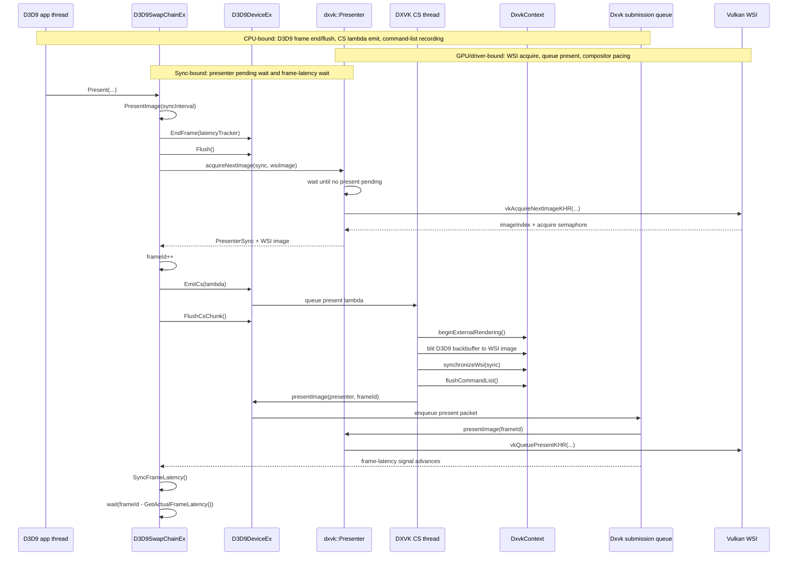
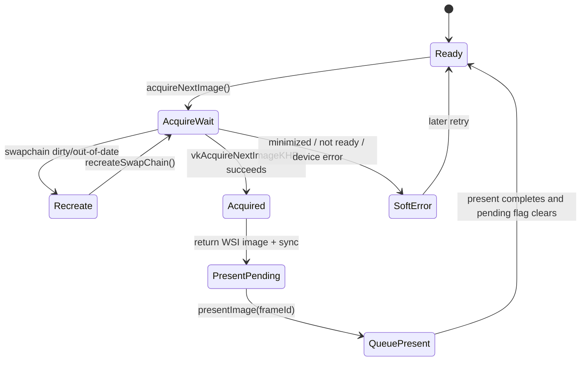

# DXVK D3D9 Present and Buffering Notes

Date: 2026-04-26

Scope:

- Local reference tree: `~/workspaces/dxvk`.
- Focus: D3D9 present path, frame-latency pacing, and swapchain buffering strategy.
- Main files inspected:
  - `~/workspaces/dxvk/src/d3d9/d3d9_swapchain.cpp`
  - `~/workspaces/dxvk/src/dxvk/dxvk_presenter.cpp`
  - `~/workspaces/dxvk/src/dxvk/dxvk_device.cpp`
  - `~/workspaces/dxvk/src/dxvk/dxvk_queue.cpp`

## Bound Legend

- CPU-bound: D3D9 swapchain/device code, CS lambda construction, command-list recording, and submission-queue bookkeeping.
- GPU/driver-bound: Vulkan WSI acquire/present, command-list execution, swapchain image ownership, and compositor/driver pacing.
- Sync-bound: CPU waits on WSI fences, presenter pending state, and frame-latency signals.

## Present Sequence

DXVK's D3D9 present path separates four concerns:

- End/flush the D3D9 frame.
- Acquire a WSI image before emitting present work.
- Execute the backbuffer-to-WSI blit on the CS thread.
- Pace the app thread with a frame-latency signal, capped by backbuffer count.



Key observed rules:

- `D3D9SwapChainEx::PresentImage()` calls `EndFrame()`, `Flush()`, then `Presenter::acquireNextImage()` before queuing the CS present lambda.
- The CS lambda performs the present blit, synchronizes WSI semaphores, flushes the command list, and calls `DxvkDevice::presentImage()`.
- `SyncFrameLatency()` waits on `frameLatencySignal` for `frameId - GetActualFrameLatency()`.
- `GetActualFrameLatency()` clamps the device frame latency by `BackBufferCount + 1`.

## Presenter State



Important ownership:

- `Presenter` owns the Vulkan swapchain, WSI images, image index, semaphores/fences, present mode, and `m_presentPending`.
- `D3D9SwapChainEx` owns D3D9 backbuffers and frame-id pacing policy.
- `DxvkDevice` owns command submission and delegates present packets to the submission queue.

## Buffering Strategy

```mermaid
flowchart LR
  subgraph CPU["CPU-bound: D3D9 + CS recording"]
    AppRT[D3D9 render target backbuffer 0]
    CSBlit[CS present blit]
    CmdList[flushed Vulkan command list]
    Queue[graphics queue submit]
    AppWait[SyncFrameLatency wait]
  end

  subgraph GPUDriver["GPU/driver-bound: Vulkan WSI"]
    Presenter[Presenter swapchain]
    WSI0[WSI image N]
    PresentQueue[vkQueuePresentKHR]
    FrameSignal[frameLatencySignal]
  end

  subgraph Sync["Sync-bound pacing"]
    Cap[actual latency = min(device latency, BackBufferCount + 1)]
    BackBufferCount[BackBufferCount]
    DeviceLatency[device frame latency]
  end

  AppRT -->|sample/blit source| CSBlit
  Presenter --> WSI0
  WSI0 -->|blit destination| CSBlit
  CSBlit --> CmdList
  CmdList --> Queue
  Queue --> PresentQueue
  PresentQueue --> FrameSignal
  FrameSignal --> AppWait

  BackBufferCount --> Cap
  DeviceLatency --> Cap
  Cap --> AppWait

  classDef cpu fill:#eaf4ff,stroke:#2f6fad,color:#0b2239
  classDef gpu fill:#fff0d6,stroke:#b26b00,color:#2b1900
  classDef sync fill:#ffe8e8,stroke:#b64242,color:#2b0d0d
  class AppRT,CSBlit,CmdList,Queue cpu
  class Presenter,WSI0,PresentQueue,FrameSignal gpu
  class AppWait,Cap,BackBufferCount,DeviceLatency sync
```

DXVK does not present the D3D9 backbuffer directly. The app renders into a normal D3D9 image, then present acquires a WSI image and blits the D3D9 image into it. This gives a clean separation between render-target lifetime and platform WSI lifetime.

Latency is bounded by a frame-id signal rather than by forcing full completion of the just-submitted present. That distinction matters for dxmt9: the app should only wait when it gets more than the effective latency ahead, not every time a present reaches the encode path.

## Bound Classification

| Region | Bound type | Why it matters for dxmt9 |
|---|---|---|
| `D3D9SwapChainEx::PresentImage()` pre-submit work | CPU-bound | Comparable to dxmt9 `DeviceImpl::present()` plus `CommandQueue::submitPresent()`. |
| `Presenter::acquireNextImage()` | GPU/driver-bound with CPU sync | Closest analogue to CAMetalLayer drawable acquisition. |
| CS present lambda | CPU-bound encode until queue submit | Similar to dxmt9 encode-thread chunk replay. |
| Vulkan queue present | GPU/driver-bound | Similar to Metal command buffer present/compositor pacing. |
| `SyncFrameLatency()` | Sync-bound | This is the desired pacing model: wait on a latency token, not on every present encode. |

## dxmt9 Adoption Points

- Keep the D3D9-facing swapchain source surface separate from the platform drawable.
- Treat drawable/image acquisition as a present subsystem responsibility, not a draw encoder side effect.
- Drive app-thread pacing from a frame-latency token derived from present completion or queue submission completion.
- Apply the DXVK-like cap `min(maxFrameLatency, BackBufferCount + 1)` only as a latency-bound rule, not as a forced synchronous flush.
- Avoid defaulting present splitting unless command-buffer overhead is proven lower than the wait it removes.
