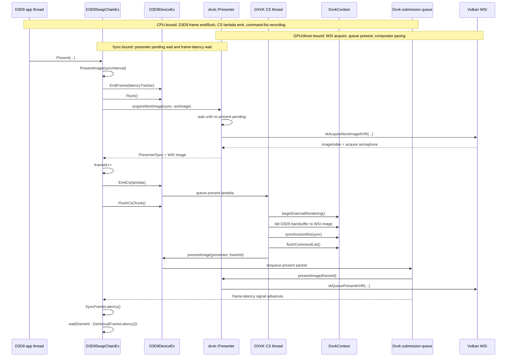
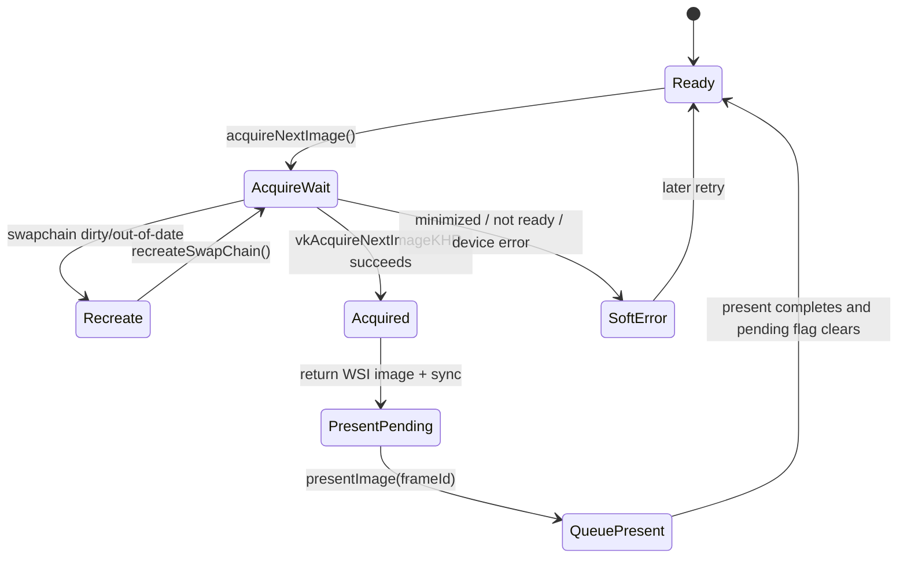
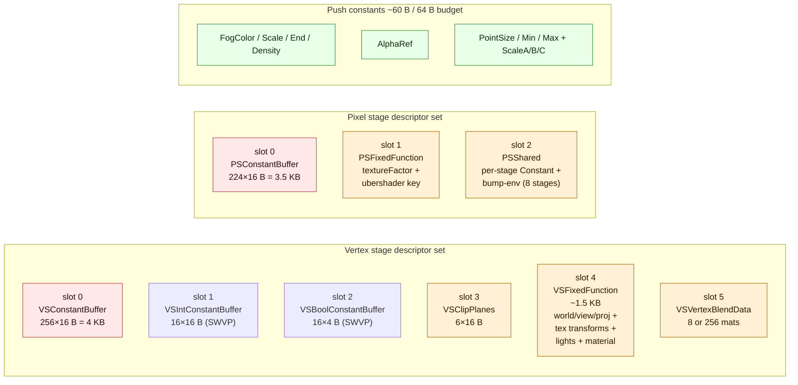

# DXVK D3D9 Present and Buffering Notes

Date: 2026-04-26

Scope:

- Local reference tree: `~/workspaces/dxvk`.
- Focus: D3D9 present path, frame-latency pacing, and swapchain buffering strategy.
- Main files inspected:
  - `~/workspaces/dxvk/src/d3d9/d3d9_swapchain.cpp`
  - `~/workspaces/dxvk/src/dxvk/dxvk_presenter.cpp`
  - `~/workspaces/dxvk/src/dxvk/dxvk_device.cpp`
  - `~/workspaces/dxvk/src/dxvk/dxvk_queue.cpp`

## Bound Legend

- CPU-bound: D3D9 swapchain/device code, CS lambda construction, command-list recording, and submission-queue bookkeeping.
- GPU/driver-bound: Vulkan WSI acquire/present, command-list execution, swapchain image ownership, and compositor/driver pacing.
- Sync-bound: CPU waits on WSI fences, presenter pending state, and frame-latency signals.

## Present Sequence

DXVK's D3D9 present path separates four concerns:

- End/flush the D3D9 frame.
- Acquire a WSI image before emitting present work.
- Execute the backbuffer-to-WSI blit on the CS thread.
- Pace the app thread with a frame-latency signal, capped by backbuffer count.



Key observed rules:

- `D3D9SwapChainEx::PresentImage()` calls `EndFrame()`, `Flush()`, then `Presenter::acquireNextImage()` before queuing the CS present lambda.
- The CS lambda performs the present blit, synchronizes WSI semaphores, flushes the command list, and calls `DxvkDevice::presentImage()`.
- `SyncFrameLatency()` waits on `frameLatencySignal` for `frameId - GetActualFrameLatency()`.
- `GetActualFrameLatency()` clamps the device frame latency by `BackBufferCount + 1`.

## Presenter State



Important ownership:

- `Presenter` owns the Vulkan swapchain, WSI images, image index, semaphores/fences, present mode, and `m_presentPending`.
- `D3D9SwapChainEx` owns D3D9 backbuffers and frame-id pacing policy.
- `DxvkDevice` owns command submission and delegates present packets to the submission queue.

## Buffering Strategy

```mermaid
flowchart LR
  subgraph CPU["CPU-bound: D3D9 + CS recording"]
    AppRT[D3D9 render target backbuffer 0]
    CSBlit[CS present blit]
    CmdList[flushed Vulkan command list]
    Queue[graphics queue submit]
    AppWait[SyncFrameLatency wait]
  end

  subgraph GPUDriver["GPU/driver-bound: Vulkan WSI"]
    Presenter[Presenter swapchain]
    WSI0[WSI image N]
    PresentQueue[vkQueuePresentKHR]
    FrameSignal[frameLatencySignal]
  end

  subgraph Sync["Sync-bound pacing"]
    Cap[actual latency = min(device latency, BackBufferCount + 1)]
    BackBufferCount[BackBufferCount]
    DeviceLatency[device frame latency]
  end

  AppRT -->|sample/blit source| CSBlit
  Presenter --> WSI0
  WSI0 -->|blit destination| CSBlit
  CSBlit --> CmdList
  CmdList --> Queue
  Queue --> PresentQueue
  PresentQueue --> FrameSignal
  FrameSignal --> AppWait

  BackBufferCount --> Cap
  DeviceLatency --> Cap
  Cap --> AppWait

  classDef cpu fill:#eaf4ff,stroke:#2f6fad,color:#0b2239
  classDef gpu fill:#fff0d6,stroke:#b26b00,color:#2b1900
  classDef sync fill:#ffe8e8,stroke:#b64242,color:#2b0d0d
  class AppRT,CSBlit,CmdList,Queue cpu
  class Presenter,WSI0,PresentQueue,FrameSignal gpu
  class AppWait,Cap,BackBufferCount,DeviceLatency sync
```

DXVK does not present the D3D9 backbuffer directly. The app renders into a normal D3D9 image, then present acquires a WSI image and blits the D3D9 image into it. This gives a clean separation between render-target lifetime and platform WSI lifetime.

Latency is bounded by a frame-id signal rather than by forcing full completion of the just-submitted present. That distinction matters for dxmt9: the app should only wait when it gets more than the effective latency ahead, not every time a present reaches the encode path.

## Bound Classification

| Region | Bound type | Why it matters for dxmt9 |
|---|---|---|
| `D3D9SwapChainEx::PresentImage()` pre-submit work | CPU-bound | Comparable to dxmt9 `DeviceImpl::present()` plus `CommandQueue::submitPresent()`. |
| `Presenter::acquireNextImage()` | GPU/driver-bound with CPU sync | Closest analogue to CAMetalLayer drawable acquisition. |
| CS present lambda | CPU-bound encode until queue submit | Similar to dxmt9 encode-thread chunk replay. |
| Vulkan queue present | GPU/driver-bound | Similar to Metal command buffer present/compositor pacing. |
| `SyncFrameLatency()` | Sync-bound | This is the desired pacing model: wait on a latency token, not on every present encode. |

## dxmt9 Adoption Points

- Keep the D3D9-facing swapchain source surface separate from the platform drawable.
- Treat drawable/image acquisition as a present subsystem responsibility, not a draw encoder side effect.
- Drive app-thread pacing from a frame-latency token derived from present completion or queue submission completion.
- Apply the DXVK-like cap `min(maxFrameLatency, BackBufferCount + 1)` only as a latency-bound rule, not as a forced synchronous flush.
- Avoid defaulting present splitting unless command-buffer overhead is proven lower than the wait it removes.

## Uniform Binding and Per-Frequency State

Date: 2026-05-07

Scope: how DXVK splits the D3D9 uniform / FFP / render-state working set across Vulkan binding slots, push constants, and per-frame ring buffers. Captured to inform dxmt9's DrawUniforms split (see `docs/perfomance-bottleneck.md`).

### Binding Slot Layout

DXVK distributes uniforms across multiple Vulkan UBO slots, split by stage and update frequency. There is no monolithic per-draw uniform buffer.



| VS slot | Buffer | Contents | Size |
|---:|---|---|---:|
| 0 | `VSConstantBuffer` | VS float constants | 256×16 B |
| 1 | `VSIntConstantBuffer` | VS int constants (SWVP only; HW VP packs into spec const) | 16×16 B |
| 2 | `VSBoolConstantBuffer` | VS bool constants (SWVP only) | 16×4 B |
| 3 | `VSClipPlanes` | User clip planes (up to 6) | 6×16 B |
| 4 | `VSFixedFunction` (`D3D9FixedFunctionVS`) | FFP world/view/normal/proj + 8 texture transforms + viewport + ambient + 8 lights + material + tween + key | ~1.5 KB |
| 5 | `VSVertexBlendData` | Blending matrices | 8 or 256 |

| PS slot | Buffer | Contents | Size |
|---:|---|---|---:|
| 0 | `PSConstantBuffer` | PS float constants | 224×16 B |
| 1 | `PSFixedFunction` (`D3D9FixedFunctionPS`) | textureFactor + ubershader key | ~32 B |
| 2 | `PSShared` (`D3D9SharedPS`) | Per-stage Constant + bump-env + bump-env LScale/LOffset (8 stages) | ~512 B |

References:
- `~/workspaces/dxvk/src/dxso/dxso_util.h:23-31` — VS slot enumeration.
- `~/workspaces/dxvk/src/d3d9/d3d9_state.h:173-189` — `D3D9FixedFunctionVS` layout.
- `~/workspaces/dxvk/src/d3d9/d3d9_state.h:241-244` — `D3D9FixedFunctionPS`.
- `~/workspaces/dxvk/src/d3d9/d3d9_state.h:255-263` — `D3D9SharedPS`.

### Push Constants for Scalar Render State

DXVK uses Vulkan push constants for ~60 B of small render-state scalars instead of a UBO. Total budget is `MaxSharedPushDataSize=64` (`d3d9_limits.h:23`).

| Field | Bytes | Reference |
|---|---:|---|
| FogColor | 12 | `d3d9_state.h:37-51` |
| FogScale / FogEnd / FogDensity | 12 | same |
| AlphaRef | 4 | same |
| PointSize / PointSizeMin / PointSizeMax | 12 | same |
| PointScaleA / PointScaleB / PointScaleC | 12 | same |

Updates use `UpdatePushConstant<offset, length>()` (`d3d9_device.cpp:6251-6256`) which calls `ctx->pushData()` only on dirty fields. Vertex/pixel shader constant registers do **not** go through push constants.

### Dirty Tracking and Upload

```mermaid
sequenceDiagram
  participant App as D3D9 app
  participant Dev as D3D9DeviceEx
  participant Cset as D3D9ConstantSets (per stage)
  participant Ring as Per-frame ring buffer
  participant Vk as Vulkan descriptor set

  App->>Dev: SetVertexShaderConstantF(start, count, data)
  Dev->>Cset: dirty = true (if range overlaps shader max-index)
  Dev->>Cset: maxChangedConstF = max(prev, start + count)
  Note over Cset: bound region tracked, not individual indices

  App->>Dev: Draw(...)
  Dev->>Cset: UploadConstants
  alt cset.dirty
    Cset->>Ring: AllocSlice(maxChangedConstF * 16 B)
    Note over Ring: sub-allocate from frame ring; no fresh buffer alloc
    Ring-->>Cset: slice + GPU offset
    Cset->>Vk: vkCmdBindDescriptorSet(slot=0, slice)
    Cset->>Cset: dirty = false
  else not dirty
    Note over Cset: skip upload; reuse last bound slice
  end

  App->>Dev: SetRenderState(D3DRS_FOGCOLOR, ...)
  Dev->>Vk: pushData(offset=0, length=12) (push constant only)
```

Every shader-stage `D3D9ConstantSets` carries:

- `dirty: bool` — set on `SetVertexShaderConstantF/I/B`, cleared after upload.
- `maxChangedConstF / maxChangedConstI / maxChangedConstB` — highest-index-set per category. The next upload only re-sends `[0..maxChanged]` rather than the entire 256/224 register file (`d3d9_device.cpp:8306-8330`).

`UploadConstants` (`d3d9_device.cpp:6208-6217`) early-exits if `!dirty`, then calls `UploadConstantSet<>()` or `UploadSoftwareConstantSet()`. Each call sub-allocates from a per-frame ring (`constSet.buffer.Alloc(size)` in `d3d9_constant_buffer.cpp:44-74`) — no fresh buffer creation per draw.

Per-shader-bind reset: `maxChangedConst*` reset to 0 on shader bind (`d3d9_device.cpp:125-127`).

### FFP Buffers — Full Re-upload Per Draw

Unlike shader constants, FFP buffers do **not** track sub-buffer dirty regions. `m_vsFixedFunction.AllocSlice()` allocates a fresh ring slice and the entire `D3D9FixedFunctionVS` (~1.5 KB) is rewritten. Same for `D3D9FixedFunctionPS` (~32 B). Acceptable because the FFP path is small and most apps either always use FFP or never use it.

### dxmt9 Adoption Points

- **Per-stage split first.** FS does not need vsFloatConst (4096 B). Splitting `DrawUniforms` into VS-only and FS-only halves removes 4 KB of FS uniform binding per draw.
- **Range tracking on float constants.** Mirror `maxChangedConstF/I/B` in dxmt9's PE shadow / payload path. Most D3D9 FFP apps use ≪256 vs constants; uploading only `[0..maxChanged]` is a free win.
- **Push constants for the scalar render state.** `setVertexBytes` / `setFragmentBytes` are the Metal equivalent of Vulkan push constants. fog, alpha ref, viewport halfPixelFixup, vertexBaseIndex are all push-constant-sized (≤64 B total). `setFragmentBytes` is already exposed in `winemetal`; `setVertexBytes` needs a small bridge addition.
- **Sub-allocate from a per-frame ring**, not per-draw. dxmt9 already does this for transient uploads after the slab coalescing change (`reserveTransientBuffer`); reuse the same path for the new per-frequency UBOs.
- **Keep FFP transforms as a separate UBO** — `VSFixedFunction` worth in DXVK terms. dxmt9's current single struct mixes shader constants and FFP into one 9 KB block; separating them lets FFP-only apps skip the shader-constant write entirely and vice-versa.
