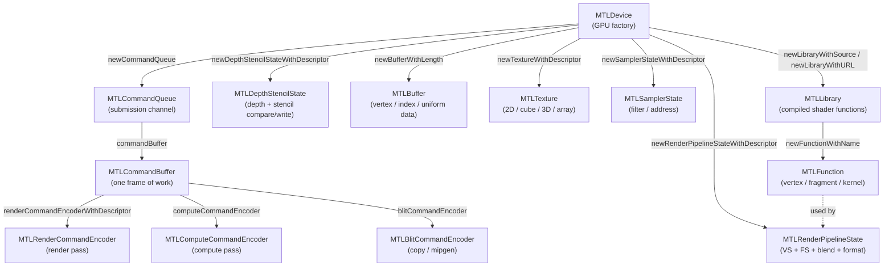
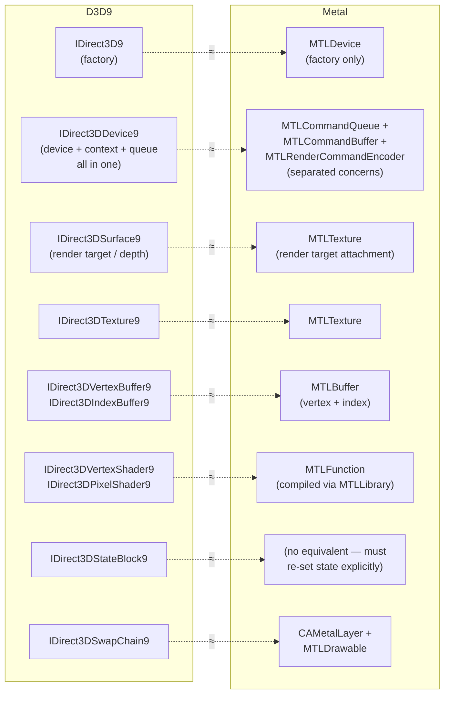
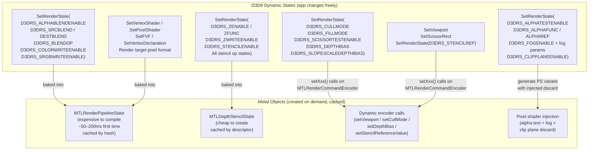

# Metal API Research Notes for dxmt9

Sources: Apple Metal Programming Guide, WWDC 2014/2018/2019/2020/2022 sessions,
MoltenVK source (KhronosGroup/MoltenVK), DXVK d3d9 source (doitsujin/dxvk),
d3d9-webgl (LostMyCode/d3d9-webgl).

---

## Metal Object Hierarchy



## D3D9 vs Metal Concept Mapping



---

## 1. Metal Device and Queue Architecture

### 1.1 MTLDevice Creation and Capabilities

`MTLDevice` is the root object of the entire Metal API. It represents a single physical
GPU and is the factory for every other Metal object. There is no concept of a device
context separate from the device itself.

```objc
id<MTLDevice> device = MTLCreateSystemDefaultDevice();
// On multi-GPU Macs:
NSArray<id<MTLDevice>> *devices = MTLCopyAllDevices();
```

The device exposes GPU family tiers through the `supportsFamily:` query:

```objc
[device supportsFamily:MTLGPUFamilyApple8]   // Apple silicon
[device supportsFamily:MTLGPUFamilyMac2]     // Intel/AMD Macs
[device supportsFamily:MTLGPUFamilyCommon2]  // Common baseline
```

MoltenVK interrogates these in `MVKMTLDeviceCapabilities` using pattern:
`[mtlDev supportsFamily:MTLGPUFamily##gpuFam]` for Apple1-10, Mac1-2, Common1-3,
and Metal version tiers (MetalFeatureSet based families have been superseded by
GPUFamily in Metal 3+).

Key capability properties on `id<MTLDevice>`:
- `name` — human-readable GPU name
- `registryID` — unique identifier surviving reboots (MoltenVK uses this for device
  identity in Vulkan)
- `maxThreadsPerThreadgroup` — compute limits
- `supportsRaytracing` — hardware RT support
- `argumentBuffersSupport` — tier 1 or tier 2 (tier 2 = bindless resources)
- `readWriteTextureSupport` — whether read/write textures are supported
- `areProgrammableSamplePositionsSupported`
- `currentAllocatedSize` — GPU memory currently allocated

All persistent objects are created from `id<MTLDevice>`:
```objc
[device newCommandQueue]
[device newBufferWithLength:options:]
[device newTextureWithDescriptor:]
[device newRenderPipelineStateWithDescriptor:error:]
[device newDepthStencilStateWithDescriptor:]
[device newSamplerStateWithDescriptor:]
[device newLibraryWithSource:options:error:]
[device newLibraryWithURL:error:]       // precompiled .metallib
```

**D3D9 comparison**: D3D9 exposes capabilities through `IDirect3D9::GetDeviceCaps()`
returning a `D3DCAPS9` struct. Metal's capability model is query-based rather than a
monolithic caps structure. The D3D9 device conflates device creation, resource
management, and command submission into one object. Metal separates these concerns
across `MTLDevice` (resources), `MTLCommandQueue` (submission), and
`MTLCommandBuffer` (recording).

### 1.2 MTLCommandQueue Lifecycle

```objc
id<MTLCommandQueue> commandQueue = [device newCommandQueue];
// Optional capacity hint:
id<MTLCommandQueue> queue = [device newCommandQueueWithMaxCommandBufferCount:64];
```

A command queue is a channel to the GPU. It maintains an ordered sequence of command
buffers and submits them in order. Metal supports multiple concurrent queues on one
device. Queues are long-lived and should be created once at initialization, not per
frame.

Properties:
- `device` — back-reference to the owning MTLDevice
- `label` — debug identifier

MoltenVK maps one Vulkan queue family to one or more Metal command queues.

**D3D9 comparison**: D3D9 has no explicit queue concept. All commands go to the
device's implicit command stream. Metal's queue is the closest analog to D3D9's
immediate context, but unlike D3D9, the queue only sequences work — it does not
record commands.

### 1.3 MTLCommandBuffer Submission Model

Command buffers are obtained from a queue, filled with encoded commands, then
committed. They execute in queue order but may overlap on GPU.

```objc
id<MTLCommandBuffer> commandBuffer = [commandQueue commandBuffer];
// or, for performance with manually managed lifetimes:
id<MTLCommandBuffer> commandBuffer = [commandQueue commandBufferWithUnretainedReferences];
```

Key lifecycle methods:
```objc
[commandBuffer commit];              // Enqueue for GPU execution
[commandBuffer waitUntilCompleted];  // CPU blocks until GPU done (avoid in hot path)
[commandBuffer addCompletedHandler:^(id<MTLCommandBuffer> cb) {
    // Called asynchronously on completion; use for semaphore signaling
}];
[commandBuffer addScheduledHandler:^(id<MTLCommandBuffer> cb) {
    // Called when the buffer has been scheduled for execution
}];
```

Status values: `MTLCommandBufferStatusNotEnqueued`, `Enqueued`, `Committed`,
`Scheduled`, `Completed`, `Error`.

Presentation integrates into the command buffer:
```objc
[commandBuffer presentDrawable:drawable];  // Present after GPU work
[commandBuffer commit];
```

**Typical per-frame pattern** (triple buffering):
```objc
dispatch_semaphore_wait(frameSemaphore, DISPATCH_TIME_FOREVER); // max 3 frames in flight
id<MTLCommandBuffer> cb = [commandQueue commandBuffer];
// ... encode work ...
[cb addCompletedHandler:^(id<MTLCommandBuffer> b) {
    dispatch_semaphore_signal(frameSemaphore);
}];
[cb presentDrawable:drawable];
[cb commit];
```

**D3D9 comparison**: D3D9 is an immediate-mode API — `DrawPrimitive()` executes
commands into a hidden command stream with no explicit buffer boundary. `EndScene()`
and `Present()` form an implicit frame boundary. DXVK's analysis shows `BeginScene`
and `EndScene` are largely no-ops in practice ("some games don't even call them"),
with actual flush happening at `Present()`. Metal requires explicit command buffer
commit. A dxmt9 translation layer needs to decide when to commit: per-frame at
`Present()` is the natural mapping, with possible mid-frame splits for render target
changes that require separate render passes.

---

## 2. Metal Render Pass Architecture

For encoder ownership and render-pass continuation models, see
[Metal Render-Pass Lifecycle](metal-render-pass-lifecycle.md).

### 2.1 MTLRenderPassDescriptor vs D3D9 BeginScene/EndScene

Metal's rendering model is based on explicit render passes. Every draw call occurs
inside a `MTLRenderCommandEncoder`, which is created from a `MTLRenderPassDescriptor`.
The descriptor fully specifies the output attachments and their load/store behavior
before any command is encoded.

```objc
MTLRenderPassDescriptor *rpd = [MTLRenderPassDescriptor renderPassDescriptor];
// Color attachment 0
rpd.colorAttachments[0].texture     = colorTexture;
rpd.colorAttachments[0].loadAction  = MTLLoadActionClear;
rpd.colorAttachments[0].clearColor  = MTLClearColorMake(r, g, b, a);
rpd.colorAttachments[0].storeAction = MTLStoreActionStore;
// Depth attachment
rpd.depthAttachment.texture     = depthTexture;
rpd.depthAttachment.loadAction  = MTLLoadActionClear;
rpd.depthAttachment.clearDepth  = 1.0;
rpd.depthAttachment.storeAction = MTLStoreActionDontCare; // discard if not sampled
// Stencil attachment (may share texture with depth on D24S8)
rpd.stencilAttachment.texture     = depthStencilTexture;
rpd.stencilAttachment.loadAction  = MTLLoadActionClear;
rpd.stencilAttachment.clearStencil = 0;
rpd.stencilAttachment.storeAction = MTLStoreActionDontCare;
```

The encoder is then created and commands are recorded:
```objc
id<MTLRenderCommandEncoder> enc =
    [commandBuffer renderCommandEncoderWithDescriptor:rpd];
// ... draw calls ...
[enc endEncoding];
```

### 2.2 Color, Depth, and Stencil Attachments

Up to 8 color attachments are supported (4 is the minimum guaranteed). Depth and
stencil can share a combined pixel format such as `MTLPixelFormatDepth24Unorm_Stencil8`
or `MTLPixelFormatDepth32Float_Stencil8`. When sharing, both `depthAttachment.texture`
and `stencilAttachment.texture` point to the same `MTLTexture`.

Load actions:
- `MTLLoadActionClear` — fill the attachment with a clear value at pass start
- `MTLLoadActionLoad` — preserve existing texture content
- `MTLLoadActionDontCare` — undefined on load (fastest when you will overwrite all pixels)

Store actions:
- `MTLStoreActionStore` — write results to texture memory
- `MTLStoreActionDontCare` — discard tile contents (fast; used for transient depth)
- `MTLStoreActionMultisampleResolve` — resolve MSAA to single-sample resolve texture
- `MTLStoreActionStoreAndMultisampleResolve` — store multisample and resolve

On Apple TBDR GPUs, `DontCare` on intermediate render targets avoids system memory
traffic entirely, since tile memory is never flushed.

### 2.3 MTLRenderCommandEncoder Lifecycle

```objc
id<MTLRenderCommandEncoder> enc =
    [commandBuffer renderCommandEncoderWithDescriptor:rpd];

// Set pipeline state (must be set before draws)
[enc setRenderPipelineState:pipelineState];

// Set depth/stencil state
[enc setDepthStencilState:depthStencilState];

// Dynamic state (set per draw or as needed)
[enc setCullMode:MTLCullModeBack];
[enc setFrontFacingWinding:MTLWindingCounterClockwise];
[enc setDepthBias:0 slopeScale:0 clamp:0];
[enc setViewport:(MTLViewport){x, y, w, h, znear, zfar}];
[enc setScissorRect:(MTLScissorRect){x, y, w, h}];

// Bind vertex buffers
[enc setVertexBuffer:vb offset:0 atIndex:0];
// Bind textures and samplers
[enc setFragmentTexture:tex atIndex:0];
[enc setFragmentSamplerState:sampler atIndex:0];
// Bind constant buffers (uniforms)
[enc setVertexBuffer:uniformBuf offset:0 atIndex:1];
[enc setFragmentBuffer:uniformBuf offset:0 atIndex:0];

// Draw
[enc drawPrimitives:MTLPrimitiveTypeTriangle vertexStart:0 vertexCount:3];
[enc drawIndexedPrimitives:MTLPrimitiveTypeTriangle
               indexCount:indexCount
                indexType:MTLIndexTypeUInt16
              indexBuffer:indexBuffer
        indexBufferOffset:0];

[enc endEncoding];
```

MoltenVK uses three types of encoders in `MVKCommandBuffer`:
- `MTLRenderCommandEncoder` — graphics draws
- `MTLComputeCommandEncoder` — compute dispatches
- `MTLBlitCommandEncoder` — copies, fills, mipmap generation, texture-buffer blits

Only one encoder type can be active at a time on a command buffer. Switching requires
`endEncoding` on the current encoder.

### 2.3b D3D9 BeginScene → Metal Render Pass Flow

```mermaid
sequenceDiagram
    participant App as D3D9 Application
    participant Dev as IDirect3DDevice9
    participant MTL as Metal (dxmt9 translation)

    App->>Dev: Clear(D3DCLEAR_TARGET|D3DCLEAR_ZBUFFER, color, 1.0, 0)
    note over MTL: Store clear params;\ndefer to next pass loadAction

    App->>Dev: BeginScene()
    note over MTL: No-op (or validation only)

    App->>Dev: SetRenderTarget(0, pSurface)
    note over MTL: If RT changed: endEncoding previous pass\nCreate new MTLRenderPassDescriptor

    App->>Dev: DrawIndexedPrimitive(...)
    note over MTL: [First draw in frame]\nCreate MTLRenderCommandEncoder\nApply deferred clear as loadAction=Clear\nSet PSO, DSS, encode draw

    App->>Dev: DrawIndexedPrimitive(...)
    note over MTL: Continue same encoder\n(same RT, no barrier needed)

    App->>Dev: EndScene()
    note over MTL: Optional encoder end\n(or defer to Present)

    App->>Dev: Present(...)
    note over MTL: endEncoding\npresentDrawable(nextDrawable)\ncommandBuffer.commit()
```

### 2.4 Clear Operations: D3D9 Clear() vs Metal loadAction

D3D9 `IDirect3DDevice9::Clear(Count, pRects, Flags, Color, Z, Stencil)` clears
arbitrary rectangles at any point between `BeginScene` and `EndScene`. It can clear
color, depth, and stencil independently.

Metal has no mid-pass clear. Clearing is expressed as `loadAction = MTLLoadActionClear`
on the render pass descriptor, which fires atomically when the pass begins. This is the
primary structural mismatch.

**Translation strategies**:

1. **Full-screen clear before any draw**: If `Clear()` is called with no draws
   preceding it in the scene, and it covers the full viewport, the clear maps to
   `loadAction = MTLLoadActionClear` on the next render pass. This is the common case
   (games clearing the backbuffer at frame start).

2. **Partial-region clear or mid-scene clear**: Must be emulated with a fill draw or
   a Metal `fillBuffer`/`clearTexture` through a blit encoder followed by a new render
   pass with `loadAction = MTLLoadActionLoad`. Alternatively, a fullscreen triangle
   with color/depth write can emulate D3D9's partial clear.

3. **Separate depth/stencil clear flag**: D3D9 lets you clear depth without clearing
   color and vice versa. Metal models these as separate attachment load actions, so
   they can be independently set to `Clear` or `Load`.

4. **Render target change mid-scene**: D3D9 `SetRenderTarget()` during a scene forces
   a render pass boundary in Metal. The previous encoder must `endEncoding`, and a
   new `MTLRenderPassDescriptor` must be created for the new render target. The
   previous target's storeAction should be `Store`.

---

## 3. Pipeline State Objects (PSO)

### D3D9 State → Metal Bucket Mapping

The central challenge: D3D9 lets the app change any state at any time before a draw.
Metal requires baking most state into immutable objects compiled ahead of time.



### 3.1 MTLRenderPipelineDescriptor

Metal bakes the following state into an immutable `MTLRenderPipelineState`:
- Vertex shader function (`vertexFunction`)
- Fragment shader function (`fragmentFunction`)
- Vertex descriptor (`vertexDescriptor`)
- Per-color-attachment pixel format and blend state (`colorAttachments[]`)
- Depth attachment pixel format (`depthAttachmentPixelFormat`)
- Stencil attachment pixel format (`stencilAttachmentPixelFormat`)
- Sample count for MSAA (`rasterSampleCount`)
- Alpha-to-coverage (`alphaToCoverageEnabled`)
- Alpha-to-one (`alphaToOneEnabled`)

```objc
MTLRenderPipelineDescriptor *psd = [MTLRenderPipelineDescriptor new];
psd.label                      = @"MainPipeline";
psd.vertexFunction             = vertexFn;
psd.fragmentFunction           = fragmentFn;
psd.vertexDescriptor           = vertexDesc;
psd.colorAttachments[0].pixelFormat = MTLPixelFormatBGRA8Unorm;
psd.colorAttachments[0].blendingEnabled             = YES;
psd.colorAttachments[0].rgbBlendOperation           = MTLBlendOperationAdd;
psd.colorAttachments[0].sourceRGBBlendFactor        = MTLBlendFactorSourceAlpha;
psd.colorAttachments[0].destinationRGBBlendFactor   = MTLBlendFactorOneMinusSourceAlpha;
psd.colorAttachments[0].alphaBlendOperation         = MTLBlendOperationAdd;
psd.colorAttachments[0].sourceAlphaBlendFactor      = MTLBlendFactorOne;
psd.colorAttachments[0].destinationAlphaBlendFactor = MTLBlendFactorZero;
psd.colorAttachments[0].writeMask                   = MTLColorWriteMaskAll;
psd.depthAttachmentPixelFormat   = MTLPixelFormatDepth32Float_Stencil8;
psd.stencilAttachmentPixelFormat = MTLPixelFormatDepth32Float_Stencil8;
psd.rasterSampleCount = 1;

NSError *error;
id<MTLRenderPipelineState> pso =
    [device newRenderPipelineStateWithDescriptor:psd error:&error];
```

PSO compilation is expensive (tens to hundreds of milliseconds). It should happen
during loading, not on the draw path. MoltenVK uses `getOrCompilePipeline` with lazy
compilation on first use of a unique PSO key.

### 3.2 Vertex Descriptor — Mapping from D3D9 FVF / Vertex Declaration

Metal's vertex descriptor specifies vertex input layout, analogous to D3D9 FVF flags
or `IDirect3DVertexDeclaration9`.

```objc
MTLVertexDescriptor *vd = [MTLVertexDescriptor new];

// Attribute: position at offset 0 from buffer 0
vd.attributes[0].format      = MTLVertexFormatFloat3; // POSITION
vd.attributes[0].offset      = 0;
vd.attributes[0].bufferIndex = 0;

// Attribute: normal at offset 12
vd.attributes[1].format      = MTLVertexFormatFloat3; // NORMAL
vd.attributes[1].offset      = 12;
vd.attributes[1].bufferIndex = 0;

// Attribute: diffuse color at offset 24 (D3DCOLOR = BGRA8 in D3D9)
vd.attributes[2].format      = MTLVertexFormatUChar4Normalized_BGRA; // maps D3DCOLOR
vd.attributes[2].offset      = 24;
vd.attributes[2].bufferIndex = 0;

// Attribute: texcoord0 at offset 28
vd.attributes[3].format      = MTLVertexFormatFloat2;
vd.attributes[3].offset      = 28;
vd.attributes[3].bufferIndex = 0;

// Buffer layout: one vertex buffer, interleaved stride
vd.layouts[0].stride       = 36; // total bytes per vertex
vd.layouts[0].stepFunction = MTLVertexStepFunctionPerVertex;
vd.layouts[0].stepRate     = 1;
```

**D3D9 FVF to Metal vertex format mapping:**

| D3D9 FVF component     | Metal format                          | Notes                                 |
|------------------------|---------------------------------------|---------------------------------------|
| `D3DFVF_XYZ`           | `MTLVertexFormatFloat3`               | 3-float position                      |
| `D3DFVF_XYZRHW`        | `MTLVertexFormatFloat4`               | Pre-transformed; bypass vertex shader |
| `D3DFVF_NORMAL`        | `MTLVertexFormatFloat3`               | Normal vector                         |
| `D3DFVF_DIFFUSE`       | `MTLVertexFormatUChar4Normalized_BGRA`| D3DCOLOR is BGRA byte order           |
| `D3DFVF_SPECULAR`      | `MTLVertexFormatUChar4Normalized_BGRA`| Same BGRA layout                      |
| `D3DFVF_TEX1` (float2) | `MTLVertexFormatFloat2`               | UV coordinates                        |
| `D3DFVF_PSIZE`         | `MTLVertexFormatFloat`                | Point size                            |

For `D3DFVF_XYZRHW` (pre-transformed positions), the vertex shader must be bypassed
or written to pass through the position unchanged after converting from D3D9's
screen-space convention (pixel coordinates + 0.5 offset) to Metal NDC.

Multi-stream binding (D3D9 `SetStreamSource` with multiple stream indices) maps to
multiple buffer indices in Metal's vertex descriptor — each stream becomes a separate
buffer slot with its own layout descriptor.

**D3D9 `IDirect3DVertexDeclaration9`** maps more directly: each
`D3DVERTEXELEMENT9` entry becomes one `MTLVertexAttributeDescriptor`.

```
D3DVERTEXELEMENT9 { Stream, Offset, Type, Method, Usage, UsageIndex }
→ MTLVertexAttributeDescriptor { bufferIndex=Stream, offset=Offset, format=..., }
```

Usage-to-attribute-index mapping is shader-convention-dependent; for generated shaders
a fixed convention (position=0, normal=1, color=2, texcoord=3+n) works.

### 3.3 Depth-Stencil State

Depth-stencil state is a separate object in Metal:

```objc
MTLDepthStencilDescriptor *dsd = [MTLDepthStencilDescriptor new];
dsd.depthCompareFunction = MTLCompareFunctionLessEqual; // D3D9 default D3DCMP_LESSEQUAL
dsd.depthWriteEnabled    = YES;  // maps D3DRS_ZWRITEENABLE

MTLStencilDescriptor *sf = [MTLStencilDescriptor new];
sf.stencilFailureOperation   = MTLStencilOperationKeep;
sf.depthFailureOperation     = MTLStencilOperationKeep;
sf.depthStencilPassOperation = MTLStencilOperationReplace;
sf.stencilCompareFunction    = MTLCompareFunctionAlways;
sf.readMask  = 0xFF;
sf.writeMask = 0xFF;
dsd.frontFaceStencil = sf;
dsd.backFaceStencil  = sf;

id<MTLDepthStencilState> dss =
    [device newDepthStencilStateWithDescriptor:dsd];
[encoder setDepthStencilState:dss];
// Stencil reference value is dynamic:
[encoder setStencilReferenceValue:refValue];
```

**D3D9 depth compare function mapping:**

| D3D9 `D3DCMPFUNC`  | Metal `MTLCompareFunction`           |
|--------------------|--------------------------------------|
| `D3DCMP_NEVER`     | `MTLCompareFunctionNever`            |
| `D3DCMP_LESS`      | `MTLCompareFunctionLess`             |
| `D3DCMP_EQUAL`     | `MTLCompareFunctionEqual`            |
| `D3DCMP_LESSEQUAL` | `MTLCompareFunctionLessEqual`        |
| `D3DCMP_GREATER`   | `MTLCompareFunctionGreater`          |
| `D3DCMP_NOTEQUAL`  | `MTLCompareFunctionNotEqual`         |
| `D3DCMP_GREATEREQUAL`| `MTLCompareFunctionGreaterEqual`   |
| `D3DCMP_ALWAYS`    | `MTLCompareFunctionAlways`           |

### 3.4 Rasterizer State

Rasterizer state is partly baked into PSO and partly dynamic on the encoder:

**Baked into PSO** (`MTLRenderPipelineDescriptor`):
- `rasterSampleCount` — MSAA sample count
- `alphaToCoverageEnabled` — maps `D3DRS_ADAPTIVEMEGSSAMPLEDISABLE`

**Dynamic on encoder** (set per draw, not baked):
```objc
[enc setCullMode:MTLCullModeBack];      // D3DRS_CULLMODE
[enc setFrontFacingWinding:MTLWindingCounterClockwise]; // see coordinate section
[enc setTriangleFillMode:MTLTriangleFillModeFill];       // D3DRS_FILLMODE
[enc setDepthBias:bias slopeScale:slopeScale clamp:clamp]; // D3DRS_DEPTHBIAS
[enc setViewport:(MTLViewport){x, y, w, h, znear, zfar}];
[enc setScissorRect:(MTLScissorRect){x, y, w, h}];
```

**D3D9 cull mode mapping:**

| D3D9 `D3DCULL`    | Metal `MTLCullMode`       |
|-------------------|---------------------------|
| `D3DCULL_NONE`    | `MTLCullModeNone`         |
| `D3DCULL_CW`      | `MTLCullModeBack` (with winding flip; see §7.3) |
| `D3DCULL_CCW`     | `MTLCullModeFront` (with winding flip) |

### 3.5 Blend State

Blend state is baked per color attachment in `MTLRenderPipelineColorAttachmentDescriptor`:

**D3D9 blend factor mapping:**

| D3D9 `D3DBLEND`         | Metal `MTLBlendFactor`                      |
|-------------------------|---------------------------------------------|
| `D3DBLEND_ZERO`         | `MTLBlendFactorZero`                        |
| `D3DBLEND_ONE`          | `MTLBlendFactorOne`                         |
| `D3DBLEND_SRCCOLOR`     | `MTLBlendFactorSourceColor`                 |
| `D3DBLEND_INVSRCCOLOR`  | `MTLBlendFactorOneMinusSourceColor`         |
| `D3DBLEND_SRCALPHA`     | `MTLBlendFactorSourceAlpha`                 |
| `D3DBLEND_INVSRCALPHA`  | `MTLBlendFactorOneMinusSourceAlpha`         |
| `D3DBLEND_DESTALPHA`    | `MTLBlendFactorDestinationAlpha`            |
| `D3DBLEND_INVDESTALPHA` | `MTLBlendFactorOneMinusDestinationAlpha`    |
| `D3DBLEND_DESTCOLOR`    | `MTLBlendFactorDestinationColor`            |
| `D3DBLEND_INVDESTCOLOR` | `MTLBlendFactorOneMinusDestinationColor`    |
| `D3DBLEND_SRCALPHASAT`  | `MTLBlendFactorSourceAlphaSaturated`        |
| `D3DBLEND_BLENDFACTOR`  | `MTLBlendFactorBlendColor`                  |
| `D3DBLEND_INVBLENDFACTOR`| `MTLBlendFactorOneMinusBlendColor`         |

Blend constant color is set dynamically: `[enc setBlendColorRed:r green:g blue:b alpha:a]`

### 3.6 Key Challenge: D3D9 Dynamic Render States vs Metal Immutable PSOs

**This is the central translation difficulty.** D3D9 apps change render states
(`SetRenderState()`) between individual draw calls — e.g., toggling blending, changing
cull mode, enabling depth write. Each unique combination of states baked into a Metal
PSO is a distinct `MTLRenderPipelineState` object.

**PSO key composition**: The PSO cache key must capture every field that is baked:
- Shader programs (vertex + fragment function pointer or hash)
- Vertex descriptor layout
- Per-attachment pixel format and blend state
- Depth/stencil pixel format
- MSAA sample count

This means a single D3D9 draw call requires looking up or compiling a PSO based on
current state. The state space can be large but in practice most games use a small
number of unique combinations.

**Recommended approach (based on DXVK and MoltenVK patterns)**:

1. **Dirty flags + lazy PSO lookup**: Track which render states are dirty using
   a bitmask (analogous to `D3D9DeviceDirtyFlag` in DXVK). On each draw call, if
   relevant state is dirty, look up the PSO cache. Only compile if the key is new.

2. **PSO cache**: A hash map from PSO key struct to `id<MTLRenderPipelineState>`.
   The key must be hashable and comparable. DXVK uses `std::unordered_map` with
   custom hash. MoltenVK uses `std::unordered_map<MVKShaderModuleKey, ...>`.

3. **Separate depth-stencil state cache**: `MTLDepthStencilState` is also immutable.
   Maintain a similar cache keyed on `{depthTest, depthWrite, depthFunc, stencilOp,
   stencilFunc, stencilMask}`.

4. **Dynamic state for the rest**: Cull mode, fill mode, viewport, scissor, depth bias,
   stencil reference value, and blend constant do not require a new PSO — they are set
   dynamically on the encoder. This covers a significant portion of D3D9 render states.

5. **Avoid compilation on the draw path**: When a new PSO combination is first
   encountered, prefer async compilation (`newRenderPipelineStateWithDescriptor:
   completionHandler:`) or a pre-warm pass. DXVK uses pipeline library extensions for
   this; Metal has `MTLBinaryArchive` for serializing compiled PSOs to disk.

**D3D9 states that require a new PSO on change:**

| D3D9 Render State           | PSO field affected                              |
|-----------------------------|-------------------------------------------------|
| `D3DRS_ALPHABLENDENABLE`    | `colorAttachments[n].blendingEnabled`          |
| `D3DRS_BLENDOP`             | `colorAttachments[n].rgbBlendOperation`        |
| `D3DRS_SRCBLEND`            | `colorAttachments[n].sourceRGBBlendFactor`     |
| `D3DRS_DESTBLEND`           | `colorAttachments[n].destinationRGBBlendFactor`|
| `D3DRS_COLORWRITEENABLE`    | `colorAttachments[n].writeMask`                |
| `D3DRS_ALPHATESTENABLE`     | fragment shader variant (or discard in shader) |
| `D3DRS_ALPHAFUNC`           | fragment shader variant                        |
| `D3DRS_VERTEXBLEND`         | vertex shader variant                          |
| Pixel format of render target| `colorAttachments[n].pixelFormat`             |
| Active shader programs       | `vertexFunction`, `fragmentFunction`           |
| Vertex declaration           | `vertexDescriptor`                             |

**D3D9 states that are dynamic (no PSO change needed):**

| D3D9 Render State           | Metal encoder method                           |
|-----------------------------|------------------------------------------------|
| `D3DRS_CULLMODE`            | `setCullMode:`                                 |
| `D3DRS_FILLMODE`            | `setTriangleFillMode:`                         |
| `D3DRS_ZENABLE`             | `setDepthStencilState:` (separate DSS object)  |
| `D3DRS_ZWRITEENABLE`        | `setDepthStencilState:`                        |
| `D3DRS_ZFUNC`               | `setDepthStencilState:`                        |
| `D3DRS_STENCILENABLE`       | `setDepthStencilState:`                        |
| `D3DRS_STENCILFUNC`         | `setDepthStencilState:`                        |
| `D3DRS_STENCILREF`          | `setStencilReferenceValue:`                    |
| `D3DRS_BLENDFACTOR`         | `setBlendColorRed:green:blue:alpha:`           |
| `D3DRS_DEPTHBIAS`           | `setDepthBias:slopeScale:clamp:`               |
| `D3DRS_SLOPESCALEDEPTHBIAS` | `setDepthBias:slopeScale:clamp:`               |
| Viewport                    | `setViewport:`                                 |
| Scissor rect                | `setScissorRect:`                              |

---

## 4. Shaders in Metal

### 4.1 Metal Shading Language (MSL) vs D3D9 HLSL/Bytecode

D3D9 uses either assembly shader bytecode (sm1.x/sm2.x/sm3.0) or HLSL compiled to
bytecode. MSL is a C++14-based language specific to Apple's GPU toolchain.

There is no direct D3D9 bytecode-to-MSL compiler as of 2026. The practical options are:

1. **SPIRV-Cross**: Compile D3D9 HLSL to SPIR-V (via DXC or HLSL-to-SPIRV), then
   cross-compile SPIR-V to MSL using SPIRV-Cross. This is what MoltenVK does for
   Vulkan/SPIR-V. DXVK converts D3D9 shader bytecode to SPIR-V and could serve as
   a reference for the bytecode-to-SPIR-V step.

2. **Direct bytecode-to-MSL translation**: Parse D3D9 shader bytecode directly and
   emit MSL. More work, but avoids the SPIR-V intermediate.

3. **Generated MSL for fixed-function**: For the fixed-function pipeline, generate
   MSL source strings from the current render state (texture stage combiners,
   lighting, fog, alpha test). This is what d3d9-webgl does for GLSL.

MoltenVK's shader pipeline: SPIR-V → SPIRV-Cross → MSL → `newLibraryWithSource:` or
precompiled `.metallib`.

### 4.2 Shader Compilation Approach

```objc
// Option A: Compile from MSL source at runtime (slow, for dev/debug)
NSError *error;
id<MTLLibrary> library = [device newLibraryWithSource:mslSource
                                              options:nil
                                               error:&error];

// Option B: Load precompiled .metallib (fast, for shipping)
id<MTLLibrary> library = [device newLibraryWithURL:metallibURL error:&error];

// Option C: Default library (shaders compiled at app build time)
id<MTLLibrary> library = [device newDefaultLibrary];

// Extract function
id<MTLFunction> vertFn = [library newFunctionWithName:@"vertex_main"];
id<MTLFunction> fragFn = [library newFunctionWithName:@"fragment_main"];

// With specialization constants (analogous to DXVK's spec constants)
MTLFunctionConstantValues *constants = [MTLFunctionConstantValues new];
bool lightingEnabled = YES;
[constants setConstantValue:&lightingEnabled type:MTLDataTypeBool atIndex:0];
id<MTLFunction> fn = [library newFunctionWithName:@"vertex_main"
                               constantValues:constants
                                        error:&error];
```

`MTLFunctionConstantValues` is the Metal equivalent of DXVK's specialization constants
— they allow a single shader to behave differently based on compile-time-like flags
without recompiling the source, only relinking. This is useful for fixed-function
variant selection (lighting on/off, fog mode, texture stage count, etc.).

For a translation layer, a viable approach is:
- One "uber-shader" per pipeline shape with many function constants
- Cache compiled variants keyed on constant values

MoltenVK stores "compiled library variants" in `MVKShaderLibraryCache` indexed by
conversion configuration and specialization macro combinations.

### 4.3 Vertex Function and Fragment Function

MSL vertex function signature:
```metal
vertex VertexOut vertex_main(
    uint vertexID [[vertex_id]],
    const device Vertex* vertices [[buffer(0)]],
    constant Uniforms& uniforms  [[buffer(1)]])
{ ... }
```

Or with vertex descriptor (attributes bound by Metal runtime):
```metal
struct VertexIn {
    float4 position [[attribute(0)]];
    float3 normal   [[attribute(1)]];
    float4 color    [[attribute(2)]];
    float2 uv       [[attribute(3)]];
};

vertex VertexOut vertex_main(VertexIn in [[stage_in]],
                             constant Uniforms& uniforms [[buffer(1)]])
{ ... }
```

MSL fragment function:
```metal
fragment float4 fragment_main(
    VertexOut in [[stage_in]],
    texture2d<float> tex0 [[texture(0)]],
    sampler samp0         [[sampler(0)]],
    constant FragUniforms& uniforms [[buffer(0)]])
{
    return tex0.sample(samp0, in.uv) * in.color;
}
```

Shader attribute binding indices in MSL correspond to `MTLVertexAttributeDescriptor.
bufferIndex` for vertex inputs and `setFragmentTexture:atIndex:` for fragment textures.

### 4.4 Fixed-Function Pipeline Emulation via Generated Shaders

D3D9's fixed-function pipeline covers:
- Vertex transformation (World × View × Projection)
- Per-vertex Phong lighting (ambient + diffuse + specular, up to 8 lights)
- Texture coordinate generation (passthrough, camera-space, sphere map, reflection)
- Texture coordinate transforms (D3DTS_TEXTURE0–7)
- Texture stage combiners (8 stages, D3DTSS_COLOROP/ALPHAOP + args)
- Fog (linear, exp, exp²)
- Alpha test (8 comparison functions + reference value)
- Vertex blending / skinning
- Point sprites

**Shader generation strategy** (based on DXVK's `d3d9_fixed_function.cpp`):

The DXVK approach generates SPIR-V IR from current render state. For dxmt9, the
equivalent is generating MSL source or building MSL IR. The key data that feeds
shader generation:

```
FFShaderKey {
    // Vertex stage
    uint32_t lightCount;           // number of enabled lights
    uint8_t  lightTypes[8];        // D3DLIGHT_DIRECTIONAL/POINT/SPOT per light
    bool     hasNormal;            // FVF has normal vector
    bool     hasDiffuse;           // FVF has diffuse color
    bool     hasSpecular;
    uint8_t  texcoordCount;        // number of texture coordinate sets
    uint8_t  texgenFlags[8];       // per-stage: passthrough/cameraNormal/reflection/etc
    bool     hasTexTransform[8];   // per-stage transform matrix
    uint8_t  vertexBlend;          // disabled/1weight/2weight/3weight/tween
    bool     pointSprites;
    bool     positionT;            // XYZRHW pre-transformed position

    // Pixel stage
    uint8_t  stageColorOp[8];      // D3DTOP_* per stage
    uint8_t  stageAlphaOp[8];
    uint8_t  stageColorArg1[8];    // D3DTA_* argument selectors
    uint8_t  stageColorArg2[8];
    uint8_t  stageAlphaArg1[8];
    uint8_t  stageAlphaArg2[8];
    uint8_t  stageCount;           // first stage with DISABLE colorop = end
    uint8_t  fogMode;              // D3DFOG_NONE/LINEAR/EXP/EXP2
    bool     fogRange;             // range-based vs vertex z fog
    uint8_t  alphaTestFunc;        // D3DCMP_* function
    bool     alphaTestEnable;
}
```

This key is hashed and used to look up or generate the MSL shader pair. The key
dimensions are large but in practice game apps use only a handful of unique
combinations.

**Texture stage combiners in MSL (pseudocode)**:
```metal
float4 prev = in.diffuseColor; // start with D3DTA_DIFFUSE
for each enabled stage i:
    float4 tex  = tex[i].sample(samp[i], uv[i]);
    float4 arg1 = select_arg(colorArg1[i], tex, prev, diffuse, specular, temp[i]);
    float4 arg2 = select_arg(colorArg2[i], ...);
    prev = apply_colorop(colorOp[i], arg1, arg2);
output = prev;
```

**D3D9 texture operation to MSL mapping:**

| D3D9 `D3DTOP_*`       | MSL equivalent                                         |
|-----------------------|--------------------------------------------------------|
| `DISABLE`             | `output = float4(0)` or stop combiner chain            |
| `SELECTARG1`          | `arg1`                                                 |
| `SELECTARG2`          | `arg2`                                                 |
| `MODULATE`            | `arg1 * arg2`                                          |
| `MODULATE2X`          | `clamp(arg1 * arg2 * 2, 0, 1)`                        |
| `MODULATE4X`          | `clamp(arg1 * arg2 * 4, 0, 1)`                        |
| `ADD`                 | `clamp(arg1 + arg2, 0, 1)`                             |
| `ADDSIGNED`           | `clamp(arg1 + arg2 - 0.5, 0, 1)`                      |
| `ADDSIGNED2X`         | `clamp((arg1 + arg2 - 0.5) * 2, 0, 1)`               |
| `SUBTRACT`            | `arg1 - arg2`                                          |
| `BLENDDIFFUSEALPHA`   | `lerp(arg2, arg1, diffuse.a)`                          |
| `BLENDTEXTUREALPHA`   | `lerp(arg2, arg1, tex.a)`                              |
| `BLENDFACTORALPHA`    | `lerp(arg2, arg1, blendfactor.a)`                      |
| `BLENDCURRENTALPHA`   | `lerp(arg2, arg1, prev.a)`                             |

**D3D lighting model in MSL vertex shader:**
```metal
float3 computeLight(float3 posW, float3 nrmW, Light light) {
    if (light.type == D3DLIGHT_DIRECTIONAL) {
        float NdotL = max(dot(nrmW, -light.dir), 0.0);
        return light.diffuse.rgb * material.diffuse.rgb * NdotL;
    } else if (light.type == D3DLIGHT_POINT) {
        float3 L = light.pos - posW;
        float dist = length(L);
        L = L / dist;
        float att = 1.0 / (light.att0 + light.att1*dist + light.att2*dist*dist);
        float NdotL = max(dot(nrmW, L), 0.0);
        return light.diffuse.rgb * material.diffuse.rgb * NdotL * att;
    }
    // spot: add cone angle falloff
}
```

---

## 5. Resources

### 5.1 MTLBuffer — Vertex, Index, and Constant Buffers

```objc
// Shared: CPU-writable, GPU-readable (for dynamic buffers)
id<MTLBuffer> vb = [device newBufferWithBytes:data
                                       length:size
                                      options:MTLResourceStorageModeShared];

// Private: GPU-only (fastest; upload via blit)
id<MTLBuffer> staticVB = [device newBufferWithLength:size
                                             options:MTLResourceStorageModePrivate];

// Managed: CPU updates sync'd to GPU on macOS (non-Apple silicon)
id<MTLBuffer> managedBuf = [device newBufferWithLength:size
                                               options:MTLResourceStorageModeManaged];
```

CPU write to shared/managed buffer:
```objc
void *ptr = [buffer contents];
memcpy(ptr, data, size);
// For managed storage on non-Apple silicon, notify GPU range is dirty:
[buffer didModifyRange:NSMakeRange(0, size)];
```

Minimum alignment for Metal buffers is typically 256 bytes for constant buffers (check
`MTLDevice.minimumConstantBufferAlignment`). Buffer binding:
```objc
[enc setVertexBuffer:vb offset:0 atIndex:0];
[enc setIndexBuffer:ib offset:0]; // passed to drawIndexed call
```

**D3D9 pool mapping:**

| D3D9 `D3DPOOL`      | Metal storage mode       | Notes                                          |
|---------------------|--------------------------|------------------------------------------------|
| `D3DPOOL_DEFAULT`   | `MTLResourceStorageModePrivate` | GPU-only; upload requires staging buffer  |
| `D3DPOOL_MANAGED`   | `MTLResourceStorageModeShared` or `Managed` | Driver manages copies; Metal equivalent is Shared on Apple silicon |
| `D3DPOOL_SYSTEMMEM` | `MTLResourceStorageModeShared` | CPU-accessible staging area              |
| `D3DPOOL_SCRATCH`   | `MTLResourceStorageModeShared` | Temporary CPU scratch                    |

MoltenVK's `applyBufferMemoryBarrier()` calls `synchronizeResource` on a blit encoder
for managed buffers when the host needs to read GPU-written data.

### 5.2 MTLTexture

```objc
MTLTextureDescriptor *td = [MTLTextureDescriptor
    texture2DDescriptorWithPixelFormat:MTLPixelFormatBGRA8Unorm
                                 width:width
                                height:height
                             mipmapped:YES];
td.usage        = MTLTextureUsageShaderRead | MTLTextureUsageRenderTarget;
td.storageMode  = MTLStorageModePrivate;
td.mipmapLevelCount = mipCount;
td.sampleCount  = 1;

id<MTLTexture> texture = [device newTextureWithDescriptor:td];
```

For MSAA render targets: `td.textureType = MTLTextureType2DMultisample; td.sampleCount = 4;`

Upload from CPU:
```objc
// For shared/managed textures:
MTLRegion region = MTLRegionMake2D(0, 0, width, height);
[texture replaceRegion:region mipmapLevel:0 withBytes:pixels bytesPerRow:bpr];

// For private textures, blit from a staging buffer:
id<MTLBlitCommandEncoder> blit = [cb blitCommandEncoder];
[blit copyFromBuffer:stagingBuf sourceOffset:0
    sourceBytesPerRow:bpr sourceBytesPerImage:0
           sourceSize:MTLSizeMake(w, h, 1)
    toTexture:texture destinationSlice:0 destinationLevel:0
    destinationOrigin:MTLOriginMake(0,0,0)];
[blit endEncoding];
```

**D3D9 format to Metal pixel format mapping (complete list):**

| D3D9 `D3DFMT_*`          | Metal `MTLPixelFormat`                    | Swizzle / notes                    |
|--------------------------|-------------------------------------------|------------------------------------|
| `D3DFMT_A8R8G8B8`        | `MTLPixelFormatBGRA8Unorm`               | Exact match (BGRA byte order)      |
| `D3DFMT_X8R8G8B8`        | `MTLPixelFormatBGRA8Unorm`               | Alpha forced to 1 in shader        |
| `D3DFMT_A8B8G8R8`        | `MTLPixelFormatRGBA8Unorm`               | —                                  |
| `D3DFMT_R5G6B5`          | `MTLPixelFormatB5G6R5Unorm`              | —                                  |
| `D3DFMT_A1R5G5B5`        | `MTLPixelFormatA1BGR5Unorm`              | needs swizzle                      |
| `D3DFMT_A4R4G4B4`        | `MTLPixelFormatABGR4Unorm`               | needs swizzle                      |
| `D3DFMT_X1R5G5B5`        | `MTLPixelFormatA1BGR5Unorm`              | alpha=1 in shader                  |
| `D3DFMT_A8`              | `MTLPixelFormatA8Unorm`                  | —                                  |
| `D3DFMT_L8`              | `MTLPixelFormatR8Unorm`                  | swizzle RGB=R in shader            |
| `D3DFMT_L16`             | `MTLPixelFormatR16Unorm`                 | swizzle RGB=R                      |
| `D3DFMT_A8L8`            | `MTLPixelFormatRG8Unorm`                 | R=lum, G=alpha; swizzle in shader  |
| `D3DFMT_V8U8`            | `MTLPixelFormatRG8Snorm`                 | signed normal map                  |
| `D3DFMT_Q8W8V8U8`        | `MTLPixelFormatRGBA8Snorm`               | —                                  |
| `D3DFMT_V16U16`          | `MTLPixelFormatRG16Snorm`                | —                                  |
| `D3DFMT_G16R16`          | `MTLPixelFormatRG16Unorm`                | —                                  |
| `D3DFMT_A2R10G10B10`     | `MTLPixelFormatBGR10A2Unorm`             | —                                  |
| `D3DFMT_A2B10G10R10`     | `MTLPixelFormatRGB10A2Unorm`             | —                                  |
| `D3DFMT_R16F`            | `MTLPixelFormatR16Float`                 | —                                  |
| `D3DFMT_G16R16F`         | `MTLPixelFormatRG16Float`                | —                                  |
| `D3DFMT_A16B16G16R16F`   | `MTLPixelFormatRGBA16Float`              | —                                  |
| `D3DFMT_R32F`            | `MTLPixelFormatR32Float`                 | —                                  |
| `D3DFMT_G32R32F`         | `MTLPixelFormatRG32Float`                | —                                  |
| `D3DFMT_A32B32G32R32F`   | `MTLPixelFormatRGBA32Float`              | —                                  |
| `D3DFMT_DXT1`            | `MTLPixelFormatBC1_RGBA`                 | —                                  |
| `D3DFMT_DXT2`            | `MTLPixelFormatBC2_RGBA`                 | premul alpha; no Metal distinction |
| `D3DFMT_DXT3`            | `MTLPixelFormatBC2_RGBA`                 | —                                  |
| `D3DFMT_DXT4`            | `MTLPixelFormatBC3_RGBA`                 | premul alpha                       |
| `D3DFMT_DXT5`            | `MTLPixelFormatBC3_RGBA`                 | —                                  |
| `D3DFMT_D16`             | `MTLPixelFormatDepth16Unorm`             | —                                  |
| `D3DFMT_D24S8`           | `MTLPixelFormatDepth24Unorm_Stencil8`   | macOS only; iOS uses D32FS8        |
| `D3DFMT_D24X8`           | `MTLPixelFormatDepth24Unorm_Stencil8`   | stencil unused                     |
| `D3DFMT_D32`             | `MTLPixelFormatDepth32Float`             | D3D9 D32 is fixed-point; close enough |
| `D3DFMT_D32F_LOCKABLE`   | `MTLPixelFormatDepth32Float`             | —                                  |

Note: `D3DFMT_D24S8` using `MTLPixelFormatDepth24Unorm_Stencil8` is only available
on macOS (not iOS/iPadOS). When targeting iOS, use `MTLPixelFormatDepth32Float_
Stencil8` instead and accept precision difference.

### 5.3 MTLSamplerState

```objc
MTLSamplerDescriptor *sd = [MTLSamplerDescriptor new];
sd.minFilter    = MTLSamplerMinMagFilterLinear;
sd.magFilter    = MTLSamplerMinMagFilterLinear;
sd.mipFilter    = MTLSamplerMipFilterLinear;
sd.sAddressMode = MTLSamplerAddressModeRepeat;
sd.tAddressMode = MTLSamplerAddressModeRepeat;
sd.rAddressMode = MTLSamplerAddressModeClampToEdge;
sd.maxAnisotropy = 1;  // 1–16
sd.compareFunction = MTLCompareFunctionNever; // for shadow maps: LessEqual
sd.lodMinClamp  = 0.0;
sd.lodMaxClamp  = FLT_MAX;
sd.normalizedCoordinates = YES; // D3D9 always uses normalized; NO for pixel-addressed

id<MTLSamplerState> sampler = [device newSamplerStateWithDescriptor:sd];
[enc setFragmentSamplerState:sampler atIndex:0];
```

**D3D9 sampler state mapping:**

| D3D9 `D3DSAMP_*`            | Metal equivalent                                    |
|-----------------------------|-----------------------------------------------------|
| `D3DSAMP_ADDRESSU`          | `sAddressMode`                                      |
| `D3DSAMP_ADDRESSV`          | `tAddressMode`                                      |
| `D3DSAMP_ADDRESSW`          | `rAddressMode`                                      |
| `D3DSAMP_MINFILTER`         | `minFilter` + `mipFilter`                           |
| `D3DSAMP_MAGFILTER`         | `magFilter`                                         |
| `D3DSAMP_MIPFILTER`         | `mipFilter` (None/Nearest/Linear)                   |
| `D3DSAMP_MIPMAPLODBIAS`     | `lodBias` (not all hardware supports; clamp to 0)   |
| `D3DSAMP_MAXMIPLEVEL`       | `lodMinClamp`                                       |
| `D3DSAMP_MAXANISOTROPY`     | `maxAnisotropy`                                     |
| `D3DSAMP_BORDERCOLOR`       | `borderColor` (limited enum: black/white only)      |

**D3D9 address mode mapping:**

| D3D9 `D3DTADDRESS_*`  | Metal `MTLSamplerAddressMode`         |
|-----------------------|---------------------------------------|
| `WRAP`                | `MTLSamplerAddressModeRepeat`         |
| `MIRROR`              | `MTLSamplerAddressModeMirrorRepeat`   |
| `CLAMP`               | `MTLSamplerAddressModeClampToEdge`    |
| `BORDER`              | `MTLSamplerAddressModeClampToBorderColor` |
| `MIRRORONCE`          | `MTLSamplerAddressModeMirrorClampToEdge` |

Note: Metal's border color is limited (`MTLSamplerBorderColorTransparentBlack`,
`OpaqueBlack`, `OpaqueWhite`). D3D9 supports arbitrary border colors (`D3DSAMP_
BORDERCOLOR`). Arbitrary border colors must be emulated in the fragment shader.

---

## 6. Presentation / Swapchain

### 6.1 CAMetalLayer Setup

`CAMetalLayer` is the bridge between Metal and the display system. It owns the
drawable pool and provides `MTLTexture` handles for rendering.

```objc
#import <QuartzCore/CAMetalLayer.h>

CAMetalLayer *metalLayer = [CAMetalLayer layer];
metalLayer.device          = device;
metalLayer.pixelFormat     = MTLPixelFormatBGRA8Unorm;  // or BGRA8Unorm_sRGB
metalLayer.framebufferOnly = YES;  // YES if no sampling/copy from drawable; faster
metalLayer.drawableSize    = CGSizeMake(width, height);
metalLayer.displaySyncEnabled = YES;   // NO for uncapped/immediate present
metalLayer.maximumDrawableCount = 3;   // triple buffering (2 or 3)
// Attach to a view's layer:
view.layer = metalLayer;
// Or for a CALayer sublayer:
[view.layer addSublayer:metalLayer];
```

For HDR/wide color:
```objc
metalLayer.pixelFormat = MTLPixelFormatRGBA16Float;       // HDR linear
metalLayer.colorspace  = CGColorSpaceCreateWithName(kCGColorSpaceDisplayP3);
metalLayer.wantsExtendedDynamicRangeContent = YES;
```

MoltenVK sets `framebufferOnly = NO` when swapchain images require transfer source or
sampling usage flags.

### 6.2 MTLDrawable / nextDrawable

```objc
id<CAMetalDrawable> drawable = [metalLayer nextDrawable];
if (!drawable) { /* skip frame */ return; }

id<MTLTexture> drawableTexture = drawable.texture;
```

`nextDrawable` may block if the drawable pool is exhausted (all drawables in flight).
This is the Metal equivalent of waiting on a vsync fence. With `maximumDrawableCount=3`
and `displaySyncEnabled=YES`, the call will block for at most one frame interval.

The drawable texture should be used as the color attachment texture for the final
render pass to screen.

### 6.3 Presenting the Frame — Equivalent of Present()

```objc
id<MTLCommandBuffer> cb = [commandQueue commandBuffer];

// Final render pass targeting the drawable
MTLRenderPassDescriptor *rpd = [MTLRenderPassDescriptor renderPassDescriptor];
rpd.colorAttachments[0].texture     = drawable.texture;
rpd.colorAttachments[0].loadAction  = MTLLoadActionClear;
rpd.colorAttachments[0].storeAction = MTLStoreActionStore;

id<MTLRenderCommandEncoder> enc = [cb renderCommandEncoderWithDescriptor:rpd];
// ... encode final blit/resolve draw ...
[enc endEncoding];

// Schedule presentation and commit
[cb presentDrawable:drawable];
// For capped frame rate:
// [cb presentDrawable:drawable afterMinimumDuration:1.0/60.0];
[cb commit];
```

**D3D9 IDirect3DSwapChain9::Present() mapping:**

| D3D9 Present behavior              | Metal equivalent                                   |
|------------------------------------|----------------------------------------------------|
| `Present(NULL, NULL, NULL, NULL)` | `[cb presentDrawable:drawable]; [cb commit]`       |
| `D3DPRESENT_INTERVAL_IMMEDIATE`   | `displaySyncEnabled = NO` on layer                 |
| `D3DPRESENT_INTERVAL_ONE`         | `displaySyncEnabled = YES` (default)               |
| Source/dest rect partial copy      | Render a textured quad to drawable region          |
| `GetFrontBufferData()`             | `[drawable.texture getBytes:...]` (if not framebufferOnly) |

DXVK's `Present()` flow: validate device state → update window context → call
`PresentImage()` → rotate backbuffers. Frame latency is capped to backbuffer count +1.

In a D3D9 translation layer, the backbuffer is an `MTLTexture` allocated by the layer.
If D3D9 `SetRenderTarget(0, backbuffer)` renders to the backbuffer, the final render
pass uses that texture as the color attachment and `drawable.texture` as the
presentation target. If they differ (e.g., different formats), a blit or fullscreen
copy draw is needed.

---

## 7. Key Translation Challenges

### 7.1 D3D9 Dynamic State vs Metal PSO Caching

This is detailed in §3.5. Summary of recommended architecture:

```
D3D9 SetRenderState() / SetTextureStageState() / SetVertexShader() / SetPixelShader()
    → dirty flag marking (no GPU action yet)

DrawPrimitive() / DrawIndexedPrimitive():
    → if (PSO dirty) {
        PSOKey key = buildKey(currentState);
        MTLRenderPipelineState *pso = psoCache.lookup(key);
        if (!pso) {
            pso = compilePSO(key);  // expensive; avoid on hot path
            psoCache.insert(key, pso);
        }
        [enc setRenderPipelineState:pso];
    }
    → if (DSSdirty) {
        DSSKey key = buildDSSKey(currentState);
        MTLDepthStencilState *dss = dssCache.lookup(key);
        if (!dss) { dss = compileDSS(key); dssCache.insert(key, dss); }
        [enc setDepthStencilState:dss];
    }
    → apply dynamic state (cull, viewport, scissor, depth bias, stencil ref)
    → bind resources (vertex buffers, textures, uniforms)
    → issue draw
```

The PSO key should be a flat, bit-packed struct to enable fast hashing (e.g., FNV-1a
or xxHash). Keep baked state minimal to maximize PSO reuse.

### 7.2 Fixed-Function Pipeline Emulation

Architecture:

1. **FFPipeline state key**: Hash all fixed-function state that affects shader behavior
   (lights on/off, FVF flags, texture stage ops, fog mode, alpha test func).

2. **Shader cache**: Map key → `(id<MTLFunction> vert, id<MTLFunction> frag)` or
   generated MSL source. Cache MSL source strings or compiled libraries.

3. **Uniform buffer layout** for FFP: Pack per-frame uniforms into a constant buffer:
   ```
   struct FFPUniforms {
       float4x4 world, view, proj, worldViewProj, worldViewIT; // transforms
       float4   material_ambient, diffuse, specular, emissive;
       float    material_power;                                 // specular exponent
       struct {
           float4 ambient, diffuse, specular;
           float3 pos, dir;
           float  range, falloff, att0, att1, att2, theta, phi;
           int    type;
       } lights[8];
       float4   ambient_light;
       float4   fog_color;
       float    fog_start, fog_end, fog_density;
       float4   texture_transforms[8][4]; // up to 4x4 per stage
       float4   clip_planes[6];
       float4   texture_factor;
       float    point_size, point_size_min, point_size_max;
       float    point_scale_a, point_scale_b, point_scale_c;
       float    alpha_ref;
   };
   ```

4. **Alpha test**: Implement as a discard/demote in the fragment shader rather than
   a PSO feature, since Metal has no hardware alpha test. The alpha test function and
   reference value are specialization constants or uniforms.

5. **Fog**: Computed in the vertex shader (range fog needs distance; otherwise use
   vertex z). Blended in fragment shader against `D3DRS_FOGCOLOR`.

### 7.3 Coordinate System Differences

**D3D9 clip space**:
- NDC: x ∈ [-1, +1], y ∈ [-1, +1], z ∈ [0, +1] (left-handed, z forward)
- Y is up in screen space (+Y = up in NDC, +Y = down in viewport after transform)

**Metal NDC**:
- x ∈ [-1, +1], y ∈ [-1, +1], z ∈ [0, +1]
- Y is up in NDC (+Y = up)
- Front face is counter-clockwise by default

D3D9 and Metal share the same depth range [0,1], so depth handling is identical.
However, D3D9's default front face is clockwise, and Metal's default is counter-
clockwise.

**Required adjustments**:

1. **Winding order**: Set `[enc setFrontFacingWinding:MTLWindingClockwise]` to match
   D3D9's default clockwise front-facing convention. Then `D3DCULL_CW` → `MTLCullModeBack`,
   `D3DCULL_CCW` → `MTLCullModeFront`. Alternatively, keep Metal's CCW default and
   negate Y in the vertex shader — but this changes lighting normal calculations too.

2. **Viewport Y-flip**: D3D9's viewport has +Y pointing down in screen space (origin
   at top-left). Metal's viewport origin is also top-left by convention when using
   `MTLViewport`. The Y-axis does not need flipping between D3D9 and Metal for the
   viewport setup, as both count y from top. Verify with specific test cases.

3. **Render-to-texture Y**: When D3D9 renders to a texture (e.g., a render target),
   the texture coordinates used to sample it may need adjustment. D3D9 render-to-
   texture places (0,0) at the top-left of the texture, which matches Metal. However,
   OpenGL-targeting code (like d3d9-webgl) would need a Y-flip; Metal-targeting code
   generally does not.

4. **Pre-transformed vertices (D3DFVF_XYZRHW)**: D3D9 uses pixel coordinates with a
   0.5 pixel center offset. Metal requires NDC. In the vertex shader, convert:
   ```metal
   // D3D9 screen-space to Metal NDC:
   float4 pos_d3d = in.position; // (x_screen, y_screen, z, 1/w)
   float4 ndc;
   ndc.x = (pos_d3d.x - viewport.x - 0.5) / (viewport.w * 0.5) - 1.0;
   ndc.y = 1.0 - (pos_d3d.y - viewport.y - 0.5) / (viewport.h * 0.5);
   ndc.z = pos_d3d.z;          // D3D9 z is already in [0,1]
   ndc.w = 1.0 / pos_d3d.w;    // D3D9 stores rhw, Metal uses w
   out.position = ndc;
   ```

5. **Half-pixel offset**: D3D9 pixel centers are at half-integer coordinates. Metal
   follows the convention that pixels are at integer coordinates (like OpenGL ES).
   For texture sampling with a direct viewport-to-texel mapping, add a half-pixel
   offset to UV coordinates in the vertex shader when rendering full-screen quads or
   UI elements.

### 7.4 Texture Coordinate Differences

D3D9 UV coordinates: (0,0) = top-left, (1,1) = bottom-right of texture. Metal uses
the same convention. No Y-flip is needed for standard texture coordinates.

The half-pixel offset issue (§7.3) applies to any pass that maps pixels 1:1 to
texels. Add `+0.5/textureSize` to UV when rendering from a D3D9 source that was
authored with D3D9's pixel-center convention.

### 7.5 Vertex Buffer Binding Model Differences

**D3D9**: Multiple streams via `SetStreamSource(stream, vb, offset, stride)`. The
device records up to 16 streams. The FVF or vertex declaration specifies which stream
each attribute comes from (via `D3DVERTEXELEMENT9.Stream`).

**Metal**: Each vertex buffer slot maps to one D3D9 stream. The vertex descriptor
specifies `bufferIndex` per attribute and `stride`/`stepFunction` per buffer slot:
```objc
// D3D9: SetStreamSource(0, posVB, 0, 12)
[enc setVertexBuffer:posVB offset:0 atIndex:0];
vd.layouts[0].stride = 12;

// D3D9: SetStreamSource(1, colorVB, 0, 4)
[enc setVertexBuffer:colorVB offset:0 atIndex:1];
vd.layouts[1].stride = 4;
```

The vertex descriptor is baked into the PSO, so changing the active streams or their
strides forces a PSO change if the stride changes. Stream offset (the `offset`
parameter to `SetStreamSource`) can be passed as the `offset` argument to
`setVertexBuffer:offset:atIndex:` without a PSO change.

**D3D9 instanced drawing** (`SetStreamSourceFreq`): The `D3DSTREAMSOURCE_INSTANCEDATA`
flag maps to `MTLVertexStepFunctionPerInstance` with the corresponding step rate.

### 7.6 Additional Metal-Specific Considerations

**MTLHeap for sub-allocation**: For workloads with many resources, allocate a
`MTLHeap` and sub-allocate buffers and textures from it. This reduces driver
overhead and enables better memory management. Use `useHeap:` on the encoder instead
of individual `useResource:` calls.

**MTLBinaryArchive for PSO caching to disk**: Compile PSOs once and save them to a
binary archive. On subsequent launches, load the archive to avoid recompilation:
```objc
MTLBinaryArchiveDescriptor *archDesc = [MTLBinaryArchiveDescriptor new];
archDesc.url = cacheURL;
id<MTLBinaryArchive> archive = [device newBinaryArchiveWithDescriptor:archDesc error:nil];
psd.binaryArchives = @[archive];
[archive addRenderPipelineFunctionsWithDescriptor:psd error:nil];
[archive serializeToURL:cacheURL error:nil];
```

**Apple TBDR architecture implications**: Apple's GPU is a Tile-Based Deferred
Renderer. Key implications:
- Use `storeAction = MTLStoreActionDontCare` for depth/stencil when not needed later.
  This avoids flushing tile memory to DRAM.
- Minimize render pass count per frame; each pass flush incurs DRAM bandwidth.
- On-chip tile memory is extremely fast; render-to-texture for intermediate passes
  is cheap as long as the texture fits in tile memory.
- Hidden Surface Removal (HSR) means opaque geometry drawn front-to-back is cheapest.
  Interleaving opaque and transparent geometry kills HSR efficiency.
- Sort draw calls: opaque first, then alpha-tested, then translucent.

**Argument buffers (bindless resources)**: Metal Tier 2 argument buffers allow
indirect resource indexing in shaders, similar to Vulkan bindless descriptors.
Useful for batching draws that differ only in texture. Available on Mac 2016+ and
iOS A13+.

---

## 8. Summary: D3D9 to Metal Mapping Table

### Core Object Mapping

| D3D9 object                      | Metal equivalent                                         |
|----------------------------------|----------------------------------------------------------|
| `IDirect3D9`                     | N/A (use `MTLCreateSystemDefaultDevice()`)               |
| `IDirect3DDevice9`               | `id<MTLDevice>` + `id<MTLCommandQueue>` + state tracking |
| `IDirect3DSwapChain9`            | `CAMetalLayer` + `id<CAMetalDrawable>`                   |
| `IDirect3DVertexBuffer9`         | `id<MTLBuffer>` (shared/private storage)                 |
| `IDirect3DIndexBuffer9`          | `id<MTLBuffer>` (shared/private storage)                 |
| `IDirect3DTexture9`              | `id<MTLTexture>` (2D, type = `MTLTextureType2D`)         |
| `IDirect3DCubeTexture9`          | `id<MTLTexture>` (type = `MTLTextureTypeCube`)           |
| `IDirect3DVolumeTexture9`        | `id<MTLTexture>` (type = `MTLTextureType3D`)             |
| `IDirect3DSurface9`              | `id<MTLTexture>` (single slice/level view)               |
| `IDirect3DVertexShader9`         | `id<MTLFunction>` (vertex function)                      |
| `IDirect3DPixelShader9`          | `id<MTLFunction>` (fragment function)                    |
| `IDirect3DVertexDeclaration9`    | `MTLVertexDescriptor`                                    |
| `IDirect3DStateBlock9`           | Snapshot of state struct; no Metal equivalent            |

### API Flow Mapping

| D3D9 call                        | Metal equivalent                                         |
|----------------------------------|----------------------------------------------------------|
| `BeginScene()`                   | Begin collecting state; open command buffer (lazy)       |
| `EndScene()`                     | Flush pending encoder; commit command buffer on Present  |
| `Clear(rects, flags, color, z, s)`| `loadAction = MTLLoadActionClear` on render pass        |
| `SetRenderTarget(0, surface)`    | New render pass descriptor with surface as color attach  |
| `SetDepthStencilSurface(surface)`| New render pass descriptor with surface as depth attach  |
| `SetViewport(vp)`                | `[enc setViewport:]` (dynamic)                           |
| `SetScissorRect(rect)`           | `[enc setScissorRect:]` (dynamic)                        |
| `SetRenderState(state, value)`   | dirty flag → PSO or DSS cache lookup on next draw        |
| `SetTextureStageState(stage, …)` | dirty flag → FF shader re-gen on next draw               |
| `SetSamplerState(sampler, …)`    | Sampler cache lookup → `[enc setFragmentSamplerState:]`  |
| `SetTexture(stage, texture)`     | `[enc setFragmentTexture:atIndex:]`                      |
| `SetVertexShader(vs)`            | Store shader; include in PSO key                         |
| `SetPixelShader(ps)`             | Store shader; include in PSO key                         |
| `SetVertexDeclaration(decl)`     | Rebuild vertex descriptor; include in PSO key            |
| `SetFVF(fvf)`                    | Parse → MTLVertexDescriptor; include in PSO key          |
| `SetStreamSource(n, vb, off, s)` | `[enc setVertexBuffer:vb offset:off atIndex:n]`          |
| `SetIndices(ib)`                 | Store for use in drawIndexed call                        |
| `SetVertexShaderConstantF(…)`    | Memcpy into uniform buffer at known offset               |
| `SetPixelShaderConstantF(…)`     | Memcpy into uniform buffer at known offset               |
| `DrawPrimitive(type, start, cnt)`| Resolve PSO/DSS, apply state, `[enc drawPrimitives:]`    |
| `DrawIndexedPrimitive(…)`        | `[enc drawIndexedPrimitives:]`                           |
| `Present(…)`                     | `[cb presentDrawable:]; [cb commit]`                     |
| `CreateTexture(…)`               | `[device newTextureWithDescriptor:]`                     |
| `CreateVertexBuffer(…)`          | `[device newBufferWithLength:options:]`                  |
| `CreateIndexBuffer(…)`           | `[device newBufferWithLength:options:]`                  |
| `Lock/UnlockVertexBuffer()`      | `[buffer contents]` for shared/managed; staging for priv |
| `Lock/UnlockTexture()`           | `[texture replaceRegion:…]` or staging + blit            |
| `UpdateTexture(src, dst)`        | `MTLBlitCommandEncoder` copy                             |
| `StretchRect(src, dst, filter)`  | Blit encoder or fullscreen textured quad draw            |
| `GetRenderTargetData(rt, surf)`  | `[texture getBytes:…]` (after blit sync on private)      |

---

## 9. References

- Apple Metal Programming Guide (library archive):
  https://developer.apple.com/library/archive/documentation/Miscellaneous/Conceptual/MetalForOpenGLDevelopers/
- Apple Metal Best Practices Guide:
  https://developer.apple.com/library/archive/documentation/3DDrawing/Conceptual/MTLBestPracticesGuide/
- WWDC 2014 Session 604 — Working with Metal: Fundamentals
- WWDC 2014 Session 605 — Working with Metal: Advanced
- WWDC 2019 Session 611 — Delivering Optimized Metal Apps and Games
- WWDC 2020 Session 10603 — Optimize Metal apps and games with GPU counters
- WWDC 2022 Session 10101 — Maximize your Metal ray tracing performance (bindless)
- Apple Metal Feature Set Tables PDF:
  https://developer.apple.com/metal/Metal-Feature-Set-Tables.pdf
- MoltenVK source — GPUObjects/ directory:
  https://github.com/KhronosGroup/MoltenVK
- DXVK d3d9 source — d3d9/ directory:
  https://github.com/doitsujin/dxvk
- DXMT (D3D11 to Metal, Wine):
  https://github.com/3Shain/dxmt
- d3d9-webgl (D3D9 FFP to WebGL):
  https://github.com/LostMyCode/d3d9-webgl
- SPIRV-Cross (SPIR-V to MSL compiler):
  https://github.com/KhronosGroup/SPIRV-Cross
