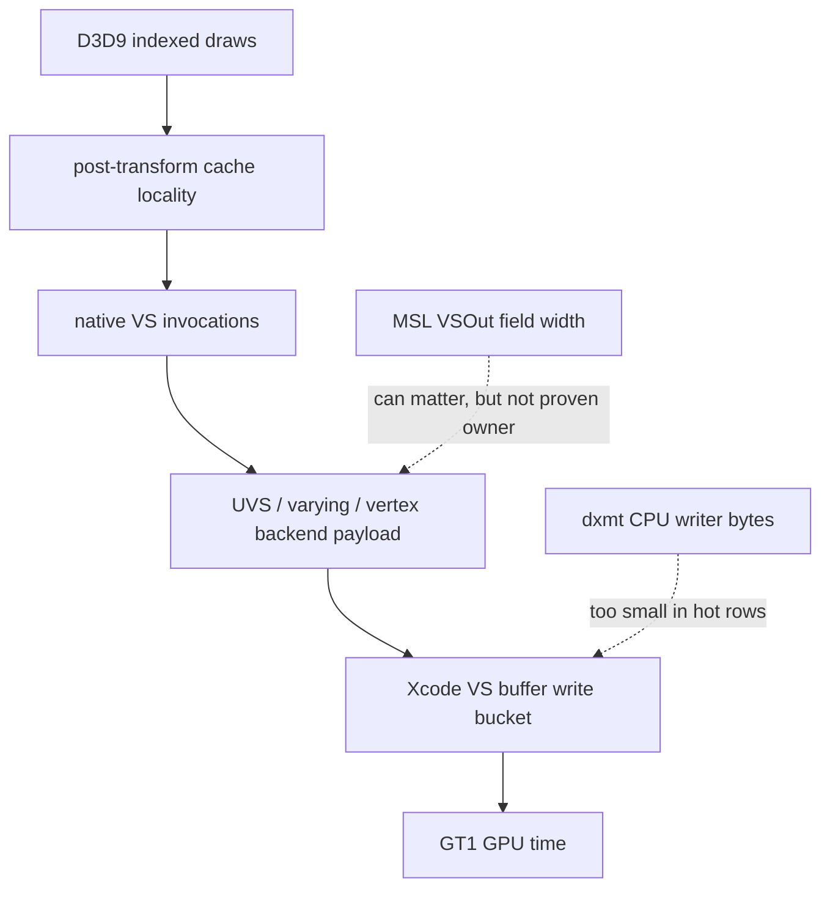

# Asahi AGX Shader Implementation Research Notes

Sources: Mesa Asahi driver documentation, Mesa `src/asahi/compiler` sources,
Alyssa Rosenzweig's Asahi/M1 GPU writeups, and Dougall Johnson's Apple G13 GPU
ISA notes.

---

## Scope

This note summarizes what the open Asahi Linux / Mesa driver shows about shader
implementation on Apple AGX GPUs, especially M1, and how that model should
inform dxmt9 shader and performance work.

The useful boundary is narrow:

- Asahi compiles NIR to native AGX binaries on Linux.
- dxmt9 emits MSL and relies on Apple's proprietary Metal compiler on macOS.
- Therefore Asahi is not a drop-in implementation source for dxmt9.
- It is useful as the best public model for what happens below Metal: shader
  prologs/epilogs, varying packing, interpolation, register pressure, and
  vertex-stage backend storage.

The current dxmt9 GT1 profiling evidence points at hidden Apple vertex /
tiler / parameter storage, not explicit dxmt buffer writes. Asahi's shader and
varying model helps explain why reducing vertex shader invocations can move
that hidden bucket even when ordinary source-visible `VSOut` trimming does not.

---

## High-Level Model

```mermaid
flowchart LR
    GLVK["OpenGL / Vulkan frontend"] --> NIR["Mesa NIR"]
    NIR --> Lower["AGX-specific NIR lowerings"]
    Lower --> AGXIR["AGX compiler IR"]
    AGXIR --> Opt["DCE / CSE / AGX opts"]
    Opt --> Sched["pressure scheduling"]
    Sched --> RA["register allocation"]
    RA --> Pack["native AGX binary packing"]
    Pack --> Parts["main shader + prolog / epilog parts"]
    Parts --> USC["AGX Unified Shader Cores"]
    USC --> Vary["UVS / remap / coefficient registers"]
    Vary --> Frag["fragment shader / PBE writeout"]

    D3D9["dxmt9 D3D9 bytecode / FFP"] -.-> DXIR["dxmt9 ShaderIR"]
    DXIR -.-> MSL["MSL"]
    MSL -.-> Apple["Apple Metal compiler / driver"]
    Apple -.-> USC
```

Asahi exposes a native shader pipeline. dxmt9 only controls the MSL source,
pipeline state, draw submission, and resource layout that Apple's compiler
then lowers. Treat Asahi as a counter-interpretation and experiment-priority
model, not as an ABI contract under Metal.

---

## Asahi Shader Pipeline

The Mesa AGX compiler path is built around NIR:

1. Frontends produce NIR.
2. `agx_preprocess_nir()` lowers variables, scratch access, side-effecting
   fragment cases, divisions, interpolation-adjacent intrinsics, subgroup
   operations, and scalar forms.
3. `agx_compile_shader_nir()` performs late lowering after the shader key is
   known: fragment coordinate normalization, explicit IO, memory access bit
   sizes, scratch cleanup, bit-size lowering, texture-handle loads, and final
   AGX NIR optimization.
4. AGX instruction selection produces AGX compiler IR.
5. The backend runs dead-code elimination, CSE, forward/backward optimizers,
   constant compaction/promotion, uniform-source lowering, pressure scheduling,
   register allocation, wait insertion, pseudo lowering, and binary packing.

The important design point is that shader compilation is not only "translate
instructions". The compiler and driver deliberately move API state into shader
periphery:

- vertex attribute fetch is handled by shader/prolog logic;
- fragment outputs and blending can be part of shader epilog behavior;
- interpolation qualifiers and coefficient-register bindings are explicit
  compiled state;
- dynamic API state can be isolated into prologs/epilogs so main shaders can
  be reused.

Alyssa Rosenzweig's Vulkan writeup calls out that M1 bakes state such as
vertex attributes, fragment outputs, blending, and linked interpolation
qualifiers into shader binaries. Honeykrisp/Asahi uses prologs and epilogs to
make that state dynamic without recompiling every main shader.

---

## Stage ABI

### Vertex Prolog

The Mesa compiler README documents the non-monolithic shader ABI. For vertex
shaders:

- `r5` and `r6` carry vertex ID and instance ID.
- `r8` onward carries 128-bit uniform vectors for attributes.
- the first uniform slots contain attribute base addresses, robustness clamps,
  base vertex, base instance, and draw ID.
- the prolog may fetch and decode vertex attributes before the main shader.

This matches the earlier Asahi design observation that Apple AGX does not look
like a desktop API pipeline with fixed-function vertex attribute fetch exposed
as a separate public unit. Attribute and uniform-buffer behavior can be lowered
into shader code around the main program.

### Vertex Outputs And Varyings

Mesa's Asahi driver documentation describes hardware varyings as a pipeline:

1. The vertex shader emits outputs with `st_var`.
2. Vertex outputs are ordered with position first, then 32-bit user varyings,
   then packed 16-bit user varyings, then point size, layer/viewport, and clip
   distances when present.
3. Outputs are remapped to varying slots.
4. Coefficient registers are loaded for the fragment shader.
5. Fragment interpolation uses coefficient registers and iterator hardware.

AGX also has a hardware glossary that is useful for Xcode-counter reading:

| Term | Relevant meaning |
|---|---|
| `VDM` | Dispatches vertex shaders. |
| `USC` | Unified shader cores running vertex, fragment, and compute code. |
| `UVS` | Buffers vertex shader outputs, including varyings. |
| `PPP` | Primitive assembly between vertex dispatch and rasterization. |
| `ISP` | Rasterization stage. |
| `PBE` | Pixel backend for color/image writes. |

For dxmt9, this is the public model that best matches a large hidden
vertex-stage write bucket: post-transform vertices and their backend payloads
can be much larger than the visible MSL `VSOut` struct.

### Fragment Prolog And Epilog

The fragment side has several distinct responsibilities:

- interpolation is expressed through coefficient registers or math lowered from
  interpolation intrinsics;
- flat interpolation and at-offset interpolation may be lowered in NIR;
- discard and depth/stencil interactions are lowered through sample-mask logic;
- fragment side effects may force late depth behavior or dummy depth writes;
- the fragment epilog reads color outputs, optional depth/stencil, sample mask,
  render target heap pointers, and blend constants.

This matters to dxmt9 because D3D9 alpha test, alpha blend, depth-read
materials, and order-sensitive screen-blend paths are not just "fragment
shader text". They can affect native writeout behavior and shader-part
selection below Metal.

---

## ISA-Level Observations

Dougall Johnson's G13 notes and the Asahi compiler design give a few practical
hardware facts:

- AGX has 32 threads per SIMD-group.
- GPRs can be viewed as 32-bit registers or 16-bit halves.
- uniform registers are separate and are constant across a shader invocation.
- instructions are variable length and have compact encodings.
- register usage affects occupancy; 16-bit use can reduce pressure when the
  compiler can exploit it.
- Asahi treats the compiler as mostly scalar with vector behavior at IO
  boundaries.

For dxmt9 this supports a cautious FP16/`half` hypothesis, but only as a
measured Metal experiment. Asahi can use native 16-bit register and varying
packing directly. dxmt9 can only influence Apple's compiler through MSL types,
field layout, and pipeline state.

---

## dxmt9 Performance Interpretation

The current GT1 data has three stable conclusions:

| Finding | Interpretation |
|---|---|
| Top hot rows show about `1.6GiB` of Xcode `VS Buffer Device Memory Bytes Written`. | The owner is likely native vertex/tiler/parameter storage, not dxmt CPU-side uploads. |
| Visible `VSOut` is much smaller, about `184B` per vertex in the hot programmable rows. | Ordinary MSL output width is not a sufficient explanation by itself. |
| Reducing post-transform vertex shader invocations moves GPU time and Xcode VS-buffer writes. | Vertex locality is a real lever for the hidden backend bucket. |

The strongest accepted movement so far is cache-aware indexed locality:

| Scenario | Baseline | Candidate | Delta |
|---|---:|---:|---:|
| Combined opaque + screen-blend total GPU | `35.900ms` | `30.923ms` | `-13.86%` |
| Combined top-three VS buffer write | `1627.338MiB` | `1412.612MiB` | `-13.19%` |
| Combined target VS invocations | `1,178,584` | `1,033,772` | `-12.29%` |

The screen-blend proof uses an explicit `lsb1` semantic image policy
(`739 / 786,432` pixels, max delta `1`). That should remain a proof artifact
or profiling ceiling unless that tolerance is deliberately accepted for the
run. The opaque-depth path is the cleaner production-shaped opt-in candidate.

The key Asahi-aligned read is:

This is why future shader/backend experiments should separate two metrics:

- `VS invocations` or a dxmt-side finite-cache miss proxy;
- `VS buffer bytes per invocation` or per cache miss.

The accepted locality path mostly reduces invocation count. The remaining
harder problem is bytes per invocation: the backend payload is still wider than
the visible D3D9-to-MSL output would suggest.

---

## Implications For Shader Work

### Keep The Current Shader Spec Boundary

`specs/d3d9/shader` is still the right home for dxmt9's D3D9 bytecode, FFP,
semantic rewrite, precision, liveness, and MSL-emission contracts. Asahi does
not change that ownership. The dxmt9 shader layer should remain a pure
translator from D3D9 shader semantics to MSL.

The Asahi research is better placed in `docs/research` because it explains the
native Apple backend model that the shader spec can reference conceptually, not
a dxmt9 requirement.

### Do Not Over-Promote VSOut Trimming

Asahi shows that varying layout and 16-bit packing are real native concepts.
That makes VSOut trimming and liveness variants worth keeping, especially for
correctness-preserving PSO specialization.

However, current GT1 probes already changed source-visible VSOut shape without
moving the Xcode VS-buffer bucket. Therefore:

- keep VSOut liveness as a shader-quality feature;
- do not treat it as the first-order GT1 GPU fix without a row-local Xcode
  counter drop;
- prefer A/B gates that prove both bytes/invocation and total VS write move.

### FP16 Is Plausible But Must Be Proved

AGX has native 16-bit register and varying concepts. Metal `half` may help
register pressure, occupancy, or native varying packing. It may also be ignored
or widened by Apple's compiler in some paths.

Any FP16 experiment should use:

- a strict semantic gate for D3D9 `_pp` and non-`_pp` behavior;
- Xcode counters for VS/FS invocations, buffer writes, LLC writes, and tiled
  vertex/primitive storage;
- row-local comparisons before whole-frame promotion.

### Blend And Depth Experiments Need Semantic Gates

Asahi's fragment epilog and sample-mask lowering make it clear that discard,
depth/stencil, sample mask, render-target format, and blending are tightly
coupled at native writeout boundaries.

For dxmt9 this supports the current discipline:

- broad "disable blend" or "disable depth write" probes are diagnostics only;
- primitive reorder in depth-read/color-write material is unsafe unless a
  same-input image gate proves final-color equivalence or an explicit tolerance;
- screen-blend cached locality can be useful, but should stay profiling-only
  unless the `lsb1` policy is intentionally accepted.

### CPU State Churn Is A Separate Track

Asahi's prolog/epilog model is useful conceptually for isolating dynamic state
at the shader periphery. It does not directly solve dxmt9 stream/IB churn,
snapshot-cache misses, or Metal encoder CPU cost.

Keep those CPU fixes in backend/importer design. Use Asahi only as a reminder
that stable main shader state plus dynamic per-draw/peripheral state is a
reasonable architecture.

---

## Practical Experiment Checklist

Use Asahi as a guide to choose experiments that can change native backend
shape:

| Experiment | Why it is plausible | Required gate |
|---|---|---|
| Cache-aware indexed locality | Reduces native VS invocations and UVS/backend payload work. | Stable row shape, lower VS invocations, lower VS buffer write, semantic image proof. |
| `half` precision for safe `_pp` values | AGX can use 16-bit registers and packed 16-bit varyings. | Strict D3D9 semantic tests plus Xcode register/write movement. |
| Varying field grouping or 16-bit output packing | AGX has explicit 32-bit and packed 16-bit varying slots. | Bytes/invocation must drop, not just source field count. |
| Fragment epilog state isolation | M1 bakes blend/output state into shader parts. | Same blend/depth semantics, same target rows, lower native write counters. |
| Row-local backend-shape probes | Hidden bucket is row/class sensitive. | Compare shared `seq/enc` rows only; reject rank-matched shape drift. |

Avoid experiments that current evidence has already rejected as first-order
GT1 fixes:

- broad shader-visible VSOut-only trimming without Xcode movement;
- broad alpha/depth/cull/scissor disables with incorrect output;
- flattening indexed draws into expanded transient vertices;
- trace-local primitive-order exclusions that are too small to move Xcode
  counters.

---

## Open Questions

- Which MSL output layouts cause Apple's compiler to choose 16-bit varying
  slots or smaller native stage-out payloads, if any?
- Can a cheap runtime predicate identify sparse/no-final-color payloads where
  cache-aware reorder is exact-safe?
- Do Metal `half` outputs or `half` temporaries reduce AGX register pressure in
  the hot D3D9 shader classes, or does Apple's compiler widen them?
- Which Xcode counters best correspond to Asahi glossary terms such as `UVS`,
  tiled vertex buffer, primitive blocks, and PBE writeout?
- Can shader-part style thinking help dxmt9 split stable main MSL from dynamic
  alpha-test/blend/writeout variants without exploding PSO count?

---

## References

| Source | Link | Notes |
|---|---|---|
| Mesa Asahi driver docs | https://docs.mesa3d.org/drivers/asahi.html | Hardware varyings, remapping, coefficient registers, image layouts, and AGX glossary. |
| Mesa Asahi compiler sources | https://gitlab.freedesktop.org/mesa/mesa/-/tree/main/src/asahi/compiler | NIR preprocessing, AGX backend passes, ABI, interpolation, sample-mask, and fragment side-effect lowerings. |
| Mesa source repository docs | https://docs.mesa3d.org/repository.html | Official Mesa GitLab source location. |
| Dissecting the Apple M1 GPU, part III | https://alyssarosenzweig.ca/blog/asahi-gpu-part-3.html | Early AGX compiler design, NIR input, scalar/16-bit/register-pressure model, attribute/uniform lowering context. |
| Vulkan 1.3 on the M1 in 1 month | https://alyssarosenzweig.ca/blog/vk13-on-the-m1-in-1-month.html | Honeykrisp, dynamic state, descriptors, and prolog/epilog strategy. |
| Apple G13 GPU Architecture Reference | https://dougallj.github.io/applegpu/docs.html | Reverse-engineered M1/G13 ISA details: registers, uniforms, execution mask, instruction encoding. |
