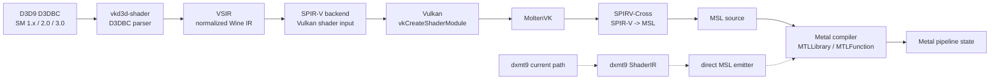
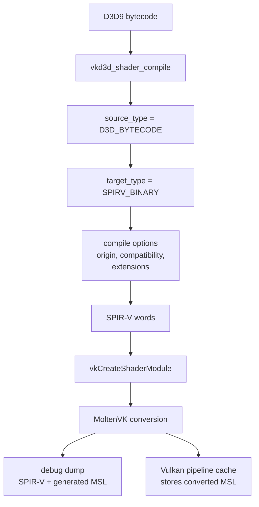

# vkd3d-shader + MoltenVK Shader Translation Research Notes

Sources: Wine vkd3d / `vkd3d-shader`, Khronos MoltenVK, Khronos
SPIRV-Cross, DXVK D3D9 shader sources, Microsoft D3D9 shader bytecode
documentation.

---

## Scope

This note replaces the older generic `shader-translation.md` research note.
The old note mixed three different concerns:

- D3D9 bytecode facts that now belong in `specs/d3d9/shader`;
- a proposed `vkd3d-shader -> SPIR-V -> SPIRV-Cross -> MSL` implementation
  path;
- fixed-function and Metal binding details that are dxmt9-specific design
  work, not generic research.

The useful scope is narrower. This file documents what dxmt9 can learn from
the vkd3d-shader and MoltenVK stack:

- vkd3d-shader as a D3DBC parser, VSIR normalizer, SPIR-V emitter, and test
  corpus/oracle reference;
- MoltenVK as the public Vulkan-on-Metal model for SPIR-V to MSL conversion,
  shader library caching, and shader-conversion diagnostics;
- SPIRV-Cross as the conversion library MoltenVK uses for SPIR-V to MSL.

It is not a proposal to replace dxmt9's current shader spec. The current dxmt9
path remains D3D9 bytecode / FFP state -> dxmt9 ShaderIR -> direct MSL.

---

## High-Level Stack

The vkd3d/MoltenVK path is valuable because it is a mature public reference
for shader parsing and Vulkan-to-Metal shader plumbing. It is less valuable as
a direct implementation path for dxmt9 because it inserts Vulkan, SPIR-V, and
MoltenVK between D3D9 bytecode and Metal. That makes the final MSL and Metal
compiler behavior harder for dxmt9 to control and attribute.

---

## Current Public Support Surface

The current vkd3d public shader header exposes:

- `VKD3D_SHADER_SOURCE_D3D_BYTECODE` for legacy D3D shader model 1, 2, and 3
  bytecode;
- `VKD3D_SHADER_TARGET_SPIRV_BINARY` and `VKD3D_SHADER_TARGET_SPIRV_TEXT`;
- `VKD3D_SHADER_TARGET_MSL` as a target enum.

The important detail is the supported transformation list in
`vkd3d_shader_compile()`: it includes `D3D_BYTECODE -> SPIRV_BINARY`,
`D3D_BYTECODE -> SPIRV_TEXT`, and `D3D_BYTECODE -> D3D_ASM`, but it does not
list `D3D_BYTECODE -> MSL`. Treat direct D3DBC-to-MSL through vkd3d as
unsupported unless a future upstream source explicitly adds that transform.

MoltenVK's public runtime guide states the supported runtime path clearly:
applications load SPIR-V normally through `vkCreateShaderModule()`, and
MoltenVK converts SPIR-V to MSL internally. MoltenVK source also notes that
direct MSL shader modules may work in simple cases, but direct MSL loading is
not officially supported.

Practical conclusion:

| Route | Status for dxmt9 research |
|---|---|
| D3DBC -> vkd3d-shader -> SPIR-V | Strong external parser/oracle/prototype path. |
| SPIR-V -> MoltenVK -> SPIRV-Cross -> MSL | Strong Vulkan-on-Metal reference path. |
| D3DBC -> vkd3d-shader -> MSL | Do not rely on it today. |
| MSL passed directly through MoltenVK shader modules | Do not rely on it today. |
| D3DBC / FFP -> dxmt9 ShaderIR -> direct MSL | Current dxmt9-owned implementation path. |

---

## What To Reuse Conceptually

### D3DBC Parser And VSIR Normalization

vkd3d-shader's `d3dbc.c` is useful as a reference for:

- token decoding for SM1-SM3;
- register type mapping into a normalized internal register model;
- signature construction from DCL semantics and legacy implicit registers;
- vPos / vFace handling;
- constant register scanning;
- combined sampler descriptor creation;
- ps_1_x texture-instruction and co-issue quirks.

dxmt9 should not copy the source directly. The useful action is to compare
dxmt9 decoder behavior against vkd3d behavior and import compatible
shader-runner fixtures with upstream commit provenance.

### vkd3d-shader As A Test Oracle

The repo already treats vkd3d as a shader corpus reference. Keep that pattern:

- import small focused `.shader_test` cases, not broad vendored code;
- record source, upstream URL, upstream commit, model, opcode coverage, and
  license scope in the manifest;
- run drift checks against a local vkd3d checkout when refreshing fixtures;
- prefer fixtures that isolate D3D9 semantics dxmt9 owns: DCL semantics,
  partial precision, relative constants, predicate registers, ps_1_x texture
  ops, TEXKILL, vPos/vFace, fog, point size, point sprites, and alpha test.

vkd3d is a correctness reference, not an ABI dependency for dxmt9.

### SPIR-V Resource Binding Model

vkd3d's SPIR-V backend models resources through descriptor sets, bindings,
samplers, combined samplers, push constants, and shader interface structures.
That is relevant for two dxmt9 design areas:

- draw-uniform binding design: compile-time field-to-offset binding is a
  proven pattern;
- future Vulkan/MoltenVK prototypes: shader resource layout must be expressed
  as Vulkan descriptors first, not hard-coded Metal argument indices.

Do not carry over the old document's fixed Metal binding table as a generic
recommendation. Direct dxmt9 Metal has its own argument-buffer and uniform
layout. MoltenVK derives Metal resource indices from the Vulkan/SPIR-V
interface and SPIRV-Cross conversion configuration.

### MoltenVK Shader Conversion And Caching

MoltenVK provides several useful design references:

- runtime SPIR-V to MSL conversion happens during shader module / pipeline
  preparation;
- converted MSL is compiled into `MTLLibrary` and retrieved as `MTLFunction`;
- pipeline cache serialization can store converted MSL and avoid repeated
  SPIR-V-to-MSL conversion;
- shader conversion can be debug-logged with `MVK_CONFIG_DEBUG`;
- shader dumps can be written with the MoltenVK shader dump directory config;
- some specialization constants become Metal function constants, while others
  require macro-specialized MSL library variants and recompilation.

For dxmt9, this reinforces the current need for deterministic shader cache keys
and clear shader dump tooling. It also warns that specialization strategy can
change whether a pipeline hit is a cheap function lookup or a full MSL library
compile.

---

## Differences From dxmt9's Direct Metal Path

| Concern | vkd3d + MoltenVK | dxmt9 current path |
|---|---|---|
| Primary IR | VSIR and SPIR-V | dxmt9 ShaderIR (`SpirvModule` historical name, not SPIR-V) |
| Metal language generation | SPIRV-Cross inside MoltenVK | dxmt9 MSL emitter |
| Resource layout | Vulkan descriptors first | dxmt9 Metal argument buffers / direct bindings |
| Shader cache | Vulkan pipeline cache, MoltenVK shader library cache | dxmt9 shader archive / Metal pipeline cache |
| D3D9 FFP | Must be synthesized before or outside vkd3d-shader | dxmt9 FFP MSL generator |
| Debug MSL ownership | MoltenVK-generated MSL | dxmt9-generated MSL |
| Apple GPU perf attribution | Indirect through Vulkan/MoltenVK | Direct to dxmt9 render encoders and shader labels |

This is why the vkd3d/MoltenVK route is best kept as research and prototype
infrastructure. The direct dxmt9 path gives tighter control over D3D9 semantic
fixups, MSL layout experiments, shader archive keys, and Xcode counter joins.

---

## What Not To Copy

- Do not replace `specs/d3d9/shader` with a vkd3d-shader + SPIRV-Cross design.
  The current spec intentionally owns a direct D3D9-to-MSL translator.
- Do not rely on vkd3d-shader's `VKD3D_SHADER_TARGET_MSL` enum as proof that
  D3DBC-to-MSL is a supported production path.
- Do not pass MSL directly through MoltenVK as a planned shader-module format.
  MoltenVK documents SPIR-V shader modules as the normal supported path.
- Do not hard-code Metal binding slots based on SPIR-V descriptor bindings.
  SPIRV-Cross/MoltenVK and dxmt9 direct Metal solve binding layout at different
  layers.
- Do not assume vkd3d-shader solves D3D9 fixed-function state. FFP shader
  synthesis remains dxmt9-owned.
- Do not import vkd3d source code into dxmt9 without a license review. Use it
  as a behavior reference and fixture source with provenance.

---

## Reference Checklist For dxmt9

Use vkd3d-shader and MoltenVK when they answer one of these concrete questions:

| Question | Reference path |
|---|---|
| How should a D3DBC token/register/semantic edge case decode? | Check vkd3d-shader `d3dbc.c`, then add a dxmt9 decoder fixture. |
| What shader-runner test shape should cover this opcode? | Use vkd3d `.shader_test` conventions and record upstream provenance. |
| How should descriptor/push-constant binding be represented for a Vulkan prototype? | Study vkd3d SPIR-V backend descriptor binding and shader interface structures. |
| How does a Vulkan-on-Metal stack cache converted MSL? | Study MoltenVK shader library cache and Vulkan pipeline cache behavior. |
| How do we debug SPIR-V-to-MSL conversion? | Use MoltenVK debug logging, shader dump directory, and SPIRV-Cross issue traces. |
| Should dxmt9's direct MSL emitter change? | Only if the reference exposes a D3D9 semantic bug or a cache/binding pattern that applies without adopting Vulkan. |

---

## Vulkan/MoltenVK Prototype Shape

If dxmt9 ever builds a Vulkan/MoltenVK shader prototype, the safe minimal path
is:

Validation requirements for such a prototype:

- compare rendered output against the direct dxmt9 MSL path;
- dump both SPIR-V and MoltenVK-generated MSL for every failing shader;
- include D3D9 half-pixel offset, XYZRHW, alpha test, fog, point sprites,
  point size, vPos/vFace, TEXKILL, and ps_1_x texture cases;
- compare pipeline-cache warm and cold behavior separately;
- do not use prototype GPU timings as direct evidence for the dxmt9 direct
  Metal path unless encoder shape and shader output are matched.

---

## Open Questions

- Can vkd3d-shader's D3DBC parser reveal decoder edge cases missing in dxmt9's
  current SM1-SM3 coverage?
- Which vkd3d shader-runner cases should be imported first for ps_1_x texture
  operations, predicate registers, and relative addressing?
- Would a MoltenVK prototype expose SPIRV-Cross MSL output patterns that are
  useful for dxmt9's direct MSL emitter, or would the Vulkan abstraction hide
  the relevant Metal details?
- Can MoltenVK's pipeline-cache handling suggest a cleaner shader archive key
  decomposition for dxmt9?
- Which SPIR-V features emitted by vkd3d for D3D9 bytecode cause awkward MSL
  under SPIRV-Cross, and do those map to current dxmt9 emitter risks?

---

## References

| Source | Link | Notes |
|---|---|---|
| Wine vkd3d repository | https://gitlab.winehq.org/wine/vkd3d | Upstream vkd3d and vkd3d-shader source. |
| vkd3d shader public header | https://gitlab.winehq.org/wine/vkd3d/-/blob/master/include/vkd3d_shader.h | Source/target types and supported `vkd3d_shader_compile()` transforms. |
| vkd3d D3DBC parser | https://gitlab.winehq.org/wine/vkd3d/-/blob/master/libs/vkd3d-shader/d3dbc.c | D3D bytecode parser, signature mapping, legacy register handling. |
| vkd3d SPIR-V backend | https://gitlab.winehq.org/wine/vkd3d/-/blob/master/libs/vkd3d-shader/spirv.c | Descriptor binding, push constants, SPIR-V emission. |
| MoltenVK Runtime User Guide | https://github.com/KhronosGroup/MoltenVK/blob/main/Docs/MoltenVK_Runtime_UserGuide.md | Runtime SPIR-V to MSL conversion, debug guidance, pipeline cache behavior. |
| MoltenVK shader module source | https://github.com/KhronosGroup/MoltenVK/blob/main/MoltenVK/MoltenVK/GPUObjects/MVKShaderModule.mm | Shader module conversion, MSL library compilation, direct-MSL caveat. |
| SPIRV-Cross README | https://github.com/KhronosGroup/SPIRV-Cross | SPIR-V reflection and MSL conversion library used by MoltenVK. |
| DXVK D3D9 shader compiler | https://github.com/doitsujin/dxvk/tree/master/src/dxso | Independent D3D9 bytecode to SPIR-V reference. |
