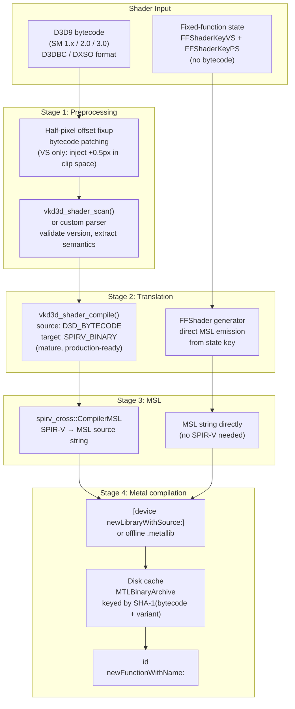
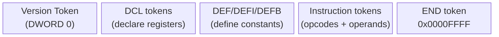
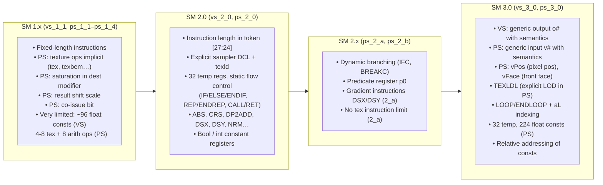
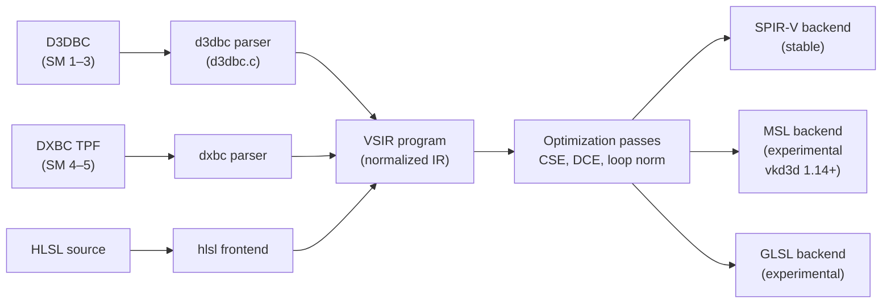
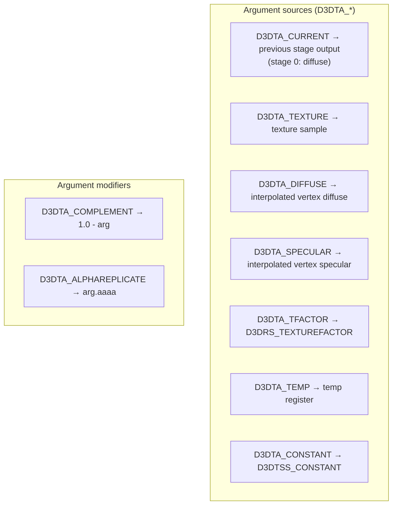
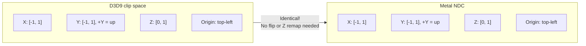

# Shader Translation Research Notes

Sources: DXVK (doitsujin/dxvk), vkd3d-shader (winehq.org/wine/vkd3d), SPIRV-Cross
(KhronosGroup/SPIRV-Cross), Mesa Gallium Nine, Microsoft WDK documentation, Aras
Pranckevičius's shader notes (aras-p.info).

---

## Overview

Translating D3D9 shaders to Metal requires a multi-step pipeline. D3D9 shaders come in
two forms: **programmable bytecode** (SM 1.x / 2.0 / 3.0, called D3DBC or DXSO) and
**fixed-function pipeline state** (no bytecode — the driver synthesizes shaders from
render/texture/lighting state). Both must be handled.

---

## Recommended Translation Pipeline



**Alternative path (longer-term):** vkd3d-shader's experimental MSL backend can target
MSL directly from D3DBC, eliminating SPIRV-Cross. As of early 2026 (vkd3d 1.18) this
path is incomplete but improving rapidly. Track release notes for 1.19+.

---

## D3D9 Shader Bytecode Format (D3DBC)

D3DBC is a flat stream of 32-bit DWORDs. There is no container — it begins with a
version token and ends with an END token (`0xFFFF`). This is entirely distinct from
the SM4+ DXBC container format (which uses RDEF/ISGN/SHDR chunk headers).

### Token Stream Layout



### Version Token (DWORD 0)

```
Bits [07:00]  minor version
Bits [15:08]  major version
Bits [31:16]  shader type: 0xFFFF = pixel shader, 0xFFFE = vertex shader

Examples:
  0xFFFE0200 = vs_2_0    0xFFFF0200 = ps_2_0
  0xFFFE0300 = vs_3_0    0xFFFF0300 = ps_3_0
```

### Instruction Token

```
Bits [15:00]  opcode (D3DSIO_* enum)
Bits [23:16]  instruction controls (comparison func for IFC, etc.)
Bits [27:24]  SM 2.0+: DWORD count of following tokens (0 in SM 1.x = fixed per opcode)
Bit  [28]     SM 2.0+: predicated instruction (extra predicate source token appended)
Bit  [30]     PS 1.x only: co-issue flag
```

### Destination Parameter Token

```
Bit  [31]     always 1 (marks as parameter)
Bits [30:28]  register type [2:0]
Bits [23:20]  result modifier: 0x1=saturate(VS), 0x2=partial precision, 0x4=centroid
Bits [19:16]  write mask: bit16=X, 17=Y, 18=Z, 19=W
Bit  [13]     relative addressing (VS 3.0+)
Bits [12:11]  register type [4:3]
Bits [10:00]  register number
```

### Source Parameter Token

```
Bit  [31]     always 1
Bits [30:28]  register type [2:0]
Bits [27:24]  source modifier:
                0x0=none  0x1=negate  0x2=bias(-0.5)  0x3=bias+neg
                0x4=bx2(x*2-1)  0xb=abs  0xc=-abs  0x9=dz  0xa=dw
Bits [23:16]  swizzle (2 bits per channel XYZW: 0=X,1=Y,2=Z,3=W)
Bits [12:11]  register type [4:3]
Bits [10:00]  register number
```

---

## Register Types (D3DSPR_*)

| Value | Name | VS | PS | Description |
|---|---|---|---|---|
| 0 | TEMP | r0–r31 | r0–r31 | Temporary (GP) registers |
| 1 | INPUT | v0–v15 | v0–v15 | VS: vertex attributes; PS 3.0: interpolated varyings |
| 2 | CONST | c0–c2047 | c0–c223 | Float constant registers |
| 3 | ADDR/TEXTURE | a0 | t# (SM 1.x) | VS: address register; PS 1.x: texture coords |
| 4 | RASTOUT | oPos/oFog/oPts | — | VS rasterizer output |
| 5 | ATTROUT | oD0/oD1 | — | VS color output (< 3.0) |
| 6 | TEXCRDOUT/OUTPUT | oT0–oT7 / o# | — | VS texture coord / generic output |
| 7 | CONSTINT | i0–i15 | i0–i15 | Integer constant registers |
| 8 | COLOROUT | — | oC0–oC3 | PS color output |
| 9 | DEPTHOUT | — | oDepth | PS depth output |
| 10 | SAMPLER | — | s0–s15 | Sampler state handle |
| 14 | CONSTBOOL | b0–b15 | b0–b15 | Bool constants |
| 15 | LOOP | aL | — | Loop counter register |
| 17 | MISCTYPE | — | vPos, vFace | PS 3.0: pixel position, front-face |
| 19 | PREDICATE | p0 | p0 | Predicate register (SM 2.x+) |

---

## SM Version Comparison



---

## Key Opcodes

**Arithmetic (all models):** NOP, MOV, ADD, SUB, MAD, MUL, RCP, RSQ, DP3, DP4, MIN,
MAX, SLT, SGE, EXP, LOG, LIT, DST, LRP, FRC, M4x4, M4x3, M3x4, M3x3, M3x2

**SM 2.0+ additions:** ABS, CRS, NRM, POW, SGN, SINCOS, DP2ADD, DSX, DSY

**Flow control (SM 2.0+):** CALL, CALLNZ, LOOP, ENDLOOP, RET, REP, ENDREP, IF, IFC,
ELSE, ENDIF, BREAK, BREAKC, MOVA, SETP (SM 3.0), BREAKP (SM 3.0)

**Texture (SM 1.x — unique ops):** TEX, TEXCOORD, TEXKILL, TEXBEM, TEXBEML,
TEXREG2AR, TEXREG2GB, TEXM3x2TEX, TEXM3x3TEX, TEXM3x3SPEC, TEXDP3, TEXDEPTH

**Texture (SM 2.0+):** texld (TEX reused), TEXLDB (bias), TEXLDP (projected),
TEXLDD (gradients), TEXLDL (explicit LOD, PS 3.0)

**Special:** PHASE (0xFFFD, PS 1.4 phase separator), COMMENT (0xFFFE), END (0xFFFF)

---

## Translation Tools

### DXVK — D3DBC → SPIR-V (most mature)

Location: `github.com/doitsujin/dxvk/tree/master/src/dxso/`

The most battle-tested D3D9 shader translator. Key files:

| File | Role |
|---|---|
| `dxso_decoder.h/cpp` | Parses D3DBC token stream → typed `DxsoInstructionContext` |
| `dxso_compiler.h/cpp` | Walks instructions, emits SPIR-V via `SpirvModule` |
| `dxso_analysis.h/cpp` | Pre-analysis: outputs, PS/VS detect |
| `dxso_enums.h` | Opcodes and register types as C++ enums |
| `d3d9_fixed_function.cpp` | Generates SPIR-V fixed-function shaders from state key |

Core instruction context type:
```cpp
struct DxsoInstructionContext {
    DxsoRegister pred;                        // optional predicate
    DxsoRegister dst;                         // destination
    std::array<DxsoRegister, MaxOperands> src;
    DxsoDefinition def;                       // for DEF/DEFI
    DxsoDeclaration dcl;                      // for DCL (semantic)
};
```

SPIR-V texture ops used:
- `OpImageSampleImplicitLod` → texld (PS 2.0+)
- `OpImageSampleExplicitLod` → texldl, texldb
- `OpImageSampleProjExplicitLod` → texldp
- `OpImageSampleGrad` → texldd (explicit gradients)

### vkd3d-shader — D3DBC → SPIR-V or MSL

Location: `gitlab.winehq.org/wine/vkd3d/tree/master/libs/vkd3d-shader`

The Wine project's modular shader compiler. Translates through an intermediate VSIR
(vkd3d Shader IR) to allow multiple backends from one parser.



**D3DBC → SPIR-V status:** stable since vkd3d 1.12 (2024).
**D3DBC → MSL status:** experimental since vkd3d 1.14; missing instructions as of 1.18
(Nov 2025). Build with `-DVKD3D_SHADER_UNSUPPORTED_MSL`.

Core API:
```c
struct vkd3d_shader_compile_info info = {
    .type = VKD3D_SHADER_STRUCTURE_TYPE_COMPILE_INFO,
    .source = { .code = bytecode, .size = bytecode_size },
    .source_type = VKD3D_SHADER_SOURCE_D3D_BYTECODE,
    .target_type = VKD3D_SHADER_TARGET_SPIRV_BINARY,
};
struct vkd3d_shader_code spirv;
vkd3d_shader_compile(&info, &spirv, &messages);
```

### SPIRV-Cross — SPIR-V → MSL

Location: `github.com/KhronosGroup/SPIRV-Cross`

The standard library for SPIR-V → MSL. Used by MoltenVK in production.

```cpp
spirv_cross::CompilerMSL compiler(spirv_words, word_count);
spirv_cross::CompilerMSL::Options opts;
opts.platform = CompilerMSL::Options::macOS;
opts.msl_version = CompilerMSL::Options::make_msl_version(2, 4);
compiler.set_msl_options(opts);

// Map D3D9 cbuffer (set=0, binding=0) → Metal buffer index 0
spirv_cross::MSLResourceBinding rb{};
rb.stage = spv::ExecutionModelVertex;
rb.desc_set = 0; rb.binding = 0;
rb.msl_buffer = 0;
compiler.add_msl_resource_binding(rb);

std::string msl = compiler.compile();
```

---

## Half-Pixel Offset Fixup

D3D9 has a critical half-pixel offset: pixel centers are at integer coordinates
(not 0.5 offsets as in Metal, D3D10+, and OpenGL). This shifts all 3D geometry
by half a pixel when rendering to a render target.

**Fix (must apply to every vertex shader):**

```metal
// In the vertex shader, after computing clip-space position:
// Inject this before returning out.position:
out.position.xy += uniforms.invViewportSize.xy * out.position.w;
// where invViewportSize = float2(1.0/width, 1.0/height)
```

**Bytecode patching approach** (apply before passing to vkd3d-shader):
1. Replace the `oPos` / `oD0` write at end of VS
2. Route through a temp register
3. Inject: `MAD temp.xy, temp.w, c_fixup.xy, temp.xy`
4. Restore to `oPos`

Reference: Aras Pranckevičius — https://aras-p.info/blog/2016/04/08/solving-dx9-half-pixel-offset/

---

## Fixed-Function Pipeline Emulation

D3D9's fixed-function pipeline (FFP) must be emulated with generated shaders. The
approach: define a compact state key struct, hash it, and cache the compiled
`id<MTLRenderPipelineState>` keyed by that hash.

### Vertex Shader State Key (FFShaderKeyVS)

```cpp
struct FFShaderKeyVS {
    // Lighting
    bool  lightingEnabled;
    bool  specularEnabled;
    bool  normalizeNormals;
    uint8_t numLights;                   // 0–8
    uint8_t lightType[8];                // D3DLIGHT_DIRECTIONAL/POINT/SPOT per slot
    uint8_t colorMaterialMode;           // D3DMCS_* (which channels from vertex color)

    // Fog
    uint8_t fogMode;                     // D3DFOG_NONE/LINEAR/EXP/EXP2
    bool    fogFromVertex;               // vertex fog vs pixel fog
    bool    rangeFog;                    // range-based vs depth-based

    // Texture
    uint8_t texCoordGen[8];              // D3DTSS_TCI_* per stage
    uint8_t texTransformFlags[8];        // D3DTTFF_COUNT2/3/4/PROJECTED per stage

    // Vertex blend
    uint8_t vertexBlend;                 // D3DVBF_*
    bool    indexedVertexBlend;
};
```

### Pixel Shader State Key (FFShaderKeyPS)

```cpp
struct FFShaderKeyPS {
    struct Stage {
        uint8_t  colorOp;    // D3DTOP_* for color channel
        uint8_t  colorArg1;  // D3DTA_* argument source
        uint8_t  colorArg2;
        uint8_t  alphaOp;    // D3DTOP_* for alpha channel
        uint8_t  alphaArg1;
        uint8_t  alphaArg2;
        uint8_t  texType;    // 2D / Cube / Volume
        uint8_t  texCoordIdx;
        bool     resultToTemp; // D3DRS_RESULTARG
    } stage[8];

    // Fog (pixel fog if !fogFromVertex)
    uint8_t fogMode;

    // Alpha test
    bool    alphaTestEnable;
    uint8_t alphaTestFunc;   // D3DCMP_*
};
```

### Lighting Equations (MSL)

```metal
// In fixed-function vertex shader:
float4 totalDiffuse  = materialAmbient * globalAmbient + materialEmissive;
float4 totalSpecular = float4(0);

for (int i = 0; i < numLights; i++) {
    if (!lightEnabled[i]) continue;

    float3 lightDir;
    float  attenuation = 1.0;

    if (lightType[i] == DIRECTIONAL) {
        lightDir = normalize(-light[i].direction.xyz); // already in view space
    } else {
        float3 toLight = light[i].position.xyz - vertPos_vs.xyz;
        float  dist    = length(toLight);
        lightDir       = toLight / dist;
        float  d2      = dist * dist;
        attenuation    = 1.0 / (light[i].atten0
                               + light[i].atten1 * dist
                               + light[i].atten2 * d2);
        attenuation    = clamp(attenuation, 0.0, 1.0);
        if (dist > light[i].range) attenuation = 0.0;

        if (lightType[i] == SPOT) {
            float cosAngle = dot(-lightDir, normalize(light[i].direction.xyz));
            float cosPhi   = cos(light[i].phi   * 0.5);
            float cosTheta = cos(light[i].theta * 0.5);
            if (cosAngle <= cosPhi) attenuation = 0.0;
            else if (cosAngle < cosTheta)
                attenuation *= pow((cosAngle - cosPhi) / (cosTheta - cosPhi),
                                   light[i].falloff);
        }
    }

    float NdotL = max(0.0, dot(normal_vs, lightDir));
    totalDiffuse += NdotL * light[i].diffuse * materialDiffuse * attenuation;

    if (specularEnabled && NdotL > 0.0) {
        float3 halfVec = normalize(lightDir + eyeDir_vs);
        float  NdotH   = max(0.0, dot(normal_vs, halfVec));
        totalSpecular += pow(NdotH, materialSpecularPower)
                         * light[i].specular * materialSpecular * attenuation;
    }
}
```

### Texture Stage Operations (D3DTOP_* → MSL)



| D3DTOP | MSL expression |
|---|---|
| DISABLE | pass through previous |
| SELECTARG1 | `arg1` |
| SELECTARG2 | `arg2` |
| MODULATE | `arg1 * arg2` |
| MODULATE2X | `clamp(arg1 * arg2 * 2.0, 0, 1)` |
| MODULATE4X | `clamp(arg1 * arg2 * 4.0, 0, 1)` |
| ADD | `clamp(arg1 + arg2, 0, 1)` |
| ADDSIGNED | `clamp(arg1 + arg2 - 0.5, 0, 1)` |
| ADDSIGNED2X | `clamp((arg1 + arg2 - 0.5) * 2.0, 0, 1)` |
| SUBTRACT | `clamp(arg1 - arg2, 0, 1)` |
| ADDSMOOTH | `arg1 + arg2 - arg1 * arg2` |
| BLENDDIFFUSEALPHA | `mix(arg2, arg1, diffuse.a)` |
| BLENDTEXTUREALPHA | `mix(arg2, arg1, texture.a)` |
| BLENDFACTORALPHA | `mix(arg2, arg1, tfactor.a)` |
| DOTPRODUCT3 | `dot(2*arg1-1, 2*arg2-1)`, replicated to all channels |
| LERP | `mix(arg2, arg1, current)` (3-arg op) |
| MULTIPLYADD | `current + arg1 * arg2` |
| BUMPENVMAP | apply D3DTSS_BUMPENVMAT transform to arg1, perturb arg2 UV |

### Fog (MSL)

```metal
float fogFactor;
if (fogMode == LINEAR)
    fogFactor = (fogEnd - fogDist) / (fogEnd - fogStart);
else if (fogMode == EXP)
    fogFactor = exp(-fogDensity * fogDist);
else if (fogMode == EXP2)
    fogFactor = exp(-fogDensity * fogDensity * fogDist * fogDist);

fogFactor = clamp(fogFactor, 0.0, 1.0);
float4 result = mix(fogColor, shadedColor, fogFactor);
// fogDist = length(vertPos_vs) for range fog, or abs(vertPos_vs.z) for depth fog
```

---

## Coordinate System Mapping



D3D9 and Metal share the same NDC convention. This is a major advantage over Vulkan
(which requires a Y-flip) and OpenGL (which requires Z remapping from [-1,1] to [0,1]).

**Key differences that DO need handling:**

| Issue | D3D9 | Metal | Fix |
|---|---|---|---|
| Pixel center | integer coords (0,0) | 0.5-offset | +0.5px in VS clip space |
| Winding | CW front | CCW front by default | `setFrontFacingWinding(MTLWindingClockwise)` |
| Pre-transformed verts | XYZRHW in pixel space | not supported natively | Convert in VS: NDC = (x/w*2-1, 1-y/h*2, z, 1) |
| Texture coords | same top-left origin | same | No change needed |

---

## Alpha Test Emulation

D3D9's alpha test (hardware-accelerated) must become shader discard in Metal:

```metal
// Injected at end of pixel shader when D3DRS_ALPHATESTENABLE:
float alpha = out.color.a;
bool pass;
switch (alphaTestFunc) {
    case D3DCMP_NEVER:        pass = false; break;
    case D3DCMP_LESS:         pass = alpha <  alphaRef; break;
    case D3DCMP_EQUAL:        pass = alpha == alphaRef; break;
    case D3DCMP_LESSEQUAL:    pass = alpha <= alphaRef; break;
    case D3DCMP_GREATER:      pass = alpha >  alphaRef; break;
    case D3DCMP_NOTEQUAL:     pass = alpha != alphaRef; break;
    case D3DCMP_GREATEREQUAL: pass = alpha >= alphaRef; break;
    case D3DCMP_ALWAYS:       pass = true; break;
}
if (!pass) discard_fragment();
```

Include `alphaTestEnable` and `alphaTestFunc` in the pixel shader state key.

---

## Resource Binding Model

D3D9 shader resources map to Metal buffer/texture indices:

| D3D9 resource | Metal binding | Notes |
|---|---|---|
| Float constants c0–c223 | `[[buffer(0)]]` | 256×float4 = 4 KB uniform buffer |
| Int constants i0–i15 | `[[buffer(1)]]` | 16×int4, or pack into buffer 0 |
| Bool constants b0–b15 | specialization constant | Rarely needed at runtime |
| Sampler s0–s15 | `[[sampler(n)]]` at index n | Match texture index n |
| Texture at stage n | `[[texture(n)]]` at index n | |
| Vertex buffer stream n | `[[buffer(n + 2)]]` | Offset by 2 to skip cbuffers |

For SPIRV-Cross, set `MSLResourceBinding` to map SPIR-V descriptor set/binding to the
Metal indices above. For direct MSL generation (fixed-function), hardcode these indices
in the generated shader templates.

---

## Important Translation Gotchas

| Gotcha | Details | Solution |
|---|---|---|
| PS 1.x texture instructions | TEX/TEXBEM/TEXBEM have implicit semantics, saturation, bx2, co-issue | vkd3d-shader lowering passes handle automatically |
| TEXKILL | Discard if any component < 0 | `if (any(reg < 0)) discard_fragment()` |
| MOVA | Move float to int address register | `int addr = int(round(x))` |
| LIT instruction | Computes lighting coefficients | Explicit MSL: `float4(1, max(0,x), (x>0 ? pow(max(0,y),w) : 0), 1)` |
| SINCOS | Computes sin+cos simultaneously | `float2 sc = float2(sin(x), cos(x))` |
| SM 1.x saturation | Dest modifier bit 0x1 | `clamp(result, 0, 1)` on dest write |
| oFog VS output | Feeds pixel fog | Pass as interpolated float to PS |
| Point sprites | D3DRS_POINTSPRITEENABLE changes tex coords | Expand in compute or geometry pass |
| Predication (p0) | SETP / predicated instructions | `if (pred) dest = computed; else dest = original` |
| PS 1.x co-issue | Two instructions share a destination | Separate alpha+color writes |

---

## Key References

| Resource | URL |
|---|---|
| DXVK D3D9 translator | https://github.com/doitsujin/dxvk/tree/master/src/dxso |
| DXVK fixed-function | https://github.com/doitsujin/dxvk/blob/master/src/d3d9/d3d9_fixed_function.cpp |
| vkd3d-shader d3dbc parser | https://gitlab.winehq.org/wine/vkd3d/-/blob/master/libs/vkd3d-shader/d3dbc.c |
| SPIRV-Cross MSL backend | https://github.com/KhronosGroup/SPIRV-Cross |
| Half-pixel fixup | https://aras-p.info/blog/2016/04/08/solving-dx9-half-pixel-offset/ |
| Fixed-function TnL VS | https://aras-p.info/texts/VertexShaderTnL.html |
| Bytecode patching gist | https://gist.github.com/aras-p/c2ea7b45ff3fbd5312eb9904c4bb8415 |
| Version token spec | https://learn.microsoft.com/en-us/windows-hardware/drivers/display/version-token |
| Instruction token spec | https://learn.microsoft.com/en-us/windows-hardware/drivers/display/instruction-token |
| D3DSIO_ opcodes | https://learn.microsoft.com/en-us/windows-hardware/drivers/ddi/d3d9types/ne-d3d9types-_d3dshader_instruction_opcode_type |
| D3DSPR_ register types | https://learn.microsoft.com/en-us/windows-hardware/drivers/ddi/d3d9types/ne-d3d9types-_d3dshader_param_register_type |
| PS version differences | https://learn.microsoft.com/en-us/windows/win32/direct3dhlsl/dx9-graphics-reference-asm-ps-differences |
| MoltenVK | https://github.com/KhronosGroup/MoltenVK |
