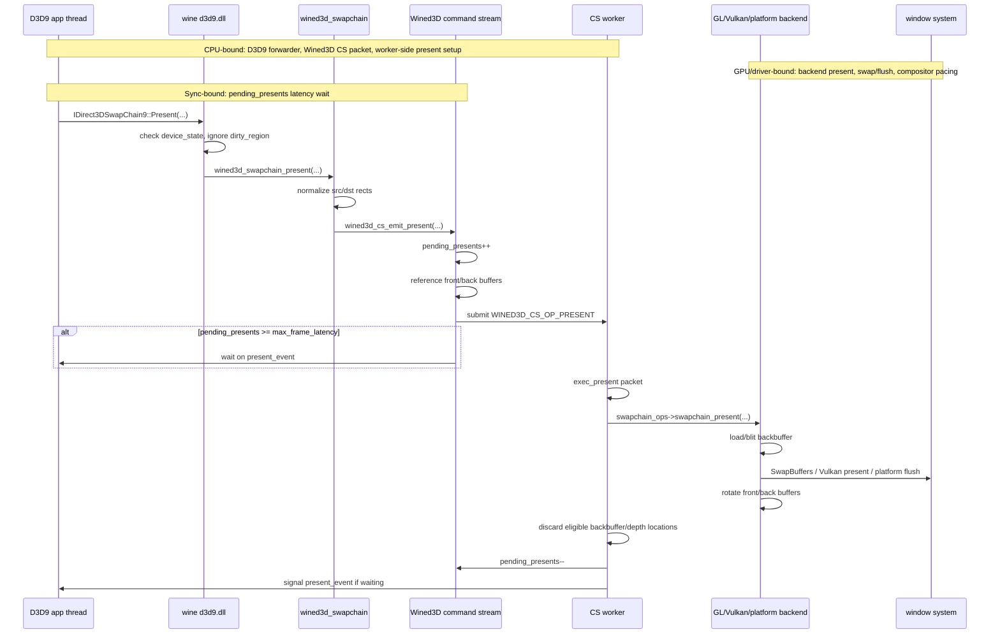
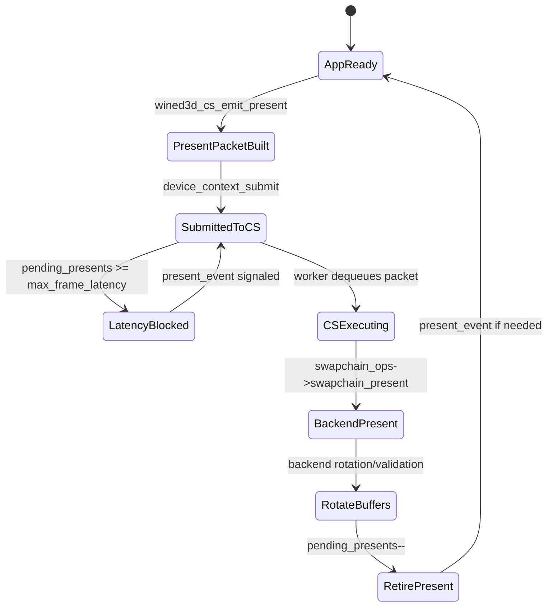

# Wine D3D9 Present and Buffering Notes

Date: 2026-04-26

Scope:

- Local reference tree: `~/workspaces/wine`.
- Focus: Wine builtin D3D9 over Wined3D, command-stream present, max-frame-latency behavior, and backbuffer/frontbuffer rotation.
- Main files inspected:
  - `~/workspaces/wine/dlls/d3d9/swapchain.c`
  - `~/workspaces/wine/dlls/d3d9/device.c`
  - `~/workspaces/wine/dlls/wined3d/swapchain.c`
  - `~/workspaces/wine/dlls/wined3d/cs.c`

## Bound Legend

- CPU-bound: D3D9 validation, Wined3D mutex work, command-stream packet construction, backend command preparation, and resource-location bookkeeping.
- GPU/driver-bound: GL/Vulkan backend present, SwapBuffers/vkQueuePresent, platform window-system flush, and actual drawable/swapchain execution.
- Sync-bound: CPU waits on `present_event`, backend fences, or command-stream progress.

## Present Sequence

Wine's D3D9 layer is thin. It validates D3D9 state and forwards present to Wined3D. Wined3D emits a present packet into its command stream, then limits input latency by counting pending presents.



Important observed rules:

- `d3d9_swapchain_Present()` forwards to `wined3d_swapchain_present()`.
- `wined3d_swapchain_present()` locks Wined3D, normalizes rectangles, and emits a CS present packet.
- `wined3d_cs_emit_present()` references the front buffer and every backbuffer before queueing the packet, so resources remain alive while the worker owns the present.
- Input latency is limited by `pending_presents >= swapchain->max_frame_latency`; the app waits on `present_event` only when it gets too far ahead.
- `wined3d_cs_exec_present()` executes the backend present, discards resources allowed by swap effect/depth flags, decrements `pending_presents`, and wakes waiters.

## Command-Stream State



This is close to the shape dxmt9 wants: the public D3D9 layer does not wait for every present to fully finish. It only blocks when the queued present count reaches the swapchain's latency limit.

## Buffering Strategy

```mermaid
flowchart TD
  subgraph CPU["CPU-bound: Wined3D swapchain + command stream"]
    Front[front_buffer]
    Back0[back_buffers[0]]
    BackN[back_buffers[n]]
    AppDraw[App rendering]
    PresentPacket[CS present packet]
    RefHold[resource references held by CS packet]
    Rotate[front/back rotation bookkeeping]
  end

  subgraph GPUDriver["GPU/driver-bound: backend present"]
    Backend[backend present]
    Window[SwapBuffers / vkQueuePresent / platform flush]
  end

  subgraph Sync["Sync-bound pacing"]
    MaxLatency[max_frame_latency]
    Pending[pending_presents counter]
    Wait[present_event wait only when over limit]
  end

  AppDraw --> Back0
  Back0 --> PresentPacket
  Front --> PresentPacket
  BackN --> PresentPacket
  PresentPacket --> RefHold
  PresentPacket --> Backend
  Backend --> Window
  Backend --> Rotate
  Rotate --> Front
  Rotate --> Back0
  MaxLatency --> Pending
  Pending --> Wait

  classDef cpu fill:#eaf4ff,stroke:#2f6fad,color:#0b2239
  classDef gpu fill:#fff0d6,stroke:#b26b00,color:#2b1900
  classDef sync fill:#ffe8e8,stroke:#b64242,color:#2b0d0d
  class Front,Back0,BackN,AppDraw,PresentPacket,RefHold,Rotate cpu
  class Backend,Window gpu
  class MaxLatency,Pending,Wait sync
```

Backend-specific behavior:

- GL path: acquire context, load the backbuffer into its drawable binding, blit to the swapchain target, call `wglSwapBuffers`, submit a fence when supported, rotate buffers, and validate the front buffer as drawable.
- Vulkan path: acquire a Vulkan context, load the backbuffer, blit to the Vulkan swapchain image, handle out-of-date/suboptimal recreation, rotate buffers, and validate the front buffer as drawable.
- macOS-specific OpenGL flushing is below this layer in the platform driver; the D3D9/Wined3D shape is still command-stream plus backend swap.

## Bound Classification

| Region | Bound type | Why it matters for dxmt9 |
|---|---|---|
| `d3d9_swapchain_Present()` | CPU-bound | Wine's public D3D9 layer stays thin; dxmt9 should avoid putting pacing complexity here. |
| `wined3d_cs_emit_present()` | CPU-bound plus sync-bound when latency limit is reached | Direct analogue to queue-owned present packet submission and max-frame-latency gating. |
| `wined3d_cs_exec_present()` before backend call | CPU-bound | Similar to dxmt9 encode-thread present preparation. |
| Backend `swapchain_present()` | GPU/driver-bound | Direct analogue to Metal present/drawable/compositor behavior. |
| `pending_presents` / `present_event` | Sync-bound | Wine waits only when queued presents exceed the latency limit, not after every present. |

## dxmt9 Adoption Points

- Keep present as a queue/command-stream packet, not a direct synchronous app-thread operation.
- Keep a present-pending counter or equivalent frame-latency token; wait only when the app gets too far ahead.
- Hold explicit resource references for the submitted present packet until the backend has consumed it.
- Make discard/rotate semantics part of present execution, not a side effect of the next draw.
- Prefer a single present queue lifecycle owner. Wine's D3D9 layer forwards policy; Wined3D owns command-stream present and max-frame-latency enforcement.
