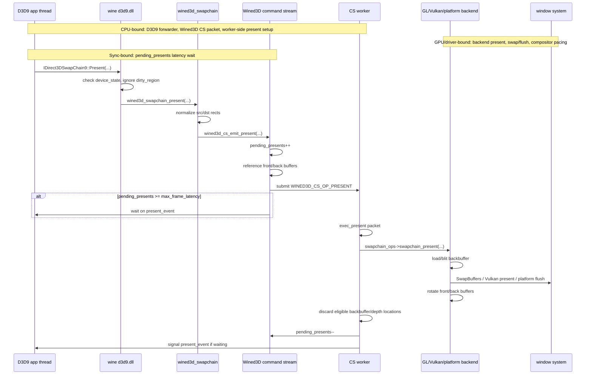
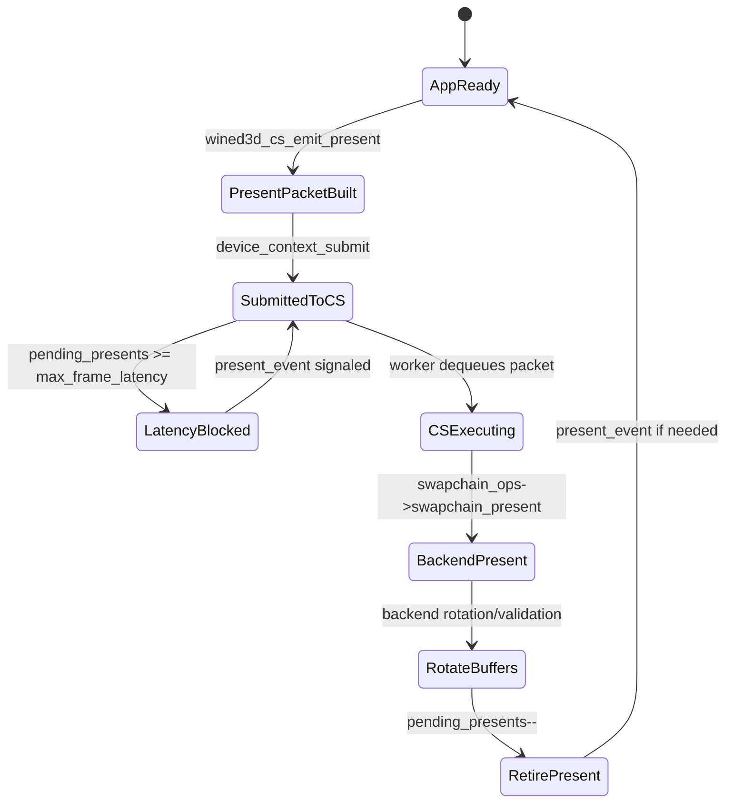
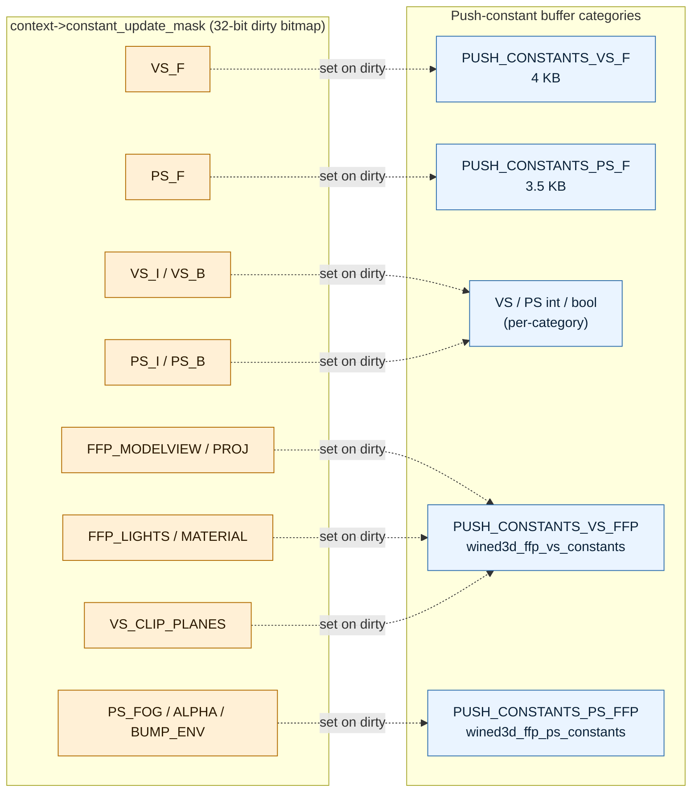
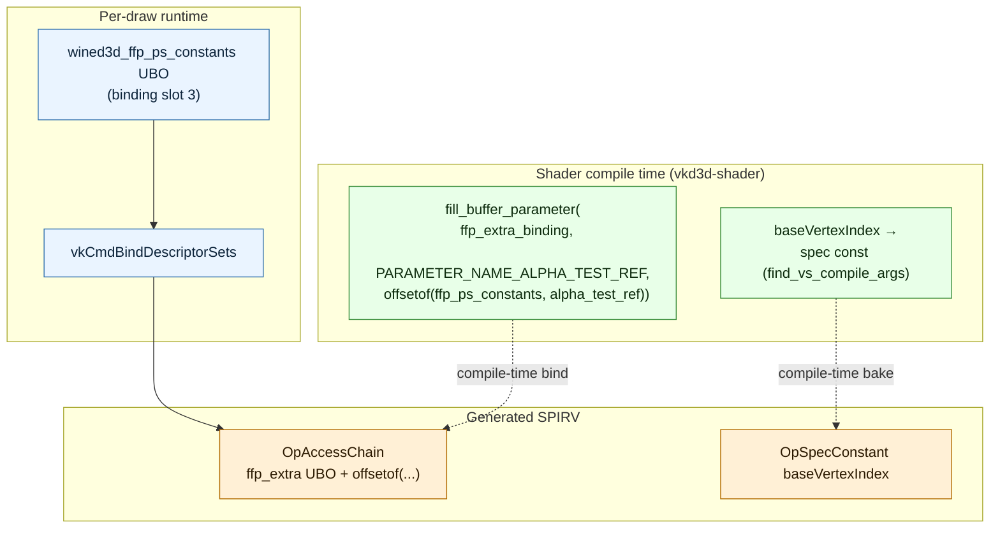

# Wine D3D9 Present and Buffering Notes

Date: 2026-04-26

Scope:

- Local reference tree: `~/workspaces/wine`.
- Focus: Wine builtin D3D9 over Wined3D, command-stream present, max-frame-latency behavior, and backbuffer/frontbuffer rotation.
- Main files inspected:
  - `~/workspaces/wine/dlls/d3d9/swapchain.c`
  - `~/workspaces/wine/dlls/d3d9/device.c`
  - `~/workspaces/wine/dlls/wined3d/swapchain.c`
  - `~/workspaces/wine/dlls/wined3d/cs.c`

## Bound Legend

- CPU-bound: D3D9 validation, Wined3D mutex work, command-stream packet construction, backend command preparation, and resource-location bookkeeping.
- GPU/driver-bound: GL/Vulkan backend present, SwapBuffers/vkQueuePresent, platform window-system flush, and actual drawable/swapchain execution.
- Sync-bound: CPU waits on `present_event`, backend fences, or command-stream progress.

## Present Sequence

Wine's D3D9 layer is thin. It validates D3D9 state and forwards present to Wined3D. Wined3D emits a present packet into its command stream, then limits input latency by counting pending presents.



Important observed rules:

- `d3d9_swapchain_Present()` forwards to `wined3d_swapchain_present()`.
- `wined3d_swapchain_present()` locks Wined3D, normalizes rectangles, and emits a CS present packet.
- `wined3d_cs_emit_present()` references the front buffer and every backbuffer before queueing the packet, so resources remain alive while the worker owns the present.
- Input latency is limited by `pending_presents >= swapchain->max_frame_latency`; the app waits on `present_event` only when it gets too far ahead.
- `wined3d_cs_exec_present()` executes the backend present, discards resources allowed by swap effect/depth flags, decrements `pending_presents`, and wakes waiters.

## Command-Stream State



This is close to the shape dxmt9 wants: the public D3D9 layer does not wait for every present to fully finish. It only blocks when the queued present count reaches the swapchain's latency limit.

## Buffering Strategy

```mermaid
flowchart TD
  subgraph CPU["CPU-bound: Wined3D swapchain + command stream"]
    Front[front_buffer]
    Back0[back_buffers[0]]
    BackN[back_buffers[n]]
    AppDraw[App rendering]
    PresentPacket[CS present packet]
    RefHold[resource references held by CS packet]
    Rotate[front/back rotation bookkeeping]
  end

  subgraph GPUDriver["GPU/driver-bound: backend present"]
    Backend[backend present]
    Window[SwapBuffers / vkQueuePresent / platform flush]
  end

  subgraph Sync["Sync-bound pacing"]
    MaxLatency[max_frame_latency]
    Pending[pending_presents counter]
    Wait[present_event wait only when over limit]
  end

  AppDraw --> Back0
  Back0 --> PresentPacket
  Front --> PresentPacket
  BackN --> PresentPacket
  PresentPacket --> RefHold
  PresentPacket --> Backend
  Backend --> Window
  Backend --> Rotate
  Rotate --> Front
  Rotate --> Back0
  MaxLatency --> Pending
  Pending --> Wait

  classDef cpu fill:#eaf4ff,stroke:#2f6fad,color:#0b2239
  classDef gpu fill:#fff0d6,stroke:#b26b00,color:#2b1900
  classDef sync fill:#ffe8e8,stroke:#b64242,color:#2b0d0d
  class Front,Back0,BackN,AppDraw,PresentPacket,RefHold,Rotate cpu
  class Backend,Window gpu
  class MaxLatency,Pending,Wait sync
```

Backend-specific behavior:

- GL path: acquire context, load the backbuffer into its drawable binding, blit to the swapchain target, call `wglSwapBuffers`, submit a fence when supported, rotate buffers, and validate the front buffer as drawable.
- Vulkan path: acquire a Vulkan context, load the backbuffer, blit to the Vulkan swapchain image, handle out-of-date/suboptimal recreation, rotate buffers, and validate the front buffer as drawable.
- macOS-specific OpenGL flushing is below this layer in the platform driver; the D3D9/Wined3D shape is still command-stream plus backend swap.

## Bound Classification

| Region | Bound type | Why it matters for dxmt9 |
|---|---|---|
| `d3d9_swapchain_Present()` | CPU-bound | Wine's public D3D9 layer stays thin; dxmt9 should avoid putting pacing complexity here. |
| `wined3d_cs_emit_present()` | CPU-bound plus sync-bound when latency limit is reached | Direct analogue to queue-owned present packet submission and max-frame-latency gating. |
| `wined3d_cs_exec_present()` before backend call | CPU-bound | Similar to dxmt9 encode-thread present preparation. |
| Backend `swapchain_present()` | GPU/driver-bound | Direct analogue to Metal present/drawable/compositor behavior. |
| `pending_presents` / `present_event` | Sync-bound | Wine waits only when queued presents exceed the latency limit, not after every present. |

## dxmt9 Adoption Points

- Keep present as a queue/command-stream packet, not a direct synchronous app-thread operation.
- Keep a present-pending counter or equivalent frame-latency token; wait only when the app gets too far ahead.
- Hold explicit resource references for the submitted present packet until the backend has consumed it.
- Make discard/rotate semantics part of present execution, not a side effect of the next draw.
- Prefer a single present queue lifecycle owner. Wine's D3D9 layer forwards policy; Wined3D owns command-stream present and max-frame-latency enforcement.

## Submission Grain (G axis)

Wine's wined3d does **not** chunk D3D9 calls into batches. Each app-side
D3D9 call is forwarded directly to the CS thread as an individual
opcode, and the CS thread replays them one-at-a-time against the
backend (GL or Vulkan). The backend opens and commits GL command lists
/ Vulkan command buffers at points it chooses.

| Axis | Wine wined3d | dxmt9 (current) |
|---|---|---|
| App→CS boundary | one opcode per D3D9 call | one chunk per ~hundreds of D3D9 calls |
| CBs per frame | backend-defined | 1 (per chunk) |
| Submission queue model | single-producer / single-consumer | same |
| Pacing | `pending_presents` counter | 3-axis (seqId / frame token / ring) |

### dxmt9 Adoption Points (G axis)

The Wine model is **not the model dxmt9 follows for submission grain** —
forwarding per-call is exactly what R-BACK-2.7 / R-BACK-2.8 avoid.
For the G axis dxmt9 went past both Wine and DXMT: DXMT keeps a strict
1 chunk = 1 CB shape (verified in
`docs/research/dxmt.md` "Submission Model (G axis)") and DXVK does
mid-batch CB split at semantic boundaries
(`docs/research/dxvk-d3d9.md`). dxmt9 R-BACK-2.34 chains up to 4
sub-CBs per chunk, more aggressive than DXMT and tuned for the D3D9
chunk profile.

What dxmt9 takes from Wine on this axis is **pacing-only**: wait when
too far ahead, not after every present (`docs/architecture-comparison.md
§F`). The submission grain itself is decided by encode-thread policy,
not by per-call opcode shape.

## Uniform Binding and Per-Frequency State

Date: 2026-05-07

Scope: how Wined3d splits shader and FFP state by update frequency for the GLSL and Vulkan/SPIRV backends. Captured to inform dxmt9's DrawUniforms split (see `docs/perfomance-bottleneck.md`).

### Push-Constant Buffers by Frequency



Wined3d maintains 8 distinct push-constant buffer categories keyed by `enum wined3d_push_constants` (`wined3d_private.h:507-527`). Updates are routed through `WINED3D_CS_OP_PUSH_CONSTANTS` (`cs.c:2245-2261`).

| Category | Size | Trigger |
|---|---:|---|
| `WINED3D_PUSH_CONSTANTS_VS_F` | 4 KB (256×16) | `SetVertexShaderConstantF` |
| `WINED3D_PUSH_CONSTANTS_PS_F` | 3.5 KB (224×16) | `SetPixelShaderConstantF` |
| VS / PS int / bool constants | per category | `SetVertexShaderConstantI/B`, `SetPixelShaderConstantI/B` |
| `WINED3D_PUSH_CONSTANTS_VS_FFP` | `sizeof(wined3d_ffp_vs_constants)` | world/view/proj/clip/light change |
| `WINED3D_PUSH_CONSTANTS_PS_FFP` | `sizeof(wined3d_ffp_ps_constants)` | fog/alpha/textureFactor change |

### Dirty-Bitmask Tracking

`context->constant_update_mask` (32-bit) tracks which categories need re-upload. Bits include:

- `WINED3D_SHADER_CONST_VS_F`, `PS_F` — float constants per stage.
- `FFP_MODELVIEW`, `FFP_PROJ`, `FFP_LIGHTS`, `FFP_MATERIAL` — FFP transform / lighting state.
- `WINED3D_SHADER_CONST_VS_CLIP_PLANES` — VS-only clip planes.
- `WINED3D_SHADER_CONST_PS_FOG`, `PS_ALPHA_TEST`, `PS_BUMP_ENV` — PS-only effects.

References: `wined3d_private.h:507-527`, `cs.c:2163-2171`, `stateblock.c:31-76`. Granularity is per-state-group; all clip planes upload together, all lights upload together. The bitmask is cheap to test on draw entry and restricts the upload to only the changed categories.

### SPIRV Backend — Compile-Time Parameter Binding



For the Vulkan/SPIRV path, FFP state lives in a single extra UBO and individual fields are bound to specific UBO offsets at shader compile time via `vkd3d-shader` parameters (`shader_spirv.c:175-243, 810-824`).

Example: `fill_buffer_parameter(..., ffp_extra_binding, VKD3D_SHADER_PARAMETER_NAME_ALPHA_TEST_REF, offsetof(struct wined3d_ffp_ps_constants, alpha_test_ref))`. Generated SPIRV reads each field at its compiled-in offset; the host updates the whole UBO, the shader picks out the parts it needs. `WINED3D_FFP_CONSTANTS_EXTRA_REGISTER` (binding slot 3) holds the FFP UBO.

`baseVertexIndex` is also a compile-time spec constant (`find_vs_compile_args()`), not a per-draw push.

### GLSL Backend — Range Heap Coalescing

The GLSL backend marks dirty constant-register ranges in a binary heap (`shader_glsl_update_float_vertex_constants()` in `glsl_shader.c:2059-2081`). On the next draw, the backend walks the heap and emits one `glUniform4fv()` per coalesced range — sparse `[0..10]` and `[20..30]` updates collapse to two API calls, not a full re-upload.

The SPIRV backend's equivalent update callback is a no-op stub; it relies on descriptor-set / push-constant binding at draw time instead of explicit upload calls.

### dxmt9 Adoption Points

- **Adopt the bitmask dirty model.** A 16-bit `dirty_mask` covering VS_F / PS_F / VS_I / PS_I / VS_B / PS_B / FFP_VS_TRANSFORMS / FFP_VS_CLIP / FFP_PS_FOG / FFP_PS_ALPHA / FFP_PS_TEX_FACTOR is enough to gate uploads cheaply. Update on PE-side shadow `Set*` (already centralized).
- **Split FFP from shader constants.** Wine's separation of `wined3d_ffp_vs_constants` / `wined3d_ffp_ps_constants` from VS_F / PS_F maps directly to dxmt9's pending Stable/Volatile work.
- **Keep `baseVertexIndex` out of the dynamic uniform path.** Wine's compile-time spec const is a Vulkan-only trick; on Metal the equivalent is `setVertexBytes` (4 B push constant). Either avoids per-draw write into the slab.
- **Coalesce sparse float-constant updates.** Wine's range heap is overkill for FFP-only apps but useful when shader-mode apps (SFIV-class) update sparse VS_F slots between draws. A simple `maxChangedConstF` (DXVK-style) is the small-step replacement; the range heap is the upgrade path.
